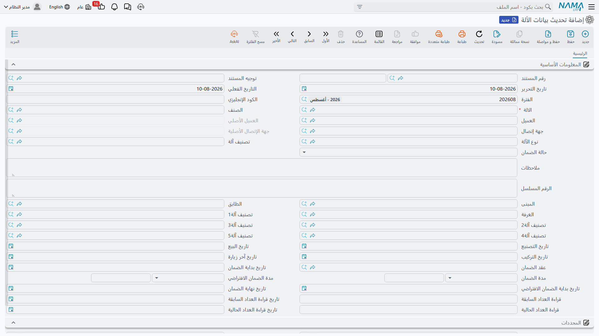

# تحديث بيانات الآلات ونقل الملكية والمعاينات

[ملف الآلة](/ar/modules/crm/maintenance-setup/crm-machines.md) ملف أساسي، وتستطيع تعديله مباشرة.
فلماذا توجد مستندات تعدّله نيابة عنك إذن؟ لأن الملف الأساسي لا يحتفظ بتاريخ: غيّر الغرفة يضع موضع
الأمس. وهذه المستندات الثلاثة موجودة لتترك أثراً مؤرخاً ومرقّماً — واحد لتغيير بيانات الآلة، وواحد
لتغيير مالكها، وواحد لتسجيل معاينة الموقع قبل التركيب.

اثنان من الثلاثة يفعلان ما يعدان به، مع أفخاخ. والثالث لا يفعل شيئاً البتة.

::: info الترخيص المطلوب
`crm-maintenance`
:::

## مستند تحديث بيانات الآلة

مستند له دفتر وتوجيه وتاريخ تحرير وتاريخ فعلي، وجسمه نسخة قريبة من مجموعة بيانات الآلة نفسها:
الصنف، والعميل، وجهة الاتصال، والعميل وجهة الاتصال الأصليان، ونوع الآلة، والتصنيف، وحالة الضمان،
والملاحظات، والرقم المسلسل، والمبنى والطابق والغرفة، والتصنيفات الخمسة، وتواريخ التصنيع والبيع
والتركيب وآخر زيارة، وعقد الضمان، وبداية الضمان، ومدة الضمان، ومدة الضمان الافتراضي، وتاريخ بداية
الضمان الافتراضي، ونهاية الضمان، وقراءتا العدّاد وتاريخاهما، والمحددات.

وفي العاشر من يونيو 2026 تُنقل وحدة مناولة الهواء `MCH-00318` من غرفة المعدات إلى غرفة المضخات
`RM-MP01-B3`. فيكتب مكتب الصيانة المستند `MUPD-0007` على تلك الآلة، ويغير الغرفة، ويحفظ. وعند
الحفظ يعيد المستند كتابة بيانات الآلة، ولأن حسابات الآلة وفحوصها تعمل بعد ذلك، يُعاد حساب تواريخ
ضمانها في الوقت نفسه.

**المحاسبة: لا شيء. المخزون: لا شيء.** وليس لهذا المستند صنف توجيه خاص به، فتوجيهه لا يحمل إلا
الإعدادات العامة للمستندات.

::: danger فخّان يضيعان البيانات في صمت

**أولاً: يكتب كل حقل في شاشته، ملأته أم لم تملأه.** فاختيار الآلة يملأ *أكثر* الخانات من السجل
الحالي — لكن ليس كلها. فالكود البديل، وتواريخ التصنيع والبيع والتركيب وآخر زيارة، وتاريخ بداية
الضمان الافتراضي، وحالة الضمان **لا** تُملأ مسبقاً، ومع ذلك تُكتب في الآلة عند الحفظ. فإن تركتها
كما وصلت، **مُحيت** من الآلة تواريخ التركيب والبيع وحالة الضمان، في صمت، وبلا شيء على الشاشة
ينبهك.

فعامل هذا المستند على أنه «أعد كتابة الآلة» لا «غيّر حقلاً واحداً». وقبل الترحيل، امش على الشاشة
حقلاً حقلاً وتأكد أن كل خانة تحمل القيمة التي تريد أن تنتهي إليها الآلة.

**ثانياً: إلغاء التحديث الوحيد لا يرجع شيئاً.** فالإلغاء يستعيد قيم مستند تحديث بيانات الآلة
**السابق** لتلك الآلة. فإن كان هذا هو الأول — وهو كذلك في أكثر الآلات دائماً — فلا مستند سابق
يُستعاد منه، وتحتفظ الآلة ببساطة بكل ما كتبه المستند الملغى. وإلغاء `MUPD-0007` كان سيترك
`MCH-00318` في غرفة المضخات.

ولإلغاء أثر تحديث أول لا بد أن تفتح الآلة وتعيد القيم القديمة بيدك، ولهذا بالضبط ينبغي أن تدوّنها
قبل الترحيل.
:::

وثمة سلوكان آخران يستحقان المعرفة:

- يُرفض المستند إذا كان هناك مستند تحديث **لاحق** للآلة نفسها — لاحق بالتاريخ الفعلي ثم بتاريخ
  الإنشاء. فلا تستطيع أن تدسّ تصحيحاً خلف التاريخ.
- إن أعدت توجيه مستند محفوظ إلى آلة **أخرى**، أُعيدت مزامنة الآلة التي كان يشير إليها من آخر مستند
  تحديث باقٍ لها.

وأخيراً، بعض بيانات الآلة **ليست** في هذه الشاشة ولا يمكن تغييرها من خلالها: الرقم المسلسل الثاني،
وقالب المهام وجدول المهام، وجدول الآلات التابعة، وجدول قطع الغيار، والمرفقات. وهذه تُعدَّل في ملف
الآلة نفسه.

::: warning هذا المستند هو الكاتب الوحيد لحقلين يبدوان تلقائيين
*تاريخ آخر زيارة* و*حالة الضمان* في الآلة لا يحافظ عليهما أي إجراء — فلا زيارة ولا أمر ولا سند
تنفيذ يمسهما. ومستند تحديث بيانات الآلة هو الشيء الوحيد في النظام الذي يكتبهما أصلاً، وهو كما سبق
يكتبهما فارغين إلا أن تملأهما. واقرأ *تاريخ نهاية الضمان* لتعرف حقيقة الضمان.
:::

## سند نقل ملكية الآلة

فندق يبيع تشيلراً مع المبنى؛ وفرع يُسلَّم إلى شركة أخرى. وسند النقل يسجل ذلك ويحفظ السلسلة.

خمسة حقول تحمل المعنى:

| الحقل | السلوك |
|---|---|
| الآلة | إلزامي |
| من عميل | يملؤه النظام من مالك الآلة الحالي |
| إلى عميل | إلزامي، يُكتب |
| من جهة اتصال | يملؤه النظام من جهة اتصال الآلة الحالية |
| إلى جهة اتصال | يُكتب — لكن انظر التنبيه أدناه |
| ملاحظات | نص حر |

وعند الحفظ يجمع المستند **كل** سندات النقل المرحَّلة لتلك الآلة، ويضيف نفسه إليها، ويرتبها بالتاريخ
الفعلي ثم بتاريخ الإنشاء، ثم يعيد بناء السلسلة: فيُكتب في الجانب «من» للسند الأول العميل وجهة
الاتصال **الأصليان** للآلة، ويؤخذ الجانب «من» لكل سند تالٍ من السند الذي قبله، ويُضبط عميل الآلة
وجهة اتصالها الحاليان من آخر سند في السلسلة. والعميل وجهة الاتصال *الأصليان* في الآلة يثبتهما
**أول** نقل ملكية، فالآلة التي لم تُنقل ملكيتها قط ليس فيها مالك أصلي مسجل بعد.

وإلغاء سند النقل حسن السلوك: تُبنى السلسلة من جديد بدونه، مع الرجوع إلى المالك الأصلي حين لا يبقى
نقل. وهذا عكس إلغاء مستند تحديث البيانات، ويجدر تذكر أيهما أيّ.

::: warning شق جهات الاتصال من السلسلة خطأ من النقل الثاني فصاعداً
سلسلة العملاء صحيحة. أما سلسلة **جهات الاتصال** فلا: فمن النقل الثاني فصاعداً يكرر *من جهة اتصال*
في كل سند جهة اتصال السند الأول بدل *إلى جهة اتصال* في السند السابق. وسترى في صفحة حركات الآلة
عمود «من جهة اتصال» يخالف عمود «من عميل» بجواره. فاقرأ سلسلة العملاء، واعتبر عمود جهة الاتصال غير
موثوق.
:::

::: warning لا تستطيع اختيار جهة الاتصال الجديدة
بحث *إلى جهة اتصال* لا يعرض إلا **جهة اتصال الآلة الحالية** — أي التي تنقل الملكية بعيداً عنها —
وعلى آلة بلا جهة اتصال أصلاً ينتج خطأً بدل قائمة فارغة. فعامل نقل الملكية على أنه عملية على مستوى
**العميل**: اترك *إلى جهة اتصال* فارغة، واحفظ السند، ثم اضبط جهة الاتصال الجديدة في ملف الآلة
بعدها.
:::

## معاينة ما قبل التركيب

معاينة الموقع قبل التركيب: العميل، وجهة الاتصال، والآلة، ونوع الآلة وتصنيفها، ومن تاريخ وإلى تاريخ،
ومرفق، و*بناءً على*، والرقم المسلسل، وجدول مجموعات صيانة، وقائمة فحص للمناقشة. واختيار الآلة يملأ
الرقم المسلسل والعميل وجهة الاتصال.

::: danger معاينة ما قبل التركيب لا تفعل شيئاً البتة
فليس في هذه الشاشة أزرار، ولا صنف توجيه، ولا فحوص، ولا أي أثر من أي نوع. وهي لا تنشئ آلة، ولا تغذي
أمراً ولا عقداً ولا خطة عمل، ولا يقرؤها أي مستند آخر. وبمجرد حفظها تصير المعاينة غير مرئية لبقية
النظام.

فإن كانت إجراءاتك تعتمد على وقوع معاينة قبل التركيب، فذلك اعتماد لا بد أن تفرضه إجراءاتك أنت. وإن
أردت أن تصل نتائج المعاينة إلى الفني، فضعها في
[أمر الصيانة](/ar/modules/crm/maintenance-cycle/crm-maintenance-orders.md) — فلن يراها أحد هنا.
:::

والمستند الذي *ينشئ* آلات فعلاً هو زر *إنشاء الآلة* في أمر بيع الصيانة — انظر
[مبيعات الصيانة](/ar/modules/crm/maintenance-cycle/crm-maintenance-sales.md)، ولاحظ أنه ينشئ
هياكل لا بد من إكمالها بعد ذلك يدوياً.

## لا وجود لشيء من هذا في منظومة الخدمات

[سندات خدمات الصيانة](/ar/modules/crm/services-suite/crm-services-suite-overview.md) ليس فيها
تحديث بيانات، ولا نقل ملكية، ولا معاينة قبل التركيب. فبيانات موقع الخدمة تُعدَّل في سجل الموقع
مباشرة، بلا أثر مستندي.

**التقارير: لا يوجد.** لا تحتوي هذه الوحدة على أي تقارير نظام، وليس لهذه الشاشات نموذج طباعة.
وصفحة حركات ملف الآلة هي موضع قراءة سلسلة الملكية؛ ولتاريخ التحديثات استعمل قائمة العرض مفلترة
بالآلة، وتصديرها إلى إكسل.
