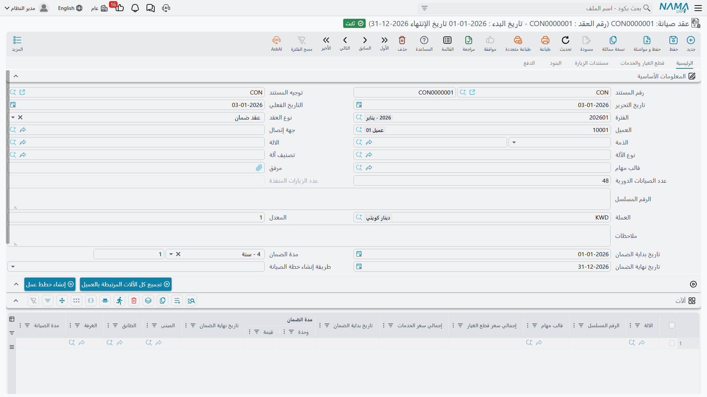

# عقود الصيانة

عقد الصيانة هو مركز ثقل المجموعة كلها. فهو يجيب عن أربعة أسئلة دفعةً واحدة: **أي الآلات** مغطاة، و**كم مرة** تُزار كل آلة، و**ما الذي دُفع ثمنه مقدماً**، و**كيف يسدد العميل**. وكل خطة عمل وقائية، وكل قطعة غيار تُخصم من الرصيد، وكل سطر فاتورة بسعر العقد، يعود إليه.

وسنتابع عقداً واحداً حتى النهاية: `MC-0021`، الموقّع مع فنادق مارينا بلازا في 18 فبراير 2026 والساري من 1 مارس 2026 إلى 1 مارس 2027.

القائمة: **خدمة العملاء ← مستندات الصيانة ← عقد صيانة**.

::: info الترخيص المطلوب
`crm-maintenance`. و**التوجيه إجباري**، وهو يحمل أمرين لا يعمل العقد بدونهما: **دفتر وتوجيه خطة العمل** اللذين يكتب فيهما زر الإنشاء، و — إن أردت للعقد أثراً محاسبياً — **طرفاً مديناً ودائناً معاً**. راجع [توجيهات مستندات الصيانة](/ar/modules/crm/document-terms/crm-maintenance-terms.md).
:::

## التواريخ ليست بالأسماء التي تتوقعها

ابدأ من هنا، لأن أحداً لا يخمّنها.

::: warning تاريخا بداية العقد ونهايته يسكنان حقلين اسمهما *تاريخ بداية الضمان* و*تاريخ نهاية الضمان*
لا يوجد حقل اسمه «بداية العقد». فمدة العقد هي زوج **تاريخ بداية الضمان** و**تاريخ نهاية الضمان** في الرأس، وبينهما **مدة الضمان**. وعلى `MC-0021` تقرأ هذه الحقول: 2026-03-01، و12 شهر، و2027-03-01.

ويجب ملء الاثنين قبل ضغط **إنشاء خطط عمل**، وإلا رفض الإنشاء أن يعمل — فسلسلة الزيارات كلها تُخطى بين هذين التاريخين.
:::

وبقية الرأس متوقعة: نوع العقد (*عقد صيانة* هنا، في مقابل *عقد ضمان* — انظر أدناه)، والعميل `C-01188`، وجهة الاتصال `CNT-0904`، والذمة وهي العميل، والموظف المسئول `EMP-3001` ناهد الجندي، والآلة ونوعها وتصنيفها، وقالب المهام، والرقم المسلسل، والعملة وسعر التحويل، وعدد الصيانات الدورية، و**عدد الزيارات المنفذة** للقراءة فقط، و**نوع إنشاء خطة العمل**.

## جدول الآلات — حيث تسكن الجدولة حقاً

هذا هو الجدول المهم، وأعمدة **نوع الزيارة** السبعة هي الجزء المهم منه. فكل سطر آلة يحمل حتى سبعة ترددات، ولكل تردد قالب مهامه بجواره، فتصبح الآلة الواحدة قادرة على أن تكون لها قائمة فحص شهرية خفيفة وأخرى ربع سنوية أثقل.

يغطي `MC-0021` ثلاث آلات:

| الآلة | نوع الزيارة 1 | القالب | نوع الزيارة 2 | القالب | الفني | المبنى |
|---|---|---|---|---|---|---|
| `MCH-00311` تشيلر رقم 1 | شهرية | `TT-CHL-M` | ربع سنوية | `TT-CHL-Q` | `EMP-2011` | `BLD-MP01` |
| `MCH-00312` تشيلر رقم 2 | شهرية | `TT-CHL-M` | ربع سنوية | `TT-CHL-Q` | `EMP-2011` | `BLD-MP01` |
| `MCH-00318` وحدة المناولة – البدروم | شهرية | `TT-AHU-M` | — | — | `EMP-2011` | `BLD-MP01` |

ويحمل الجدول نفسه أيضاً الرقم المسلسل، وتواريخ ضمان الآلة، والمبنى والطابق والغرفة، ومدة الصيانة وعدد الزيارات، وتاريخ زيارة مخطط، ومجموعة الصيانة، والفني، وخمسة أعمدة تصنيف، وإجماليات لكل آلة يُعاد حسابها من الجداول التفصيلية عند كل حفظ.

وزر **تجميع كل الألات المرتبطة بالعميل** اختصار يستحق المعرفة: فهو يستبدل بالجدول كل آلة تخص العميل وليست آلة فرعية من أخرى. وعلى عميل لديه أربعون وحدة سبليت يوفر لك هذا بعد ظهيرة كاملة — لكنه **يستبدل**، فاستعمله قبل أن تبدأ تعديل السطور يدوياً لا بعده.

::: warning جدول الزيارات لا يفعل شيئاً
أسفل الصفحة الرئيسية جدول عنوانه **جدول الزيارات**، يحمل آلة وتاريخ زيارة. ويبدو تماماً كالمكان الذي تكتب فيه «تشيلر 1، 1 أبريل؛ تشيلر 1، 1 مايو؛ …» — ولا شيء يقرؤه. والشيء الوحيد الذي يمسّه تحقّق يتأكد أن الآلة المختارة مذكورة أيضاً في جدول الآلات.

فلا خطة عمل ولا أمر ولا زيارة تنتج منه أبداً. سلسلة الزيارات تأتي من أعمدة **نوع الزيارة** أعلاه ومن تاريخَي بداية العقد ونهايته. اترك جدول الزيارات فارغاً.
:::

وصفحة **الشروط التعاقدية** من الفئة نفسها: جدول لمستوى المشكلة ووصفها وزمن الاستجابة وملاحظات. وهو جدول مستوى خدمة، يُطبع طباعةً حسنة إن بنى لك المنفّذ نموذجاً، ولا يقرؤه أي كود في الوحدة. ولا شيء يقيس زمن استجابة فعلياً في مقابله.

## الرصيد المدفوع مقدماً

صفحة **قطع الغيار والخدمات** هي حيث تسكن التغطية فعلاً، والتغطية هنا تعني شيئاً واحداً: **كمية بسعر**.

*قطع الغيار:*

| الصنف | الكمية | سعر الوحدة | صافي القيمة |
|---|---|---|---|
| `SP-FLT-14` فلتر هواء 14 بوصة | 24 | 300.00 | 7,200.00 |
| `SP-OIL-05` زيت ضاغط 5 لتر | 4 | 600.00 | 2,400.00 |
| **إجمالي قطع الغيار** | | | **9,600.00** |

*الخدمات:*

| الخدمة | الكمية | سعر الوحدة | صافي القيمة |
|---|---|---|---|
| `MSV-01` زيارة صيانة دورية للتشيلر | 44 | 1,200.00 | 52,800.00 |
| **إجمالي الخدمات** | | | **52,800.00** |

والأربع والأربعون زيارة ليست مصادفة — فهي بالضبط الزيارات الأربع والأربعون التي سينتجها مولّد خطط العمل من سطور الآلات أعلاه. فتسعير العقد وجدولته وجهان لحساب واحد، ويحسن عملهما معاً.

ويحمل كل سطر **الكمية** و**الكمية المباعة** و**الكمية المتبقية**. ومع ترحيل الأوامر والفواتير والمردودات على هذا العقد ترتفع الكمية المباعة وتنخفض المتبقية، ويُرفض أي مستند يطلب أكثر مما تبقّى برسالة تسمّي الصنف والعقد. وبعد أمر أبريل `MO-0513` يُظهر `MC-0021`: `SP-FLT-14` مباع 6 / متبقٍ 18، و`SP-OIL-05` مباع 1 / متبقٍ 3، و`MSV-01` مباع 3 / متبقٍ 41.

::: tip سعر العقد هو الغالب
سعر `MSV-01` في كتالوج الخدمات 1,500.00 وعلى هذا العقد 1,200.00؛ وسعر `SP-FLT-14` في قائمة أسعار البيع 350.00 وهنا 300.00. وحين يُحرَّر مستند على العقد فإن **سعر العقد** هو الذي يظهر على السطر. وهذه هي الآلية التي تمنح بها المواقع عملاء العقود سعراً أفضل — وإذا سعّرت سطراً بصفر، فهذا هو المعنى الوحيد لكون العمل المغطى «مجانياً».
:::

::: warning ما لا تفعله تغطية العقد
لا شيء يقارن تاريخ العمل بمدة العقد ولا بأي ضمان. فالأمر المحرَّر على آلة انتهى عقدها العام الماضي يُسعَّر ويُفوتَر تماماً كالأمر على عقد سارٍ، دون أي تنبيه. ولا يوجد مؤشر «مجاني/مفوتَر» في أي موضع: قرار المطالبة بالمبلغ أو تحمّله يتخذه إنسان في كل مرة.
:::

## المال والدفعات

يحمل العقد كتلة مالية كاملة، وعلى `MC-0021` تقرأ هكذا:

| | |
|---|---|
| الإجمالي (52,800.00 خدمات + 9,600.00 قطع غيار) | **62,400.00** |
| ضريبة مبيعات 14 ٪ | **8,736.00** |
| صافي القيمة | **71,136.00** |

وتحمل صفحة **الفوترة** جدول الدفعات. ومارينا بلازا تسدد ربع سنوياً:

| # | التاريخ | المبلغ |
|---|---|---|
| 1 | 2026-03-01 | 17,784.00 |
| 2 | 2026-06-01 | 17,784.00 |
| 3 | 2026-09-01 | 17,784.00 |
| 4 | 2026-12-01 | 17,784.00 |
| | **الإجمالي** | **71,136.00** |

::: tip مجموع الجدول لازم
يُرفض العقد إذا لم يساوِ مجموع سطور جدول الدفعات صافي القيمة تماماً. وهذا تحقّق حقيقي ونافع — فإن رفض العقد الحفظ فاجمع الجدول أولاً.
:::

أما أزرار تلك الصفحة — **إنشاء الدفعات** و**إنشاء سند قبض للدفعات المختارة** و**إنشاء سند قبض** و**تجميع سندات القبض** — فهي مساعدات جدول الدفعات القياسية. وإنشاء سند القبض يفتح سنداً مملوءاً مسبقاً تراجعه وتحفظه؛ ولا يُنشأ شيء من وراء ظهرك.

## ما الذي يفعله ترحيل العقد

**المحاسبة: نعم، إذا ضُبط التوجيه لذلك.** حفظ `MC-0021` ينشئ قيداً كاملاً بشكل الفاتورة على سطور قطع الغيار والخدمات — في مثالنا: مدين مديونية العميل 71,136.00، دائن إيراد قطع الغيار 9,600.00، وإيراد الخدمات 52,800.00، وضريبة المبيعات 8,736.00.

::: warning الطرفان معاً أو لا شيء
لا يُحدث العقد قيداً إلا إذا حمل توجيهه طرفاً **مديناً ودائناً معاً**. وبطرف واحد فقط لا يُنشئ **شيئاً على الإطلاق**، بصمت وبلا رسالة خطأ. فإن كان عقد موقّع لا يظهر له قيد فهذا أول ما تفحصه — راجع [كيف تعمل توجيهات مستندات خدمة العملاء](/ar/modules/crm/document-terms/crm-terms-basics.md).
:::

**المخزون: لا شيء.** عقد الصيانة لا يحرك مخزوناً أبداً.

ويُنشأ القيد على هيئة **طلب أعمال** ويُعالَج في الخلفية، ولهذا يكون الحفظ فورياً. وإذا فشلت المعالجة فأعد المحاولة من شاشة قائمة طلبات الأعمال: رشّح الطلبات الفاشلة، واختر السطور، ثم من قائمة المزيد ← إعادة المعالجة / إعادة الترحيل.

## إنشاء خطط العمل

هذه هي الضغطة الأولى من الضغطتين اللتين تجعلان الصيانة الوقائية تحدث. في 1 مارس 2026 تفتح ناهد `MC-0021` وتضغط **إنشاء خطط عمل**.

يمرّ المولّد على كل سطر آلة، ويقرأ أعمدة نوع الزيارة، ويخطو بتاريخ إلى الأمام ابتداءً من تاريخ بداية العقد حتى يتجاوز تاريخ نهايته. ثم يجمّع الصفوف الناتجة في مستندات خطط عمل بحسب **نوع إنشاء خطة العمل** في الرأس:

| نوع الإنشاء | خطة عمل واحدة لكل… |
|---|---|
| إنشاء خطة الصيانة بناء على فترة العقد *(الافتراضي إذا تُرك الحقل فارغاً)* | شهر ميلادي من تاريخ الأمر المتوقع |
| إنشاء خطة الصيانة بناء على نوع الزيارة فقط | نوع زيارة |
| إنشاء خطة الصيانة بناء على نوع الزيارة مع اعتبار فترة العقد | نوع زيارة، لكل شهر |

ويستعمل `MC-0021` الأول، فينتج **44 صف زيارة متوقعة موزعة على 12 مستند خطة عمل**، من `WP-0087` إلى `WP-0098`. أما الحساب — لماذا 44 ولماذا 12 وماذا في كل خطة — ففي [خطط عمل الصيانة](/ar/modules/crm/maintenance-cycle/crm-maintenance-work-plans.md)، وهي أيضاً موضع الضغطة الثانية.

ويلزم أمران قبل أن يعمل الزر: تاريخا بداية العقد ونهايته، و**دفتر وتوجيه خطة العمل** على توجيه العقد. فإن نقص أحدهما توقف الإنشاء برسالة ولم يُنتج شيئاً.

::: danger ضغط زر إنشاء خطط عمل مرة أخرى يحذف خطط عمل
هذه ليست إعادة تحديث آمنة. فحين تضغط الزر ثانيةً يُبقي المولّد خطط العمل التي ما زال مفتاح تجميعها مطابقاً، و**يحذف كل خطة عمل أخرى أنتجها هذا العقد**، ومعها روابط سطور آلاتها بالأوامر التي أُنشئت منها.

أضف آلة إلى العقد، أو غيّر نوع زيارة، أو حرّك تاريخ نهاية العقد، فقد تختفي خطط عمل كانت موجودة. وقبل إعادة الإنشاء على عقد قيد التشغيل، سجّل أي خطط العمل أنتجت أوامر بالفعل. والأوامر نفسها لا تُحذف، لكن أثر الرجوع من خطة العمل إليها يُحذف.
:::

## عقود الضمان

لنوع العقد قيمة ثانية هي **عقد ضمان**، وهي في الغالب لا تُكتب باليد: فترحيل أمر صيانة نوعه *تركيب* ينشئ عقد ضمان تلقائياً، ناسخاً مدة الضمان والآلة والرقم المسلسل والعميل وجهة الاتصال وجداول قطع الغيار والآلات والخدمات.

::: warning عقد الضمان المُنشأ يحمل الكتلة المالية كاملة
لأن العقد المُنشأ نسخة، فهو يأتي بالإجماليات نفسها التي على الأمر الذي جاء منه. فإذا كان توجيه عقد الضمان يحمل أطرافاً محاسبية، سُجّل المبلغ نفسه مرتين — مرة من الأمر أو الفاتورة ومرة من العقد المُنشأ. اترك توجيه عقد الضمان **بلا** أطراف محاسبية. والآلية موصوفة في [أوامر الصيانة](/ar/modules/crm/maintenance-cycle/crm-maintenance-orders.md).
:::

## صفحة عدد الزيارات

آخر صفحة في العقد قائمة للقراءة فقط بمستندات **زيارة الصيانة** التي تشير إليه. وتمتلئ مع كتابة الزيارات، وكل زيارة ترفع *عدد الزيارات المنفذة* في الرأس — فينتقل `MC-0021` من صفر إلى واحد حين تُحفظ `MVIS-0055` في 1 أبريل 2026.

وهي شاشة «هل ذهب أحد فعلاً؟» نافعة حقاً، مع تحفظ واحد صادق: لا شيء ينشئ مستندات الزيارات هذه، فالعدّاد لا يعكس إلا الزيارات التي تجشّم أحدهم كتابتها. راجع [زيارات الصيانة](/ar/modules/crm/maintenance-cycle/crm-maintenance-visits.md).

## التقارير

**التقارير: لا يوجد.** لا تحتوي هذه الوحدة على أي تقرير جاهز، وليس لهذه الشاشة نموذج طباعة. ولمراجعة العقود عبر العملاء استعمل شاشة القائمة بمعايير محفوظة وصدّر إلى إكسل، أو ابنِ لوحة في وحدة ذكاء الأعمال فوق بيانات العقود.
