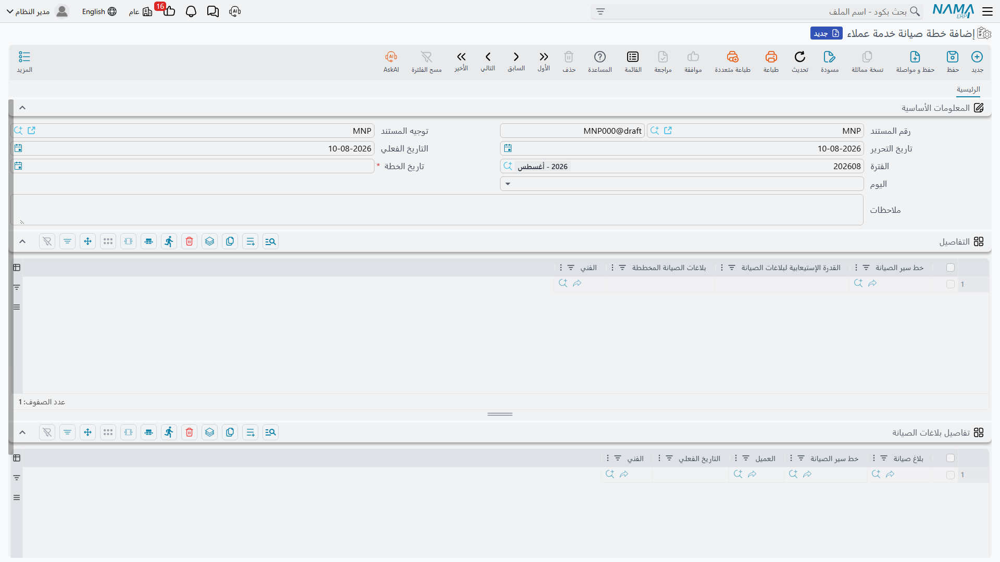

# التوزيع اليومي للفنيين

يستقبل مركز الاتصال بلاغات الأعطال طوال اليوم. ثم لا بد لأحدهم أن يقرر من يذهب إلى أين غداً، وبأي
ترتيب. وهذا هو الغرض من **خطة صيانة خدمة العملاء** و**خط سير الصيانة**: ورقة توزيع ليوم واحد،
والطرق المسماة التي تعتمد عليها.

::: danger هذه ليست جدولة الصيانة الوقائية
كلمتا «خطة» و«خط سير» تغريان بالظن أن هذا هو موضع جدولة الزيارات الدورية. وليس كذلك، والميزتان لا
تلتقيان أبداً. فالصيانة الوقائية تُخطَّط في
[عقد الصيانة](/ar/modules/crm/maintenance-cycle/crm-maintenance-contracts.md)، ثم تتوسع إلى
[خطط عمل الصيانة](/ar/modules/crm/maintenance-cycle/crm-maintenance-work-plans.md) ثم إلى أوامر
صيانة — كل ذلك بضغط أزرار، إذ لا يوجد مجدول زمني في هذه الوحدة.

أما الخطة اليومية الموصوفة في هذه الصفحة فلا تتعامل إلا مع **بلاغات صيانة موجودة بالفعل**. وهي لا
تنشئ شيئاً، ولا تجدول شيئاً في المستقبل، ولا تنتج أمراً ولا زيارة.
:::

::: info الترخيص المطلوب
`crm-maintenance`
:::

## خط السير — طريق مسمى

خط سير الصيانة ملف أساسي، وموضعه في **ملفات الصيانة** لا مع المستندات. ويحمل اسم الطريق، و**سعة
البلاغات** — كم بلاغاً يُظن أن الطريق يستوعبه في اليوم — وخمس خانات وصف حرة، وجدولاً بمناطق العناوين
التي يغطيها الطريق.

هذا كل ما فيه، ورقم السعة هو موضع الحذر: فلا شيء يطبقه، بل إنه لا يُنقل إلى الخطة نيابة عنك. انظر
التنبيه أدناه.

## الخطة — مستند لكل يوم

الخطة نفسها مستند قصير:

**الترويسة.** **تاريخ الخطة** وهو إلزامي، و**يوم الأسبوع** الذي يحسبه النظام منه.

**جدول الطرق.** سطر لكل طريق يعمل ذلك اليوم: خط السير، وسعة البلاغات، وعدد البلاغات المخطط،
و**الفني** المخصص له.

**جدول البلاغات.** البلاغات التي ستُخدم فعلاً: بلاغ الصيانة، وخط السير الذي وُضع عليه، وعميل البلاغ
وتاريخه الفعلي وفنيه. واختيار خط السير في السطر يملأ لك الفني من سطر الطريق المقابل، فيبقى التخصيص
متسقاً.

وثلاث قواعد مطبقة لا رابع لها: لا بد من سطر طريق واحد على الأقل، ولا يجوز تكرار خط السير نفسه، ولا
يجوز تكرار البلاغ نفسه.

## ماذا يحدث عند ترحيل الخطة

شيء واحد، لكل بلاغ مذكور فيها:

| ما يُكتب في البلاغ | من أين |
|---|---|
| الموظف المسئول (الفني) | فني سطر الطريق |
| خط سير الصيانة | الطريق الذي وُضع عليه البلاغ |
| تاريخ الزيارة المخططة | تاريخ الخطة |

هذا هو أثر الخطة كله. **المحاسبة: لا شيء. المخزون: لا شيء.** وتوجيه هذا المستند بلا إعدادات
البتة — فليس فيه ما يُضبط.

خذ بلاغ تسريب غاز التبريد في مارينا بلازا يوم 20 مايو 2026، وهو البلاغ `MNOT-0140`. يكتب الموزع
خطة اليوم، ويضيف سطر طريق بالفني `EMP-2014` (سيد عبد الله مرسي)، ويدرج `MNOT-0140` على ذلك الطريق،
ويحفظ. ثم افتح البلاغ بعدها تجد الموظف المسئول وخط السير وتاريخ الزيارة المخططة مملوءة. ولم يتغير
فيه شيء آخر — فهو ما زال سجل عطل، والعمل لا يصير حقيقة إلا حين يصدر أحدهم
[أمر صيانة](/ar/modules/crm/maintenance-cycle/crm-maintenance-orders.md) والبلاغ مذكور في
*بناءً على*.

::: warning السعة ملاحظة لا حد
سعة البلاغات في الطريق وعدد البلاغات المخطط يُكتبان بيدك ولا يقارَنان أبداً بعدد أسطر البلاغات.
فالطريق الذي سعته 5 يقبل 30 بلاغاً ويُحفظ في هدوء. بل إن السعة لا تُنقل من ملف خط السير إلى سطر
الخطة — أنت تعيد كتابتها، ولا أحد يتحقق من صحة ما كتبت.
:::

::: warning لا شيء يُخطر الفني
حفظ الخطة يكتب في البلاغات ثم يقف. فلا إشعار ولا رسالة ولا تنبيه على التطبيق ولا بريد — إذ لا توجد
آلية إشعارات في هذه الوحدة أصلاً. فورقة التوزيع شيء يقرؤه المشرف على الشاشة أو يصدّره، وإيصالها
إلى الفريق خطوة يدوية.
:::

## من أين تأتي البلاغات

من مركز الاتصال وحده. فالبلاغ يُكتب حين يتصل العميل؛ ولا شيء يولّده. انظر
[البلاغات والطلبات](/ar/modules/crm/maintenance-cycle/crm-maintenance-notices-and-requests.md)
لمعرفة ما يحمله البلاغ، وللحقيقة المهمة أن إجمالياته المالية وجدول سداده لا يصلان إلى شيء البتة.

والبلاغات كذلك هي مستند حضور الفني في التطبيق — فتسجيل الحضور والانصراف يكون على البلاغ لا على
الخطة.

**التقارير: لا يوجد.** لا تحتوي هذه الوحدة على أي تقارير نظام، وليس لهذه الشاشة نموذج طباعة. وورقة
توزيع اليوم تُقرأ من مستند الخطة نفسه أو من قائمة البلاغات مفلترة بتاريخ الزيارة المخططة أو الفني
أو خط السير؛ وتصدير قائمة العرض إلى إكسل هو الطريقة العملية لتوزيعها.
