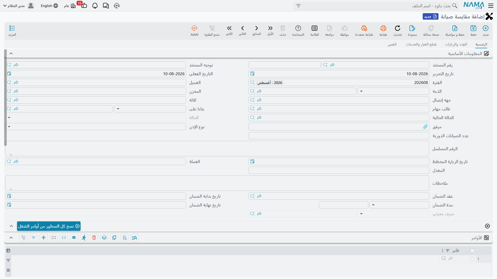

# مقايسات الصيانة

مقايسة الصيانة هي أكثر شاشات مجموعة الصيانة إثارةً لسوء الفهم. فاسمها يَعِد بعرض سعر — تسعّر الإصلاح، وتعرضه على العميل، وتحوّله إلى أمر شغل حين يوافق. وليست كذلك، وقراءتها على هذا النحو هي الطريق الذي تخرج به البضاعة من المخزن لعمل لم يوافق عليه أحد.

اقرأ هذه الصفحة كاملة قبل أن تسمح لأحد باستعمال الشاشة.

القائمة: **خدمة العملاء ← مستندات الصيانة ← مقايسة صيانة**.

::: info الترخيص المطلوب
`crm-maintenance`. و**التوجيه إجباري** — وشاشته لا تعرض الإعدادات التي تحكم هذا المستند فعلاً. راجع [توجيهات مستندات الصيانة](/ar/modules/crm/document-terms/crm-maintenance-terms.md) والتحذير أدناه.
:::

## أول ما يجب أن تعرفه

::: danger ترحيل مقايسة الصيانة قد يصرف بضاعة من المخزن
مقايسة الصيانة مستند من فصيلة الفواتير. فإذا كان توجيهها مضبوطاً على إنشاء صرف مخزني، فإن حفظها **يصرف قطع الغيار وأصناف الخدمات المدرجة من المخزن** — صرفاً مخزنياً حقيقياً في المخازن، يُنشأ ويُرحَّل في الخلفية، وتحتفظ المقايسة بمرجع له للقراءة فقط.

فهي ليست عرض سعر محايداً. ولأن [فاتورة الصيانة](/ar/modules/crm/maintenance-cycle/crm-maintenance-invoicing.md) تنشئ صرفها المخزني من السطور نفسها، فقد تخرج القطع ذاتها من المخزن **مرتين** لعمل واحد: مرة عند حفظ المقايسة ومرة عند حفظ الفاتورة. ولا شيء يربط بينهما ولا يقاصّهما ولا يمنعهما — فليست هناك كمية «سبق صرفها» في أي موضع.

**فعّل إنشاء الصرف المخزني على توجيه واحد فقط في تركيبك — توجيه فاتورة الصيانة عادةً — واترك توجيه المقايسة بدونه.**
:::

وثمة رحمة صغيرة هنا، يحسن فهمها لا الاتكال عليها: الحقول الأربعة الخاصة بالإنشاء والظاهرة على شاشة توجيه المقايسة ليست هي التي يقرؤها هذا المستند، ولذلك تكون الإعدادات الحقيقية فارغة في التركيب الذي لم يتكلف فيه أحد عناءً خاصاً فلا تتحرك بضاعة. لكن يمكن ضبطها عبر مُعدِّل شاشة أو عبر استيراد، والتوجيه المضبوط بهذه الطريقة يصرف البضاعة بصمت. فإن كانت مقايساتك تصرف من المخزن، فمن هنا يأتي ذلك.

## وماذا عن دفتر الأستاذ؟

::: warning صفحات المحاسبة على المقايسة لا تعمل عند حفظها
تعرض شاشة توجيه المقايسة صفحات مدين ودائن وضرائب وخصومات، تماماً كتوجيه الفاتورة. و**هذه الصفحات بلا أثر عند ترحيل المقايسة** — فحفظ مقايسة لا ينشئ قيداً محاسبياً ولا مديونية.

لكنها ليست بلا خطر. فإذا ضغط أحدهم **Regenerate Accounting Effects** على المستند، أو شُغّلت مهمة إعادة توليد القيود عليه، أنشأت المقايسة قيداً كاملاً بشكل الفاتورة من تلك الصفحات. اتركها فارغة إلا إذا كان ذلك مقصوداً.
:::

فالخلاصة الصادقة إذن: **الجانب المالي خامل حتى يوقظه أحد بيده، والجانب المخزني تلقائي.** وهذا عكس ما يتوقعه معظم الناس، ولهذا يستحق الصندوقان أعلاه قراءة ثانية قبل ضبط التوجيه.

## ما هي المقايسة حقاً

هي **ورقة تكلفة مبنية على أعمال قائمة بالفعل**.

لا شيء ينتج مقايسة — لا زر ولا إنشاء ولا مستند آخر ينشئ واحدة. والمقايسة لا تنتج شيئاً: فلا يوجد إجراء تحويل إلى أمر، ولا إجراء اعتماد، ولا بوابة من أي نوع. وفي حقل الحالة قيمة تُقرأ كأنها موافقة العميل، ولا يقرؤها أي كود في الوحدة.

وانظر إلى اتجاه زرها النافع الوحيد لتتضح الصورة. فالصفحة الرئيسية للمقايسة تبدأ بجدول **الأوامر** وزر عنوانه **نسخ كل السطور من أوامر الشغل** — عنوان غريب الصياغة، لكنه الصحيح الذي تبحث عنه على الشاشة. تسرد أمر صيانة قائماً أو أكثر فيلحق الزر كل سطورها بالمقايسة. فالسطور تنساب **من** الأوامر **إلى** المقايسة. أي أن المقايسة تقع *بعد* الأمر لا قبله.

::: warning لا تصف هذا بأنه خطوة من عرض السعر إلى الأمر
موافقة العميل على المقايسة لا تفتح شيئاً، ولا يوجد طريق من المقايسة إلى أمر الصيانة. فإن قَبِل العميل، كتب أحدهم العمل في [أمر صيانة](/ar/modules/crm/maintenance-cycle/crm-maintenance-orders.md) بيده — أو نسخه إليه عبر حقل *بناءاً على* على الأمر نفسه. ومهما حوت المقايسة، فلن يقرأها أي مستند آخر أبداً.
:::

وضمن هذه الحدود هي نافعة حقاً: مكان تجمّع فيه تكلفة إصلاح كبير على `MCH-00311` من سطور الأوامر المحرَّرة عليه، وتسعّرها، ولا تطبع شيئاً، وتعرض الإجمالي على عميل أو مدير.

## الشاشة

**الصفحة الرئيسية.** الرأس هو رأس أمر الصيانة مع إضافتين: **مخزن** إجباري، و**مرجع الصرف المخزني** للقراءة فقط يُملأ إن أنشأ المستند صرفاً. ثم جدول **الأوامر** وزره **نسخ كل السطور من أوامر الشغل**، وجدول **الآلات**، وجدول **الأعطال**، ومجموعة إجماليات.

**صفحة العِدد والزيارات.** جدول عِدد، وزر **طلب صرف عِدد**، وقائمة للقراءة فقط بزيارات الصيانة المشيرة إلى هذا المستند.

**صفحة قطع الغيار والخدمات.** جدول قطع الغيار مع زر **طلب صرف قطع غيار** وإجمالياته، ثم جدول الخدمات وإجمالياته. وكتلة السعر هنا أنحف بوضوح من كتلة الفاتورة: سعر وحدة، ونسبة خصم وقيمته، وصافي قيمة — و**بلا أي أعمدة ضرائب**. فالمقايسة تعرض رقماً صافياً لا رقماً يدفعه العميل بعد الضريبة؛ فأضف الضريبة بنفسك عند تقديم العرض.

**صفحة الفنيين.** الفنيون ومكافآتهم.

ويرفض المستند الحفظ إذا: كان المخزن فارغاً؛ أو لم يساوِ مجموع مكافآت الفنيين مكافأة الرأس؛ أو استُعملت آلة في جداول قطع الغيار أو الخدمات أو الأعطال أو العِدد وهي ليست في جدول الآلات؛ أو تكررت الآلة نفسها في جدول الآلات؛ أو كان في سطر قطع غيار صنف بلا كمية؛ أو كان في سطر خدمة خدمةٌ أو صنف بلا كمية.

::: warning اكتب كل آلة في جدول الآلات بنفسك
على بقية مستندات الصيانة تُضاف الآلة المكتوبة في الرأس إلى جدول الآلات تلقائياً. لا تعتمد على ذلك هنا — فعلى المقايسة ليس موثوقاً، وآلة رأس ليست في الجدول أصلاً قد تُنتج خطأً فنياً عند الحفظ. أضف الآلات إلى الجدول أولاً ثم اضبط الرأس.
:::

## أزرار الصرف اليدوية

**طلب صرف قطع غيار** و**طلب صرف عِدد** يفتحان مستنداً مخزنياً مملوءاً مسبقاً في نافذة لتراجعه وتحفظه. وهما **بديل** عن الإنشاء عبر التوجيه، لا إضافة إليه.

فإذا كان توجيه المقايسة ينشئ صرفاً مخزنياً وضغط أحدهم الزر أيضاً، خرجت القطع مرتين. والأمر نفسه ينطبق عبر المستندات: فالأمر وسند التنفيذ والمقايسة والفاتورة يحمل كلٌّ منها أزرار صرف خاصة به، ولا يفحص أيٌّ منها ما صرفه الآخرون. فاحسم مرة واحدة، على مستوى التركيب، أين تخرج البضاعة من المخزن، وأخبر الفنيين.

## كيف تستعملها بأمان

1. اترك توجيه المقايسة **بلا** إنشاء صرف مخزني، وبصفحات المدين والدائن والضرائب **فارغة**.
2. استعمل المقايسة ورقةَ تكلفة: اسرد أوامر الصيانة المعنية، واضغط **نسخ كل السطور من أوامر الشغل**، وعدّل الكميات والأسعار، واقرأ الإجمالي.
3. تذكّر أنه لا ضريبة على الشاشة — فاعرض على العميل الصافي مضافاً إليه الضريبة.
4. وحين يُتفق على العمل، حرّر [أمر صيانة](/ar/modules/crm/maintenance-cycle/crm-maintenance-orders.md) حقيقياً ودع السلسلة الطبيعية — أمر، فتنفيذ، ففاتورة — تتولى البضاعة والمال.

## التقارير

**التقارير: لا يوجد.** لا تحتوي هذه الوحدة على أي تقرير جاهز، وليس لهذه الشاشة نموذج طباعة. ولا يوجد شيء جاهز يطبع مقايسة للعميل؛ فإن احتجت واحدة فهي نموذج طباعة خاص يبنيه لك المنفّذ.
