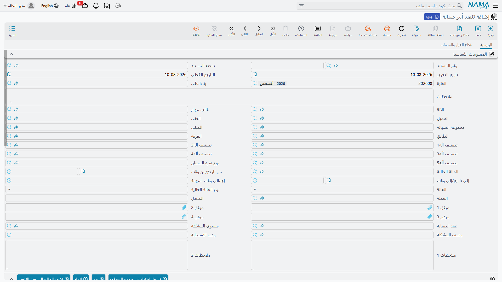

# تنفيذ أوامر الصيانة

سند التنفيذ هو مستند الفني. يُنشأ واحد منه لكل آلة في
[أمر الصيانة](/ar/modules/crm/maintenance-cycle/crm-maintenance-orders.md)، ويحمل قائمة فحص تلك
الآلة، وفيه زر بدء وزر إنهاء يوقّتان العمل، وفيه جدول يكتب فيه الفني قطع الغيار التي ركّبها فعلاً.

كل ما في هذه الجملة صحيح ونافع. لكن ثمة أمر واحد لا يفعله هذا السند، والخطأ فيه هو أغلى خطأ في
هذه الوحدة كلها.

::: danger سند التنفيذ لا يحرك مخزوناً ولا مالاً
جدول قطع الغيار في سند التنفيذ يبدو تماماً كمستند مخزني — مخزن، وموقع، وتشغيلة، ومسلسل، وكمية.
**وهو ليس كذلك.** فترحيل سند التنفيذ لا يسجل شيئاً في دفتر الأستاذ ولا يصرف شيئاً من أي مخزن.
والقطع التي يسجلها الفني هنا تظل في المخزون في نظر النظام حتى تُحفظ
[فاتورة صيانة](/ar/modules/crm/maintenance-cycle/crm-maintenance-invoicing.md)، أو حتى يضغط أحدهم
*صرف قطع غيار* ويحفظ مستند المخازن الذي يُفتح.

ولا شيء يتحقق من حدوث أي من الأمرين. والفرع الذي يعامل سند التنفيذ على أنه المستند الذي يستهلك
المخزون سيكون له مخزن لا تتم مطابقته أبداً، والفارق يكبر مع كل مهمة.
:::

::: info الترخيص المطلوب
`crm-maintenance`
:::

## إنشاء سندات التنفيذ

لا تُكتب سندات التنفيذ من الصفر في الاستعمال المعتاد. بل تضغط في الأمر المرحَّل أحد زرين:

- **إنشاء سند تنفيذ لكل السطور** — سند تنفيذ لكل سطر آلة؛
- **إنشاء سند تنفيذ للسطور المختارة** — المثل، مقصوراً على أسطر الآلات التي علّمتها.

ويشترط الزران أن يسمي [توجيه](/ar/modules/crm/document-terms/crm-maintenance-terms.md) الأمر
**دفتر وتوجيه سند التنفيذ**؛ فبغيرهما يفشل الزر. ويُنشأ كل سند تنفيذ ويُرحَّل نيابة عنك، ويُكتب
مرجعه في سطر الآلة في الأمر، وينتقل نوع حالة الأمر إلى *قيد التنفيذ*.

وفي الأول من أبريل 2026 تنتج أسطر الآلات الثلاثة في الأمر `MO-0513` ثلاثة سندات تنفيذ:

| سند التنفيذ | الآلة | قائمة الفحص | البدء | الإنهاء | صافي الوقت |
|---|---|---|---|---|---|
| `OEX-0771` | `MCH-00311` تشيلر رقم 1 | الشهرية للتشيلر (3 مهام) | 08:00 | 11:30 | 3:30 |
| `OEX-0772` | `MCH-00312` تشيلر رقم 2 | الشهرية للتشيلر (3 مهام) | 11:45 | 13:15 | 1:30 |
| `OEX-0773` | `MCH-00318` وحدة مناولة الهواء | الشهرية لوحدة المناولة (3 مهام) | 14:00 | 15:00 | 1:00 |
| | | | | **إجمالي الموقع** | **6:00** |

وأي قائمة فحص تصل يتوقف على خيار واحد في توجيه الأمر. فالأصل أن تأتي المهام من **قالب مهام سطر
الآلة**؛ فإن فعّلت *اعتبار مهام قوالب المهام عند إنشاء سندات التنفيذ* جاءت من قالب **الترويسة**
بدلاً منه. انظر
[قوالب المهام](/ar/modules/crm/maintenance-setup/crm-maintenance-task-templates.md).

والضغط على الأزرار مرة أخرى لا يكرر شيئاً — بل تُحدَّث سندات التنفيذ القائمة في مكانها.

## ما يراه الفني

**الصفحة الرئيسية.** الأمر في *بناءً على*، والآلة، وقالب المهام، والعميل، والفني، ومجموعة الصيانة،
والمبنى والطابق والغرفة، وتصنيفات الآلة الخمسة، ونوع فترة الضمان، والحالة الحالية، وزوج *من تاريخ
ووقت*، وزوج *إلى تاريخ ووقت*، و**صافي الوقت** المحسوب، و**الحالة** (قيد التنفيذ / منتهي / معاد
فتحه)، والعملة وسعر التحويل، وستة مرفقات، وعقد الصيانة، ومستوى المشكلة، ووصف المشكلة، وزمن
الاستجابة، وحقلا ملاحظات.

**جدول المهام.** قائمة الفحص نفسها: علامة *منتهية*، والمهمة، وعمود مهمة ثانٍ، والملاحظات، ومرفقان
لكل سطر. وزر **تحديد كل السطور كمنتهية** يعلّمها جميعاً بضغطة واحدة.

**جدول الأعطال.** الأعطال التي ظهرت أثناء العمل، بكتلتي الضمان القديم والجديد نفسيهما اللتين في
الأمر.

**صفحة قطع الغيار والخدمات.** جدولان — القطع المركّبة والخدمات المؤداة — في كل منهما الصنف والآلة
والكمية ووحدة القياس وسعر الوحدة والخصم وصافي القيمة ومحددات الصنف.

وفي سندات التنفيذ الثلاثة للأمر `MO-0513` يسجل الفني `SP-FLT-14` × 4 و`SP-OIL-05` × 1 في
`OEX-0771`، و`SP-FLT-14` × 2 في `OEX-0772`، ولا شيء في `OEX-0773` — ستة فلاتر وزيت واحد في
المجموع، مطابقة تماماً لجدول الأمر.

## أزرار التوقيت الثلاثة

**بدء** يضبط الحالة على *قيد التنفيذ* ويكتب تاريخ اليوم والوقت الحالي في زوج *من* إن كانا فارغين.
و**إنهاء** يضبط الحالة على *منتهي* ويكتب زوج *إلى* ويحسب صافي الوقت بالفرق بينهما. و**إعادة فتح**
يعيد الحالة إلى *معاد فتحه*.

والثلاثة لا تكتب إلا في الشاشة التي أمامك — **فالمستند لا يُحفظ بضغطها.** فإن ضغط الفني «إنهاء»
وأغلق المتصفح لم يُسجَّل شيء.

## ماذا يحدث عند ترحيل سند التنفيذ

| الأثر | النتيجة |
|---|---|
| **المحاسبة** | لا شيء. فليس في هذا المستند منطق محاسبي البتة، وليس في توجيهه صفحات محاسبية — بل خطة ضريبية وخاضع للضريبة وضريبة قابلة للتعديل والسماح بتعديل ضريبة الترويسة في التفاصيل، لا غير. |
| **المخزون** | **لا شيء.** انظر التنبيه في أول الصفحة. |
| **في الأمر** | تُكتب حالة سند التنفيذ في *حالة التنفيذ* لسطر الآلة المقابل؛ ويصير نوع حالة الأمر *قيد التنفيذ* ما دام سطر واحد جارياً، و*منتهي* حين تصير كلها منتهية؛ وتُدفع الحالة الحالية للسند إلى الأمر. |

ولا يتغير شيء غير ذلك. وعلى وجه الخصوص لا يُمس استحقاق العقد — فقد خُصم عند ترحيل الأمر — و**لا**
يُحدَّث *تاريخ آخر زيارة* في الآلة، لا هنا ولا في أي موضع آخر.

## إخراج القطع من المخزن

زران في صفحة قطع الغيار يفتحان مستند مخازن مملوءاً مسبقاً من أسطر سند التنفيذ:

| الزر | ما يفتحه |
|---|---|
| طلب صرف قطع غيار | **طلب** صرف مخزني، يعتمده أحدهم ثم يُصرف |
| صرف قطع غيار | **الصرف المخزني** نفسه، أي المستند المخزني الحقيقي |

وكلاهما يُفتح في نافذة منبثقة كمسودة غير محفوظة. ولا يتحرك شيء حتى تحفظه.

::: warning طريق واحد لا طريقان
فبإمكان فاتورة الصيانة أن تولّد صرفاً مخزنياً خاصاً بها من الأسطر نفسها متى نصّ توجيهها على ذلك.
وهذان الزران **بديل** عن ذلك لا إضافة إليه — فحفظ الاثنين يخرج القطع نفسها من المخزون مرتين، بلا
مقاصّة وبلا رابط بين المستندين. فاختر مرة واحدة، على مستوى المنظومة كلها، أي الطريقين تتبع، ودرّب
الفرع عليه.
:::

وهناك زر ثالث، **إنشاء عرض أسعار للأصناف التي بدون سعر**، يجمع كل أسطر قطع الغيار والخدمات التي
سعر وحدتها فارغ أو صفر ويفتح عرض أسعار مبيعات بتلك الأصناف وحدها. وهو معين «نحتاج سعراً لهذا قبل أن
نفوتره».

## إلى الفاتورة مباشرة

زر **إنشاء فاتورة صيانة** في سند التنفيذ يفتح مسودة فاتورة غير محفوظة: تُنسخ الترويسة، وتُرفع آلة
سند التنفيذ إلى سطر آلة في الفاتورة، وتُنسخ جداول قطع الغيار والخدمات. راجعها واحفظها — انظر
[فوترة الصيانة](/ar/modules/crm/maintenance-cycle/crm-maintenance-invoicing.md).

::: warning سند التنفيذ لا يتحقق من شيء
يمكن حفظ سند تنفيذ بلا آلة ولا تواريخ ولا مهام معلّمة ولا قطع غيار البتة. فليس في هذا المستند أي
قاعدة اكتمال، وأي انضباط تريده حوله لا بد أن يأتي من إجراءاتك أنت. وعلى وجه الخصوص، سند تنفيذ يقول
*منتهي* ليس دليلاً على أن العمل تم، ولا على أن قائمة الفحص استُوفيت، ولا على أن القطع خرجت من
المخزن.
:::

**التقارير: لا يوجد.** لا تحتوي هذه الوحدة على أي تقارير نظام، وليس لهذه الشاشة نموذج طباعة. وشاشة
الأمر تحمل قائمة مدمجة بسندات التنفيذ الصادرة عنه، وهي أقرب ما تقدمه الوحدة إلى تقرير بطاقة عمل؛
وفيما عدا ذلك استعمل قائمة العرض وتصديرها إلى إكسل.
