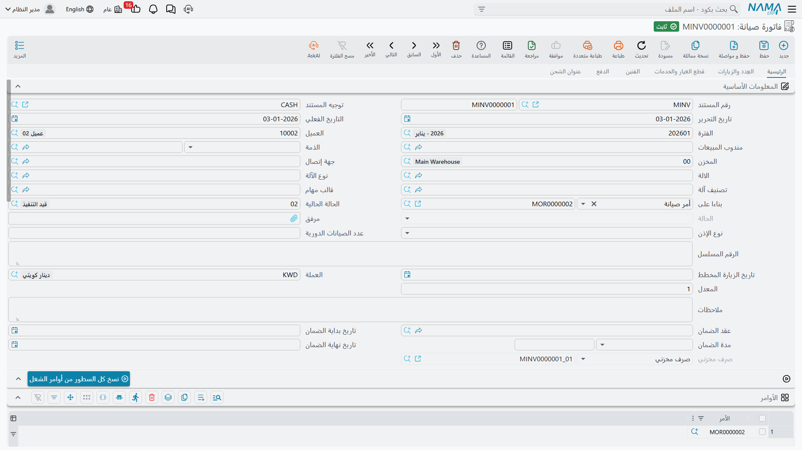

# فوترة الصيانة

فاتورة الصيانة هي المستند الذي يجعل كل ما سبق حقيقة. فحتى هذه اللحظة خصم
[الأمر](/ar/modules/crm/maintenance-cycle/crm-maintenance-orders.md) الكميات من العقد، وسجلت
[سندات التنفيذ](/ar/modules/crm/maintenance-cycle/crm-maintenance-executions.md) ما فعله الفني —
لكن لم يتحرك مال ولم تخرج قطعة من المخزن. والفاتورة تفعل الأمرين.

::: danger الفاتورة هي موضع حركة المخزون والمال
قلها بصوت مسموع لكل من يتعلم هذه الوحدة: **سند التنفيذ يسجل القطع، والفاتورة تصرفها.** فإن عامل
فرعك سند تنفيذ الفني على أنه خطوة استهلاك المخزون، لم تتم مطابقة المخزن أبداً — فالقطع ما زالت
موجودة في النظام والعميل لم يُحاسَب قط.
:::

::: info الترخيص المطلوب
`crm-maintenance`
:::

## إصدار الفاتورة

في الخامس من أبريل 2026 يضغط مكتب الخلفية **إنشاء فاتورة صيانة** في الأمر `MO-0513`. فتُفتح مسودة
غير محفوظة في نافذة منبثقة وقد نُسخت إليها الترويسة وكل الجداول؛ يراجعها الموظف ويحفظها فتصير
`MINV-0298`. والزر نفسه موجود في سند التنفيذ، وينتج المسودة نفسها من أسطر السند.

وهناك ثلاثة طرق أخرى لملء الفاتورة:

- تكتبها، وتدرج الأوامر المعنية في جدول *الأوامر*، وتضغط **نسخ كل السطور من الأوامر** — فتُلحق كل
  أسطر تفاصيل كل أمر مذكور؛
- تكتبها وتختار مستنداً سابقاً في *بناءً على*، فينسخ الناسخ القياسي الترويسة والجداول؛
- تكتب الأسطر بيدك.

ولا شيء يربط هذه الطرق بعضها ببعض. فإدراج الأمر نفسه في فاتورتين ينسخ أسطره مرتين بلا أي تنبيه.

## كيف تبدو `MINV-0298`

| الترويسة | القيمة |
|---|---|
| بناءً على | `MO-0513` |
| العميل | `C-01188` فنادق مارينا بلازا |
| مندوب المبيعات | `EMP-1042` هالة سمير عبد الرحمن |
| المخزن | `WH-ALX` مخزن الإسكندرية |
| عقد الصيانة | `MC-0021` |
| الصرف المخزني *(للقراءة فقط، يُملأ عند الحفظ)* | `SI-1904` |

| قطع الغيار | الكمية | سعر الوحدة | صافي القيمة |
|---|---|---|---|
| `SP-FLT-14` فلتر هواء 14 بوصة | 6 | 300.00 | 1,800.00 |
| `SP-OIL-05` زيت ضاغط 5 لتر | 1 | 600.00 | 600.00 |
| **إجمالي سعر قطع الغيار** | | | **2,400.00** |

| الخدمات | الكمية | سعر الوحدة | صافي القيمة |
|---|---|---|---|
| `MSV-01` زيارة صيانة دورية للتشيلر | 3 | 1,200.00 | 3,600.00 |
| **إجمالي سعر الخدمات** | | | **3,600.00** |

| إجماليات الفاتورة | |
|---|---|
| الإجمالي (2,400.00 + 3,600.00، بلا مرتجعات) | **6,000.00** |
| ضريبة مبيعات 14 % (336.00 على القطع + 504.00 على الخدمات) | **840.00** |
| صافي القيمة | **6,840.00** |

والفاتورة **لا** تحسب نفسها من ساعات سند التنفيذ ولا من إجماليات العقد. بل تفوتر الأسطر الموجودة
عليها فعلاً — جدول قطع الغيار زائد جدول الخدمات ناقص جدول قطع الغيار المرتجعة — وإجماليات الترويسة
هي ببساطة مجموع تلك الجداول.

## من أين تأتي الأسعار

| السطر | السعر الافتراضي | ما يستبدله |
|---|---|---|
| قطعة غيار | **قائمة أسعار البيع** في المخازن | **عقد الصيانة**، متى كان الصنف نفسه في العقد وله كمية متبقية |
| خدمة | سعر سجل كتالوج الخدمات نفسه | قاعدة سطر العقد نفسها |

ولهذا كانت الفلاتر في `MINV-0298` بـ300.00 للواحد، وهو سعر العقد، لا 350.00 المذكور في قائمة
الأسعار؛ وكانت الزيارة الدورية بـ1,200.00 لا 1,500.00 المذكورة في
[كتالوج الخدمات](/ar/modules/crm/maintenance-setup/crm-maintenance-service-catalogue.md). وتبقى كل
الأسعار قابلة للتعديل؛ ولا شيء يمنع الموظف من كتابة غيرها.

::: danger التغطية تُفحص بالكمية وحدها — ولا يوجد فحص تاريخ في أي موضع
تنسخ الفاتورة عقد ضمان الآلة وتاريخي بدايته ونهايته إلى خانات الترويسة ثم لا تفعل بها شيئاً. **فلا
يوجد كود يقارن تاريخ العمل بفترة ضمان أو بتاريخ نهاية عقد، ولا يوجد كود يقرر هل يُحاسَب العميل.**
والمعنى الوحيد لكون العمل «مغطى» هو أن العقد ما زالت فيه كمية متبقية بسعر العقد — والعقد الذي
يسعّر خدمةً بصفر ينتج سطراً بقيمة صفر، وهذه هي الآلية كلها.

والآلة التي انتهى عقدها العام الماضي تُسعَّر وتُخصم وتُفوتَر تماماً كآلة عليها عقد سارٍ. وقرار
المحاسبة من عدمها قرار بشري يُتخذ على هذه الشاشة.
:::

## ماذا يحدث عند ترحيل الفاتورة

| الأثر | النتيجة |
|---|---|
| **المحاسبة** | **نعم.** في `MINV-0298`: مدين حساب مديني العميل (الذمة `C-01188`) بـ6,840.00؛ ودائن إيراد قطع الغيار 2,400.00، وإيراد خدمات الصيانة 3,600.00، وضريبة المبيعات المستحقة 840.00. والأطراف تأتي من [توجيه](/ar/modules/crm/document-terms/crm-maintenance-terms.md) الفاتورة. |
| **المخزون** | **نعم**، متى سمّى التوجيه دفتر وتوجيه الصرف المخزني وفعّل *إنشاء صرف مخزني بقطع الغيار* و/أو *بأصناف الخدمات*. فيُنشأ **صرف مخزني** `SI-1904` من `WH-ALX` يحمل `SP-FLT-14` × 6 و`SP-OIL-05` × 1، ويظهر مرجعه للقراءة فقط في الفاتورة. |
| **استحقاق العقد** | **لا يتغير هنا.** فالخصم وقع عند ترحيل الأمر؛ و*بناءً على* في هذه الفاتورة هو الأمر لا العقد. أما الفاتورة الصادرة مباشرة عن عقد فتخصم من العقد. |
| **سجل ضمانات الأعطال في الآلة** | فقط إذا فعّل توجيه الفاتورة *تحديث جدول ضمانات الأعطال في الآلة* — وعندئذ بشرط ألا يفعّله توجيه الأمر، انظر أدناه. |

والأثران يُنشآن **كطلبات أعمال** تُعالج في الخلفية، فتُحفظ الفاتورة فوراً. وإن فشل أحدهما أعدت
المحاولة من قائمة **طلبات الأعمال**: فلترة حسب حالة المعالجة، ثم اختيار الأسطر، ثم **المزيد ← إعادة
المعالجة**.

وإلغاء الفاتورة يحذف الصرف المخزني المولَّد ويسحب القيد المحاسبي؛ وإعادة حفظها تحدّث الصرف المخزني
في مكانه، وحذف كل الأسطر المولِّدة يحذفه كلياً.

## القواعد التي تحفظ سلامة الحساب

::: warning فعّل توليد المستند المخزني في توجيه واحد فقط
[مقايسة الصيانة](/ar/modules/crm/maintenance-cycle/crm-maintenance-estimations.md) تستطيع هي أيضاً
توليد صرف مخزني من أسطر الأوامر نفسها، بلا مقاصّة وبلا رابط بين المستندين — وأزرار *صرف قطع الغيار*
في الأمر وسند التنفيذ وهذه الشاشة تفتح مستندات مخازن من الأسطر نفسها كذلك. وأي طريقين من هذه
الطرق استُعملا معاً صرفا القطع مرتين.

فاختر **واحداً** — والأصل توجيه فاتورة الصيانة — واترك توليد المستند المخزني معطلاً في كل ما عداه.
:::

::: warning *تحديث جدول ضمانات الأعطال في الآلة* يُفعَّل في توجيه الأمر أو توجيه الفاتورة، لا فيهما معاً
فإن فُعِّل فيهما، رُفضت الفاتورة الصادرة عن ذلك الأمر رفضاً تاماً برسالة تطلب اختيار الخيار في ملف
واحد من الاثنين.
:::

::: warning المستند المخزني المولَّد لا يحتفظ بشيء يُذكر من تفاصيل أسطرك
لا يُنقل إلا **الصنف والكمية ووحدة القياس**، ومعها الترويسة: دفتر وتوجيه المستند من توجيه مستند
خدمة العملاء، و**مخزن الترويسة**، والذمة، والمستند المصدر.

ومعنى ذلك أن **مخزن السطر وموقعه يسقطان**، وكذلك الأسعار ومحددات الصنف والملاحظات. فالإصلاح الذي
تأتي قطعه من مخزنين مختلفين لا يمكن صرفه صرفاً صحيحاً من هذا المستند — إذ يخرج كل شيء من مخزن
الترويسة. وإن كان مخزن الترويسة فارغاً فشلت الفاتورة عند الحفظ بخطأ فني بدل رسالة تحقق واضحة،
فاملأه قبل الحفظ.

وثمة فخ متصل بهذا: الفاتورة المحفوظة على توجيه لم تُملأ إعداداته تفشل هي الأخرى بخطأ فني بدل رسالة
مفهومة. فإن أنتج حفظ فاتورة فشلاً لا تفسير له، فافحص التوجيه أولاً.
:::

::: warning طرف الحساب الذي يأخذ ذمته من مندوب المبيعات لا يعمل هنا
فالإعداد نفسه يعمل في أمر الصيانة وطلب أمر الصيانة، ويُتجاهل في صمت في الفاتورة، وإن كان فيها
مندوب مبيعات. استعمل ذمة العميل في أطراف حسابات الفاتورة.
:::

## المدفوعات في الفاتورة

تحمل الفاتورة كتلة المدفوعات كاملة: قالب جدول سداد، وزر **إنشاء المدفوعات** يوسعه إلى أسطر جدول،
وأزراراً لإنشاء سند قبض للمدفوعات المختارة، أو إنشاء سند قبض واحد، أو تجميع سندات القبض القائمة.
وتعرض كتلة الإجماليات الإجمالي والخصم والمبلغ النقدي ومكافأة الفنيين وصافي القيمة ومدفوعات السندات
وإجمالي المسدد والمتبقي. ولا شيء من هذا يغير ما فُوتر — فهو تحصيل لا تسعير.

## مردود فاتورة الصيانة

**مردود فاتورة الصيانة** هو المستند المقابل، ويصدر والفاتورة مذكورة في *بناءً على*. وجدول قطع
الغيار فيه *هو* المرتجع (فليس فيه جدول مرتجعات مستقل)، وبدل الصرف المخزني يحمل مرجع **توريد مخزني**
للقراءة فقط. وتوجيهه على شكل توجيه الفاتورة، بدفتر وتوجيه **توريد** مخزني وخياري *إنشاء توريد
مخزني بقطع الغيار / بأصناف الخدمات*.

وترحيله يعكس القيد المحاسبي ويورّد القطع إلى مخزن الترويسة.

::: danger المردود لا يعيد استحقاق العقد — بل يستهلك المزيد
فإرجاع فلترين على عقد لا يعيد اثنين إلى الكمية المتبقية. بل يخصم **اثنين آخرين**، في الاتجاه نفسه
الذي خصمته الفاتورة: المنصرف يزيد والمتبقي ينقص. ثم تُرفض الأوامر التالية خطأً بحجة تجاوز الكمية
المتبقية.

ولا يوجد زر يصحح هذا. فبعد كل مردود، افتح عقد الصيانة وصحح كميتي المنصرف والمتبقي في الأسطر
المتأثرة بيدك.
:::

ويرث المردود كذلك قاعدة مخزن الترويسة المذكورة أعلاه: فالتوريد المولَّد يأخذ الصنف والكمية ووحدة
القياس لا غير، ويعود كل شيء إلى مخزن الترويسة.

**التقارير: لا يوجد.** لا تحتوي هذه الوحدة على أي تقارير نظام، وليس لهذه الشاشة نموذج طباعة.
ولأرقام الإيراد والاستهلاك استعمل قوائم العرض وتصديرها إلى إكسل، أو دفتر الأستاذ العام، أو وحدة
ذكاء الأعمال على المستندات المخزنية والمحاسبية المولَّدة.
