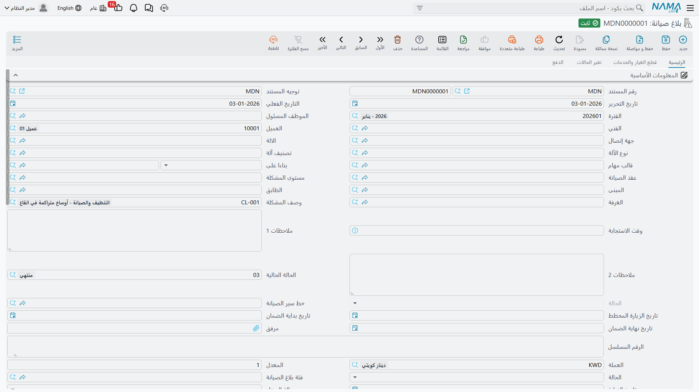
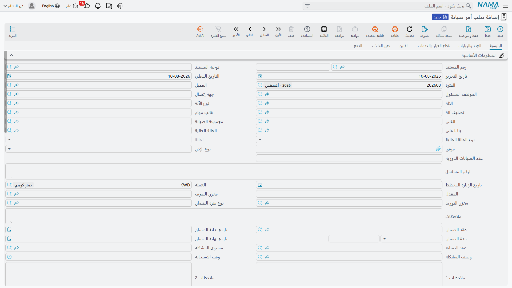

# البلاغات والطلبات

ليست كل صيانة مخططة. ففي 20 مايو 2026 يتصل فندق مارينا بلازا بشركة النخبة: التشيلر رقم 2 يفقد كفاءته في التبريد، وثمة رائحة غاز تبريد في غرفة المعدات. ولا توجد خطة عمل لهذا. وما يكتبه مركز الاتصال هو **بلاغ صيانة** — `MNOT-0140` — ومن هناك يسير المسار التفاعلي إلى أمر صيانة بالطريقة نفسها التي يسير بها المسار الوقائي.

وتتناول هذه الصفحة المستندين الواقعين قبل أمر الصيانة: **البلاغ**، وهو مكالمة العميل، و**طلب أمر الصيانة**، الذي يبدو خطوة اعتماد وليس كذلك.

القائمة: **خدمة العملاء ← مستندات الصيانة ← بلاغ صيانة** و**… ← طلب أمر صيانة**.

::: info الترخيص المطلوب
`crm-maintenance`. وليس للبلاغ **توجيه على الإطلاق**، فلا شيء تضبطه فيه. أما الطلب فيتشارك توجيه أمر الصيانة — وهنا تكمن المشكلة؛ انظر أدناه.
:::

## بلاغ الصيانة

البلاغ سجل عطل يحمل اسم عميل. ويقرأ `MNOT-0140` هكذا:

| الحقل | القيمة |
|---|---|
| التاريخ الفعلي | 2026-05-20 |
| العميل | `C-01188` فنادق مارينا بلازا |
| الآلة | `MCH-00312` تشيلر رقم 2 |
| فئة بلاغ الصيانة | `NC-01` بلاغ عميل |
| مستوى مشكلة الصيانة | `TL-02` متوسط |
| وصف مشكلة الصيانة | `TD-07` انخفاض كفاءة التبريد |
| العطل | `DYS-021` تسريب غاز التبريد |
| الفني | `EMP-2014` سيد مرسي |

واختيار الآلة يكتب عنك معظم البيانات: فالعميل وجهة الاتصال والرقم المسلسل وتواريخ الضمان والمبنى والطابق والغرفة تُملأ كلها من ملف الآلة. أما التصنيفات على اليمين فتأتي من كتالوجات الأعطال — راجع [كتالوجات الأعطال](/ar/modules/crm/maintenance-setup/crm-fault-catalogues.md).

**والصفحة الرئيسية** تحمل أيضاً الموظف المسئول، ونوع الآلة وتصنيفها، وقالب المهام، وعقد الصيانة، وكتلة عنوان كاملة مع موقع على الخريطة، ومرفقاً، وحالة طلب دعم، وتاريخ زيارة، وحالة سداد، وحقلين يكتبهما مستند التوزيع: **خط سير الصيانة** و**تاريخ الزيارة المخطط**. وتحت الرأس جدول **الآلات**، وجدول **الأعطال** — العطل والآلة وتفصيل حر وحل مقترح — ومجموعة إجماليات.

**وصفحة قطع الغيار والخدمات** تحمل القطع والخدمات المتوقعة للإصلاح، بأسعارها وضرائبها وإجمالياتها.

**وصفحة تغيير الحالة** تعرض سجلاً يكتبه النظام لتغيرات الحالة (من حالة، إلى حالة، التاريخ، المستخدم، ملاحظة). ولا يمكنك إضافة سطر فيه ولا تعديله ولا حذفه — فالنظام وحده يكتب فيه عند تغير الحالة الحالية. وتحته شيء أطرف يتناوله القسم التالي.

**وصفحة الفوترة** فيها قالب جدول دفعات، وزر **إنشاء الدفعات**، وسطور الجدول، ومستندات الدفع، وطرق الدفع.

::: danger البلاغ يسجل مالاً ولا يفعل به شيئاً
يعيد البلاغ حساب إجماليات قطع الغيار والخدمات والكتلة المالية في الرأس وجدول الدفعات كله وأنت تكتب — ثم **لا يصل أي من ذلك إلى شيء**. فلا قيد محاسبي، ولا حركة مخزنية، ولا مديونية، ولا أثر على رصيد العميل، ولا حتى توجيه يمكن أن تضبط به شيئاً. البلاغ **سجل عطل**، وتسعيره مسك دفاتر لعينيك أنت فقط.

وثمة طرافتان مصاحبتان تتوقعهما وأنت على الشاشة:

- يُكتب في كل سطر آلة **إجمالي سعر الخدمات** بقيمة **صفر**، مهما وضعت في جدول الخدمات.
- ومع ذلك يُرفض المستند إذا لم يساوِ مجموع سطور جدول الدفعات صافي القيمة — تحقّق على جدول بلا أثر. فإن رفض البلاغ الحفظ فهذا هو السبب عادةً.
:::

## حضور الفنيين من التطبيق المحمول

يقوم البلاغ أيضاً بدور مستند الحضور للفنيين الميدانيين. فحين يسجّل فني يستعمل تطبيق نما للهواتف دخوله وخروجه في مهمة، تُسجَّل القيود على البلاغ وتظهر قائمةً للقراءة فقط في صفحة **تغيير الحالة** — من كان في الموقع، وبين أي وقتين.

وهذه هي الخاصية كلها: سجل ظاهر للوصول والمغادرة على المهمة. ولا يُقارن شيء بوردية، ولا يصل شيء إلى الرواتب، ولا توجد قاعدة تمنع الفني من تسجيل الدخول مرتين.

## من البلاغ إلى أمر الصيانة

لا يوجد زر *تحويل إلى أمر*. ففي 21 مايو ينشئ أحدهم **أمر صيانة** بيده ويختار `MNOT-0140` في حقل **بناءاً على**. فتُنقل آلة الرأس وبيانات الرأس المشتركة، ومعها جداول مجموعات الصيانة وقطع الغيار والخدمات والأعطال والآلات والعِدد والفنيين — إلا إذا أشّر توجيه الأمر على *عدم نسخ بيانات رأس المستند المصدر* أو *عدم نسخ تفاصيل المستند المصدر*.

والناتج هو `MO-0527`، أمر صيانة عادي يحمل كل ما سجله مركز الاتصال. ومن هناك تسير الدورة كما تسير الدورة الوقائية — راجع [أوامر الصيانة](/ar/modules/crm/maintenance-cycle/crm-maintenance-orders.md).

::: tip توزيع بلاغات اليوم
إذا كان فرعك يعمل بخطوط سير لا بالمكالمة الواحدة، فزوج **خطة صيانة خدمة عملاء** و**خط سير صيانة** هو الأداة: تسرد الخطة خطوط سير اليوم ولكل خط فنيّه والبلاغات التي ستُخدَم، وحفظها يكتب الفني وخط السير وتاريخ الزيارة المخطط على كل بلاغ مدرج فيها. وهذا أثر تلقائي حقيقي — الموضع الوحيد في هذه المنطقة الذي يغيّر فيه حفظ مستند مستنداً آخر.

وهو توزيع يومي لا جدولة وقائية، وأرقام سعة خطوط السير لا تُفرَض أبداً. راجع [التوزيع اليومي](/ar/modules/crm/maintenance-cycle/crm-maintenance-dispatch.md).
:::

## طلب أمر الصيانة

وُجد الطلب لتُراجَع الأعمال قبل أن تصير أمراً. وهو يتشارك شاشة أمر الصيانة تشاركاً شبه تام — الرأس نفسه، وصفحات الآلات والأعطال وقطع الغيار والخدمات والفنيين وتغيير الحالة — مع نزع الأجزاء العاملة. فعلى الطلب لا يوجد زر **إنشاء سند تنفيذ**، ولا **إنشاء فاتورة صيانة**، ولا **طلب صرف قطع غيار**، ولا **طلب توريد قطع غيار المرتجعة**، ولا **طلب صرف عِدد**، ولا قائمة الزيارات المضمّنة، ولا صفحة عنوان الشحن.

وهو يتحقق كما يتحقق الأمر: مجموع مكافآت الفنيين في الجدول يجب أن يساوي مكافأة الرأس، وكل آلة مستعملة في جدول تفصيلي يجب أن تظهر في جدول الآلات، ولا يجوز تكرار الآلة وقالب المهام نفسيهما، وتُرفض أي كمية تتجاوز ما تبقّى على العقد.

::: warning لا شيء يحوّل الطلب إلى أمر
لا يوجد إجراء اعتماد ولا إجراء تحويل. فحين يُتفق على العمل ينشئ أحدهم **أمر صيانة** ويختار الطلب في حقل **بناءاً على** — الخطوة اليدوية نفسها التي تُستعمل مع البلاغ. والطلب لا يُؤشَّر عليه ولا يُغلق ولا يُستهلك، ويمكن استعمال الطلب الواحد مصدراً لأي عدد من الأوامر. فالمراجعة التي سُمّي بها إجراء بشري لا إجراء في النظام.
:::

::: danger الطلب ينشئ قيداً محاسبياً إذا كان في توجيهه حسابات
يتشارك الطلب توجيه أمر الصيانة، ولذلك التوجيه صفحة **الأثر** فيها طرف مدين وطرف دائن. ويُقرأ هذان الطرفان على الطلب تماماً كما يُقرآن على الأمر: املأهما، فيصير حفظ مستند غرضه كله أن *يطلب* عملاً سبباً في قيد على حساب العميل.

اترك الطرفين المدين والدائن على توجيه أمر الصيانة **فارغين** إلا إذا أردت عمداً أن تُحدث الأوامر والطلبات قيوداً — ففي الإعداد الطبيعي تكون [فاتورة الصيانة](/ar/modules/crm/maintenance-cycle/crm-maintenance-invoicing.md) هي المستند الوحيد في الدورة الذي يصل إلى دفتر الأستاذ. راجع [توجيهات مستندات الصيانة](/ar/modules/crm/document-terms/crm-maintenance-terms.md).
:::

ولا تحرك الطلبات مخزوناً في أي إعداد.

## متى تستعمل أيّاً منهما

| الحالة | المستند |
|---|---|
| عميل يبلّغ عن عطل | **بلاغ صيانة** — فهو المستند الوحيد الذي عليه كتالوجات الأعطال وكتلة العنوان وسجل حضور التطبيق المحمول |
| عمل يحتاج اعتماداً داخلياً قبل تخصيص فني | **طلب أمر صيانة**، مفهوماً بوصفه ورقة على أحدهم أن يقرأها — وأطرافه المحاسبية فارغة |
| زيارة وقائية مخططة | لا هذا ولا ذاك. فتلك تأتي من [خطة العمل](/ar/modules/crm/maintenance-cycle/crm-maintenance-work-plans.md) |

## التقارير

**التقارير: لا يوجد.** لا تحتوي هذه الوحدة على أي تقرير جاهز، وليس لهذه الشاشة نموذج طباعة. ولمراجعة البلاغات المفتوحة استعمل شاشة قائمة البلاغات بمعايير محفوظة — مرشَّحة بفئة البلاغ أو مستوى المشكلة أو تاريخ الزيارة المخطط — وصدّرها إلى إكسل.
