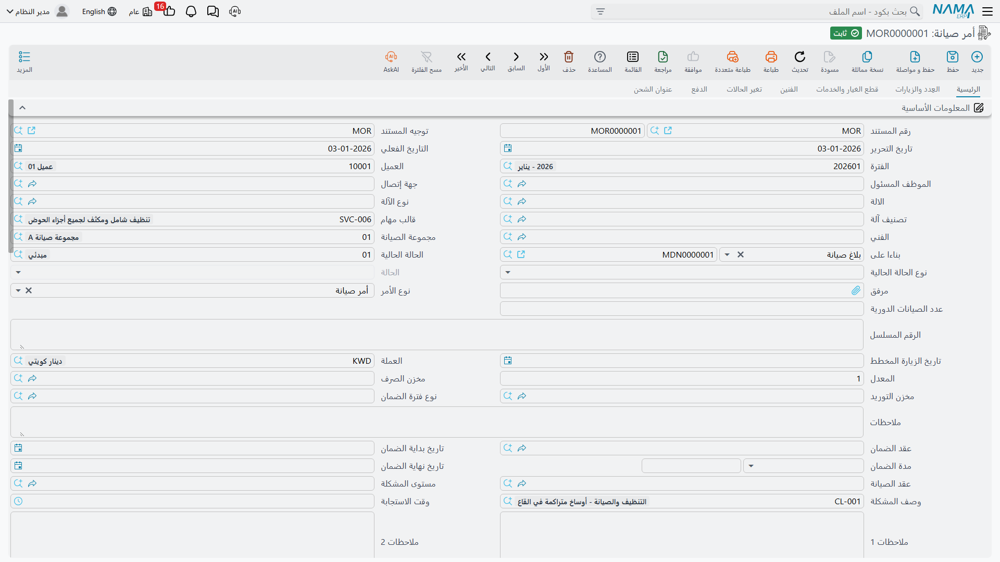

# أوامر الصيانة

في الأول من أبريل 2026 تفتح ناهد الجندي خطة عمل الصيانة `WP-0087` وتضغط **إنشاء أوامر الصيانة**.
في الخطة ثلاثة أسطر: زيارة أبريل الشهرية للتشيلر `MCH-00311`، ومثلها للتشيلر `MCH-00312`، والزيارة
الشهرية لوحدة مناولة الهواء `MCH-00318`. والثلاثة تشترك في التاريخ المتوقع نفسه، والفني نفسه
(`EMP-2011` محمود عادل حسن)، والمبنى نفسه، فيجمعها النظام في مستند **واحد**: أمر الصيانة `MO-0513`.

وهذا الأمر هو موضع العمل الحقيقي في منظومة الصيانة. فهو يقول ما الآلات التي يجري العمل عليها، وما
الأعطال التي وُجدت، وما قطع الغيار والخدمات التي يحتاجها العمل، ومن الفنيون وما المستحق لكل منهم.
وهو يخصم الكميات المدفوعة مقدماً من العقد، ويستطيع أن يكتب ضماناً جديداً على العطل الذي أُصلح، بل
ويستطيع أن يسجل قيداً محاسبياً إن أعددته لذلك. أما ما لا يفعله فهو إخراج قطعة واحدة من المخزن؛ فذلك
لا يحدث إلا عن طريق [الفاتورة](/ar/modules/crm/maintenance-cycle/crm-maintenance-invoicing.md).

::: info الترخيص المطلوب
`crm-maintenance`
:::

## من أين يأتي أمر الصيانة

هناك خمسة طرق للوصول إلى هذه الشاشة، وواحد منها فقط تلقائي:

| الطريق | كيف | تلقائي؟ |
|---|---|---|
| من **خطة عمل صيانة** | زر *إنشاء أوامر الصيانة* في خطة العمل | نعم — تُنشأ الأوامر وتُرحَّل نيابة عنك |
| من **بلاغ صيانة** | تكتب الأمر وتختار البلاغ في *بناءً على* | لا |
| من **طلب أمر صيانة** | تكتب الأمر وتختار الطلب في *بناءً على* | لا |
| من **عقد صيانة** | تكتب الأمر وتختار العقد في *بناءً على* | لا |
| من لا شيء | تكتبه | لا |

وحين تختار مستنداً سابقاً في *بناءً على* ينسخ النظام بيانات الترويسة وجداول مجموعات الصيانة وقطع
الغيار والخدمات والأعطال والآلات والعِدد والفنيين — ما لم يكن
[توجيه](/ar/modules/crm/document-terms/crm-maintenance-terms.md) الأمر يفعّل خيار *عدم نسخ بيانات
ترويسة المستند المصدر* أو *عدم نسخ تفاصيل المستند المصدر*. و**العقد** استثناء: منه تُنسخ أسطر
مجموعات الصيانة فقط.

::: warning لا شيء يحوّل طلباً أو مقايسة إلى أمر
يبدو *طلب أمر الصيانة* كأنه خطوة موافقة تسبق الأمر، وتبدو
[مقايسة الصيانة](/ar/modules/crm/maintenance-cycle/crm-maintenance-estimations.md) كأنها عرض سعر
يتحول إلى أمر. وليس الأمر كذلك في الحالتين. فلا يوجد في أي منهما زر ينتج أمر صيانة — بل يُكتب الأمر
يدوياً مع ذكر المستند السابق في *بناءً على*، ولا يُعلَّم المستند السابق ولا يُغلق ولا يُستهلك
بأي صورة.
:::

## الشاشة صفحةً صفحة

**الصفحة الرئيسية.** العميل، والموظف المسئول، وجهة الاتصال، والآلة، ونوع الآلة، وتصنيف الآلة، وقالب
المهام، والفني، ومجموعة الصيانة، و*بناءً على*، و**الحالة الحالية** و**نوع الحالة** (انظر أدناه)،
والمرفق، و**نوع الأمر** (تركيب / أمر صيانة / صيانة دورية)، وعدد الصيانات الدورية، والرقم المسلسل،
وتاريخ الزيارة المخططة، والعملة وسعر التحويل، و**مخزن الصرف** و**مخزن التوريد**، ونوع فترة الضمان،
وعقد الضمان، وبداية العقد ومدة الضمان ونهاية العقد، وعقد الصيانة، ومستوى المشكلة، ووصف المشكلة،
وزمن الاستجابة، وحقلا ملاحظات.

واختيار الآلة يملأ العميل وجهة الاتصال والرقم المسلسل وتواريخ الضمان والمبنى والطابق والغرفة من
[ملف الآلة](/ar/modules/crm/maintenance-setup/crm-machines.md). والأصل أن عميل الآلة **يستبدل** ما
كُتب في خانة العميل؛ وخيار إعدادات خدمة العملاء *إنشاء فاتورة بعميل مختلف* هو ما يمنع ذلك. وعلى
النسق نفسه، لا يعرض بحث الآلة إلا آلات العميل المختار ما لم يكن خيار *عدم فلترة الآلة بالعميل*
مفعّلاً — ولهذا بالضبط تكون الآلات التي أنشأها زر *إنشاء الآلة* بلا عميل غير ظاهرة هنا (انظر
[مبيعات الصيانة](/ar/modules/crm/maintenance-cycle/crm-maintenance-sales.md)).

**جدول الآلات.** سطر لكل آلة يجري العمل عليها، ولكل سطر قالب مهامه، وأعمدة عدّاد التشغيل، وعمودان
للقراءة فقط بمستند التنفيذ وحالة التنفيذ، ومربع *مختار* يعمل معه زر *إنشاء سند تنفيذ للسطور
المختارة*. وفي `MO-0513` ثلاثة أسطر: `MCH-00311` و`MCH-00312` بقائمة الفحص الشهرية للتشيلر،
و`MCH-00318` بقائمة الفحص الشهرية لوحدة المناولة.

وآلة الترويسة تُنسخ إلى هذا الجدول تلقائياً عند الحفظ فتحل محل سطر فارغ. وهناك قاعدتان مطبقتان: كل
آلة تُستعمل في أي موضع آخر من المستند يجب أن تظهر في هذا الجدول، ولا يجوز تكرار الزوج
(آلة + قالب مهام) مرتين.

**جدول الأعطال.** الأعطال التي وُجدت. فللتشيلر رقم 1 يسجل الفريق العطل `DYS-014` *ارتفاع ضغط
الطرد*، مع وصف حر وحل مقترح. أما كتلة *الضمان القديم* للقراءة فقط في السطر — نوع الفترة والبداية
والنهاية والأيام المتبقية — فتُملأ من سجل ضمانات الأعطال في الآلة نفسها، ليرى الفني بنظرة واحدة هل
ما زال هذا العطل مغطى من إصلاح سابق. وهي فارغة في `MO-0513` لأن هذا أول عطل مسجل على التشيلر رقم 1.
والأعمدة المقابلة هي الضمان **الجديد** الذي يمنحه الإصلاح: نوع الفترة `WPT-03M`، البداية
2026-04-02، النهاية 2026-07-02.

**قطع الغيار والخدمات.** جدولان مسعّران وثالث للمرتجعات. ويحمل كل سطر قطع غيار الصنف والآلة والكمية
وكتلة سعر كاملة بأربع ضرائب والمخزن والموقع والملاحظات ومحددات الصنف. أما أسطر الخدمات فتحمل خدمة من
[كتالوج الخدمات](/ar/modules/crm/maintenance-setup/crm-maintenance-service-catalogue.md) وكمية وكتلة
السعر وحقول ضمان خاصة بها. وفي `MO-0513`:

| قطع الغيار | الكمية | سعر الوحدة | صافي القيمة |
|---|---|---|---|
| `SP-FLT-14` فلتر هواء 14 بوصة | 6 | 300.00 | 1,800.00 |
| `SP-OIL-05` زيت ضاغط 5 لتر | 1 | 600.00 | 600.00 |
| **إجمالي سعر قطع الغيار** | | | **2,400.00** |

| الخدمات | الكمية | سعر الوحدة | صافي القيمة |
|---|---|---|---|
| `MSV-01` زيارة صيانة دورية للتشيلر | 3 | 1,200.00 | 3,600.00 |
| **إجمالي سعر الخدمات** | | | **3,600.00** |

فيكون إجمالي الأمر **6,000.00**.

**الفنيون.** خانة *مكافأة الصيانة* في الترويسة وجدول بالفنيين ومكافأة كل منهم. ويُرفض المستند إذا لم
يكن مجموع الجدول مساوياً للترويسة — ففي `MO-0513` الترويسة 300.00 مقابل `EMP-2011` بـ200.00
و`EMP-2014` بـ100.00. واختيار مجموعة صيانة يملأ الجدول من أعضائها.

**العِدد والزيارات.** جدول العِدد، وزر *طلب صرف عِدد*، وقائمة مدمجة للقراءة فقط
[بزيارات الصيانة](/ar/modules/crm/maintenance-cycle/crm-maintenance-visits.md) المرتبطة بهذا الأمر.

**تغيير الحالة.** سجل الحالات: من حالة، إلى حالة، تاريخ التغيير، المستخدم، ملاحظة. ويكتبه النظام
وحده — وإضافة سطر أو حذفه أو تعديله يجعل المستند مرفوضاً.

وصفحتا **الفوترة** و**عنوان الشحن** تحملان تفاصيل جدول السداد والتسليم، وتعملان كما في أي مستند آخر
من هذه العائلة.

## الحالات، وخطوة الإعداد التي تقرر هل يعمل كل ذلك أصلاً

خانة *الحالة الحالية* تشير إلى سجل **حالة أمر صيانة** أنشأته أنت، ويحمل كل سجل منها **نوع حالة** —
مفتوحة، قيد التنفيذ، معلقة، مغلقة، مبدئية، معاد فتحها، منتهية. ونوع الحالة هذا هو ما يقرأه النظام
فعلاً: يُنسخ إلى خانة *نوع الحالة* في الأمر (للقراءة فقط)، وتكتب فوقه
[سندات التنفيذ](/ar/modules/crm/maintenance-cycle/crm-maintenance-executions.md) مع بدء العمل
وانتهائه. ففي `MO-0513` يبدأ الأمر عند `MOS-NEW` (مفتوح) وينتقل إلى `MOS-WIP` (قيد التنفيذ) بمجرد
بدء أول تنفيذ.

::: warning حالة بلا نوع حالة لا تسجل شيئاً
إذا أُنشئت سجلات حالات الأوامر في منظومتك بغير نوع حالة، توقفت الدورة كلها في صمت: يبقى نوع حالة
الأمر فارغاً، ولا تجد سندات التنفيذ ما تحركه، ولا تخبرك أي شاشة بالسبب. افحص هذا أولاً — انظر
[حالات الأوامر والزيارات](/ar/modules/crm/maintenance-setup/crm-maintenance-statuses.md).
:::

وهناك خانة حالة ثانية اسمها *نوع الحالة الحالية* (مراجَع، بانتظار المراجعة، مرفوض، انتهى بموافقة
العميل). وهي تُحفظ وتُعرض و**لا يقرؤها شيء**. فاعتبرها ملاحظة لزملائك لا دورة مراجعة.

## من أين تأتي الأسعار

يُسعَّر صنف قطع الغيار من **قائمة أسعار البيع** في المخازن — إلا أن يكون الصنف نفسه مذكوراً في عقد
الصيانة الذي جاء منه الأمر وله كمية متبقية، فعندئذ **يفوز سعر العقد**. وتُسعَّر الخدمة من سجل
كتالوج الخدمات، ثم يستبدله سطر العقد إن وُجد. ولهذا كان سعر الفلاتر في `MO-0513` هو 300.00 لا
350.00 المذكور في قائمة الأسعار: لأن `MC-0021` يسعّرها بـ300.00.

وتبقى كل الأسعار قابلة للتعديل على الشاشة. ولا شيء يمنع الموظف من كتابة رقم آخر.

## استحقاق العقد — المعنى الوحيد لكلمة «مغطى»

لا يحمل عقد الصيانة علامة «مغطى / غير مغطى». وإنما يحمل **كمية** من قطع الغيار والخدمات مدفوعة
مقدماً بسعر العقد، والأمر يخصم من تلك الكمية. فترحيل `MO-0513` يغيّر `MC-0021` هكذا:

| سطر العقد | المتبقي قبل | المطلوب | المنصرف / المتبقي بعد |
|---|---|---|---|
| `SP-FLT-14` | 24 | 6 | 6 / **18** |
| `SP-OIL-05` | 4 | 1 | 1 / **3** |
| `MSV-01` | 44 | 3 | 3 / **41** |

وإن طلبت أكثر مما تبقى في العقد رُفض الأمر برسالة تذكر الصنف والعقد.

::: danger التغطية كمية لا تاريخ
يملأ الأمر خانات *عقد الضمان* و*بداية العقد* و*نهاية العقد* من الآلة ثم يقف عند ذلك. **فلا يوجد
كود يقارن تاريخ العمل بفترة الضمان أو بتاريخ نهاية العقد، ولا يوجد كود يقرر هل يُحاسَب العميل أم
لا.** والعمل على آلة انتهى عقدها العام الماضي يُسعَّر ويُخصم ويُفوتَر تماماً كالعمل المغطى. فقرار
ما يُحاسَب عليه قرار بشري بالكامل، يُتخذ على هذه الشاشة.
:::

## ماذا يحدث عند ترحيل الأمر

| الأثر | النتيجة |
|---|---|
| **المحاسبة** | فقط إذا أُعدّ طرفا المدين والدائن كلاهما في توجيه الأمر. عندئذ يسجل الأمر قيداً بسيطاً من طرفين — سطر لكل سطر قطع غيار، وسطر لكل سطر خدمة، وسطر **بالسالب** لكل سطر قطع غيار مرتجعة. وفي `MO-0513` تُرك الطرفان فارغين عمداً فلا يُسجَّل شيء؛ والفاتورة هي التي تسجل. |
| **المخزون** | **لا شيء.** لا تخرج أي قطعة من أي مخزن بسبب هذا المستند. |
| **استحقاق العقد** | يُخصم كما في الجدول أعلاه. |
| **سجل ضمانات الأعطال في الآلة** | إذا فعّل التوجيه خيار *تحديث جدول ضمانات الأعطال في الآلة*، كتب كل سطر عطل يمنح ضماناً جديداً سطراً في سجل ضمانات الآلة. فتكسب `MCH-00311` السطر: `DYS-014` · `MO-0513` · 2026-04-01 · `WPT-03M` · بداية 2026-04-02 · 92 يوماً · نهاية 2026-07-02. وإلغاء الأمر أو تعديله ينظف تلك الأسطر مرة أخرى. |
| **عقد الضمان** | فقط لأمر من نوع *تركيب* — انظر القسم التالي. |

والقيد المحاسبي، حيث يوجد، يُنشأ **كطلب أعمال** يُعالج في الخلفية، فيُحفظ المستند فوراً. وإن فشلت
المعالجة أُعيدت المحاولة من قائمة **طلبات الأعمال**: فلترة حسب حالة المعالجة، ثم اختيار الأسطر، ثم
**المزيد ← إعادة المعالجة**.

::: warning فعّل *تحديث جدول ضمانات الأعطال في الآلة* في موضع واحد فقط
الخيار نفسه موجود في توجيه الأمر وفي توجيه الفاتورة. فإن حمله الاثنان، رُفضت الفاتورة الصادرة عن
ذلك الأمر **رفضاً تاماً** برسالة تطلب منك اختياره في ملف واحد من الاثنين. فاختر واحداً — والأصل أن
يكون توجيه الأمر لأنه موضع تسجيل العطل.
:::

## أمر التركيب ينشئ عقداً من وراء ظهرك

حين يكون *نوع الأمر* هو **تركيب** ويسمي توجيه الأمر دفتر عقد الضمان وتوجيهه، فإن ترحيل الأمر
**ينشئ ويرحّل عقد صيانة** من نوع *عقد ضمان*. وينسخ إليه مدة الضمان وتواريخه، والآلة والرقم المسلسل
والعميل وجهة الاتصال، وجداول الآلات وقطع الغيار والخدمات. وإلغاء الأمر — أو تغيير نوعه إلى غير
التركيب — يحذف ذلك العقد.

::: danger عقد الضمان المولَّد يحمل كتلة المال كاملة
فالنسخ يشمل كتلة المال كلها لا التغطية وحدها. ولعقد الصيانة أثر محاسبي كامل من طراز الفواتير، فإن
كان التوجيه الذي سميته للعقد المولَّد يحمل طرفي مدين ودائن **سُجل المبلغ نفسه مرتين** — مرة بالأمر
(أو لاحقاً بالفاتورة) ومرة بالعقد الذي ظهر من تلقاء نفسه. ولا شيء ينبهك. فسمِّ توجيه عقد ضمان
**بلا** أطراف محاسبية.
:::

## طلب أمر الصيانة

يشترك الطلب في هذه الشاشة، والمقصود به خطوة «من فضلكم نفذوا هذا العمل» قبل الأمر. وهو عملياً شاشة
الأمر وقد أُزيل أكثر أزرارها: لا سندات تنفيذ، ولا فاتورة، ولا صرف قطع غيار، ولا صرف عِدد، ولا قائمة
زيارات، ولا عنوان شحن. وهو موصوف مع البلاغات في صفحة
[البلاغات والطلبات](/ar/modules/crm/maintenance-cycle/crm-maintenance-notices-and-requests.md).

::: warning الطلب يسجل قيداً محاسبياً
رغم أنه «طلب»، فهو يستعمل منطق المحاسبة نفسه الذي يستعمله الأمر: فإن حمل توجيهه طرفي مدين ودائن،
أنشأ حفظه قيداً محاسبياً. فاترك هذين الطرفين فارغين في توجيه الطلب إلا أن تريد فعلاً مستنداً لا
يتجاوز *طلب* العمل ثم يصل إلى دفتر الأستاذ.
:::

## الأزرار التي تُخرج القطع من المخزن

ثلاثة أزرار في هذه الشاشة تفتح مستند مخازن في نافذة منبثقة، مملوءاً مسبقاً من جداول الأمر. ولا
يُحفظ شيء حتى تحفظه أنت:

| الزر | ما يفتحه |
|---|---|
| طلب صرف قطع غيار | طلب صرف مخزني بأسطر قطع الغيار |
| طلب توريد قطع الغيار المرتجعة | طلب توريد مخزني بأسطر المرتجعات |
| طلب صرف عِدد | طلب صرف مخزني بجدول العِدد |

::: warning هذه بديل عن الصرف بالفاتورة لا إضافة إليه
فالفاتورة تولّد صرفاً مخزنياً خاصاً بها من الأسطر نفسها. فإن صرف الفني القطع من هنا ثم حفظ مكتب
الخلفية فاتورة يولّد توجيهها صرفاً مخزنياً، **خرجت القطع من المخزن مرتين** — بلا مقاصّة، وبلا علامة
«صُرفت من قبل»، وبلا رابط بين المستندين. فاختر مرة واحدة، على مستوى المنظومة كلها، أي الطريقين
تتبع.

وفي هذه الشاشة غرابة أخرى: زران يحملان الاسم نفسه **طلب صرف عِدد**، وأحدهما يفتح في الحقيقة طلب
**توريد** مخزني. فاقرأ المستند الذي يُفتح قبل أن تحفظه.
:::

## الخطوة التالية

من الأمر المرحَّل يكون الطريق المعتاد هو *إنشاء سند تنفيذ لكل السطور* (أو تختار الآلات التي تريدها
وتضغط *إنشاء سند تنفيذ للسطور المختارة*)، ثم الفوترة. ولكل منهما صفحته:
[تنفيذ أوامر الصيانة](/ar/modules/crm/maintenance-cycle/crm-maintenance-executions.md) و
[فوترة الصيانة](/ar/modules/crm/maintenance-cycle/crm-maintenance-invoicing.md). وزر *إنشاء فاتورة
صيانة* في هذه الشاشة يفتح مسودة فاتورة غير محفوظة قد نُسخت إليها الترويسة وكل الجداول — راجعها
واحفظها بنفسك.

**التقارير: لا يوجد.** لا تحتوي هذه الوحدة على أي تقارير نظام، وليس لهذه الشاشة نموذج طباعة. استعمل
قائمة العرض وتصديرها إلى إكسل، أو وحدة ذكاء الأعمال.
