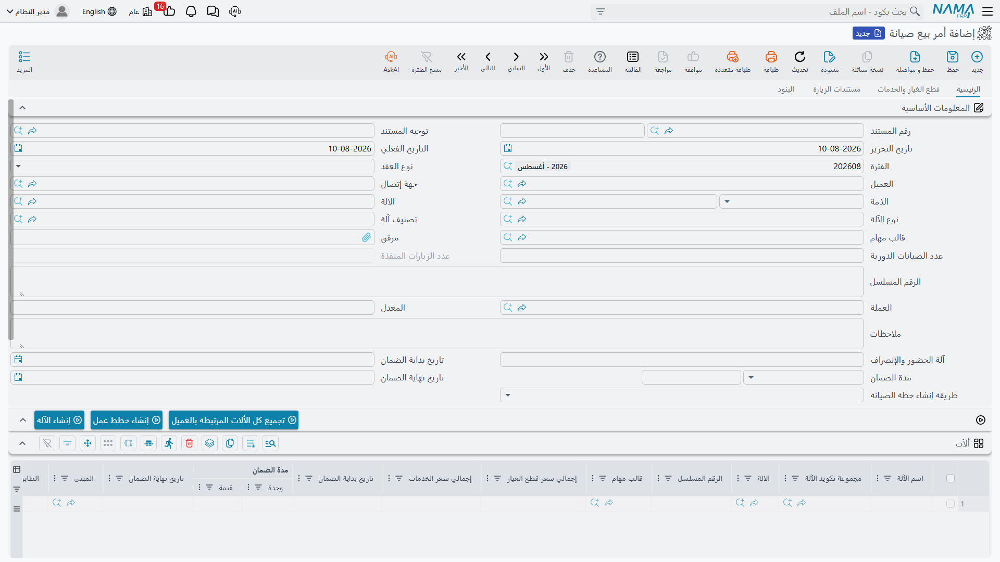

# عروض أسعار وأوامر بيع الصيانة

قبل أن تصون شركة النخبة شيئاً في مارينا بلازا، عليها أن تبيع الفندق المعدات وصفقة الصيانة. وتجري هذه المحادثة على مستندين: **عرض أسعار صيانة** في 3 فبراير 2026 (`MSQ-0033`) يعرض وحدتَي تبريد مركزي 300 طن ووحدة مناولة هواء وعقد صيانة لمدة سنة، ثم **أمر بيع صيانة** بعد أسبوع (`MSO-0029`) حين يوافق الفندق.

المستندان تحت **خدمة العملاء ← مستندات الصيانة**، وأفضل فهم لهما هو حقيقتهما: أوراق عليها زر واحد نافع.

::: info الترخيص المطلوب
`crm-maintenance`. ولا يوجد **توجيه** لأي من المستندين أصلاً، فليس فيهما ما تضبطه ولا إعدادات محاسبة أو إنشاء يمكن أن تخطئ فيها.
:::

## ماذا يفعلان فعلاً

::: warning ليس لهذين المستندين أي أثر من أي نوع
عرض أسعار الصيانة وأمر بيع الصيانة **لا ينشئان قيداً محاسبياً، ولا يحركان مخزوناً، ولا يولّدان مستنداً في المخازن، ولا ينشئان عقد الصيانة**. وحفظ أيٍّ منهما لا يغيّر شيئاً في أي مكان آخر في النظام. عاملهما بوصفهما سجلاً للعرض وللقبول، لا خطوةً تُحدث شيئاً.
:::

وهذا ليس تحفظاً على استعمالهما — فأمر بيع موقّع ورقة جيدة أن تحتفظ بها، وهو السابق الطبيعي للعقد. لكنه يعني ألا ينتظر أحد حدوث شيء بعد الحفظ.

وتتفرع عن الحقيقة نفسها نتيجتان صغيرتان يحسن معرفتهما حتى لا تطاردهما بوصفهما خللاً:

- **إجماليات كل آلة** في جدول الآلات (إجمالي سعر قطع الغيار وإجمالي سعر الخدمات) لا تُملأ أبداً على هذين المستندين، وتبقى فارغة مهما سعّرت السطور.
- عمود **الكمية المتبقية** في جدولَي قطع الغيار والخدمات يعكس ببساطة الكمية التي كتبتها، لأن لا شيء على هذين المستندين يستهلك شيئاً فلا يُطرح منه شيء.

## الشاشة

يتشارك عرض الأسعار وأمر البيع و[عقد الصيانة](/ar/modules/crm/maintenance-cycle/crm-maintenance-contracts.md) تصميم شاشة واحداً، فمعظم ما تشرحه صفحة العقد ينطبق هنا كذلك. والفروق قليلة يسهل حصرها.

**الصفحة الرئيسية.** نوع العقد (*عقد صيانة* أو *عقد ضمان*)، والعميل، وجهة الاتصال، والذمة، والآلة ونوعها وتصنيفها، وقالب المهام، وعدد الصيانات الدورية، والرقم المسلسل، والعملة وسعر التحويل، وتاريخ بداية الضمان ومدة الضمان وتاريخ نهاية الضمان، ونوع إنشاء خطة العمل. ويضيف هذان المستندان فوق الحقول المشتركة حقل **اسم الآلة** الحر في الرأس، وعمودَي **اسم الآلة** و**مجموعة الآلة** في جدول الآلات — وهما العمودان اللذان يقرأهما زر *إنشاء الآلة*.

**جدول الآلات.** هو جدول العقد العريض نفسه: الآلة، والرقم المسلسل، وقالب المهام، وتواريخ الضمان، والمبنى والطابق والغرفة، ومدة الصيانة وعدد الزيارات، وأعمدة **نوع الزيارة** السبعة يتبع كلاً منها قالب مهامه، وتاريخ الزيارة المخطط، ومجموعة الصيانة، والفني، والتصنيفات الخمسة، والملاحظات.

**صفحة قطع الغيار والخدمات.** الأصناف والخدمات المعروضة، بكمياتها وأسعار وحداتها وخصوماتها وضرائبها وصافي قيمتها، مع إجمالياتها.

ولا توجد صفحة فوترة على أي من المستندين — فجدول الدفعات يخص العقد.

## زر إنشاء الآلة

هذا هو الزر الوحيد الذي يفعل شيئاً. ويظهر على **أمر بيع الصيانة** فقط، وينشئ ملف آلة حقيقياً لكل سطر في جدول الآلات لا يشير إلى آلة بعد، فيسميه من اسم الآلة المكتوب ويكوّده من مجموعة الآلة المختارة.

في 10 فبراير تضغطه هالة على `MSO-0029` فتظهر ثلاثة ملفات آلات: `MCH-00311` و`MCH-00312` و`MCH-00318`.

::: danger زر إنشاء الآلة ينشئ هياكل لا آلات مكتملة
ينسخ الزر **المبنى والطابق والغرفة** و**قالب المهام** و**مدة الضمان** ومحددات السطر فقط. ولا ينسخ **العميل**.

وهذا مهم لأن البحث عن الآلة في كل مستند صيانة لاحق مرشَّح على آلات العميل المختار. فالآلة المُنشأة بهذه الطريقة والمتروكة على حالها تكون **غير مرئية** في أمر الصيانة أو العقد أو البلاغ التالي — يبحث عنها المستخدم فلا يجدها ويظن أنها لم تُنشأ أصلاً.

بعد ضغط الزر، افتح كل آلة مُنشأة واملأ فيها على الأقل:

- **العميل** (وجهة الاتصال)
- **الصنف**
- **نوع الآلة** — وهنا تكمن فعلاً قائمة قطع الغيار وافتراضات المهام
- **الرقم المسلسل**
- **تاريخ البيع** و**تاريخ التركيب** — فتواريخ الضمان تُحسب منهما

وعندئذ فقط تصبح الآلة قابلة للاستعمال. راجع [ملف الآلة](/ar/modules/crm/maintenance-setup/crm-machines.md) لمعرفة السجل كاملاً، و[أنواع الآلات وتصنيفاتها](/ar/modules/crm/maintenance-setup/crm-machine-types-and-categories.md) لمعرفة مصدر الافتراضات.
:::

وفي مثالنا تقع هذه الخطوة الثانية في 11 فبراير: تُفتح كل آلة من الثلاث ويُكتب فيها العميل `C-01188`، وصنفها (`AC-CHL-300` مرتين و`AC-AHU-12` مرة)، ونوع الآلة، ورقمها المسلسل (`CHL300-2026-0021` و`CHL300-2026-0022` و`AHU12-2026-0004`)، وتاريخا بيعها وتركيبها.

## الزر الذي لا يعمل هنا

::: warning زر إنشاء خطط عمل يظهر على هاتين الشاشتين ويفشل عند ضغطه
لأن عرض الأسعار وأمر البيع والعقد يتشاركون تصميماً واحداً، يظهر زر **إنشاء خطط عمل** على الثلاثة. وهو لا يعمل إلا على عقد صيانة. أما ضغطه على عرض أسعار صيانة أو أمر بيع صيانة فينتج خطأً فنياً ولا خطط عمل.

خطط العمل تأتي من العقد، ومن العقد وحده — راجع [خطط عمل الصيانة](/ar/modules/crm/maintenance-cycle/crm-maintenance-work-plans.md).
:::

والأمر نفسه ينطبق على زر **تجميع كل الألات المرتبطة بالعميل**، وهو تسهيل حقيقي على العقد لكن لا فائدة منه هنا، لأن هذين المستندين يدوران عادةً حول آلات لم تُنشأ بعد.

## الانتقال إلى العقد

لا يوجد زر يحوّل أمر البيع إلى عقد صيانة. أنت تنشئ العقد بنفسك وتختار أمر البيع في حقل **بناءاً على**، فيُنقل العميل ومندوب المبيعات وجهة الاتصال — ولا شيء غير ذلك. وكل ما يجعل العقد عقداً (سطور الآلات بأنواع زياراتها، والكميات المدفوعة مقدماً، وتاريخا البداية والنهاية، وجدول الدفعات) يُكتب على العقد.

وفي مثالنا يُنشأ `MC-0021` في 18 فبراير 2026 و`MSO-0029` في حقل بناءاً على. وهذه هي عملية التسليم كلها.

::: tip اختر عرض الأسعار على أمر البيع
بين عرض الأسعار وأمر البيع يكون النسخ أغنى: اختيار `MSQ-0033` في حقل **بناءاً على** على أمر البيع ينقل آلة الرأس وبيانات الرأس المشتركة، إضافة إلى جداول مجموعات الصيانة وقطع الغيار والخدمات والأعطال والآلات والعِدد والفنيين — إلا إذا أوقف التوجيه هذا النسخ. ولأن هذين المستندين بلا توجيه، فالنسخ الكامل يحدث دائماً بينهما.
:::

## التقارير

**التقارير: لا يوجد.** لا تحتوي هذه الوحدة على أي تقرير جاهز، وليس لهذه الشاشة نموذج طباعة. فإن احتجت عرض أسعار مطبوعاً للعميل فذلك نموذج طباعة يبنيه لك المنفّذ، أو صدّر شاشة القائمة إلى إكسل.
