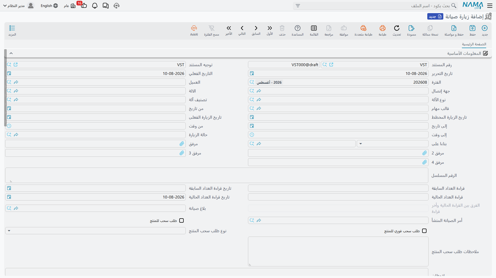

# زيارات الصيانة

زيارة الصيانة سجل بعد الواقعة. ذهب أحدهم إلى الموقع، وتمت الزيارة، ثم كُتب مستند يقول ذلك. هذا كل
ما في الأمر — وقول ذلك صراحة في أول الصفحة يوفر لبساً كثيراً، لأن كل ما في الاسم يوحي بالعكس.

::: warning زيارة الصيانة لا يولّدها شيء
لا العقد، ولا خطة العمل، ولا الأمر، ولا مجدول زمني — إذ لا يوجد مجدول زمني في هذه الوحدة أصلاً.
فالسلسلة الوقائية التي تُعدّها في
[عقد الصيانة](/ar/modules/crm/maintenance-cycle/crm-maintenance-contracts.md) تتوسع إلى
[خطط عمل](/ar/modules/crm/maintenance-cycle/crm-maintenance-work-plans.md) ثم إلى
[أوامر صيانة](/ar/modules/crm/maintenance-cycle/crm-maintenance-orders.md). ولا تنتج زيارة صيانة
واحدة أبداً. فإن أردت تسجيل الزيارات كتبها أحدهم بيده.
:::

::: info الترخيص المطلوب
`crm-maintenance`
:::

## لماذا تكتبها إذن

لأنها المستند الوحيد الذي يحرك **عدّاد الزيارات المنفذة** في العقد، والوحيد الذي يحدّث عدّاد
تشغيل الآلة.

ففي الأول من أبريل 2026، بعد تنفيذ أعمال التشيلرين ووحدة المناولة، يكتب مكتب الإسكندرية
`MVIS-0055`: *بناءً على* = عقد الصيانة `MC-0021`، والآلة `MCH-00311`، وحالة الزيارة `MVS-DONE`
(تمت الزيارة)، وتاريخ الزيارة الفعلي 2026-04-01، والعدّاد الحالي (ساعات التشغيل) 1,240.

وحفظه يفعل ثلاثة أشياء لا رابع لها:

| الأثر | النتيجة |
|---|---|
| **في العقد** | يُعاد حساب *عدد الزيارات المنفذة* في `MC-0021` — من صفر إلى **1**. |
| **في الآلة** | يُحدَّث زوج قراءات العدّاد في الآلة من قراءات الزيارة. |
| **في الأمر** | تُدفع أسطر جدول *قطع الغيار الإضافية* في الزيارة إلى الجدول المقابل في الأمر المرتبط. |

**المحاسبة: لا شيء. المخزون: لا شيء.** فالزيارة ليست مستنداً قابلاً للفوترة ولا تصير كذلك؛ ولتحاسب
على زيارة تفوتر سطر الخدمة في الأمر.

## الشاشة

هي صفحة واحدة. العميل، وجهة الاتصال، والآلة، ونوع الآلة وتصنيفها، وقالب المهام؛ و*من تاريخ* و*إلى
تاريخ* مع *من وقت* و*إلى وقت*؛ و**تاريخ الزيارة المخططة** و**تاريخ الزيارة الفعلي**؛ و**حالة
الزيارة**؛ و*بناءً على*؛ وأربعة مرفقات؛ والرقم المسلسل؛ وكتلة العدّاد (العدّاد السابق وتاريخه،
والعدّاد الحالي وتاريخه، والفرق المحسوب)؛ والبلاغ المرتبط والأمر المرتبط؛ وكتلة **طلب استدعاء
الآلة** — علامة، وعلامة «فوري»، ونوع الاستدعاء، وملاحظات حرة.

وتحتها: جدول *قطع الغيار الإضافية* (صنف وكمية)، وجدول *مجموعات الصيانة*، وقائمة فحص *أسطر
المناقشة*، وجدول *الأوامر* مع زر **نسخ كل السطور من الأوامر** الذي يلحق أسطر تفاصيل الأوامر
المذكورة.

::: warning ثلاثة حقول في هذه الشاشة أقل مما تبدو
- **حالة الزيارة** لا تحرك شيئاً البتة. فهي وصف لتقاريرك أنت؛ ولا قاعدة ولا تغيير حالة ولا فحص
  يقرؤها. انظر
  [حالات الأوامر والزيارات](/ar/modules/crm/maintenance-setup/crm-maintenance-statuses.md).
- كتلة **طلب استدعاء الآلة** تُحفظ وتُعرض فحسب. ولا شيء يتصرف بناءً عليها، ولا شيء يدرجها، ولا شيء
  يتابعها.
- **تاريخ العدّاد الحالي** يُكتب فوقه في صمت بالتاريخ الفعلي للمستند عند كل حفظ، فما تكتبه فيه لن
  يبقى.
:::

## القاعدتان اللتان يطبقهما المستند فعلاً

تُرفض الزيارة إذا كان تاريخ العدّاد الحالي مساوياً لتاريخ العدّاد السابق، وإذا كانت قراءة العدّاد
الحالي **أقل** من القراءة المسجلة في الآلة لزيارة تاريخها في أو بعد تاريخ عدّاد الآلة. والقاعدتان
موجودتان لإبقاء سجل العدّاد متصاعداً. وهما كل ما في هذا المستند من فحوص.

## ليست زيارة خدمة العملاء

زيارة الصيانة في منظومة الصيانة و[زيارة خدمة العملاء](/ar/modules/crm/activities/crm-visits.md) في
جانب المبيعات تشتركان في كلمة ولا شيء غيرها. فزيارة خدمة العملاء نشاط بيعي على خيط بيع أو فرصة، وفيها
تسجيل الحضور والانصراف من التطبيق — وهي المستند الوحيد في وحدة خدمة العملاء كلها الذي له نموذج
طباعة جاهز. وهذا المستند ليس له نموذج.

**التقارير: لا يوجد.** لا تحتوي هذه الوحدة على أي تقارير نظام، وليس لهذه الشاشة نموذج طباعة. وشاشة
عقد الصيانة تحمل قائمة مدمجة للقراءة فقط بالزيارات الصادرة عنه، وشاشتا الأمر والفاتورة تحملان
القائمة نفسها في نطاقهما؛ وفيما عدا ذلك استعمل قائمة العرض وتصديرها إلى إكسل.
