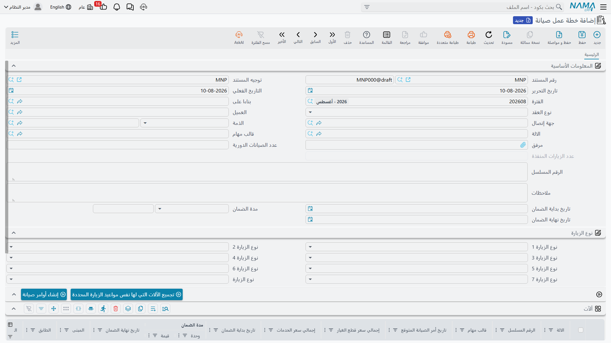

# خطط عمل الصيانة

يقول عقد الصيانة: «تشيلر 1 له زيارة شهرية وزيارة ربع سنوية لمدة اثني عشر شهراً». وخطة العمل هي هذه الجملة وقد تحولت إلى صفوف مؤرخة — أربعة وأربعين صفاً في مثالنا — ثم تحولت هذه الصفوف إلى أوامر صيانة حقيقية. وهي مستند الجدولة الوحيد في الوحدة الذي ينتج شيئاً، وتقع تماماً في منتصف الطريق بين ضغطتَي الزر اللتين تجعلان الصيانة الوقائية تحدث.

القائمة: **خدمة العملاء ← مستندات الصيانة ← خطة عمل صيانة**.

::: info الترخيص المطلوب
`crm-maintenance`. و**التوجيه إجباري**، ويحمل شيئاً واحداً مهماً: **دفتر وتوجيه أمر الصيانة** اللذين يكتب فيهما زر *إنشاء أوامر صيانة*. وبدون هذا الزوج لا ينتج الزر شيئاً. راجع [توجيهات مستندات الصيانة](/ar/modules/crm/document-terms/crm-maintenance-terms.md).
:::

## من أين تأتي خطط العمل

أنت لا تنشئ خطة عمل بيدك. فهي تصل دفعةً واحدة حين يفتح أحدهم [عقد صيانة](/ar/modules/crm/maintenance-cycle/crm-maintenance-contracts.md) ويضغط **إنشاء خطط عمل** — الضغطة الأولى من اثنتين.

في 1 مارس 2026 تضغط ناهد الجندي هذا الزر على `MC-0021`، فتظهر اثنتا عشرة خطة عمل: من `WP-0087` إلى `WP-0098`.

## كيف تُنتَج التواريخ

يأخذ المولّد كل سطر آلة على العقد، ويقرأ أعمدة **نوع الزيارة** فيه، ويخطو بتاريخ إلى الأمام ابتداءً من تاريخ بداية العقد. وتفصيلان يحسمان كل شيء:

1. **يخطو أولاً ثم يسجّل.** فتاريخ بداية العقد نفسه لا يُنتج زيارة أبداً. والسلسلة الشهرية على عقد يبدأ في 1 مارس 2026 تبدأ في 1 أبريل 2026.
2. **يواصل الخطو ما دام التاريخ في أو قبل تاريخ نهاية العقد.** فآخر صف يقع في تاريخ النهاية أو قبله، ولا يتجاوزه أبداً.

وتعتمد الخطوة على نوع الزيارة، وأحدها ليس كما يوحي اسمه:

| نوع الزيارة | الخطوة التي يأخذها النظام |
|---|---|
| يومي | يوم واحد |
| أسبوعي | 7 أيام |
| **نصف شهرية** | **14 يوماً** |
| شهرية | شهر واحد |
| ربع سنوية | 3 أشهر |
| نصف سنوية | 6 أشهر |
| سنوية | 12 شهراً |

::: danger «نصف شهرية» تخطو 14 يوماً لا شهرين
يظهر الخيار باسم *نصف شهرية* بالعربية و*Bimonthly* بالإنجليزية، والخطوة التي يأخذها النظام **أربعة عشر يوماً**. فمن قرأه «كل شهرين» أنتج نحو أربعة أضعاف ما توقع من الزيارات؛ ومن قرأه «مرتين في الشهر» فلم يصب تماماً كذلك، لأن 14 يوماً ليست نصف كل شهر.

مثال محسوب: لو أن `MCH-00318` أُعطيت *نصف شهرية* بدل *شهرية* على `MC-0021`، لسارت سلسلتها هكذا: 2026-03-15، 2026-03-29، 2026-04-12 … بخطوة 14 يوماً في كل مرة، منتهيةً في **2027-02-28** — أي **26 صفاً بدل 12** (لأن التاريخ التالي 2027-03-14 يقع بعد نهاية العقد). فاعتبر هذا الخيار دائماً *كل 14 يوماً*، وسعّر العقد على هذا الأساس.
:::

وتفصيل التوسعة على `MC-0021` كالتالي:

| نوع الزيارة | الخطوة | تنطبق على | أول تاريخ | آخر تاريخ | صفوف لكل آلة |
|---|---|---|---|---|---|
| شهرية | ‎+شهر | الآلات الثلاث | 2026-04-01 | 2027-03-01 | 12 |
| ربع سنوية | ‎+3 أشهر | `MCH-00311` و`MCH-00312` | 2026-06-01 | 2027-03-01 | 4 |

ومجموعها (12 + 4) + (12 + 4) + 12 = **44 صفاً** — مطابقةً للزيارات الأربع والأربعين المدفوعة مقدماً على العقد.

## كيف تُجمَّع الصفوف في مستندات

الأربعة والأربعون صفاً لا تعني أربعة وأربعين مستنداً. فـ**نوع إنشاء خطة العمل** على العقد هو الذي يقرر كيف تُحزَم:

| نوع الإنشاء | ينتج |
|---|---|
| إنشاء خطة الصيانة بناء على فترة العقد *(الافتراضي إذا تُرك الحقل فارغاً)* | خطة عمل لكل **شهر ميلادي** من تاريخ الأمر المتوقع، ويكون التاريخ الفعلي لخطة العمل هو أول ذلك الشهر |
| إنشاء خطة الصيانة بناء على نوع الزيارة فقط | خطة عمل لكل **نوع زيارة** |
| إنشاء خطة الصيانة بناء على نوع الزيارة مع اعتبار فترة العقد | خطة عمل لكل نوع زيارة، لكل شهر |

ويستعمل `MC-0021` الأول، فتحطّ صفوفه الأربعة والأربعون في اثني عشر مستنداً شهرياً:

| خطة العمل | التاريخ الفعلي | السطور | ماذا |
|---|---|---|---|
| `WP-0087` | 2026-04-01 | 3 | شهرية × 3 آلات |
| `WP-0088` | 2026-05-01 | 3 | شهرية × 3 |
| `WP-0089` | 2026-06-01 | 5 | شهرية × 3 + ربع سنوية × 2 |
| `WP-0090` | 2026-07-01 | 3 | شهرية × 3 |
| `WP-0091` | 2026-08-01 | 3 | شهرية × 3 |
| `WP-0092` | 2026-09-01 | 5 | شهرية × 3 + ربع سنوية × 2 |
| `WP-0093` | 2026-10-01 | 3 | شهرية × 3 |
| `WP-0094` | 2026-11-01 | 3 | شهرية × 3 |
| `WP-0095` | 2026-12-01 | 5 | شهرية × 3 + ربع سنوية × 2 |
| `WP-0096` | 2027-01-01 | 3 | شهرية × 3 |
| `WP-0097` | 2027-02-01 | 3 | شهرية × 3 |
| `WP-0098` | 2027-03-01 | 5 | شهرية × 3 + ربع سنوية × 2 |
| **12 مستنداً** | | **44 سطراً** | |

## شاشة خطة العمل

خطة العمل صفحة واحدة، ومعظم رأسها يصل مملوءاً من العقد لحظة ضبط حقل **بناءاً على**: نوع العقد، والعميل، وجهة الاتصال، والذمة، والآلة، وقالب المهام، والرقم المسلسل، وعدد الصيانات الدورية والزيارات المنفذة، وتاريخ بداية العقد ومدة الضمان وتاريخ النهاية. ويُملأ جدول الآلات من آلات العقد في اللحظة نفسها.

وللرأس أيضاً مجموعة **أنواع الزيارة** الخاصة به — حقول نوع الزيارة السبعة مع نوع زيارة الخطة نفسها. وهذه هي مُدخل زر **تجميع الآلات التي لها نفس مواعيد الزيارة المحددة**، الذي يرشّح جدول الآلات ليقتصر على سطور آلات العقد المطابقة لأي من أنواع الزيارة المختارة في الرأس. وهو تسهيل من نوع «أرني الربع سنوية فقط» على خطة عمل وصلت حاملةً كل شيء.

أما جدول **الآلات** فهو موضع العمل: الآلة، والرقم المسلسل، وقالب المهام، ثم العمود الذي يقود الخطوة التالية —

- **تاريخ الأمر المتوقع** — التاريخ الذي حسبه المولّد. وعليه تُجمَّع أوامر الصيانة.
- **مجموعة الصيانة** و**الفني** — من سيذهب.
- **المبنى والطابق والغرفة** — أين.
- **أمر الصيانة المُنشأ**، للقراءة فقط. يبقى فارغاً حتى تضغط الزر التالي، ثم يمتلئ بالأمر الذي خرج من هذا السطر.
- وأعمدة الضمان، وأنواع الزيارة، وتاريخ الزيارة المخطط، والتصنيفات الخمسة، والملاحظات.

وإلى جانبها إجماليات قطع الغيار والخدمات لكل آلة كما في العقد، وتاريخ نهاية ضمان يُعاد حسابه فور كتابة تاريخ بداية ومدة.

::: warning خطة العمل لا تفحص شيئاً عند الحفظ
فيما عدا الحقول الإجبارية على مستوى النظام — الدفتر والكود والمحددات — لا يوجد على خطة عمل الصيانة أي تحقّق على الإطلاق. فالخطة الفارغة تُحفظ بلا اعتراض، وكذلك التي لا تواريخ في سطور آلاتها. فلا تنتظر من هذه الشاشة أن تمسك لك خطأً.
:::

## إنشاء الأوامر

هذه هي الضغطة الثانية من اثنتين. افتح خطة عمل واضغط **إنشاء أوامر صيانة**.

تُجمَّع سطور الآلات بحسب **(تاريخ الأمر المتوقع، الفني، المبنى)** — أمر صيانة واحد لكل مجموعة. وعلى `WP-0087` تشترك السطور الثلاثة في 1 أبريل 2026 والفني `EMP-2011` والمبنى `BLD-MP01`، فيخرج أمر **واحد**: `MO-0513`، حاملاً الآلات الثلاث.

ويصل كل أمر مُنشأ وحقل **بناءاً على** فيه يشير إلى خطة العمل، وحقل **عقد الصيانة** مضبوطاً على العقد الذي جاءت منه الخطة — وهذا ما يجعل تسعير العقد وخصم الرصيد يعملان عليه لاحقاً. ويُكتب مرجع الأمر في سطر خطة العمل الذي خرج منه، فيصبح ضغط **إنشاء أوامر صيانة** مرة أخرى على الخطة نفسها **تعديلاً للأوامر ذاتها** لا إنشاءً لنسخ مكررة.

فإن لم يفعل الزر شيئاً، فافحص توجيه خطة العمل بحثاً عن دفتر وتوجيه أمر الصيانة.

::: tip أمران يستحقان المعرفة قبل الضغط
وزّع العمل توزيعاً معقولاً أولاً. فلأن التجميع بالتاريخ والفني والمبنى، فإن تغيير فني أحد السطور قبل الإنشاء هو وسيلتك لتقسيم عمل اليوم بين طاقمين؛ وتركهم متطابقين هو وسيلتك لإبقائه في أمر واحد. ولأن الأمر المُنشأ يحمل العقد، فإن الأمر — لا خطة العمل — هو الذي يخصم الكميات المدفوعة مقدماً.
:::

## ما لا تفعله خطة العمل

::: warning ليس لخطة العمل أثر خاص بها
حفظ خطة عمل **لا ينشئ قيداً محاسبياً** و**لا يحرك مخزوناً**. فهي مستند تخطيط. وكل ما تنتجه هو أوامر الصيانة التي تُنشئها منها، وحتى هذه لا توجد إلا لأن أحداً ضغط الزر.
:::

ولنقلها مرة أخرى، لأنها أكثر حقيقة يفترض الناس عكسها: **لا شيء ينشئ خطط عمل أو أوامر وفق جدول زمني.** لا مهمة مجدولة ولا تذكير ولا منبّه في هذه الوحدة كلها. فإن لم يفتح أحد `WP-0087` … `WP-0098` واحدة واحدة ويضغط **إنشاء أوامر صيانة**، بقيت اثنا عشر شهراً من الزيارات المخططة على الشاشة ولم يُوفَد فني قط. راجع [دورة الصيانة](/ar/modules/crm/maintenance-cycle/crm-maintenance-overview.md).

::: danger إعادة الإنشاء من العقد قد تحذف خطط عمل
ضغط **إنشاء خطط عمل** ثانيةً على العقد يُبقي الخطط التي ما زال مفتاح تجميعها مطابقاً و**يحذف الباقي** — ومعها روابط سطور آلاتها بالأوامر التي أُنشئت منها. وإضافة آلة أو تغيير نوع زيارة أو تحريك تاريخ نهاية العقد كافٍ لتغيير مفتاح التجميع. فعامل إعادة الإنشاء بوصفها إعادة بناء لا إعادة تحديث.
:::

## التقارير

**التقارير: لا يوجد.** لا تحتوي هذه الوحدة على أي تقرير جاهز، وليس لهذه الشاشة نموذج طباعة. ولرؤية التقويم الوقائي كله في مكان واحد، استعمل شاشة قائمة خطط العمل بمعايير محفوظة وصدّرها إلى إكسل.
