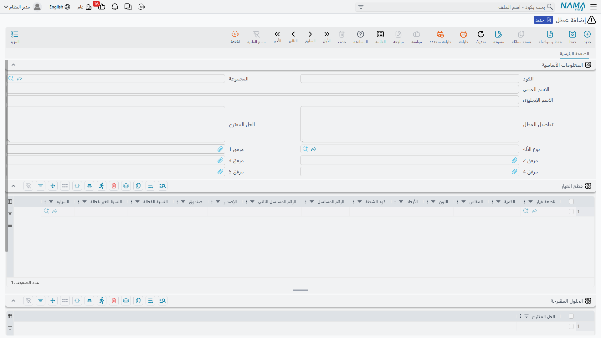

# كتالوجات الأعطال

حين يفتح فريق مارينا بلازا وحدة التبريد فيجد ارتفاعًا في ضغط الطرد، يحتاج ثلاثة أشخاص إلى فهم ما جرى: الفني الذي يحرّر التقرير، والمشرف الذي يقدّر مدى الاستعجال، ومن يردّ على الهاتف حين يتكرر العطل نفسه. ولذلك تمنحهم منظومة الصيانة أربعة ملفات صغيرة يقولون بها الشيء نفسه بالألفاظ نفسها في كل مرة.

وواحد منها، وهو **العطل**، يعمل عملًا حقيقيًا: فهو يحمل التشخيص القياسي والحل القياسي وقطع الغيار القياسية، ويغذّي [سجل ضمانات الأعطال في الآلة](/ar/modules/crm/maintenance-setup/crm-machines). أما الثلاثة الباقية فمفردات: **وصف مشكلة الصيانة** و**مستوى مشكلة الصيانة** و**فئة بلاغ الصيانة**.

::: info الرخصة المطلوبة
`crm-maintenance`. والأربعة في **خدمة العملاء ← ملفات الصيانة**: **عطل** (Dysfunction) و**وصف مشكلة صيانة** (Maintenance Trouble Description) و**مستوى مشكلة صيانة** (Maintenance Trouble Level) و**فئة بلاغ الصيانة** (Maintenance Notice Category).
:::

::: info هذه كتالوجات منظومة الصيانة لا مكتب الدعم
لنواة خدمة العملاء [كتالوجات مشاكل وشكاوى](/ar/modules/crm/master-files/crm-problem-and-complaint-catalogues) خاصة بها تستخدمها الشكاوى ومشاكل العملاء. والمجموعتان ملفات منفصلة تمامًا لا رابط بينها، ولا يمكن اختيار إحداهما في شاشات الأخرى. فإذا احتاج عملك مفردات موحدة بين العالمين وجب أن تحفظ القائمة نفسها مرتين.
:::

## العطل — مكتبة الأعطال عندك

العطل هو خلل واحد معروف، موصوف مرة واحدة حتى لا يُعاد شرحه في كل مستند. وتحتفظ النخبة بالعطل `DYS-014` ارتفاع ضغط الطرد والعطل `DYS-021` تسريب غاز التبريد، من بين غيرهما.

| الحقل | ماذا يحمل |
|---|---|
| **الكود** والأسماء والمجموعة | هوية الملف الرئيسي المعتادة. |
| **نوع الآلة** (Machine Type) | الموديل الذي ينتمي إليه هذا العطل — `MT-CHL300` لعطلي وحدات التبريد. |
| **تفاصيل العطل** (Dysfunction Details) | الوصف القياسي للعَرَض، بالألفاظ التي تريدها في المستندات. |
| **الحل المقترح** (Proposed Solution) | العلاج القياسي. |
| **مرفق 1..5** (Attachment 1..5) | جداول التشخيص ونشرات المُصنّع. |

ثم جدولان:

- **قطع الغيار** — القطع التي يستهلكها هذا العطل عادةً، بكمياتها.
- **الحلول المقترحة** — قائمة علاجات بديلة، واحد في كل سطر.

وحقول الرأس والجدولان جميعًا في شاشة واحدة:

### ماذا يحدث حين يختاره أحد

الغاية من ملء ذلك كله هي ما يحدث في [بلاغ الصيانة أو أمرها](/ar/modules/crm/maintenance-cycle/crm-maintenance-notices-and-requests). فحين يسمّي سطر العطل عطلًا من الكتالوج:

1. تُنسخ **تفاصيل العطل** و**الحل المقترح** على السطر، فيبدأ الفني من النص القياسي ويعدّله بدل أن يكتب من الصفر.
2. تُسحب **قطع غياره** إلى جدول قطع الغيار في المستند بكمياتها.
3. يضيق بحث **الآلة** في ذلك السطر ليقتصر على آلات نوع الآلة الخاص بالعطل — فإن اخترت عطل وحدة تبريد عُرضت عليك وحدات التبريد.
4. تظهر العلاجات البديلة من جدول *الحلول المقترحة* كاقتراحات أثناء الكتابة في حقل الحل المقترح في المستند نفسه.

وهذا عائد طيب على دقائق معدودة من الإعداد، ويستحق أن يُتقن للعشرين أو الثلاثين عطلًا التي تشكّل معظم عملك.

::: warning بحث قطع الغيار في هذه الشاشة غير مفلتَر بنوع الآلة
حين تبني جدول قطع الغيار على العطل نفسه، يعرض عليك بحث الأصناف **كل صنف في الشركة معلَّم بأنه قطعة غيار على ملف الصنف** — ولا يضيق إلى قطع نوع الآلة الخاص بالعطل، رغم أن نوع الآلة موجود في الشاشة ذاتها.

فالقاعدة النافذة الوحيدة هي تعليم «قطعة غيار». فاختر بعناية: لا شيء يمنعك من إلحاق قطعة مصعد بعطل وحدة تبريد.
:::

## مستوى المشكلة ووصفها

هذان الملفان رفيعان عن قصد: كود وأسماء وحقل **العميل** واحد للمواقع التي تريد مفردات لكل عميل. وتستخدم النخبة `TL-02` متوسط و`TD-07` انخفاض كفاءة التبريد.

ويُختاران في رؤوس أوامر الصيانة والبلاغات وسندات التنفيذ، ويمكن كذلك سردهما في جدول الشروط في عقد أو عرض سعر أو أمر بيع.

وهناك سلوك حقيقي واحد: **في البلاغ يُحصر بحث مستوى المشكلة في المستويات المسرودة في شروط العقد المختار.** فإذا كان جدول شروط عقد مارينا بلازا يسرد «متوسط» و«مرتفع» فقط، فهذان هما المستويان الوحيدان اللذان يعرضهما البلاغ.

::: warning مستوى المشكلة لا ينشئ مستوى خدمة
يقرن جدول شروط العقد كل مستوى مشكلة بزمن استجابة، فيبدو وكأنه اتفاقية مستوى خدمة. ولا شيء يقرؤه. فلا ساعة تبدأ، ولا تاريخ استحقاق يُضبط، ولا تصعيد يحدث، ولا تقرير يقارن زمن استجابة فعليًا بآخر موعود — إذ لا جدولة زمنية ولا منبهات ولا إشعارات في هذه الوحدة إطلاقًا.

مستوى المشكلة عنوان أولوية يعين إنسانًا على تقرير ما يبدأ به. فعامله على هذا الأساس تمامًا.
:::

## فئة بلاغ الصيانة

أصغر ملفات المنظومة: كود وأسماء لا غير. ومستهلكه الوحيد حقل **فئة بلاغ الصيانة** في [بلاغ الصيانة](/ar/modules/crm/maintenance-cycle/crm-maintenance-notices-and-requests)، حيث يجيب عن سؤال «من أين جاء هذا البلاغ». وتحتفظ النخبة بالفئة `NC-01` بلاغ عميل إلى جانب فئات للأعطال المكتشفة أثناء زيارة دورية وللأعطال التي يبلّغ عنها مهندسو المبنى أنفسهم.

ولأن البلاغ هو نقطة الاستقبال التفاعلية لدورة الصيانة كلها، فهذا الحقل الصغير هو ما يتيح لك لاحقًا فرز قائمة البلاغات إلى «ما أبلغ به العملاء» في مقابل «ما اكتشفناه بأنفسنا». وأبقِ القائمة قصيرة، فخمس أو ست فئات تكفي، والقائمة الطويلة تُستعمل بلا اتساق ببساطة.

## بناء الأربعة

اعمل بهذا الترتيب، وتوقّع أن ينمو الكتالوج في الأشهر الستة الأولى:

1. **فئات البلاغات** و**مستويات المشكلة** أولًا، حفنة من كل منهما متفقًا عليها مع المشرف الذي يفرز البلاغات الواردة.
2. **أوصاف المشكلات** بوصفها الأعراض التي يبلّغ بها عملاؤك فعلًا.
3. **الأعطال** أخيرًا، لأن كل عطل يحتاج نوع آلة ونصًا قياسيًا وقائمة قطع. ابدأ بالأعطال التي تراها أسبوعيًا بدل محاولة الإحاطة بكل شيء، فالعطل الخالي من قائمة قطع ومن نص قياسي لا يوفّر على أحد وقتًا.

وليس لأي من الأربعة أثر محاسبي ولا مخزني، ولا يولّد أي منها مستندًا، ولا يخضع أي منها لتحقق يتجاوز قواعد الملفات الرئيسية المعتادة. وكما في كل هذه الوحدة، **لا تقارير ولا لوحات معلومات** عليها — ولمعرفة الأعطال الغالبة افلتر شاشات قوائم البلاغات أو الأوامر وصدّرها.
