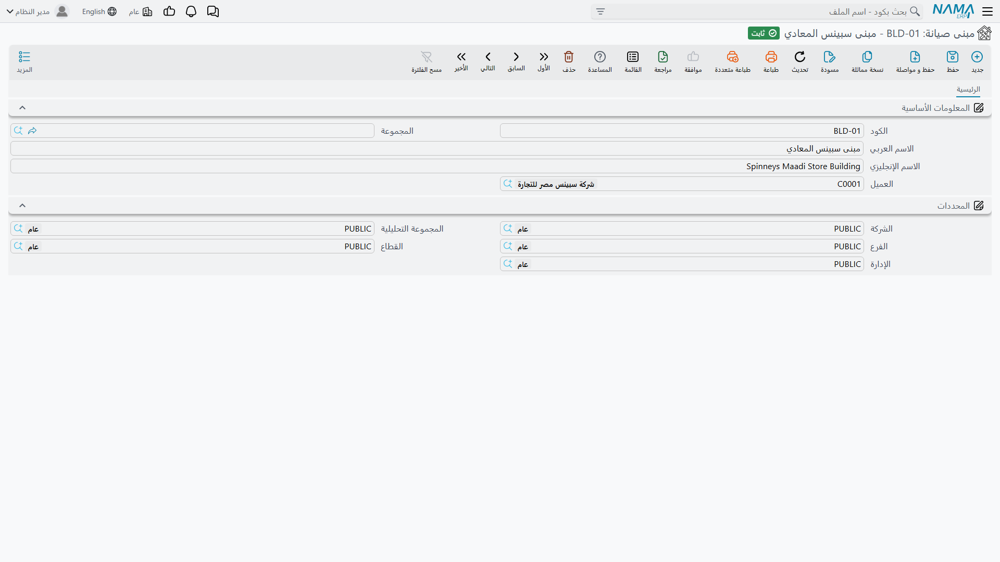

# المباني والطوابق والغرف

وحدتا التبريد في مارينا بلازا ليستا «في مارينا بلازا» فحسب. إنهما في غرفة التبريد المركزي، في مستوى السطح، من البرج الرئيسي — وحين يُوفَد فني في السابعة صباحًا يكون هذا هو الفارق بين أن يجد الآلة وأن يتصل بمهندس الموقع.

تسجّل منظومة الصيانة هذا العنوان في ثلاثة ملفات رئيسية صغيرة يتداخل بعضها في بعض: **المبنى** ← **الطابق** ← **الغرفة**. وموقع النخبة في الإسكندرية يبدو هكذا:

```
BLD-MP01  المبنى الرئيسي – مارينا بلازا الإسكندرية
   ├── FLR-MP01-R  سطح المبنى
   │        └── RM-MP01-R1  غرفة التبريد المركزي   →  MCH-00311, MCH-00312
   └── FLR-MP01-B  البدروم
            └── RM-MP01-B2  غرفة المعدات            →  MCH-00318
```

::: info الرخصة المطلوبة
`crm-maintenance`. والشاشات الثلاث في **خدمة العملاء ← ملفات الصيانة**: **مبنى صيانة** (Maintenance Building) و**طابق صيانة** (Maintenance Floor) و**غرفة صيانة** (Maintenance Room).
:::

## الملفات الثلاثة

الثلاثة ملفات رئيسية بسيطة — كود ومجموعة واسم عربي وإنجليزي ومجموعة المحددات — يضاف إليها العميل والرابط إلى ما فوقها:

| الملف | الحقول الإضافية |
|---|---|
| **مبنى صيانة** (Maintenance Building) | **العميل** (Customer) |
| **طابق صيانة** (Maintenance Floor) | **العميل** (Customer) و**المبنى** (Building) |
| **غرفة صيانة** (Maintenance Room) | **العميل** (Customer) و**المبنى** (Building) و**الطابق** (Floor) |

وكل شيء محصور بالعميل، وهو ما يجعل ملفات المواقع صالحة للاستعمال أصلًا: فـ `BLD-MP01` يخص فنادق مارينا بلازا، ومن ثم حين تعمل على آلة تخص مارينا بلازا يعرض بحث المباني مواقعهم دون سواهم. وشاشات القوائم تسير على النسق ذاته: المباني تُفلتر بالعميل، والطوابق بالعميل والمبنى، والغرف بالمبنى والطابق.

ابنِها من أعلى إلى أسفل، عميلًا بعد عميل: مباني الموقع، ثم طوابق كل مبنى، ثم غرف كل طابق. والشاشات تعينك: اختر الطابق في شاشة الغرفة يمتلئ المبنى والعميل تلقائيًا.

وشاشة المبنى أقصر الثلاث، وعلى نسقها تسير الأخريان:



## ملء الموقع في الآلة

في [شاشة الآلة](/ar/modules/crm/maintenance-setup/crm-machines) أسرع طريق أن تعمل عكسيًا فتختار **الغرفة**، فتملأ الشاشة الطابق والمبنى بل والعميل منها. واختيار الطابق يملأ المبنى والعميل. أما اختيار المبنى فلا يملأ شيئًا بعده، إذ ليس فوق المبنى شيء.

::: warning التسلسل تيسير في الشاشة لا قاعدة
لا شيء في أي موضع يفرض أن تكون الغرفة تابعة لطابقها، ولا أن يكون الطابق تابعًا لمبناه، ولا أن تكون غرفة الآلة في الطابق المكتوب بجوارها. فالملفات الثلاثة مجرد مراجع عادية بعضها إلى بعض، ولا يخضع أي منها لتحقق عند الحفظ.

ونتيجتان تستحقان المعرفة:

- في شاشة الآلة **يُفلتر بحث الغرفة بالعميل والمبنى لا بالطابق المختار**. فيمكنك اختيار غرفة من طابق آخر في المبنى نفسه — وعندها تعيد الشاشة كتابة حقل الطابق بهدوء ليطابق الغرفة التي اخترتها. فإذا تغيّر الطابق على غير ما توقعت فهذا هو السبب.
- **بيانات المواقع المستوردة لا تُراجَع إطلاقًا.** فقد تُحمَّل مبانٍ وطوابق وغرف متضاربة كيفما اتفق ولا يعترض شيء. وإذا استوردت أسطولًا قائمًا فتحقق من الانتماءات في الملف قبل تحميله، لأن النظام لن يفعل ذلك عنك.
:::

## ما تُستعمل المواقع فيه فعلًا

الموقع **بُعد للفلترة والتقارير**، وهو جيد في ذلك. ويُحمل تلقائيًا إلى الأمام: فحين تدخل الآلة في بلاغ صيانة، أو يُنشأ سند تنفيذ للفني، ينتقل معها المبنى والطابق والغرفة، فتقول الأوراق التي يتسلمها الفني إلى أين يذهب.

لكنه ليس مدخلًا لتخطيط المسارات. فلا شيء في الوحدة يخطط طريقًا انطلاقًا من مبنى، ولا شيء يجمّع العمل حسب الطابق. و[مستندات التوزيع اليومي](/ar/modules/crm/maintenance-cycle/crm-maintenance-dispatch) تعمل بمناطق العناوين لا بهذه الملفات. أما خطط العمل وزيارات الصيانة فلا تحمل حقول موقع خاصة بها أصلًا.

وكما في كل موضع آخر في هذه الوحدة، **لا تقارير ولا لوحات معلومات** على ملفات المواقع. فللإجابة عن سؤال «كم عملًا أنجزنا في البدروم الربع الماضي» افلتر شاشة قائمة وصدّرها، أو ابنِ ذلك في وحدة ذكاء الأعمال.

## أحسن تسميتها

لأن التسلسل غير مفروض ولا تقارير عليه، فإن ما تجنيه من هذه الملفات هو بالضبط ما يضعه فيها اصطلاح التسمية عندك. وعادتان تدفعان ثمن نفسهما:

- ضع اسم العميل أو الموقع في اسم المبنى — «المبنى الرئيسي – مارينا بلازا الإسكندرية» لا «المبنى الرئيسي». فالمباني تُعرض عبر العملاء جميعًا في شاشة القائمة، ولن يكون «المبنى الرئيسي» وحيدًا فيها.
- اجعل أكواد الطوابق والغرف مسبوقة بكود المبنى كما في `FLR-MP01-R` و`RM-MP01-R1`. فحين ينظر أحدهم إلى غرفة منفردة — في سند تنفيذ مثلًا — يكون الكود وحده ما يدله على مكانها.
