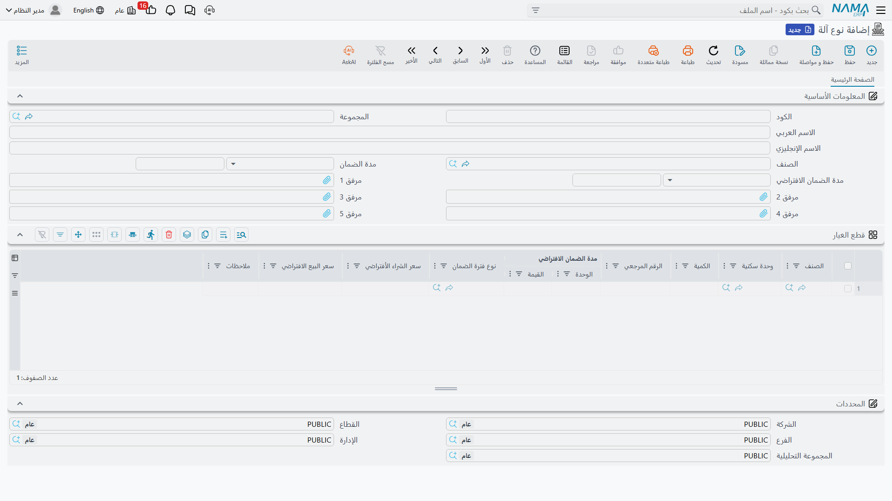

# أنواع الآلات وتصنيفاتها

تتولى شركة النخبة صيانة بضع مئات من الوحدات لعملائها، لكنها ليست بضع مئات من الأشياء المختلفة. إنها وحدات تبريد مركزي ووحدات مناولة هواء ووحدات منفصلة، ثلاثة أو أربعة موديلات من كل صنف. و**نوع الآلة** هو المكان الذي تصف فيه الموديل مرة واحدة، و**تصنيف الآلة** هو العائلة العريضة التي ينتمي إليها الموديل.

والفرق بينهما أهم مما يبدو، فأحد الملفين يعمل عملًا حقيقيًا والآخر مجرد عنوان. فعلى نوع الآلة تعيش افتراضات الضمان، وعليه تُحفظ قائمة قطع الغيار التي تحكم كل بحث في المنظومة. أما تصنيف الآلة فتجميعة تفلتر بها وتصنّف تقاريرك عليها.

::: info الرخصة المطلوبة
`crm-maintenance`. والشاشتان في **خدمة العملاء ← ملفات الصيانة**: **نوع آلة** (Machine Type) و**تصنيف آلة** (Maintenance Machine Category).
:::

## تصنيف الآلة — العائلة العريضة

شاشة التصنيف قصيرة: الكود والمجموعة والاسمان المعتادة، و**الصنف** (Item)، وحقلا مدة ضمان، ومجموعة المحددات.

وتحتفظ النخبة بتصنيفين: `MCT-CHL` تبريد مركزي و`MCT-SPL` وحدات منفصلة. فكل وحدة تبريد مركزي ووحدة مناولة هواء تنتمي إلى الأول، وكل وحدة سبليت مثبتة على الحائط تنتمي إلى الثاني. ويُحمل التصنيف على الآلات، كما تُربط [قوالب المهام](/ar/modules/crm/maintenance-setup/crm-maintenance-task-templates) بتصنيف حتى تُعرف قائمة الفحص بأنها «قائمة معدات التبريد».

::: warning حقلا الضمان في التصنيف لا يفعلان شيئًا
تعرض شاشة التصنيف **مدة الضمان** و**مدة الضمان الافتراضي**، وهو ما يُقرأ تمامًا كأنه موضع ضبط ضمان افتراضي لعائلة كاملة من المعدات. ولا شيء يقرؤهما. فالآلة لا تأخذ مدد ضمانها من تصنيفها أبدًا.

اضبط افتراضات الضمان على **نوع الآلة** الموصوف أدناه. وإن كنت قد ملأت حقلي الضمان في التصنيف فلا ضرر، فهما بلا أثر ببساطة.
:::

## نوع الآلة — الموديل

هذا هو الملف الذي يستحق مكانه. سجل واحد لكل موديل تتولى صيانته:

| الحقل | ماذا يفعل |
|---|---|
| **الكود** والاسمان (Code / Name1 / Name2) | `MT-CHL300`، تشيلر 300 طن / Chiller 300 TR. |
| **الصنف** (Item) | الصنف المخزني المقابل لهذا الموديل — `AC-CHL-300`. وهو ما يربط النوع بالآلة: ففي شاشة الآلة لا يعرض بحث نوع الآلة إلا الأنواع التي يطابق صنفها صنف الآلة، إضافة إلى أي نوع بلا صنف. |
| **مدة الضمان** (Warranty Period) | الضمان القياسي لهذا الموديل — 12 شهرًا لوحدات التبريد. ويُنسخ على الآلة لحظة اختيار النوع. |
| **مدة الضمان الافتراضي** (Default Warranty Period) | فترة السماح بين البيع وبدء الضمان — 3 أشهر. وتُنسخ هي الأخرى على الآلة. |
| **مرفق 1..5** (Attachment 1..5) | الكتيّبات والرسومات وبيانات الموديل. |

ثم جدول واحد، **قطع الغيار**، بالأعمدة نفسها الموجودة في جدول قطع الغيار على الآلة: الصنف، ووحدة القياس، والكمية، والرقم المرجعي، ومدة بداية ضمان افتراضية، و[نوع فترة الضمان](/ar/modules/crm/maintenance-setup/crm-machines)، وسعر شراء افتراضي، وسعر بيع افتراضي، وملاحظات.

**وهذا هو الجدول الذي يستعمله النظام فعلًا.** فحين يملأ الفني جدول قطع الغيار في بلاغ صيانة أو أمر أو فاتورة على آلة ما، يُحصر بحث الصنف في القطع المسرودة على نوع تلك الآلة. ومن ثم يسرد `MT-CHL300` القطع `SP-FLT-14` (فلتر هواء 14 بوصة) و`SP-CMP-30` (ضاغط 30 حصانًا) و`SP-GAS-410` (غاز التبريد R-410A) و`SP-OIL-05` (زيت الضاغط)، وهذه هي ما يستطيع الفريق اختياره عند العمل على أي من وحدتَي تبريد مارينا بلازا.

::: warning شرطان يقع فيهما كثيرون
**لا يُعرض الصنف كقطعة غيار إلا إذا كان معلَّمًا *قطعة غيار* على ملف الصنف.** وهذا التعليم يُضبط في ملف أصناف سلسلة التوريد لا هنا. فالقطعة المسرودة على نوع الآلة وغير المعلَّمة على ملف الصنف لن تظهر في أي بحث، والرسالة التي تصلك هي قائمة فارغة لا أكثر.

كما أن الجدول المناظر على **سجل الآلة نفسها لا يقرؤه شيء البتة**. فحفظ القطع لكل آلة على حدة يبدو أدق ولا يحقق شيئًا — اجعل القائمة هنا على النوع.
:::

وملاحظة شكلية حتى لا تفاجئك: عمود وحدة القياس في هذا الجدول معنون **«وحدة سكنية»**، وهو عنوان مستعار من وحدة العقارات. والعمود يعمل عملًا سليمًا، والخطأ في العنوان وحده.

وشاشة النوع تضم حقول الرأس وجدول قطع الغيار بعنوانه المستعار:

## افتراضات الضمان في الممارسة

ضبط حقلي المدة على النوع هو ما يجعل تواريخ ضمان الآلة تخرج من تلقاء نفسها. فعلى `MT-CHL300` تضبط النخبة مدة الضمان = 12 شهرًا ومدة الضمان الافتراضي = 3 أشهر. وحين يُنشئ أحدهم `MCH-00311` ويختار هذا النوع تُنسخ المدتان على الآلة. ثم يملأ تاريخ البيع (2026-02-16) وتاريخ التركيب (2026-02-24) ويحفظ، فتُحسب له تواريخ بداية الضمان ونهايته — 2026-02-24 و2027-02-24. وتفصيل الحساب كاملًا في [صفحة ملف الآلة](/ar/modules/crm/maintenance-setup/crm-machines).

وتُنسخ المدتان بوصفهما **افتراضات** لا رابطًا دائمًا. فإن غيّرت مدة ضمان النوع العام القادم احتفظت الآلات المنشأة العام الماضي بمددها؛ ولا يأخذ القيم الجديدة إلا الآلات الجديدة (والآلات التي يُعاد فيها اختيار النوع).

## بناء الملفين

في التركيب الجديد اعمل من العريض إلى الدقيق:

1. أنشئ التصنيفات أولًا، وحفنة منها تكفي عادة. فتصنيفا النخبة يغطيان كل ما تتعامل معه.
2. أنشئ نوع آلة لكل موديل، واربطه بصنفه المخزني، واضبط مدتَي الضمان، واسرد قطع غياره القياسية.
3. راجع ملف الأصناف: كل قطعة سردتها يجب أن تكون معلَّمة قطعة غيار.
4. عند ذلك فقط ابدأ إنشاء الآلات. فاختيار النوع والتصنيف على الآلة سيملأ مدد الضمان ويعطي بحث قطع الغيار ما يعرضه.

وليس لأي من الملفين أثر محاسبي ولا مخزني، ولا يولّد أي منهما شيئًا، ولا يخضع أي منهما لتحقق يتجاوز قواعد الملفات الرئيسية المعتادة. ولا توجد تقارير ولا لوحات معلومات عليهما — فشاشات القوائم وفلاترها والتصدير إلى إكسل هي ما لديك.
