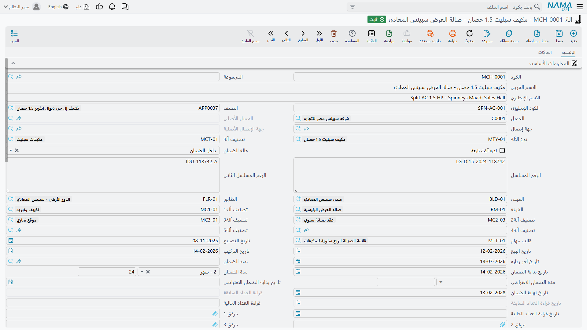

# ملف الآلة

باعت شركة النخبة لأنظمة التكييف لفنادق مارينا بلازا وحدتَي تبريد مركزي سعة 300 طن ووحدة مناولة هواء لبرجها في الإسكندرية، ثم وقّعت معها عقد صيانة لرعاية هذه الوحدات. ومنذ تلك اللحظة صار كل ما تفتحه إدارة الصيانة من شاشات يشير إلى واحد من ثلاثة سجلات: `MCH-00311` و`MCH-00312` (وحدتا التبريد في غرفة التبريد المركزي على السطح) و`MCH-00318` (وحدة مناولة الهواء في غرفة المعدات بالبدروم).

هذه السجلات الثلاثة هي **الآلات**، وملف الآلة هو العمود الفقري لمنظومة الصيانة كلها. فعقد الصيانة يغطي آلات، وخطة العمل تجدول زيارات لكل آلة، وأمر الصيانة يُنفَّذ على آلات، والفاتورة تُحاسِب على العمل الذي تم على آلات. إن أحسنت بناء هذا الملف وجدت كل ما يليه مستندًا إلى أرضية صلبة، وإن أخطأت فيه — وأشهر خطأ هو ترك خانة العميل فارغة — اختفت الآلة بهدوء من كل بحث يهمك.

::: info الرخصة المطلوبة
`crm-maintenance`. وتجد الشاشة في **خدمة العملاء ← ملفات الصيانة ← الة**.
:::

::: warning ملف الآلة غير متصل بمكتب الدعم
سجل الآلات يخص منتج الصيانة وحده. فهو غير مرئي لمشاكل العملاء (Trouble Tickets) ولا للشكاوى ولا لسجل الضمانات في نواة خدمة العملاء، و**لا يمكن فتح مشكلة عميل على آلة مشمولة بالصيانة**. فإذا اتصل العميل مبلّغًا عن عطل في وحدة تبريد تتولى صيانتها، كان مآل هذه المكالمة [بلاغ صيانة](/ar/modules/crm/maintenance-cycle/crm-maintenance-notices-and-requests) لا مشكلة عميل.
:::

وهذه هي الشاشة كما تُفتح لآلة جديدة، ومجموعة المعلومات الأساسية تمتد إلى ما بعد أسفل الصورة بكثير:

## ابدأ بالملفات المساندة

شاشة الآلة في معظمها مجموعة مؤشرات إلى ملفات أخرى، ومن الأيسر كثيرًا أن تُنشئ تلك الملفات أولًا:

- [نوع الآلة وتصنيفها](/ar/modules/crm/maintenance-setup/crm-machine-types-and-categories) — فعلى النوع تعيش الافتراضات الحقيقية للضمان وقائمة قطع الغيار الفعّالة.
- [المبنى والطابق والغرفة](/ar/modules/crm/maintenance-setup/crm-machine-locations) التي رُكّبت فيها الوحدة.
- [قالب مهام](/ar/modules/crm/maintenance-setup/crm-maintenance-task-templates) إن كان لهذا الموديل قائمة فحص قياسية.
- [ملفات التصنيف الخمسة](/ar/modules/crm/maintenance-setup/crm-machine-classifications) إن كان موقعك يستخدمها.
- الصنف نفسه على ملف الأصناف في سلسلة التوريد.

## الصفحة الرئيسية

الصفحة الأولى كلها مجموعة واحدة طويلة اسمها **المعلومات الأساسية** تضم نحو خمسين حقلًا، يليها ثلاثة جداول ثم مجموعة المحددات. ومن الأيسر عرضها في كتل موضوعية، وهو ما نفعله فيما يلي.

### ما هي الوحدة

| الحقل | ماذا يحمل |
|---|---|
| **الكود** (Code) | مرجعك للوحدة، مثل `MCH-00311`. |
| **الكود الإنجليزي** (English Code) | كود بديل ثانٍ. |
| **الاسم العربي / الاسم الإنجليزي** (Name1 / Name2) | تشيلر رقم 1 – مارينا بلازا / Chiller No. 1 – Marina Plaza. |
| **المجموعة** (Group) | تجميع الملفات الرئيسية المعتاد. |
| **الصنف** (Item) | الصنف المخزني الذي تُعد هذه الوحدة نسخة منه — `AC-CHL-300`. وهو أيضًا ما يحصر قائمة أنواع الآلات المعروضة. |
| **نوع الآلة** (Machine Type) | `MT-CHL300`. ولا يعرض البحث إلا الأنواع التي يطابق صنفها صنف الآلة، أو التي بلا صنف. |
| **تصنيف آلة** (Machine Category) | `MCT-CHL`، أي العائلة العريضة. |
| **الرقم المسلسل** (Serial Number) | نص حر — `CHL300-2026-0021`. |
| **الرقم المسلسل الثاني** (Second Serial) | رقم مسلسل حر ثانٍ للوحدات التي تحمل لوحتين. |
| **لديه آلات تابعة** (Has Dependent Machines) | علّم عليه لتفعيل جدول الآلات التابعة أسفل الشاشة. |
| **حالة الضمان** (Warranty Status) | تصنيف يدوي — انظر التحذير أدناه. |
| **مرفق 1..10** (Attachment 1..10) | عشر خانات مرفقات للكتيّبات والصور وأذون التسليم. |

::: warning الأرقام المسلسلة نص حر
لا شيء يتحقق من عدم تكرار الرقم المسلسل، و**لا صلة للحقل إطلاقًا** بآلية الأرقام المسلسلة والأصناف الفرعية في سلسلة التوريد. فقد تحمل آلتان الرقم نفسه، والرقم الذي أصدره المخزن عند تسليم الوحدة لا ينتقل إلى هنا. تعامل معه على أنه بيان تكتبه بيدك.
:::

### من يملكها وأين هي

| الحقل | ماذا يحمل |
|---|---|
| **العميل** (Customer) | `C-01188` فنادق مارينا بلازا. **أهم حقل في الشاشة على الإطلاق** — انظر أدناه. |
| **العميل الأصلي** (Original Customer) | المالك الأول. يختمه النظام مرة واحدة ثم لا يغيّره. |
| **جهة إتصال** (Contact) | `CNT-0904` م. رامي عبد المنعم. ولا يعرض البحث إلا جهات اتصال العميل المختار. |
| **جهة الإتصال الأصلية** (Original Contact) | أول جهة اتصال، تُختم مع العميل الأصلي. |
| **المبنى / الطابق / الغرفة** (Building / Floor / Room) | `BLD-MP01` / `FLR-MP01-R` / `RM-MP01-R1`. اختر الغرفة تملأ لك الشاشة الطابق والمبنى والعميل. |
| **تصنيف آلة1..5** (Machine Classification1..5) | خمسة تصنيفات حرة. |

العميل أهم ما في الشاشة لأن **البحث عن الآلة في المستندات اللاحقة مفلتَر بالعميل افتراضيًا**. فأمر الصيانة المحرَّر لمارينا بلازا لا يعرض إلا الآلات التي عميلها مارينا بلازا. ومن ثم فالآلة التي عميلها فارغ غير مرئية للدورة كلها، وإن كان سجلها محفوظًا تمامًا ويمكن فتحه من القائمة. فإذا كان موقعك يحتاج فعلًا إلى تحرير مستندات على آلات بصرف النظر عن مالكها، فخيار **عدم الفلترة على الآلة بالعميل** (Do Not Filter Machine By Customer) في [شاشة إعدادات خدمة العملاء](/ar/modules/crm/crm-configuration) يرفع هذا القيد.

ولا يُقصد بالملكية أن تُعدَّل من الشاشة بعد دخول الآلة الخدمة، فهناك [سند نقل ملكية](/ar/modules/crm/maintenance-cycle/crm-machine-updates-and-transfers) مخصص يحتفظ بالتاريخ ويعيد ترتيب سلسلة المالكين السابقين.

### التواريخ والضمان والعداد

| الحقل | مكتوب أم محسوب؟ |
|---|---|
| **تاريخ التصنيع** (Manufacturing Date) | مكتوب. |
| **تاريخ البيع** (Sale Date) | مكتوب. 2026-02-16 للوحدات الثلاث. |
| **تاريخ التركيب** (Installation Date) | مكتوب. 2026-02-24 لوحدتي التبريد و2026-02-26 لوحدة المناولة. |
| **تاريخ آخر زيارة** (Last Visit Date) | مكتوب، ولا شيء غير ذلك — انظر التحذير أدناه. |
| **عقد الضمان** (Warranty Contract) | مرجع إلى عقد الصيانة الذي يحمل ضمان هذه الوحدة. و[أمر التركيب يملؤه تلقائيًا](/ar/modules/crm/maintenance-cycle/crm-maintenance-orders)، وإلا فهو مكتوب. |
| **مدة الضمان الافتراضي** (Default Warranty Period) | مكتوبة رقمًا ووحدة (3 شهر)، وتُملأ افتراضيًا من نوع الآلة عند اختياره. |
| **تاريخ بداية الضمان الافتراضي** (Default Warranty Start Date) | **محسوب** — تاريخ البيع + مدة الضمان الافتراضي. |
| **تاريخ بداية الضمان** (Warranty Start Date) | **محسوب** — الأقدم من تاريخ التركيب وتاريخ بداية الضمان الافتراضي. |
| **مدة الضمان** (Warranty Period) | مكتوبة رقمًا ووحدة (12 شهر)، وتُملأ افتراضيًا من نوع الآلة. |
| **تاريخ نهاية الضمان** (Warranty End Date) | **محسوب** — تاريخ بداية الضمان + مدة الضمان. |
| **حالة الضمان** (Warranty Status) | مكتوبة، ولا تُشتق أبدًا من التواريخ أعلاه. |
| **قراءة العداد السابقة وتاريخها** (Last Odometer) | معطّلة على الشاشة، ويرحّل إليها النظام القراءة الحالية عند ورود قراءة أحدث. |
| **قراءة العداد الحالية وتاريخها** (Current Odometer) | تُكتب هنا، وتكتبها أيضًا [زيارة الصيانة](/ar/modules/crm/maintenance-cycle/crm-maintenance-visits) حين يسجل الفني قراءة. |

### كيف تُحسب تواريخ الضمان الثلاثة

يستحق هذا وقفة متأنية، فالحقول تبدو خانات تاريخ عادية بينما تتصرف كمعادلات. ففي كل مرة يُحفظ فيها سجل الآلة يعيد النظام تنفيذ ثلاث خطوات بالترتيب:

1. إذا كان تاريخ البيع ومدة الضمان الافتراضي مملوءين، فإن **تاريخ بداية الضمان الافتراضي = تاريخ البيع + مدة الضمان الافتراضي**.
2. إذا كان تاريخ التركيب أو تاريخ بداية الضمان الافتراضي مملوءًا، فإن **تاريخ بداية الضمان = الأقدم من الاثنين**.
3. إذا كان تاريخ بداية الضمان ومدة الضمان مملوءين، فإن **تاريخ نهاية الضمان = تاريخ بداية الضمان + مدة الضمان**.

وبتطبيق ذلك على وحدات مارينا بلازا، بمدة ضمان افتراضي 3 أشهر ومدة ضمان 12 شهرًا:

| الخطوة | `MCH-00311` و`MCH-00312` | `MCH-00318` |
|---|---|---|
| بداية الضمان الافتراضي = تاريخ البيع + 3 أشهر | 2026-02-16 + 3 شهر = **2026-05-16** | **2026-05-16** |
| بداية الضمان = الأقدم من تاريخ التركيب والسطر السابق | الأقدم من 2026-02-24 و2026-05-16 = **2026-02-24** | الأقدم من 2026-02-26 و2026-05-16 = **2026-02-26** |
| نهاية الضمان = بداية الضمان + 12 شهرًا | **2027-02-24** | **2027-02-26** |

::: warning هذه التواريخ الثلاثة تُعاد حوسبتها مع كل حفظ
تاريخ بداية الضمان وتاريخ بداية الضمان الافتراضي وتاريخ نهاية الضمان **يُكتب فوقها في كل مرة تُحفظ فيها الآلة**، ما دامت الحقول المغذّية لها مملوءة. فإن كتبت تاريخ نهاية ضمان بيدك ثم حفظت، حلّت القيمة المحسوبة محل ما كتبت. ولا يبقى التاريخ المكتوب إلا إذا كان تاريخ البيع وتاريخ التركيب والمدّتان جميعًا فارغة، وهو ما نادرًا ما تريده.

فإذا أردت تغيير الضمان فغيّر مدخلاته: تاريخ البيع أو تاريخ التركيب أو حقلي المدة.
:::

::: warning حالة الضمان وتاريخ آخر زيارة يبدوان تلقائيين وليسا كذلك
**حالة الضمان** تصنيف يدوي، لا يعيد النظام حسابه أبدًا، فتظل الآلة التي انقضى تاريخ نهاية ضمانها منذ أشهر مكتوبًا عليها *تحت الضمان* إلى أن يعدّلها أحد. اقرأ **تاريخ نهاية الضمان** لتعرف الحقيقة.

و**تاريخ آخر زيارة** ملاحظة يدوية. فزيارات الصيانة وأوامرها وسندات تنفيذها وخطط عملها لا تمسّه مهما نُفّذ على الآلة. والشيء الوحيد الذي يكتبه هو [سند تحديث بيانات الآلة](/ar/modules/crm/maintenance-cycle/crm-machine-updates-and-transfers) — ويكتبه سواء قصدت ذلك أم لا.
:::

## أنواع فترات الضمان

**نوع فترة الضمان** ملف رئيسي صغير في مجلد القائمة نفسه: كود واسم ومدة ضمان مكتوبة رقمًا ووحدة. فـ `WPT-03M` هو «ضمان 3 أشهر» و`WPT-06M` هو «ضمان 6 أشهر».

وهو موجود ليتيح اختيار مدة الضمان بالاسم بدل كتابتها رقمًا، في الموضعين اللذين يُربط فيهما الضمان بجزء من الآلة لا بالوحدة كلها:

- على سطور قطع الغيار في الآلة (وفي نوع الآلة)، بوصفه الضمان المصاحب للقطعة.
- على سطور الأعطال في أوامر الصيانة وفواتيرها — وهذا هو الموضع المهم. فحين يصلح الفني عطلًا ويحمل العمل ضمانًا خاصًا به، يُسمّي سطر العطل نوع فترة ضمان. وإذا تُرك تاريخ نهاية الضمان الجديد فارغًا **اشتُقّ تاريخ النهاية من نوع فترة الضمان**، وانتهت النتيجة إلى جدول ضمانات الأعطال في الآلة الموصوف أدناه.

فضمان الآلة الكلي يأتي إذن من حقلي المدة على الآلة نفسها، أما ضمانات الأعطال المفردة فتأتي من أنواع الفترات المسمّاة هذه. أنشئ سجلًا واحدًا لكل مدة تتعامل بها فعلًا — ثلاثة أشهر، ستة أشهر، سنة — ولا تزد.

## الجداول الثلاثة

**المهام.** قائمة الفحص الخاصة بهذه الوحدة، عمودان من النص الحر (المهمة ومهمة 2). ونادرًا ما تكتب فيها بيدك، إذ يكفي اختيار [قالب مهام](/ar/modules/crm/maintenance-setup/crm-maintenance-task-templates) في الرأس فيُعاد بناء الجدول من سطور القالب. ولاحظ كلمة *يُعاد بناء*: اختيار القالب **يستبدل** ما كان في الجدول.

**الآلات التابعة.** للوحدات المركّبة من وحدات أخرى — محطة تبريد بدائرتين، أو نظام بوحدة داخلية وأخرى خارجية. علّم على *لديه آلات تابعة* ثم اسرد الآلات الأبناء. ولا يعرض البحث إلا الآلات التي ليست تابعة لغيرها، ويُرفض السجل عند الحفظ في الحالات الآتية:

- خانة التعليم مرفوعة والجدول به سطور، أو موضوعة والجدول فارغ؛
- تكرار الآلة نفسها مرتين؛
- كون الآلة المسرودة تابعة لأصل آخر بالفعل؛
- كون الآلة المسرودة لها آلات تابعة هي الأخرى — إذ **لا يُسمح إلا بمستوى واحد من التداخل**؛
- إدراج الآلة لنفسها.

وعند الحفظ يُختم كل ابن بهذه الآلة أصلًا له، ويُحرَّر من حذفته من الجدول. وحذف الأصل يحرّرهم جميعًا.

**قطع الغيار.** جدول أصناف وكميات وأرقام مرجعية وأسعار شراء وبيع افتراضية ونوع فترة ضمان.

::: warning جدول قطع الغيار في الآلة لا يقرؤه شيء
لا شيء في النظام يقرأ هذا الجدول. فهو لا يحصر بحثًا ولا يسعّر شيئًا ولا يصل إلى أي مستند. إنه قائمة استرشادية تحتفظ بها لعينيك أنت.

أما الجدول الذي يحكم فعلًا بحث قطع الغيار في البلاغات والأوامر والفواتير فهو **الجدول المطابق له على [نوع الآلة](/ar/modules/crm/maintenance-setup/crm-machine-types-and-categories)**. فاحفظ قوائم قطعك هناك. وتذكّر القاعدة الأساسية السارية في المنظومة كلها: لا يُعرض الصنف كقطعة غيار إلا إذا كان معلَّمًا **قطعة غيار** على ملف الصنف.

وطرافة شكلية وأنت في هذا الجدول: عمود وحدة القياس معنون **«وحدة سكنية»**، وهو تعبير مستعار من وحدة العقارات. العمود نفسه وحدة قياس سليمة، والخطأ في العنوان وحده.
:::

وأسفل الجداول تجد مجموعة **المحددات** المعتادة — الشركة والقطاع والفرع والإدارة والمجموعة التحليلية.

## صفحة الحركات — تاريخ خدمة الوحدة

الصفحة الثانية، **الحركات**، هي أنفع ما في ملف الآلة عند مكالمة دعم، لأنها الجزء الذي تحفظه المستندات نفسها فعلًا. أربع قوائم وجدول واحد:

| الكتلة | ماذا تعرض |
|---|---|
| **أوامر الصيانة** | كل [أمر صيانة](/ar/modules/crm/maintenance-cycle/crm-maintenance-orders) ذكر هذه الآلة، ومعه المستند المالك وإجمالي الخدمات وقطع الغيار في ذلك السطر. |
| **بلاغات صيانة** | كل [بلاغ](/ar/modules/crm/maintenance-cycle/crm-maintenance-notices-and-requests) حُرِّر عليها. |
| **عقود الصيانة** | كل [عقد](/ar/modules/crm/maintenance-cycle/crm-maintenance-contracts) يغطيها. |
| **سندات نقل مكلية آلة** | تاريخ الملكية: المستند، ومن/إلى عميل، ومن/إلى جهة اتصال، والتاريخ الفعلي. |
| **ضمانات الأعطال** | سجل ضمانات الأعطال المفردة، ويحفظه النظام. |

ولأن الوحدة **لا تشحن أي تقارير ولا أي لوحات معلومات على الإطلاق**، فهذه القوائم الأربع هي كل التقارير الجاهزة عن تاريخ الآلة. أما ما هو أوسع — كل الآلات التي خرجت من الضمان هذا الربع، أو كل أعطال نوع بعينه في موقع عميل — فمن شاشات القوائم وفلاترها، أو بالتصدير إلى إكسل، أو ببنائه في وحدة ذكاء الأعمال.

::: warning عمود جهة الاتصال في تاريخ الملكية غير موثوق
سلسلة **من عميل** في قائمة سندات النقل صحيحة. أما عمود **من جهة اتصال** فلا: فمن السند الثاني فصاعدًا يكرر جهة اتصال السند الأول بدل جهة الاتصال الجديدة في السند السابق، فيتناقض العمودان. اقرأ سلسلة العملاء، وعامل سلسلة جهات الاتصال على أنها زينة.
:::

### جدول ضمانات الأعطال

يملأ النظام هذا الجدول ولا يمكن الكتابة فيه. وهو يجيب عن سؤال واحد: *حين أصلحنا هذا العطل في هذه الآلة آخر مرة، ما الضمان الذي منحناه، وهل ما زال ساريًا؟*

تابع خيط مارينا بلازا. في 2026-04-01 نفّذ الفريق الصيانة الشهرية بالأمر `MO-0513` فوجد ارتفاعًا في ضغط الطرد في وحدة التبريد الأولى، فسجّل العطل `DYS-014` في جدول أعطال الأمر ومنح الإصلاح ضمانًا لثلاثة أشهر (`WPT-03M`) يبدأ في اليوم التالي. وعند اعتماد الأمر اكتسب جدول الوحدة الأولى سطرًا:

| العطل | المستند | التاريخ الفعلي | نوع فترة الضمان | بداية الضمان | عدد الأيام | نهاية الضمان |
|---|---|---|---|---|---|---|
| `DYS-014` | `MO-0513` | 2026-04-01 | `WPT-03M` | 2026-04-02 | 92 | 2026-07-02 |

وعدد الأيام هو تاريخ النهاية ناقص تاريخ البداية زائد واحد.

ومن ثم، كلما سجّل أحد العطل `DYS-014` على وحدة التبريد الأولى في بلاغ أو أمر أو فاتورة، امتلأت من هذا السطر كتلةُ *الضمان القديم* غير القابلة للتعديل في سطر العطل — نوع الفترة والبداية والنهاية والأيام المتبقية — فيرى من أمام الشاشة بلمحة هل ما زال الإصلاح السابق في الضمان. وتعديل المستند المصدر أو إلغاؤه ينظّف أثره: تُحذف السطور التي لم تعد سارية.

::: warning لا يمتلئ الجدول إلا إذا سمح توجيه المستند
الكتابة في هذا الجدول يشغّلها خيار **تحديث جدول ضمانات الأعطال في الآلة** (Update Machine Dysfunction Warranties) في [توجيه أمر الصيانة وتوجيه فاتورة الصيانة](/ar/modules/crm/document-terms/crm-maintenance-terms). فإن كان مرفوعًا لم يُكتب شيء، وحُذفت السطور التي كتبها ذلك المستند سابقًا.

وشغّله في **واحد** من الاثنين لا في كليهما: فإن حمله توجيه الأمر وتوجيه الفاتورة معًا رُفضت الفاتورة عند محاولة حفظها.
:::

## من أين تأتي الآلات

الطرق ثلاث، وواحدة منها فقط تعطيك سجلًا كاملًا.

1. **بالإنشاء اليدوي** من القائمة، وهي الطريقة الطبيعية والمفضّلة.
2. **بالتوليد من أمر بيع صيانة.** فزر *إنشاء الآلة* في [أمر بيع الصيانة](/ar/modules/crm/maintenance-cycle/crm-maintenance-sales) المحفوظ ينشئ آلة لكل سطر لا يشير إلى آلة بعد. وفي صفقة مارينا بلازا أنتج الأمر `MSO-0029` الآلات `MCH-00311` و`MCH-00312` و`MCH-00318` بضغطة واحدة في 2026-02-10.
3. **بالاستيراد أو خدمة الويب**، بأدوات استيراد السجلات القياسية — وهي مفيدة حين يتسلم الموقع أسطولًا قائمًا من الوحدات.

::: warning زر إنشاء الآلة ينتج هياكل لا آلات مكتملة
ينسخ الزر المبنى والطابق والغرفة وقالب المهام ومدة الضمان ومحددات السطر فقط. ولا ينسخ **العميل** ولا الصنف ولا نوع الآلة ولا التصنيف ولا الرقم المسلسل ولا أي تاريخ — مع أن أمر البيع يعرف العميل تمام المعرفة.

ولأن البحث عن الآلة مفلتَر بالعميل، تكون هذه الآلات المولَّدة **غير مرئية** في أمر الصيانة التالي لذلك العميل. فتعامل مع الزر على أنه خطوة إنشاء هياكل: في صفقة مارينا بلازا فتح الفريق كلًا من الآلات الثلاث في اليوم التالي وملأ العميل والصنف ونوع الآلة والرقم المسلسل وتاريخي البيع والتركيب قبل أن يُحرَّر عليها أي شيء.
:::

وثمة أشياء توحي بأنها تنشئ آلات وهي لا تفعل. فـ **المعاينة قبل التركيب** لا تنشئ شيئًا البتة. و**أمر التركيب** ينشئ *عقد* ضمان لا آلة. ولا يُنتج أي مستند من مستندات سلسلة التوريد — تسليمًا كان أو فاتورة أو صرفًا — سجل آلة.

## تغيير الآلة بعد ذلك

هناك سندان لتغيير الآلة بعد دخولها الخدمة، وكلاهما مشروح في [صفحة تحديث الآلات ونقل ملكيتها](/ar/modules/crm/maintenance-cycle/crm-machine-updates-and-transfers): **سند تحديث بيانات الآلة** للسمات، و**سند نقل ملكية آلة** للمالك. اقرأ تلك الصفحة قبل استخدام أيهما — فسند التحديث يكتب كل حقل في شاشته على الآلة، ومن ثم تُمحى الحقول التي لم تُعِد كتابتها، كما أن إلغاءه لا يعيد الأمور إلى سابق عهدها بالضرورة.
