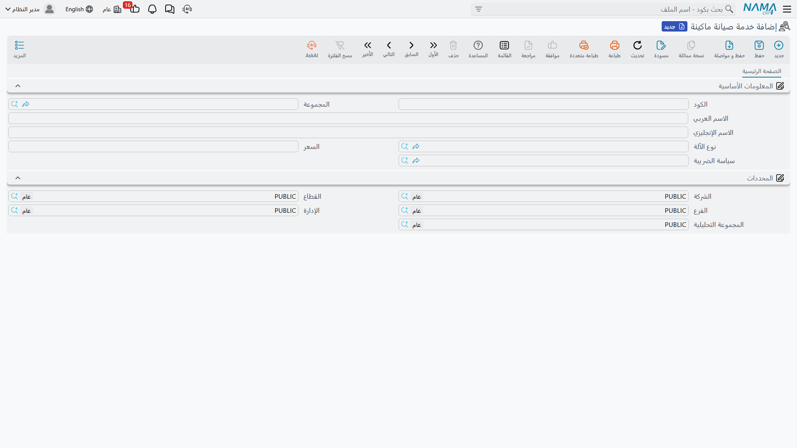

# كتالوج الخدمات

شركة الصيانة لا تبيع قطع الغيار وحدها، بل تبيع **الزيارات والفحوص والشحنات والاستدعاءات** — أي نصف الفاتورة الخاص بالعمالة. ولذلك تحفظ منظومة الآلات هذه الخدمات في كتالوج مسعّر، حتى تظل زيارة الصيانة الدورية لوحدة التبريد بـ 1,500.00 في كل عرض سعر وكل عقد وكل فاتورة، ما لم يُتفق على غير ذلك عن قصد.

وهذا الكتالوج هو الملف المسمّى **خدمة صيانة ماكينة** (Machine Maintenance Service).

::: warning اقرأ هذا قبل أن تفتح أي شاشة
هناك **ملفان مختلفان يكاد اسماهما يتطابقان**، تحت رخصتين مختلفتين، في مجلدَي قائمة مختلفين. واختيار الملف الخطأ يكلفك بعد ظهيرة كاملة.

> **خدمة صيانة ماكينة** (Machine Maintenance Service، رخصة `crm-maintenance`) هي **كتالوج الخدمات المسعّر** في منظومة الآلات: خدمة مسمّاة لها سعر وسياسة ضريبة، تضعها في سطر أمر وتحاسب عليها. **وهذه الصفحة عن هذا الملف.**

> **خدمة صيانة** (Maintenance Service، رخصة `crm-maintenance-services`) هي **الشيء الذي تجري خدمته** — موقع أو فرع أو طابق أو منطقة، له عميل وموقع وقائمة مهام. وهو نظير الآلة في [منظومة الخدمات](/ar/modules/crm/services-suite/crm-services-suite-overview)، **وليس** قائمة خدمات تبيعها.

فإن فتحت شاشة تنتظر فيها السعر وسياسة الضريبة فوجدت العميل وتصنيف الآلة وجدول مهام، فأنت في الملف الثاني. عد واختر الملف الذي يبدأ عنوانه الإنجليزي بكلمة *Machine*. وإن كان تركيبك يحمل الرخصتين معًا فاطلب ممن يعدّه أن يعيد تسمية الثاني إلى شيء مثل «الموقع المخدوم» عبر ملف تغيير الترجمة في المنصة — فهذا الالتباس لا يستحق التعايش معه.
:::

::: info الرخصة المطلوبة
`crm-maintenance`. والشاشة في **خدمة العملاء ← ملفات الصيانة ← خدمة صيانة ماكينة**.
:::

## الشاشة كلها

هي من أقصر الملفات الرئيسية في الوحدة، وتلك علامة طيبة، فمدخل الكتالوج ينبغي أن يكون سريع الإنشاء:

| الحقل | ماذا يحمل |
|---|---|
| **الكود** والمجموعة والاسمان (Code / Name1 / Name2) | `MSV-01`، زيارة صيانة دورية للتشيلر / Chiller periodic maintenance visit. |
| **نوع الآلة** (Machine Type) | الموديل الذي تنطبق عليه الخدمة — `MT-CHL300`. |
| **السعر** (Price) | السعر القياسي، وهو 1,500.00 لزيارة وحدة التبريد الدورية. |
| **سياسة الضريبة** (Tax Plan) | سياسة الضريبة التي يستعملها المستند عند حساب ضريبة هذا السطر. وخدمات النخبة تحمل سياسة ضريبة المبيعات القياسية 14 %. |
| **المحددات** (Dimensions) | الشركة والقطاع والفرع والإدارة والمجموعة التحليلية. |

وهذا كل ما فيها. فلا وحدة قياس، ولا تكلفة، ولا مدة، ولا مهارة مطلوبة، ولا ارتباط بصنف — فالخدمة في هذا الكتالوج اسم له سعر.

وهذه الشاشة كلها في سجل جديد:

وتحتفظ النخبة بقائمة قصيرة: `MSV-01` لزيارة دورية لوحدة التبريد، و`MSV-02` شحن غاز التبريد، وحفنة أخرى للاستدعاءات الطارئة والعُمرات السنوية.

## أين يُستعمل الكتالوج

الخدمات واحد من جدولَي المال اللذين يسريان في منظومة الآلات كلها، والآخر قطع الغيار. فجدول الخدمات يظهر في عروض أسعار بيع الصيانة وأوامرها، وفي العقود والبلاغات والأوامر والمقايسات والفواتير وخطط العمل. وحيثما رأيت **الخدمات** فما تختاره فيه يأتي من هذا الكتالوج.

وسلوكان يستحقان المعرفة، لأنهما يحسمان ما يُحاسب عليه عميلك فعلًا.

**سعر العقد يغلب سعر الكتالوج.** ففي عقد مارينا بلازا `MC-0021` تبيع النخبة مقدمًا 44 زيارة لوحدات التبريد بسعر **1,200.00** للزيارة — أي دون سعر الكتالوج 1,500.00، لأن العميل التزم بسنة كاملة. وحين يحاسب أمر الصيانة `MO-0513` على ثلاث من تلك الزيارات يسعّرها بـ 1,200.00 لا 1,500.00. فسعر الكتالوج سعر القائمة، وسعر العقد هو ما يدفعه العميل المتعاقد. والتفصيل الكامل في [صفحة فوترة الصيانة](/ar/modules/crm/maintenance-cycle/crm-maintenance-invoicing).

**«التغطية» في العقد كمية لا مدى زمني.** فالزيارات الـ 44 في العقد ليست إلا 44 وحدة من `MSV-01` بسعر 1,200.00، تُستنزل مع كل محاسبة. ولا شيء في أي موضع يقارن تاريخ العمل بمدة ضمان أو بتاريخ انتهاء عقد ليقرر أن الخدمة مجانية. فالتغطية في هذه المنظومة تعني «ما زالت هناك كمية متبقية بسعر العقد» ولا شيء غير ذلك — انظر [صفحة عقود الصيانة](/ar/modules/crm/maintenance-cycle/crm-maintenance-contracts).

## بناء الكتالوج

أبقِه قصيرًا ومسعّرًا بصدق. وهذه صورة نافعة لتركيب جديد:

1. مدخل واحد لكل **شيء تضعه فعلًا في سطر فاتورة**: زيارة دورية، استدعاء طارئ، شحن غاز، عمرة سنوية. لا مدخل لكل مهمة، فتفصيل المهام مكانه [قالب المهام](/ar/modules/crm/maintenance-setup/crm-maintenance-task-templates).
2. اربط كل مدخل بـ **نوع آلة** حيث يختلف السعر فعلًا باختلاف الموديل. فزيارة وحدة تبريد 300 طن ليست زيارة وحدة سبليت على الحائط، وتسعيرهما بمدخل واحد سيكلفك مالًا.
3. اضبط **سياسة الضريبة** في كل مدخل. فسطر خدمة بلا سياسة ضريبة سطر لا يحاسب على ضريبة بهدوء.
4. راجع الأسعار حين تراجع قائمة أسعارك، فلا رابط بين هذا الكتالوج وقائمة أسعار المبيعات، ولن يحدّث نفسه.

::: warning منظومة الخدمات ليس فيها كتالوج كهذا إطلاقًا
إن كنت تحمل أيضًا الرخصة `crm-maintenance-services` فلا تبحث عن الملف المناظر هناك. ففي تلك المنظومة **لا تحمل الخدمات أي سعر البتة**: خانة *إجمالي سعر الخدمات* في كل مستنداتها صفر دائمًا، وفاتورة الخدمة لا تحاسب إلا على قطع الغيار. وللمحاسبة على العمالة في منظومة الخدمات تسجّلها المواقع صنفًا مخزنيًا وتضعها في جدول قطع الغيار. وهذا مشروح في [صفحة فوترة الخدمات](/ar/modules/crm/services-suite/crm-service-invoicing).
:::

وليس للكتالوج نفسه أثر محاسبي ولا مخزني، ولا يولّد شيئًا، ولا يخضع لتحقق يتجاوز قواعد الملفات الرئيسية المعتادة. وكما في كل هذه الوحدة، **لا تقرير ولا لوحة معلومات** تخبرك أي الخدمات أكثر مبيعًا — افلتر شاشات قوائم الأوامر أو الفواتير وصدّرها، أو ابنِ ذلك في وحدة ذكاء الأعمال.
