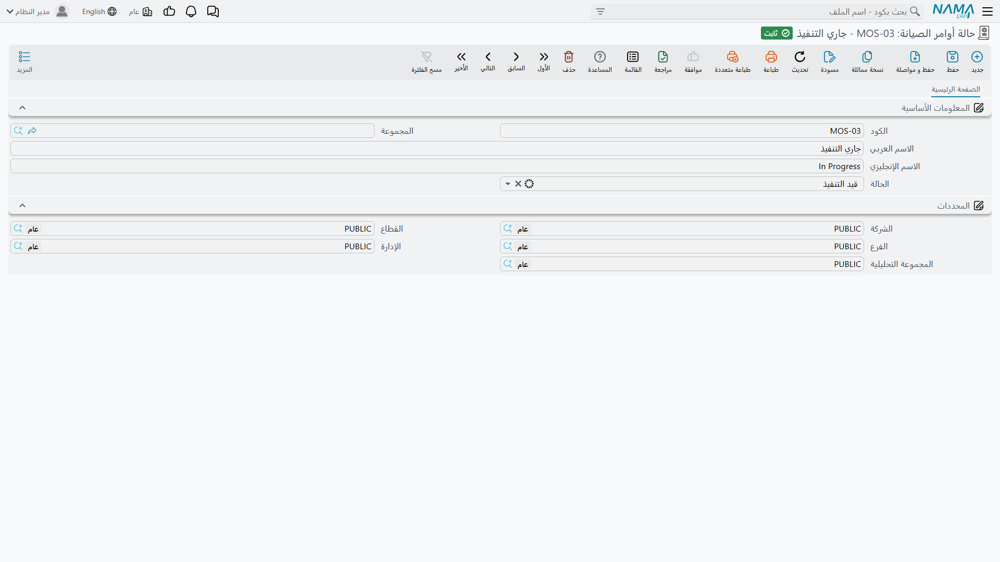

# حالات الأوامر والزيارات

كل ما يتعلق بسلوك أمر الصيانة — أيفهمه النظام مفتوحًا أم قيد التنفيذ أم معلقًا أم منتهيًا — يعود إلى حقل صغير واحد في ملف رئيسي صغير واحد. فإن أصبته في الساعة الأولى من إعداد الوحدة سارت الدورة كما ينبغي، وإن أغفلته حصلت على مسار عمل يبدو طبيعيًا تمامًا على الشاشة ولا يسجّل شيئًا البتة.

::: danger املأ حقل «الحالة» في كل حالة أمر
في ملف **حالة أوامر الصيانة** حقل واحد هو المهم: قائمة منسدلة عنوانها **الحالة** (Status)، تخبر النظام بما *تعنيه* حالتك. فالأسماء لك وحدك — «مفتوح» أو «بانتظار قطع الغيار» أو «بانتظار العميل» أو ما شئت — لكن كل اسم يجب أن يُربط بواحد من سبعة معانٍ مضمّنة في النظام.

والحالة المحفوظة وذلك الحقل **فارغ لا تحمل أي معنى للنظام**. فتُعامل المستندات التي تستعملها كأنها ما زالت في حالتها المبدئية، فلا يُسجَّل أن العمل فُتح أو عُلِّق أو انتهى. وتظل الشاشات تعمل، وتظهر أسماء الحالات كما هو متوقع، ولا تسجّل الدورة كلها شيئًا في صمت.

فإن تسلّمت تركيبًا تبدو فيه حالات الأوامر سليمة ولا يتصرف فيه شيء، فافتح سجلات الحالات وافحص هذا الحقل أولًا.
:::

::: info الرخصة المطلوبة
`crm-maintenance`. والملفان في **خدمة العملاء ← ملفات الصيانة**: **حالة أوامر الصيانة** (Maintenance Order Status) و**حالة الزيارة** (Visit Status).
:::

## حالة أمر الصيانة

الشاشة أربعة حقول قياسية من الملف الرئيسي، يضاف إليها الحقل المهم:

| الحقل | ماذا يحمل |
|---|---|
| **الكود** و**المجموعة** (Code / Group) | الهوية المعتادة. |
| **الاسم العربي / الاسم الإنجليزي** (Name1 / Name2) | الاسم الذي يراه موظفوك على الأمر، وهو لك وحدك تختاره. |
| **الحالة** (Status) | المعنى المضمّن. سبع قيم مسرودة أدناه. |
| **المحددات** (Dimensions) | مجموعة المحددات المعتادة. |

وعنوان هذا الحقل الأخير هو **الحالة** فحسب، في ملف اسمه *حالة أوامر الصيانة* — وهو ما يربك أول مرة، إذ يُقرأ كأنه تكرار لاسم السجل نفسه. وليس كذلك: إنه *نوع* الحالة التي يمثلها هذا السجل.

وهو الحقل الرابع في ملف رئيسي عادي فيما عدا ذلك:

### المعاني السبعة

| القيمة | ماذا يفهم النظام منها |
|---|---|
| **مبدئي** (Initial) | لم يبدأ. وهذا أيضًا ما يُعامَل به المستند حين لا تُختار له حالة أصلًا. |
| **مفتوحة** (Open) | محرَّر وقائم، لكن العمل لم يبدأ. |
| **قيد التنفيذ** (InProgress) | العمل جارٍ. |
| **معلقة** (OnHold) | قائم لكنه متوقف: بانتظار قطع أو دخول للموقع أو قرار. |
| **معاد فتحه** (ReOpen) | أُعيد فتحه بعد أن كان منتهيًا أو مغلقًا. |
| **منتهي** (Finished) | العمل تمّ. |
| **مغلقة** (Closed) | انتهى الأمر إداريًا. |

وحالات النخبة الخمس تغطي حياتها العملية كلها:

| الكود | الاسم | الحالة |
|---|---|---|
| `MOS-NEW` | مفتوح | مفتوحة (Open) |
| `MOS-WIP` | قيد التنفيذ | قيد التنفيذ (InProgress) |
| `MOS-HLD` | معلق بانتظار قطع الغيار | معلقة (OnHold) |
| `MOS-FIN` | منتهي | منتهي (Finished) |
| `MOS-CLS` | مغلق | مغلقة (Closed) |

ولاحظ أن `MOS-HLD` يقول *لماذا* هو معلّق. وهذه هي فائدة الفصل بين الاسم والمعنى: يمكنك الاحتفاظ بثلاث حالات تعليق مختلفة — بانتظار القطع، وبانتظار دخول العميل، وبانتظار الاعتماد — فيعاملها النظام كلها على أنها «معلقة» بينما يرى مشرفك بلمحة أيها هي.

## ماذا تحرّك الحالة فعلًا

ثلاثة أمور تحدث متى حملت حالاتك معانيها.

**المستند يأخذ معنى الحالة معنى له.** فحين تضبط **الحالة الحالية** في أمر صيانة أو بلاغ أو طلب، ينسخ المستند معنى تلك الحالة إلى وضعه هو. وهذا ما تقرؤه الشاشات والفلاتر والأزرار لاحقًا. وإن لم تختر حالة أصلًا عُومل المستند على أنه مبدئي.

**كل تغيير حالة يُسجَّل.** غيّر الحالة الحالية — أو حتى ملاحظتها — فيُضاف سطر تلقائيًا إلى جدول تغيّر الحالة في المستند: من أي حالة، وإلى أي حالة، ومتى، وبواسطة من. لا يكتبه أحد ولا يستطيع أحد تخطّيه. وفي الأمر `MO-0513` هذا الجدول هو سجل انتقال الأمر من `MOS-NEW` إلى `MOS-WIP` صباح 2026-04-01.

**سندات التنفيذ تحركها عنك.** فحين يبدأ [سند تنفيذ](/ar/modules/crm/maintenance-cycle/crm-maintenance-executions) الفني يُدفع الأمر الأصل إلى «قيد التنفيذ»، وحين تنتهي سندات التنفيذ يُدفع إلى «منتهي». وهذا هو الجزء الوحيد من الدورة الذي يتحرك دون أن يختار أحد حالة بيده.

::: warning لا يوجد جدول انتقالات
يمكن ضبط أي حالة انطلاقًا من أي حالة. فلا شيء يمنع انتقال الأمر من «مفتوح» إلى «مغلق» مباشرة، ولا من «منتهي» إلى «مفتوح» دون المرور بـ«معاد فتحه». ولا اعتماد ولا بوابة ولا قاعدة في من يحق له تحريك ماذا.

وجدول تغيّر الحالة يتيح لك دائمًا أن ترى ما حدث، لكنه لا يمنع شيئًا من الحدوث.
:::

## بناء الحالات

افعل هذا قبل أن تحرّر أمرًا واحدًا:

1. اكتب الحالات التي تعترف بها ورشتك فعلًا. وخمس أو ست حالات هي المعتاد.
2. أنشئ سجلًا لكل حالة، وسمّها باللغتين بالطريقة التي يتحدث بها موظفوك، و**اضبط حقل الحالة في كل سجل دون استثناء**.
3. غطِّ على الأقل: مفتوحة، وقيد التنفيذ، ومنتهي، ومغلقة. أما «معلقة» فتدفع ثمن نفسها أول مرة تنتظر فيها مهمة ثلاثة أسابيع ريثما يصل ضاغط.
4. استعمل «معاد فتحه» عن قصد، فهو ما يُظهر أننا «اضطررنا إلى العودة» بدل أن تبدو المهمة وكأنها لم تنتهِ قط.
5. افحص الحالات التي أنشأها أحدهم لاحقًا بحقل حالة فارغ. فهذا أشهر خطأ إعداد في المنظومة كلها.

## حالة الزيارة

يبدو الملف الثاني توأمًا للأول: كود وأسماء وقائمة **نوع الزيارة** المنسدلة التي تعرض يومي وأسبوعي ونصف شهرية وشهرية وربع سنوية ونصف سنوية وسنوية. وتحتفظ النخبة بسجل واحد هو `MVS-DONE` تمت الزيارة، وتضعه على زيارات الصيانة عند تسجيلها.

::: warning حالة الزيارة عنوان لا أكثر
بخلاف حالة الأمر، **لا تحرّك حالة الزيارة شيئًا على الإطلاق**. فلا شيء يقرأ الحالة التي تضعها على [زيارة الصيانة](/ar/modules/crm/maintenance-cycle/crm-maintenance-visits): لا إجمالي ولا عدّاد ولا وضع يُفلتر به ولا مستند لاحق. وقائمة نوع الزيارة في هذا الملف لا تُقرأ هي الأخرى.

فأبقِ القائمة قصيرة جدًا. سجل أو سجلان — «تمت الزيارة» وربما «تعذرت الزيارة» — يكفيان لجعل قائمة الزيارات مقروءة لمن يتصفحها. وما زاد على ذلك جهد يُبذل في عنوان.
:::

وليس لأي من الملفين أثر محاسبي ولا مخزني، ولا يولّد أي منهما شيئًا، ولا يخضع أي منهما لتحقق يتجاوز قواعد الملفات الرئيسية المعتادة. وكما في كل هذه الوحدة **لا تقارير ولا لوحات معلومات** — ولمعرفة كم أمرًا معلقًا افلتر شاشة قائمة الأوامر وصدّرها.
