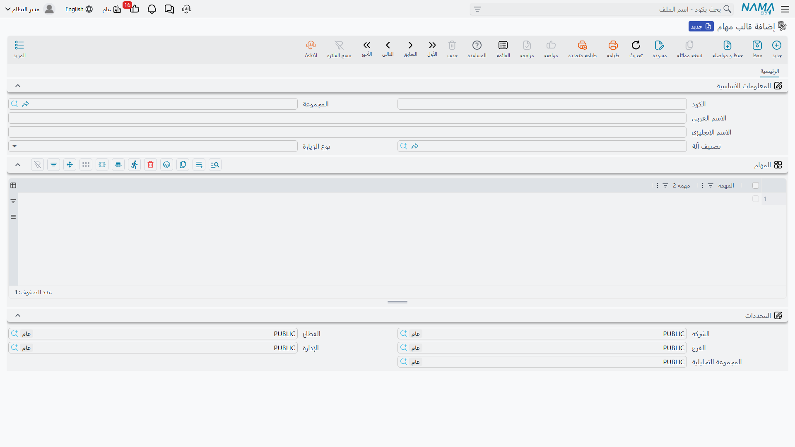

# قوالب المهام

الصيانة الشهرية لوحدة التبريد ثلاثة أشياء: تغيير فلتر الهواء، وفحص مستوى الزيت، وتسجيل ساعات التشغيل. كل شهر، على وحدتَي مارينا بلازا، طوال سنة العقد. ولا أحد يرغب في إعادة كتابة ذلك في أربعة وأربعين سند تنفيذ، ولا أحد يرغب في أن يقرر الفني من ذاكرته ما الذي تشمله «الصيانة الشهرية».

و**قالب المهام** هو تلك القائمة، مكتوبة مرة واحدة. وتحتفظ النخبة بأربعة قوالب:

| الكود | الاسم | يُستعمل في |
|---|---|---|
| `TT-CHL-M` | قائمة الفحص الشهرية للتشيلر | الزيارة الشهرية لوحدتَي التبريد |
| `TT-CHL-Q` | قائمة الفحص الربع سنوية للتشيلر | الزيارة الربع سنوية الأعمق |
| `TT-AHU-M` | قائمة الفحص الشهرية لوحدة المناولة | وحدة مناولة الهواء |
| `TT-BRN-B` | قائمة الفحص نصف الشهرية للفروع | فروع البنك في منظومة الخدمات |

::: info الرخصة المطلوبة
`crm-maintenance`. والشاشة في **خدمة العملاء ← ملفات الصيانة ← قالب مهام** (Maintenance Task Template).
:::

## ماذا يوجد في القالب

| الحقل | ماذا يحمل |
|---|---|
| **الكود** والمجموعة والاسمان (Code / Name1 / Name2) | `TT-CHL-M`، قائمة الفحص الشهرية للتشيلر. |
| **تصنيف آلة** (Machine Category) | العائلة التي تنتمي إليها القائمة — `MCT-CHL` تبريد مركزي. |
| **نوع الزيارة** (Visit Type) | الدورة المقصودة: يومي أو أسبوعي أو نصف شهرية أو شهرية أو ربع سنوية أو نصف سنوية أو سنوية. |
| جدول المهام | عمودان — **المهمة** (Task) و**مهمة 2** (Task 2) — سطر لكل عمل يجب إنجازه. |

ويحمل `TT-CHL-M` ثلاثة سطور: تغيير فلتر الهواء · فحص مستوى الزيت · تسجيل ساعات التشغيل.

والمهام نص حر. فلا مدة، ولا مهارة، ولا ترقيم تسلسل، ولا تعليم إلزام، ولا عمود توقيع — فالمهمة جملة يقرؤها الفني ويعلّم عليها. اكتبها قصيرة لا لبس فيها، فهي ما يراه فعلًا من يقف على السطح في الثامنة صباحًا.

وشاشة القالب هي كتلة الرأس أعلاها وجدول المهام أسفلها:

::: tip «نصف شهرية» تعني كل أربعة عشر يومًا
تضم قائمة أنواع الزيارات خيارًا اسمه العربي **نصف شهرية** والإنجليزي *Bimonthly*. وفي كل مواضع هذه الوحدة يخطو هذا الخيار **14 يومًا**، لا شهرين ولا نصف شهر بالضبط. فإذا سمّيت قوالبك بأسماء دوراتها فسمّها بما تعنيه الدورة حقًا — وجدول الخطوات كاملًا في [صفحة خطط عمل الصيانة](/ar/modules/crm/maintenance-cycle/crm-maintenance-work-plans).
:::

## المواضع الثلاثة التي يُستعمل فيها القالب

**على الآلة.** اختر قالبًا في رأس [سجل الآلة](/ar/modules/crm/maintenance-setup/crm-machines) فيُعاد بناء جدول المهام في الآلة من سطور القالب. ولاحظ *يُعاد بناء*: فما كان في الجدول يُستبدل. وتحمل `MCH-00311` و`MCH-00312` القالب `TT-CHL-M`، بينما تحمل `MCH-00318` القالب `TT-AHU-M`.

**على العقد، لكل نوع زيارة.** وهنا يجني القالب معظم قيمته. فكل سطر آلة في [عقد الصيانة](/ar/modules/crm/maintenance-cycle/crm-maintenance-contracts) يمكن أن يحمل حتى **سبعة أنواع زيارات، لكل منها قالبه**. وفي `MC-0021` ضُبطت وحدتا التبريد على «شهرية» بالقالب `TT-CHL-M` و«ربع سنوية» بالقالب `TT-CHL-Q`، وضُبطت وحدة مناولة الهواء على «شهرية» بالقالب `TT-AHU-M` وحدها. وحين تُولَّد خطط العمل والأوامر تحمل كل زيارة قائمة الفحص الصحيحة لدورتها، فالزيارة الربع سنوية قائمة مختلفة عن الشهرية، ولا يحتاج أحد إلى تذكّر ذلك.

**على سند التنفيذ.** حين [يولّد أمر الصيانة سندات تنفيذه](/ar/modules/crm/maintenance-cycle/crm-maintenance-executions) تُنسخ قائمة الفحص على كل سند ليجدها الفني أمامه. وسندات التنفيذ الثلاثة الصادرة عن الأمر `MO-0513` وصل كل منها بقالب سطر آلته — ثلاث علامات لكل سند — وأغلقها الفريق بزر *تحديد كل السطور كمنتهية*.

وأي القالبين يستعمله سند التنفيذ المولَّد مسألة إعداد لا تخمين: فخيار **اعتبار مهام قوالب المهام عند إنشاء عمليات التنفيذ** (Consider Task Templates Tasks When Creating Executions) في [توجيه أمر الصيانة](/ar/modules/crm/document-terms/crm-maintenance-terms) يختار بين قالب سند التنفيذ نفسه وقالب سطر الأمر. اختر اصطلاحًا واحدًا للتركيب والزمه، فتغييره لاحقًا يبدّل ما يظهر في سندات التنفيذ الجديدة ويربك الفريق.

وهناك طريق رابع أصغر: إذا أنشأ أحدهم سند تنفيذ بيده واختار فيه آلة، نُسخ جدول مهام **الآلة نفسها** إليه — وهذا سبب آخر لإبقاء قالب معقول على كل آلة.

::: warning لا شيء يفرض إنجاز قائمة الفحص
قائمة الفحص التي بقيت سطورها بلا علامات لا تعطّل شيئًا. فسند التنفيذ يمكن اعتماده وكل سطوره كما هي، ويمضي الأمر في طريقه، ولا تقرير يبيّن أي المهام تُخُطّيت. فقائمة الفحص معين على التذكّر وسجل لما يقول الفني إنه فعله، لا أداة ضبط.
:::

## بناء قوالبك

1. قالب لكل **عائلة آلات ودورة**: شهري لوحدات التبريد، ربع سنوي لها، شهري لوحدة المناولة. وقاوم فكرة القالب الواحد الضخم ذي السطور الشرطية، فالفني لا يرى الشروط.
2. اربط كل قالب بـ **تصنيف آلته** ليُعرف في البحث، واضبط **نوع زيارته** على الدورة التي ينتمي إليها.
3. اكتب كل مهمة تعليمًا لا عنوانًا. فـ «تغيير فلتر الهواء» مهمة، و«الفلاتر» ليست مهمة.
4. ألحق القالب اليومي بالآلة، واضبط قوالب الزيارات على سطور آلات العقد حين يُحرَّر العقد.

وليس لقوالب المهام أثر محاسبي ولا مخزني، ولا تولّد شيئًا، ولا تخضع لتحقق يتجاوز قواعد الملفات الرئيسية المعتادة. ولا تقارير عليها كذلك — ولمعرفة ما أُنجز اقرأ سندات التنفيذ على الأمر.

## مجموعات الصيانة — الفرق الفنية

وإلى جوار قوالب المهام في مجلد القائمة نفسه ملف صغير آخر: **مجموعة صيانة** (Maintenance Group). وهو أبسط منها: كود وأسماء وجدول **الفنيين** بملاحظة أمام كل واحد.

وتحتفظ النخبة بالمجموعة `MG-01` فريق التبريد – الإسكندرية، وفيها محمود عادل حسن (`EMP-2011`) وسيد عبد الله مرسي (`EMP-2014`).

ويسمّي أمر الصيانة **فنيًا** بعينه، و**مجموعة صيانة** اختيارية هي الفريق الذي خرج للعمل. ففي الأمر `MO-0513` الفني هو `EMP-2011` والمجموعة هي `MG-01`. والمجموعة سجل لمن كان في المهمة، ووسيلة مريحة لكتابة «فريق التبريد» بدل تسمية ثلاثة أشخاص؛ وهي لا توزّع عملًا، ولا تتحقق من التوافر، ولا تقسّم مكافأة الفنيين — فذلك الجدول في الأمر يُملأ باليد ويجب أن يساوي مجموعُه رقمَ الرأس.
