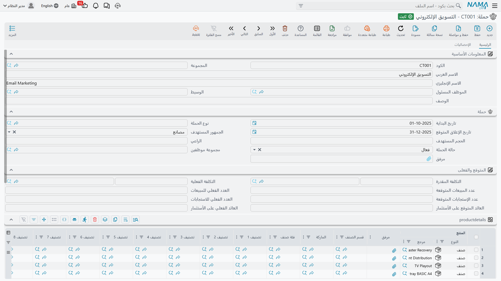

# الحملات (CRM Campaign)

في يناير ٢٠٢٦ شاركت شركة النخبة لأنظمة التكييف بجناح في معرض التبريد الدولي. حجزت إدارة التسويق
المساحة، وطبعت الكتيبات، وأوقفت مندوبَي مبيعات على الجناح ثلاثة أيام، وكانت تتوقع الخروج بنحو ١٢٠
زائرًا مؤهلًا. لا بد لأحد أن يسجّل ذلك في مكان ما — ما هي الحملة، ومن يملكها، وأي الأصناف تروّج لها،
ومن يعمل عليها — ثم لا بد لأحد بعد شهور أن يجيب عن السؤال: *«هل كانت تستحق؟»*.

شاشة **الحملة (CRM Campaign)** تجيب عن النصف الأول من ذلك إجابة جيدة؛ فهي بطاقة تسجيل صادقة ومفيدة
لجهد تسويقي. أما النصف الثاني — *هل كانت تستحق* — فلا تجيب عنه، وأهم ما تفعله هذه الصفحة أن تقول لك
ذلك بوضوح كافٍ لتخطط على أساسه من اليوم الأول.

::: info الترخيص المطلوب
`crm`
:::

| الشاشة | مكانها |
|---|---|
| حملة | خدمة العملاء > التسويق > حملة |
| نوع حملة | خدمة العملاء > التسويق > نوع حملة |

## الحملة ملف، لا مستند

رغم أن الحملة تحمل تواريخ ومربعات مبالغ وحالة، فهي **ملف رئيسي**. ليس لها دفتر مستندات، ولا توجيه
مستند، ولا رقم مستند، ولا تاريخ استحقاق، ولا دورة اعتماد. وحفظها لا يعالج شيئًا، ولا ينشئ طلب أعمال،
وليس له أي أثر محاسبي على الإطلاق. هي بطاقة في درج، وكل ما فيها كتبه إنسان بيده.

يستحق هذا أن يستقر في الذهن قبل قراءة بقية الشاشة، لأن عدة مربعات فيها تبدو وكأنها تخص مستندًا
يحسب.

## ما تملؤه بيدك

أعلى الشاشة هوية الحملة: الكود، والمجموعة، والاسم العربي والإنجليزي، والموظف المسئول، والوسيط، ووصف
حر.

ومجموعة **حملة** تحتها هي الحملة نفسها:

| الحقل | ملاحظات |
|---|---|
| تاريخ البداية (Start Date) | تاريخ بدء الحملة |
| نوع الحملة (Campaign Type) | مرجع إلى ملف نوع حملة — معرض، بريد مباشر، جولة ترويجية |
| تاريخ الإغلاق المتوقع (Expected Closing Date) | «النهاية» الوحيدة للحملة؛ ولا يوجد تاريخ انتهاء ملزم |
| الجمهور المستهدف (Target Kind) | قائمة ثابتة: مصانع، مشاريع، معارض |
| الحجم المستهدف (Target Size) | **نص حر** — `١٢٠ زائرًا مؤهلًا` قيمة طبيعية تمامًا |
| الراعي (Sponsor) | **نص حر** — إدارة، أو شريك، أو صاحب الميزانية |
| حالة الحملة (Campaign Status) | في فترة التخطيط، فعال، غير فعال، تمت، ملغي |
| مجموعة موظفين (Employee Group) | موجودة في الشاشة ولا يقرؤها شيء — انظر التنبيه أدناه |
| مرفق (Attachment) | خانة ملف واحدة |

وفي معرضنا تقرأ هكذا: النوع `CT-03` معرض، البداية ٨ يناير ٢٠٢٦، الإغلاق المتوقع ٣١ مارس ٢٠٢٦،
الجمهور المستهدف معارض، الحجم المستهدف `١٢٠ زائرًا مؤهلًا`، الراعي `إدارة التسويق`، الحالة فعال.

::: tip أمران غير موجودين في هذه الشاشة إطلاقًا
لا يوجد **حقل قناة** — لا شيء يسجّل ما إذا كانت الحملة بريدًا إلكترونيًا أو رسائل نصية أو تواصلًا
اجتماعيًا أو مطبوعات أو جناحًا في معرض. فإن كانت القناة تهمك، ضعها في اسم الحملة أو استخدم ملف نوع
الحملة لذلك، وهو ما تنتهي إليه معظم المواقع.

ولا يوجد **أي سلوك لمجموعة الموظفين**. مربع *مجموعة موظفين* يقبل قيمة ولا يقرؤها أي جزء من النظام.
الجدول الذي يليه هو ما يسند العمل فعليًا.
:::

### جدول الأصناف — إجباري ويفاجئ الناس

جدول **productdetails** (عنوانه غير مترجم، فيظهر حرفيًا هكذا في اللغتين) يسرد ما تروّج له الحملة:
سطر لكل صنف أو وحدة إيجارية، ومعه قسم الصنف وماركته وفئته وتصنيفاته والمحددات.

**ويلزم سطر واحد على الأقل.** فالحملة بجدول أصناف فارغ لا يمكن حفظها، وهذا ما يوقع الناس في الحيرة
عند إنشاء أول حملة. ولمعرضنا نسجّل `AC-CHL-300` (وحدة التبريد المركزية ٣٠٠ طن) و`AC-SPL-24` (وحدة
السبليت ٢٤٠٠٠ وحدة حرارية).

### جدول «مسند إلي» — هذا يعمل فعلًا

جدول *مسند إلي* يسرد الموظفين العاملين على الحملة، ومعه عمود ملاحظات. ولا يعرض بحث الموظف إلا
الموظفين المؤشَّر عليهم بأنهم **مندوبو مبيعات** في ملف الموظف؛ فإن غاب زميل عن القائمة فهذا هو
السبب.

وهذا الجدول هو القطعة الحقيقية الوحيدة من الآلية في الحملة. فحين يفتح مندوب المبيعات لاحقًا
[خيط بيع](/ar/modules/crm/sales-pipeline/crm-leads.md) ويختار هذه الحملة في مربع *الحملة*، تُنسخ
سطور «مسند إلي» من الحملة إلى جدول الموظفين المسند إليهم في خيط البيع. وفي حملة المعرض وصل السطران
`EMP-1042` (هالة) و`EMP-1001` (طارق) إلى خيط البيع `LD-00417` بهذه الطريقة دون أن يكتبهما أحد.

## «المتوقع والفعلى» — اقرأ هذا قبل أن تستعمله

تبدو مجموعة **المتوقع والفعلى (Expectations And Actuals)** وكأنها دراسة جدوى مصغّرة: التكلفة
المقدرة والفعلية، وعدد المبيعات المتوقع والفعلي، وعدد الاستجابات المتوقع والفعلي، والعائد على
الاستثمار المتوقع والفعلي.

::: danger لا شيء هنا يُحسب، ولا شيء هنا يُرحَّل
المربعات الثمانية كلها **أرقام تُكتب بحرية**. لا شيء يجمع الإنفاق الحقيقي للحملة، ولا شيء يعدّ
الاستجابات، ولا شيء يعدّ المبيعات، ولا شيء يقسم رقمًا على آخر ليخرج عائدًا على الاستثمار. ومربعات
*الفعلي* لا يملؤها النظام في أي لحظة وتحت أي شرط — أنت من يكتبها.

وليس للحملة **أي أثر محاسبي** كذلك. فالتكلفة التي تكتبها هنا لا تصير قيدًا، ولا تُقارَن بفاتورة مورد
أو سند مصروف، ولا تظهر في أي قائمة مالية. وإن كان الإنفاق التسويقي لا بد أن يصل إلى الدفاتر فهو يصل
بالطريق المعتاد — فواتير المشتريات وسندات المصروفات في المحاسبة — ويبقى هذا المربع ملاحظة منفصلة
تحافظ على تطابقها بيدك.
:::

فمربعات معرضنا الثمانية تقرأ: تكلفة مقدرة ١٨٠٬٠٠٠٫٠٠ مقابل تكلفة فعلية ١٩٦٬٥٠٠٫٠٠؛ و١٢ عملية بيع
متوقعة مقابل ٥ مسجلة؛ و١٢٠ استجابة متوقعة مقابل ٩٤ مسجلة؛ وعائد متوقع ٣٫٥ مقابل عائد فعلي ٢٫١. وكل
رقم من هذه العشرة كتبه إنسان قرأه من مكان آخر. وهذه طريقة معقولة تمامًا لحفظ بطاقة نتائج للحملة — ما
دام الجميع يعلم أن هذا كل ما هي عليه.

## أين تلتقي الحملات بخيوط البيع

الحملة لا تنتج خيوط بيع. لا يوجد في هذه الشاشة زر ينشئ خيط بيع، أو يستورد قائمة استجابات، أو يفتح
سجلًا في مسار البيع. **الربط يتم في الاتجاه المعاكس، سجلًا سجلًا**: يفتح المندوب
[خيط بيع](/ar/modules/crm/sales-pipeline/crm-leads.md) أو [فرصة](/ar/modules/crm/sales-pipeline/crm-potentials.md)
ويختار الحملة في مربع *الحملة*.

::: warning قائمة اختيار الحملة تعرض كل الحملات
كان المقصود من قائمة الاختيار في شاشتي خيط البيع والفرصة أن تخفي الحملات الملغاة وغير الفعالة. وهي
لا تفعل — إذ لا يستبعد الفلتر شيئًا، فتظل حملة أغلقتها قبل سنتين معروضة إلى جوار حملة هذا الربع.
سمِّ الحملات بأسماء مؤرخة (`معرض التبريد ٢٠٢٦` لا `معرض`) ليستطيع المختار التمييز بينها.
:::

والتبويب الثاني **الإحصائيات** هو المكان الذي تعود إليه عمليات الإسناد. فيه ثلاث قوائم للعرض فقط —
خيوط البيع التي تحمل هذه الحملة، والفرص التي تحملها، والعملاء الذين يحملونها. لا شيء فيها قابل
للتعديل؛ هي نظرة حيّة على من أشار إلى هذه الحملة.

وتستحق قائمة العملاء كلمة، لأنها تمتلئ أقل مما يتوقع الناس. فالعميل لا يحمل حملة إلا إذا ضُغط
*تحويل إلي عميل* **على خيط بيع** يحمل الحملة أصلًا. وفي مثالنا حُوِّل خيط البيع أولًا إلى فرصة —
والتحويل إلى فرصة لا ينقل الحملة — فلما أُنشئ العميل `C-01188` أخيرًا من الفرصة وصل بلا حملة، وظلت
قائمة العملاء في حملة المعرض فارغة رغم أن الصفقة جاءت من المعرض. راجع
[تحويل خيط البيع](/ar/modules/crm/sales-pipeline/crm-lead-conversion.md) لتعرف ما ينقله كل زر تحويل.
فإن كان إسناد الحملة على العملاء يهمك، فاحسم مبكرًا أن خيوط البيع تُحوَّل إلى عملاء مباشرة، إذ لا
طريق آخر: حقل الحملة لا يظهر في شاشة العميل، فلا يمكن ضبطه ولا تصحيحه بعد ذلك.

## السؤال الذي لا تستطيع هذه الشاشة الإجابة عنه

::: danger الصفقة الرابحة لا يمكن أبدًا تتبعها رجوعًا إلى الحملة التي أنتجتها
ينتهي الإسناد عند العميل. **لا يحمل أي عرض أسعار ولا أمر بيع ولا فاتورة ولا إذن صرف ولا أي مستند
إيراد في نظام نما أي حملة.** لا مربع حملة في تلك الشاشات، ولا عمود حملة في قوائمها، ولا فلتر حملة في
تصديرها.

معنى ذلك أن السلسلة «حملة ← خيط بيع ← عميل ← أمر بيع ← فاتورة ← إيراد» مقطوعة عند الحلقة الرابعة،
بشكل دائم. فالنظام لا يستطيع أن يخبرك بما كسبته حملة، ولا أن يقارن حملتين بالإيراد، ولا أن ينتج
تكلفة خيط البيع أو عائدًا على الاستثمار. ومربع *العائد الفعلي على الأستثمار* هو المكان الذي يكتب فيه
أحدهم الإجابة التي استخرجها من خارج النظام.
:::

لكن هذا ليس نهاية الطريق؛ إنما يعني أن الحساب يجري خارج الشاشة. وما ينفع عمليًا:

1. **كن صارمًا في حقل الحملة على خيوط البيع.** فهو نقطة الإسناد الوحيدة الموجودة، وخيط البيع الذي
   يُنشأ بدونها يظل غير مرئي للحملة إلى الأبد.
2. **اقرأ الأعداد من تبويب الإحصائيات**، أو من شاشة قائمة خيوط البيع مفلترة بالحملة. يعطيك ذلك عدد
   خيوط بيع حقيقيًا وموثوقًا للحملة — وهو الرقم الوحيد في هذه المنطقة كلها الذي يحسبه لك النظام.
3. **صدِّر وحلّل في إكسل.** فقائمتا خيوط البيع والفرص تُصدَّران إلى إكسل ومعهما عمود الحملة. اضربه
   في تصدير للمبيعات حسب العميل، فيكتمل طرف الإيراد في المعادلة، مرة واحدة، في ملف إكسل.
4. **اطلب لوحة معلومات في نظام ذكاء الأعمال (BI)** إن كان السؤال متكررًا. فالبيانات كلها موجودة في
   قاعدة البيانات؛ والناقص شاشة تربطها، ونظام ذكاء الأعمال هو المكان الذي يبنيها فيه الموقع.
5. ثم اكتب الإجابة في *العائد الفعلي على الأستثمار* لتحمل بطاقة الحملة خلاصتها.

## نوع الحملة

ملف **نوع حملة** لافتة فحسب — كود واسم عربي وإنجليزي وموظف مسئول ووسيط. لا يحمل قيمًا افتراضية، ولا
حساب تكلفة، ولا قناة، ولا سلوكًا؛ واختيار النوع في الحملة لا يغيّر شيئًا آخر في الشاشة. وهو مشروح مع
بقية ملفات التصنيف في
[ملفات التصنيف](/ar/modules/crm/master-files/crm-lead-classification-files.md).

## أمران صغيران يستحقان المعرفة

::: warning حقلان إضافيان موجودان خارج الشاشة
إلى جانب قائمة *الجمهور المستهدف* ومربع *الراعي* النصي، يحمل سجل الحملة حقلين مخزَّنين آخرين يبدوان
كنص جمهور مستهدف ونص راعٍ. وهما ليسا في الشاشة ولا يقرؤهما شيء — لكنهما **يظهران** في الاستيراد
والتصدير ومنتقي أعمدة القوائم، حيث لا يمكن تمييزهما عن الحقيقيين. فحين تبني ملف استيراد أو تصميم
قائمة، تأكد أنك اخترت *الجمهور المستهدف* و*الراعي* لا شبيهيهما؛ فالبيانات المكتوبة في الآخرين تختفي
بصمت.
:::

وخلافًا لكل شاشة أخرى في هذه المنطقة، لا تملأ الحملة الموظف المسئول بموظف المستخدم الحالي عند
الإنشاء. فإن أردت مالكًا للبطاقة فاضبطه بنفسك.

::: info التقارير
التقارير: لا يوجد. لا يشحن هذا الموديول أي تقارير نظام، وليس لهذه الشاشة نموذج طباعة. استعمل شاشات
قوائم الحملات وخيوط البيع والفرص، وأوامر تصديرها إلى إكسل، أو لوحة معلومات يبنيها موقعك في نظام ذكاء
الأعمال.
:::
