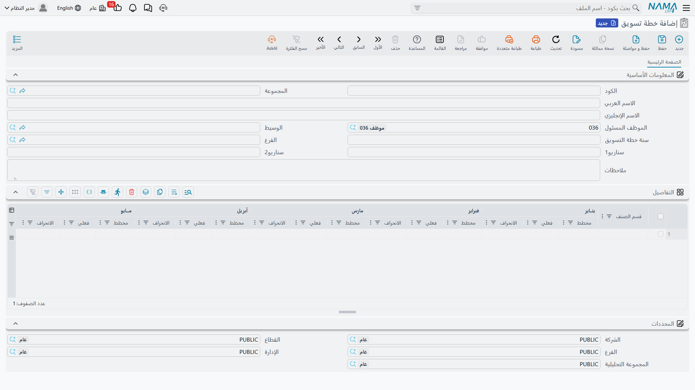

# خطط التسويق (MarketingPlan)

في كل ديسمبر يجلس مدير المبيعات ويكتب السنة كلها في ورقة واحدة: وحدات التكييف المركزي ينبغي أن تأتي
بـ٤٠٠٬٠٠٠ شهريًا، وقطع الغيار بـ٩٠٬٠٠٠، وعقود الصيانة بـ١٥٠٬٠٠٠. اثنا عشر عمودًا عرضًا، وسطر لكل خط
نشاط، ومقارنة جارية بما حدث فعلًا.

شاشة **خطة تسويق (MarketingPlan document)** هي هذه الورقة بعينها منقولة إلى نظام نما. وهي صادقة فيما
هي عليه متى عرفتَ أمرًا واحدًا: **إنها ورقة لا محرّك.** فكل رقم مخطط وكل رقم فعلي فيها يكتبه إنسان.
وما تعطيه لك الشاشة في المقابل هو الحساب — إجماليات السطور وانحرافات الشهور التي تحدّث نفسها وأنت
تكتب — ومكان واحد تعيش فيه السنة كلها بدل ملف إكسل على حاسوب أحدهم.

::: info الترخيص المطلوب
`crm`
:::

| الشاشة | مكانها |
|---|---|
| خطة تسويق | خدمة العملاء > التسويق > خطة تسويق |

::: tip القائمة تسميها مستندًا، وهي ملف رئيسي
رغم الاسم في القائمة، هذه **ملف رئيسي**: لا دفتر مستندات، ولا توجيه مستند، ولا رقم مستند، ولا تاريخ
استحقاق، ولا دورة اعتماد. وحفظها لا يعالج شيئًا وليس له أثر محاسبي. والأمر نفسه ينطبق على هدف
التشغيل المجاور.
:::

## الرأس

أربعة مربعات تهم، وأحدها سيفاجئك:

- **سنة خطة التسويق (Year)** — سنة الخطة، وهي **نص حر** لا رقم. فـ`٢٠٢٦` و`٢٠٢٦ – معدّلة` كلاهما
  مقبول. اختر اصطلاحًا واحدًا والتزم به في الموقع كله، لأن هذا الحقل لا يُرتَّب ولا يُجمَّع ولا
  يُتحقق منه نيابة عنك.
- **الفرع (Branch)** — الفرع الذي تخصّه الخطة، وهو `BR-CAI` في مثالنا.
- **سناريو1** و**سناريو2** — مربعا نص حر. لا يقرؤهما شيء ولا يتفرع عليهما شيء؛ هما مكان تكتب فيه
  «متفائل» أو «معتمدة من المجلس» إن ساعدك ذلك على التمييز بين خطتين.
- ثم الموظف المسئول والوسيط والملاحظات كالمعتاد.

## جدول التفاصيل — سطر لكل قسم، واثنا عشر شهرًا عرضًا

كل سطر في الجدول خط نشاط واحد، وعموده الأول عنوانه **قسم الصنف (Item Section)**.

::: warning «قسم الصنف» نص حر لا مرجع
العمود معنون وكأنه رابط إلى ملف أقسام الأصناف، لكنه مربع نص عادي. لا شيء يتحقق مما تكتبه، ولا شيء
يبحث عنه، ولا شيء يربط خطتك بأقسام أصناف حقيقية في سلاسل الإمداد.

والنتيجة العملية هي الإملاء. فـ«قطع غيار» و«قطع الغيار» و«قطع‑غيار» ثلاثة سطور مختلفة عند من يقرأ
الورقة، ولن تطابق خطة العام القادم خطة هذا العام ما لم ينسخ أحدهم الصياغة حرفًا بحرف. اتفق على أسماء
الأقسام مرة واحدة، ودوّنها، وأعد استعمالها.
:::

وبعد القسم تأتي الشهور الاثنا عشر، وكل شهر ثلاثة أعمدة:

| العمود | معناه |
|---|---|
| مخطط (Planned) | ما تنوي تحقيقه في ذلك الشهر |
| فعلي (Actual) | ما حدث فعلًا — **يُكتب باليد** |
| الانحراف (Deviation) | محسوب: **الفعلي − المخطط** |

وينتهي السطر بإجماليين: **إجمالي المخطط** و**إجمالي المنفذ**، وهما مجموع الاثني عشر مخططًا والاثني
عشر فعليًا.

خطة النخبة لعام ٢٠٢٦ (`MKP-2026`) فيها ثلاثة سطور، بالرقم المخطط نفسه كل شهر، ولم تُدخل حتى الآن إلا
فعليات الربع الأول:

| القسم | المخطط شهريًا | إجمالي المخطط | فعلي يناير | فعلي فبراير | فعلي مارس | إجمالي المنفذ |
|---|---|---|---|---|---|---|
| تكييف مركزي | ٤٠٠٬٠٠٠٫٠٠ | ٤٬٨٠٠٬٠٠٠٫٠٠ | ٣٢٠٬٠٠٠٫٠٠ | ٤٥٥٬٠٠٠٫٠٠ | ٤٠٠٬٠٠٠٫٠٠ | ١٬١٧٥٬٠٠٠٫٠٠ |
| قطع غيار | ٩٠٬٠٠٠٫٠٠ | ١٬٠٨٠٬٠٠٠٫٠٠ | ٨٤٬٠٠٠٫٠٠ | ٩٧٬٥٠٠٫٠٠ | ٩١٬٠٠٠٫٠٠ | ٢٧٢٬٥٠٠٫٠٠ |
| عقود صيانة | ١٥٠٬٠٠٠٫٠٠ | ١٬٨٠٠٬٠٠٠٫٠٠ | ١٤٠٬٠٠٠٫٠٠ | ١٦٥٬٠٠٠٫٠٠ | ١٥٠٬٠٠٠٫٠٠ | ٤٥٥٬٠٠٠٫٠٠ |
| **الإجماليات** | | **٧٬٦٨٠٬٠٠٠٫٠٠** | | | | **١٬٩٠٢٬٥٠٠٫٠٠** |

فيكون انحراف الربع الأول:

| القسم | يناير | فبراير | مارس |
|---|---|---|---|
| تكييف مركزي | −٨٠٬٠٠٠٫٠٠ | +٥٥٬٠٠٠٫٠٠ | ٠٫٠٠ |
| قطع غيار | −٦٬٠٠٠٫٠٠ | +٧٬٥٠٠٫٠٠ | +١٬٠٠٠٫٠٠ |
| عقود صيانة | −١٠٬٠٠٠٫٠٠ | +١٥٬٠٠٠٫٠٠ | ٠٫٠٠ |

## في أي اتجاه يشير الانحراف؟

في هذه الشاشة الانحراف هو **الفعلي − المخطط**. فالرقم **الموجب** يعني أنك تجاوزت الخطة، والرقم
**السالب** يعني أنك قصّرت عنها. فيناير كان متأخرًا ٨٠٬٠٠٠ في الوحدات المركزية، وفبراير كان متقدمًا
٥٥٬٠٠٠.

::: warning هدف التشغيل يقرأ في الاتجاه المعاكس
[هدف التشغيل](/ar/modules/crm/marketing/crm-target-plans.md) فيه جدول يبدو مطابقًا — الشهور الاثنا
عشر نفسها، والأعمدة الثلاثة نفسها، وعنوان العمود العربي نفسه — لكن انحرافه **المخطط − الفعلي**، فالرقم
الموجب هناك يعني **عجزًا**.

شاشتان بالتصميم نفسه ومعنى معاكس. فكلما وضعت رقم انحراف أمام شخص لم يفتح الشاشة بنفسه، فقل له من أي
الخطتين جاء.
:::

## من أين تأتي الأرقام الفعلية

تأتي منك. فلا يوجد **زر «تحديث فعلي» في هذه الشاشة**، ولا استعلام خلفه، ولا نداء خدمة، ولا شيء في
نظام نما كله يدفع رقم مبيعات إلى خطة تسويق. والنظام لا يقرأ أمر بيع ولا فاتورة ولا حساب إيراد نيابة
عن هذه الشاشة أبدًا.

وليس الأمر بالقتامة التي يبدو عليها؛ إنما يعني أن الخطة ورقة مراجعة لا تقرير حي. وعمليًا يقوم أحدهم
مرة كل شهر بما يلي:

1. يستخرج أرقام المبيعات التي يثق بها — من شاشات قوائم المبيعات وتصديرها إلى إكسل، أو من تقرير
   محاسبي، أو من لوحة معلومات بناها الموقع في نظام ذكاء الأعمال (BI)؛
2. يفتح خطة التسويق ويكتب فعليات الشهر في السطور الثلاثة؛
3. يقرأ الانحرافات والإجماليين، وهما يتحدثان أثناء الكتابة.

فإن أردت أن تصل الأرقام الفعلية من تلقاء نفسها، فتلك مسألة ذكاء أعمال لا مسألة خطة تسويق. خطة
التسويق هي المكان الذي يعيش فيه **الهدف** وتدور فيه المناقشة.

::: warning خانات الانحراف لا تتحدث دائمًا
لا يُعاد حساب الانحراف إلا حين تحمل خانة **الفعلي** لذلك الشهر قيمة غير صفرية. ويترتب على ذلك أمران،
وكلاهما يقع في الاستعمال العادي:

- اكتب رقمًا *مخططًا* في شهر لا يزال فعليه فارغًا، فتبقى خانة الانحراف فارغة أو محتفظة بقيمتها
  القديمة.
- أعِد فعليًا إلى صفر، فيبقى الانحراف القديم معروضًا.

والحفظ لا ينظف ذلك — فخلافًا لهدف التشغيل، ليس في هذه الشاشة إعادة حساب عند الحفظ. والعلاج ببساطة أن
تعيد إدخال قيمة *الفعلي* لذلك الشهر، فيلحق حساب السطر كله. وحين تقرأ خطة ملأها غيرك، ثق بعمودي
*إجمالي المخطط* و*إجمالي المنفذ* أكثر من خانة انحراف مفردة، وإن بدا انحراف مستحيلًا فأعد كتابة
الفعلي المجاور له.
:::

## ما لا تمسّه الخطة

لا شيء. فخطة التسويق لا تولّد مستندًا، ولا تقرؤها شاشة أخرى، وليس لها أثر محاسبي ولا مخزني، ولا يوجد
زر في أي شاشة أخرى ينشئ واحدة. هي ورقة قائمة بذاتها — ولهذا فالمخاطر الحقيقية الوحيدة معها هي إملاء
أسماء الأقسام واصطلاحا الإشارة.

::: info التقارير
التقارير: لا يوجد. لا يشحن هذا الموديول أي تقارير نظام، وليس لهذه الشاشة نموذج طباعة. ولإخراج الخطة
استعمل تصدير شاشة القائمة إلى إكسل واعمل في ملف الإكسل.
:::

::: tip ملاحظة على عناوين الأعمدة الإنجليزية
عدة عناوين إنجليزية في جدول الشهور الاثني عشر بها أخطاء إملائية في الشاشة المشحونة — سترى
`Jan|Panned` و`Mars|Planned` و`Jan |excuted` و`Sept|Planned` و`total Excuted`. وهي أخطاء شكلية؛
والأعمدة تعمل تمامًا كما تصفها العناوين العربية، والعناوين العربية للشهور صحيحة.
:::
