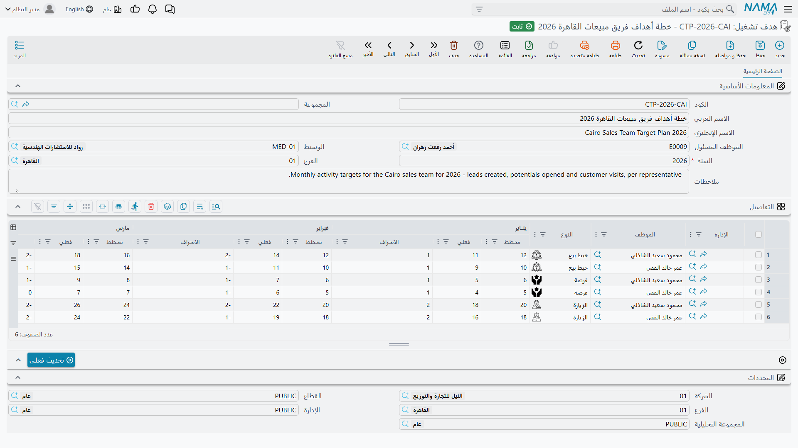

# خطط الأهداف — هدف تشغيل (Operation goal)

يُتوقع من هالة أن تجري أربعين مكالمة في يناير، وثماني زيارات ميدانية، وأن تفتح ستة خيوط بيع جديدة.
ويُتوقع من كريم في إدارة الصيانة أن يسجّل خمسة وعشرين تنفيذ طلب دعم في الشهر. هذه حصة — وهي حصة
**أنشطة** لا حصة أموال.

الشاشة التي تسميها القائمة **هدف تشغيل (Operation goal)** هي مكان هذه الحصة. وهي أقرب ما في موديول
خدمة العملاء إلى ورقة أهداف المبيعات، وأهم جملة تُقال عنها هي: **خطة الهدف تعدّ أنشطة.** مكالمات
وزيارات وخيوط بيع ومهام وفرص ومشاريع وتنفيذات طلبات دعم. ليس فيها عمود مبلغ ولا عملة ولا صنف ولا
منتج، ولا تُقارَن أبدًا بأمر بيع أو فاتورة أو رقم إيراد. فإن جئت تبحث عن «على هالة أن تبيع ٤ ملايين
هذا العام»، فهذه الشاشة لا تستطيع أن تحمل هذه الجملة.

::: info الترخيص المطلوب
`crm`
:::

| الشاشة | مكانها |
|---|---|
| هدف تشغيل | خدمة العملاء > التسويق > هدف تشغيل |

وكـ[خطة التسويق](/ar/modules/crm/marketing/crm-marketing-plans.md) المجاورة لها، هذه **ملف رئيسي** —
لا دفتر مستندات، ولا توجيه مستند، ولا رقم مستند، ولا دورة اعتماد، ولا أثر محاسبي.

## الرأس

- **السنة (Year)** — رقم صحيح، وهو **إجباري**. وخلافًا لسنة خطة التسويق النصية، هذه رقم حقيقي، فتكون
  `٢٠٢٦`.
- **الفرع (Branch)** — الفرع. سجّله لحفظك الخاص؛ فلا شيء يفلتر أو يقيّد على أساسه.
- الموظف المسئول والوسيط والملاحظات.

## سطر لكل موظف ولكل نوع نشاط

جدول التفاصيل هو موضع كتابة الحصة. وكل سطر يجيب عن سؤال «مَن، وماذا نعدّ؟»:

| العمود | معناه |
|---|---|
| الإدارة (Department) | الإدارة التي يخصها الهدف |
| الموظف (Employee) | **صاحب** الحصة في هذا السطر |
| النوع (Type) | **ما** يجري عدّه |
| مخطط · فعلي · الانحراف، اثنتي عشرة مرة | العدد المخطط والعدد الفعلي والانحراف لكل شهر |
| إجمالي المخطط (Total Planned) | مجموع الأعداد المخططة الاثني عشر |
| إجمالي المنفذ (Total Executed) | مجموع الأعداد الفعلية الاثني عشر |

ويعرض عمود *النوع* سبعة أشياء للعدّ، وهذه السبعة فقط: **اتصال**، و**الزيارة**، و**خيط بيع**،
و**فرصة**، و**مهمة خدمة عملاء**، و**مشروع CRM**، و**تنفيذ طلب دعم**.

فالموظف الذي عليه ثلاثة أنواع من الحصص يأخذ ثلاثة سطور. وخطة النخبة لعام ٢٠٢٦ (`TGT-2026`) تبدو
هكذا:

| الإدارة | الموظف | النوع | الخطة الشهرية | إجمالي المخطط | يناير | فبراير | مارس | إجمالي المنفذ |
|---|---|---|---|---|---|---|---|---|
| `DPT-SLS` | `EMP-1042` هالة | اتصال | ٤٠، ٤٠، ٤٠، ٤٥، ٤٥، ٤٥، ٣٠، ٣٠، ٤٥، ٥٠، ٥٠، ٤٠ | **٥٠٠** | ٣٦ | ٤٤ | ٤١ | **١٢١** |
| `DPT-SLS` | `EMP-1042` هالة | الزيارة | ٨ كل شهر | **٩٦** | ٧ | ٩ | ٨ | **٢٤** |
| `DPT-SLS` | `EMP-1042` هالة | خيط بيع | ٦ كل شهر | **٧٢** | ٥ | ٨ | ٦ | **١٩** |
| `DPT-MNT` | `EMP-1055` كريم | تنفيذ طلب دعم | ٢٥ كل شهر | **٣٠٠** | ٢٢ | ٢٧ | ٢٤ | **٧٣** |

::: danger هذه الحصة لا يمكن التعبير عنها بالمال أبدًا
لا يوجد مبلغ ولا عملة ولا صنف ولا سعر في أي موضع من هذه الشاشة، ولا شيء في النظام يقارن خطة هدف
بأمر بيع أو فاتورة أو قيمة عقد أو تحصيل. خطة الهدف تقول «أربعون مكالمة»، ولا تقول «أربعمائة ألف»
أبدًا.

وهذا قصور حقيقي لا إعداد يمكن تشغيله. فإن كانت أهداف مبيعاتك مالية فخطة الهدف ليست الورقة المناسبة
لها — استعمل [خطة التسويق](/ar/modules/crm/marketing/crm-marketing-plans.md)، فهي على الأقل مقوّمة
بالمال (لكل قسم لا لكل موظف)، أو احتفظ بالهدف المالي خارج نظام نما واستعمل هذه الشاشة لانضباط
الأنشطة الذي يسنده.
:::

## الانحراف، والفخ المجاور

الانحراف في هذه الشاشة **المخطط − الفعلي**. فالرقم **الموجب** يعني **عجزًا** — خططت هالة لأربعين
مكالمة في يناير وأجرت ٣٦، فيقرأ يناير `+٤`. والرقم **السالب** يعني أنها تجاوزت الهدف: فبراير خطته
٤٠ وحقق ٤٤، فالانحراف `−٤`.

::: warning خطة التسويق تقرأ في الاتجاه المعاكس
جدول [خطة التسويق](/ar/modules/crm/marketing/crm-marketing-plans.md) يبدو مطابقًا ويحسب
**الفعلي − المخطط**، فالرقم الموجب هناك خبر سار. التصميم نفسه، وعنوان العمود العربي نفسه، والإشارة
معاكسة.

فكلما خرج رقم انحراف من الشاشة — في بريد أو اجتماع أو ملف مصدَّر — فقل من أي خطة جاء.
:::

والخبر الطيب أن حساب هذه الشاشة موثوق. فالإجماليان والانحرافات الاثنا عشر تُعاد حسابها على الخادم في
كل مرة يُحفظ فيها السجل، فخطة الهدف التي تفتحها متسقة داخليًا دائمًا مهما كانت طريقة تعبئتها.

## زر «تحديث فعلي»

في الشاشة زر عنوانه **تحديث فعلي (Actual update)** في كتلة الإجراءات بالصفحة الرئيسية. ونيّته واضحة
وجذابة: تضغطه فتملأ خانات *الفعلي* الاثنتا عشرة نفسها بالعدد الحقيقي للمكالمات والزيارات وخيوط البيع
التي سجّلها الموظف في تلك السنة.

::: danger «تحديث فعلي» لا يعمل — بل يفشل بخطأ في قاعدة البيانات
ضغط الزر يعيد خطأ قاعدة بيانات بدل أن يملأ شيئًا. فالاستعلام الذي خلفه يشير إلى جدول غير موجود في
قاعدة البيانات، فيفشل قبل قراءة سطر واحد. ويحدث ذلك في كل تركيب، وعلى كل خطة هدف، وفي كل مرة.

**ولذلك لا يُقاس تحقيق الهدف آليًا أبدًا.** تعامل مع خطة الهدف كورقة تملؤها وتقرؤها بعينك: الأعداد
المخططة تُكتب، والأعداد الفعلية تُكتب كذلك.
:::

::: warning لا تحاول إصلاح الزر
يستحق هذا أن يقال صراحة، لأن العطل يبدو كمشكلة قاعدة بيانات صغيرة يستطيع أحدهم ترقيعها. وهو ليس
كذلك، وإصلاح الاستعلام سيزيد الأمر سوءًا لا صلاحًا:

- كل سطر (موظف + نوع) يعود من الاستعلام حاملًا عدد **شهر واحد**، وتنسخ الشاشة تلك القيمة المفردة على
  الشهور الاثني عشر جميعًا — فتكتب رقمًا حقيقيًا في شهر واحد و**صفرًا في الأحد عشر الباقية**، ماحيةً
  أي أعداد فعلية كُتبت هناك من قبل.
- والاستعلام بلا أي فلاتر: لا سنة، ولا فرع، ولا شركة، ولا محددات، ولا تمييز بين مستند محفوظ ومسودة.
  فسيعدّ كل ما في قاعدة البيانات، بما فيه سجلات شركات أخرى ومسودات غير مكتملة، ضمن هدف الموظف.

فالموقف الصادق ليس «هذه الخاصية معطلة وسيصلحها مدير قاعدة البيانات قريبًا» — بل «هذه الخاصية غير
موجودة بعد». املأ أعمدة الفعلي بيدك.
:::

## الحصول على الأعداد الحقيقية يدويًا

كتابة الفعليات أقل إيلامًا مما تبدو، لأن كل عدد تريده هذه الشاشة يبعد عنك شاشة قائمة مفلترة واحدة.
لكل موظف وكل شهر:

1. افتح شاشة القائمة المقابلة — اتصال، أو زيارة، أو خيط بيع، أو فرصة، أو مهمة خدمة عملاء، أو مشروع
   CRM، أو تنفيذ طلب دعم.
2. فلتر بالموظف وبمدى تواريخ الشهر.
3. اقرأ عدد السجلات من القائمة، أو صدّر القائمة المفلترة إلى إكسل وعُدّ هناك.
4. اكتب الرقم في خانة *فعلي* لذلك الشهر.

وإن كان هذا طقسًا شهريًا لعشرة موظفين أو أكثر، فيستحق الأمر بناء لوحة معلومات صغيرة في نظام ذكاء
الأعمال (BI) تخرج المصفوفة كلها في مكان واحد — فالبيانات الأساسية كاملة وقابلة للعدّ تمامًا،
والناقص شاشة تجمعها فحسب. عندئذ يستغرق نقل اثني عشر رقمًا لكل سطر دقائق معدودة، وتبقى خطة الهدف
الورقة الواحدة التي يراجعها الجميع.

::: tip انتبه للسنة
لأن أرقام *الفعلي* مكتوبة باليد ولا يعيد شيء اشتقاقها، فخطة الهدف لقطة تعكس آخر من حدّثها. ولا شيء في الموديول ينبه أحدًا إلى انقضاء
شهر — فليس في خدمة العملاء جدولة زمنية ولا منبه ولا إشعار في أي موضع. اجعل
التحديث ضمن روتين أحدهم الشهري، واستعمل خانة *الملاحظات* لتسجيل إلى أي شهر جرى تحديث الفعليات — فليس
في هذه الشاشة مؤشر «آخر تحديث» ذو معنى.
:::

::: info التقارير
التقارير: لا يوجد. لا يشحن هذا الموديول أي تقارير نظام، وليس لهذه الشاشة نموذج طباعة. وشاشات قوائم
الأنشطة وتصديرها إلى إكسل ونظام ذكاء الأعمال هي المصدر الحقيقي لأرقام التحقيق.
:::

::: tip ملاحظة على عناوين الأعمدة الإنجليزية
كما في خطة التسويق، بعض عناوين الشهور الإنجليزية في هذا الجدول بها أخطاء إملائية (`Jan|Panned`
و`Mars|Planned` و`Jan |excuted` و`Sept|Planned` و`total Excuted`). وهي شكلية؛ والعناوين العربية
صحيحة والأعمدة تعمل كما وُصف أعلاه.
:::
