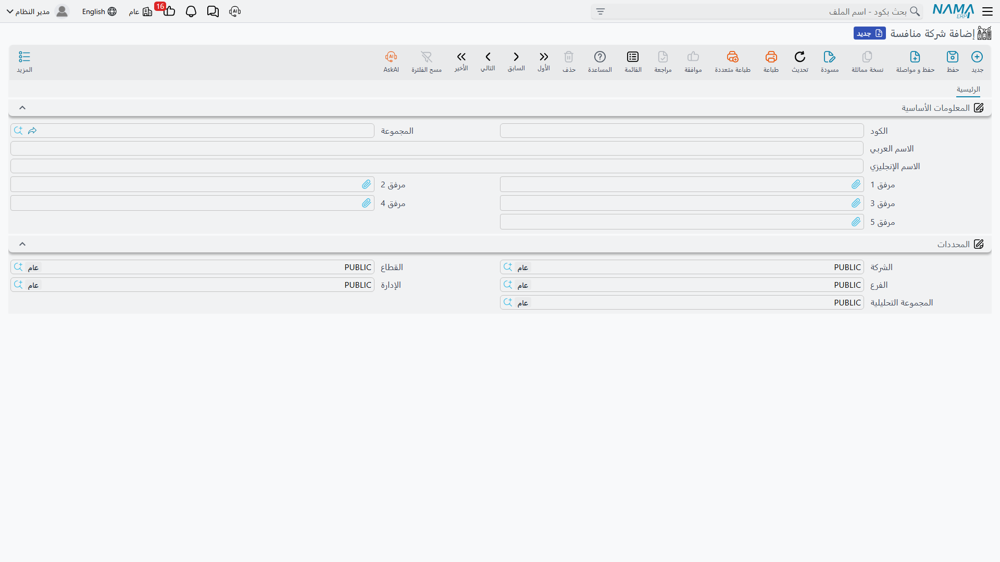

# الشركات المنافسة

**شركة منافسة / Competitor Company** — `خدمة العملاء > التسويق > شركة منافسة`.
**صنف شركة منافسة / Competitor Company Item** — `خدمة العملاء > التسويق > صنف شركة منافسة`.

::: info الترخيص المطلوب
`crm`.
:::

حين تخسر هالة صفقة تشيلر في مارينا بلازا، فالسؤال المفيد بعدها ليس *لماذا* بقدر ما هو *لصالح مَن، وبأي
منتج*. وهذان الملفان يتيحان لفريق البيع تسجيل ذلك على سطر المنتج نفسه: أي شركة منافسة كانت في الغرفة،
وأي من منتجاتها عُرض في مواجهة منتجك.

لكن اضبط التوقع أولاً، فذلك يوفّر خيبة لاحقة.

::: warning هذا تسجيل بيانات، لا تحليل تنافسي
لا شيء في المنتج يقرأ المنافس الذي سجّلته. فليس في خدمة العملاء **أي تقرير ولا لوحة معلومات ولا شاشة
قائمة ولا تحليل مكسب/خسارة** ينظر إلى بيانات المنافسين، ولا صلة بين سطر المنافس وحالة خيط البيع أو سبب
رفضه. وما تكتبه هنا لا يخرج إلا عبر شاشات القوائم أو التصدير إلى إكسل أو عرض يبنيه موقعك في BI.
:::

## الملفان، والاتجاه الذي يشيران إليه

**شركة منافسة** هي الشركة المنافسة نفسها. وشاشتها اسم لا أكثر:

| الحقل | ملاحظات |
|---|---|
| الكود والمجموعة والاسم العربي والاسم الإنجليزي | المجموعة الأساسية المعتادة. |
| مرفق 1 … مرفق 5 (Attachment 1 … 5) | حيث يمكن أن تعيش كتيّب أو قائمة أسعار وقعت في يدك. |

ثم مجموعة **المحددات (Dimensions)**، وهذا كل السجل. لا عنوان ولا جهة اتصال ولا حصة سوقية ولا حقل
ملاحظات.

**صنف شركة منافسة** هو أحد منتجات *تلك الشركة* — وجدوله يسرد منتجاتك *أنت* التي ينافسها. وهذا الاتجاه
هو ما ينبغي ضبطه: أنت لا تصف صنفك وتسرد منافسيه، بل تصف صنفاً منافساً وتسرد أصنافك التي يقابلها.

| الحقل | ملاحظات |
|---|---|
| الكود والمجموعة والاسم العربي والاسم الإنجليزي | المجموعة الأساسية المعتادة. |
| الشركة المنافسة (Competitor Company) | مَن يصنعه. |
| جدول *الأصناف المقابلة للصنف المنافس* | أصنافك التي تنافسه. |

ويُشحن الجدول بعمودين اثنين — **الصنف** و**ملاحظة**. والسطر قادر على حمل ثماني قيم أخرى (مرجعين ونصين
وتاريخين ورقمين)، لكنها ليست على الشاشة كما تُشحن، فالموقع الذي يريد تسجيل سعر المنافس مثلاً عليه أن
يُضاف العمود إلى تصميم الشاشة أولاً.

وفي المثال المرجعي، `COMP-03` **شركة الأفق للتكييف** هي المنافس، و`CITM-011` **تشيلر أفق 300 طن** هو
آلتها، والجدول على `CITM-011` يسرد `AC-CHL-300`، تشيلر النخبة 300 طن.

## أين تفعل ملفات المنافسين شيئاً فعلاً

ثلاث تسهيلات صغيرة، كلها على جدول **المنتجات** في
[خيط البيع](/ar/modules/crm/sales-pipeline/crm-leads.md) أو
[الفرصة](/ar/modules/crm/sales-pipeline/crm-potentials.md) أو
[المكالمة](/ar/modules/crm/activities/crm-calls.md). ففي ذلك الجدول عمود *الشركة المنافسة* وعمود
*صنف الشركة المنافسة* بجوار كل منتج تعرضه.

1. **اختر الصنف المنافس فتملأ الشركة نفسها.** اختر `CITM-011` على سطر منتج فتصير *الشركة المنافسة*
   `COMP-03` دون أن تُسأل.
2. **منتقي الصنف المنافس يضيّق نفسه.** فمتى حمل السطر شركة منافسة ومنتجاً، لم يعرض المنتقي إلا أصناف
   تلك الشركة، ومنها فقط ما يسرد جدولُه المنتجَ الموجود على السطر. فعلى خيط البيع `LD-00417` يعرض سطر
   `AC-CHL-300` الصنفَ `CITM-011`، بينما لا يعرض سطر `AC-AHU-12` شيئاً لأن لا صنف لأفق يسرد وحدة
   المناولة.
3. **وعلى المكالمة ينعكس السهم.** اختر الصنف المنافس أولاً فيضيق منتقي *المنتج* على الأصناف المسرودة
   داخل جدول ذلك الصنف المنافس — وهو مفيد حين يفتتح العميل الحديث باسم موديل المنافس.

هذا هو أثرها الوظيفي كاملاً. ولا شيء آخر في الوحدة يستشير هذين الملفين.

::: tip إذا توقف صنف منافس قديم عن الظهور في المنتقي
التضييق في النقطة 2 يعتمد على فهرس يعيد كل صنف منافس بناءه عند حفظه. والسجل الذي أُنشئ قبل ملء جدول
الأصناف، أو استُورد دون المرور بالشاشة، قد يغيب عنه — والعرَض أن الصنف المنافس موجود لكنه لا يظهر أبداً
بعد اختيار منتج على السطر. افتح الصنف المنافس واحفظه من جديد.
:::

## الإعداد

أنشئ **الشركة المنافسة** أولاً، ثم **صنف شركة منافسة** لكل منتج من منتجاتها تلقاه بانتظام، واسرد داخل
كل صنف أصنافك المنافسة له. ولا تحاول بناء كتالوج لكل ما تبيعه الشركة المنافسة — ابنِ فقط الاقترانات
التي يصطدم بها مندوبوك فعلاً، فالاقتران هو ما يجعل المنتقي مفيداً.

ولا تتحقق أي من الشاشتين من شيء عند الحفظ، ولا تملأ أي منهما موظفاً مسئولاً، وليس لأي منهما حقل
ملاحظات.

## التقارير

التقارير: لا شيء. لا تُشحن هذه الوحدة بأي تقارير نظام، ولا يوجد لهذه الشاشة نموذج طباعة. وإخراج الصورة
التنافسية يعني تصدير خيوط البيع أو الفرص أو المكالمات بسطور منتجاتها إلى إكسل، أو بناء التحليل في BI.
