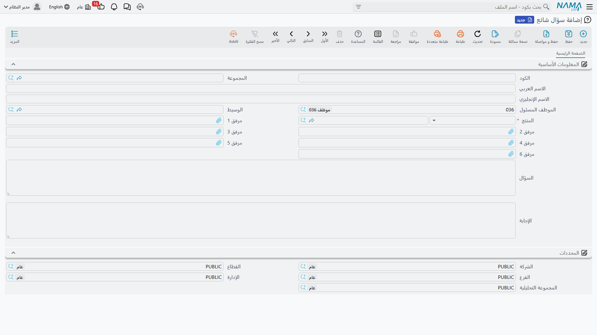

# الأسئلة الشائعة

**سؤال شائع / CRM FAQ** — `خدمة العملاء > الدعم > سؤال شائع`.

::: info الترخيص المطلوب
`crm`.
:::

كل مكتب دعم يلاحظ في النهاية أن الأسئلة الثلاثة نفسها تصل كل أسبوع، ويريد موضعاً يدوّن فيه الإجابات.
وملف الأسئلة الشائعة هو ذلك الموضع — قائمة سجلات سؤال وإجابة، كل منها مرتبط بمنتج، يملؤها موظف الدعم
كناتج جانبي لإغلاق طلب دعم.

وقبل أن تبني عليه شيئاً، كن على بيّنة من مداه.

::: warning هذا دفتر ملاحظات، لا قاعدة معرفة
لا يُظهر النظام مدخل سؤال شائع في أي مكان أبداً. فليس ثمّة **لوحة أسئلة شائعة على شاشة
[طلب الدعم](/ar/modules/crm/support/crm-trouble-tickets.md)**، ولا على
[الشكوى](/ar/modules/crm/support/crm-complaints.md)، ولا على تنفيذ الطلب؛ ولا اقتراح أثناء الكتابة، ولا
بحث في نصوص الأسئلة الشائعة من أي شاشة أخرى، ولا بوابة للعملاء. والسبيل الوحيد لقراءة مدخل هو فتح شاشة
قائمة الأسئلة الشائعة والبحث فيه.

اكتب هنا إن كان دفتر ملاحظات داخلي مشترك مفيداً لفريقك. ولا تَعِد بقاعدة معرفة للخدمة الذاتية، ولا تخطط
لعملية دعم تعتمد على أن يُعرض على الموظفين الجوابُ الصحيح تلقائياً — فلا شيء يفعل ذلك.
:::

## من أين يأتي السؤال الشائع

تستطيع إنشاءه من القائمة كأي سجل آخر، لكن الطريق المقصود هو زر
**تحويل إلي سؤال شائع / Convert To FAQ** على طلب الدعم. والقصة التي بُني لها تجري هكذا: يصل طلب، ويعمل
عليه الفنيون، ويكتبون ما فعلوه في ملاحظات تنفيذهم، ويُغلق الطلب — فيضغط الموظف زراً واحداً ليحوّل
الحادثة كلها إلى مدخل قابل لإعادة الاستعمال.

وضغط الزر يفعل هذا:

1. يفحص الطلب أولاً، ويرفض إن كان الطلب **بلا منتج** («يجب إدخال المنتج») أو **بلا وصف**
   («يجب إدخال وصف الطلب»).
2. يفتح سجل سؤال شائع **جديداً غير محفوظ**، منقولاً إليه **منتج** الطلب، ووصفُ الطلب سؤالاً، وملاحظات
   **كل تنفيذات** ذلك الطلب مجموعة وراء بعضها إجابةً، بدءاً من الأقدم.
3. تحرّره كما تريد ثم **تحفظه بنفسك**. فلا شيء يُحفظ عنك، ولا يُعلَّم الطلب ولا يُربط ولا يتغيّر بأي
   صورة — واضغط الزر مرتين تحصل على سجلين.

وهكذا وُلد في المثال المرجعي `FAQ-0031` (الوحدة لا تعمل بعد انقطاع التيار) من طلب الدعم `TKT-0451` على
وحدة السبليت في مارينا بلازا.

## الشاشة

صفحة واحدة.

| الحقل | ملاحظات |
|---|---|
| الكود والمجموعة والاسم العربي والاسم الإنجليزي | المجموعة الأساسية المعتادة. ولا يوجد حقل ملاحظات. |
| الموظف المسئول (Responsible Employee) | يُملأ بموظف مستخدمك عند الضغط على «جديد» — **دون شرط**، مهما قال إعداد *السماح بجعل القيمة الافتراضية للموظف بالمسئول بالحالي* [في الإعدادات](/ar/modules/crm/crm-configuration.md). فذلك الخيار تلتزم به شاشة خيط البيع وحدها. |
| الوسيط (Mediator) | اختياري. |
| المنتج (Product) | **إلزامي.** صنف مخزني أو وحدة تأجيرية. |
| مرفق 1 … مرفق 6 (Attachment 1 … 6) | ستة مواضع هنا بدل الخمسة المعتادة — متسع لصورة العطل أو لوحة توصيلات. |
| السؤال (**Criteria**) | **السؤال.** انظر التحذير أدناه. |
| الإجابة (**Result**) | **الإجابة.** |

ثم مجموعة **المحددات (Dimensions)**.

::: warning التسميتان الإنجليزيتان تقولان "Criteria" و"Result"
على الواجهة الإنجليزية يحمل الحقلان الكبيران أسفل الشاشة اسمَي **Criteria** و**Result**. وهما ليسا
معايير ولا نتيجة — بل هما **السؤال** و**الإجابة**، وهما الحقلان اللذان يملؤهما زر *تحويل إلي سؤال
شائع*. أما الواجهة العربية فتقرأ صحيحة: **السؤال** و**الإجابة**.

ولا خلل في البيانات؛ الخلل في التسميتين الإنجليزيتين وحدهما. أخبر بها الموظفين الجدد الذين يعملون
بالإنجليزية مرة واحدة، وإلا بحثوا عن حقل Question غير موجود.
:::

## إخراج المدخلات

تعرض شاشة قائمة الأسئلة الشائعة عمود **المنتج**، وتتيح الفلترة بالمنتج وبنص السؤال. وهذا — مع التصدير
إلى إكسل — كل قصة الاسترجاع. ولذا فالنصيحة العملية أن تجعل القائمة نفسها قابلة للقراءة:

- ضع ملخصاً قصيراً قابلاً للبحث في **الاسم العربي / الاسم الإنجليزي**. فهذا ما ستمرّ عليه عينك في
  القائمة، لا نص السؤال.
- اضبط **المنتج** دائماً، فهو الفلتر الوحيد الذي يتصرف كتصنيف.
- هذّب الإجابة التي ولّدها الزر. فملاحظات التنفيذ الخام تُقرأ كسجل عمل لا كإجابة، ولن يعيد أحد استعمالها
  على تلك الحال.

## التقارير

التقارير: لا شيء. لا تُشحن هذه الوحدة بأي تقارير نظام، ولا يوجد لهذه الشاشة نموذج طباعة.
