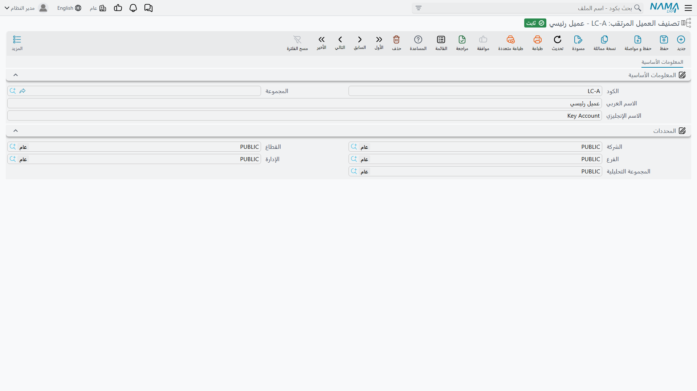

# ملفات التصنيف

::: info الترخيص المطلوب
`crm`.
:::

ست قوائم صغيرة تمنح الجانب البيعي من خدمة العملاء مفرداته: في أي مجال يعمل العميل المرتقب، وكم تُقدّر
قيمته، وأي نشاط مستحق بعد ذلك، ولماذا خسرته، وأي نوع من الحملات جاء به. وكلها قوائم مرجعية بسيطة — كود
واسمان، وأحياناً حقل إضافي واحد — ولا يفعل أي منها شيئاً بذاته.

والجدير بالمعرفة أنها تنقسم نصفين مختلفين تماماً. **ثلاثة منها جزء من آلة حالات حقيقية**: فكل
[مكالمة](/ar/modules/crm/activities/crm-calls.md) وكل [زيارة](/ar/modules/crm/activities/crm-visits.md)
تستطيع دفع قيمة جديدة من هذه القوائم إلى خيط البيع المسجَّلة عليه. **والثلاثة الأخرى مجرد تسميات** —
تختار واحدة عند إنشاء السجل ولا يغيّرها شيء بعد ذلك.

## الملفات الستة

| الملف | موضعه في القائمة | أين يُختار |
|---|---|---|
| **تصنيف العميل المرتقب (Lead Classification)** | الدعم | خيط البيع والفرصة؛ وزوج «الحالي / التحديث إلى» على المكالمات والزيارات |
| **نوع النشاط (Activity Type)** | الدعم | خيط البيع والفرصة؛ وزوج «الحالي / التالي» على المكالمات والزيارات |
| **سبب الرفض (Rejection Reason)** | الدعم | خيط البيع والفرصة؛ وزوج «الحالي / الجديد» على المكالمات والزيارات |
| **التصنيف الرئيسي (Main Category)** | الدعم | نوع النشاط — ولا شيء غيره |
| **مجال خيط البيع (CRM Industry)** | التسويق | خيط البيع والفرصة |
| **نوع حملة (Campaign Type)** | التسويق | الحملة |

وابنِها بهذا الترتيب، فالتبعية واحدة فقط: **التصنيف الرئيسي أولاً ثم نوع النشاط** (فكل نوع نشاط يشير
إلى تصنيف رئيسي). وما عدا ذلك مسطّح يُدخَل بأي ترتيب.

## الثلاثة التي تقودها المكالمات والزيارات

هذه هي الآلية الحيّة الوحيدة فعلاً في الملفات الأساسية لخدمة العملاء، ويسهل ألا تراها لأنها تعيش على
شاشتَي المكالمة والزيارة لا هنا.

فالمكالمة والزيارة تحملان حقولاً **مزدوجة**: الأول من كل زوج يقرأ قيمة خيط البيع الحالية، والثاني يقول
إلى ماذا ينبغي أن تصير:

| على المكالمة أو الزيارة | القراءة / الكتابة |
|---|---|
| تصنيف العميل الحالي (Current Lead Classification) | يُملأ من خيط البيع ما دام الحقل فارغاً |
| تحديث تصنيف العميل إلى (Update Lead Classification To) | يُكتب على خيط البيع عند الاعتماد |
| نوع النشاط الحالي (Current Activity Type) | يُملأ من خيط البيع ما دام الحقل فارغاً |
| نوع النشاط التالي (Next Activity Type) | يُكتب على خيط البيع عند الاعتماد |
| سبب الرفض الحالي (Current Rejection Reason) | يُملأ من خيط البيع ما دام الحقل فارغاً |
| سبب الرفض الجديد (New Rejection Reason) | يُكتب على خيط البيع عند الاعتماد |
| تغيير الحالة إلى (Change Status To) | يُكتب على خيط البيع عند الاعتماد |
| التاريخ المخطط لمعاودة الإتصال (Planned Re-Call Date) | يُكتب على خيط البيع عند الاعتماد |

ففي المثال المرجعي، تضع المكالمة `CALL-0342` يوم 14 يناير *تغيير الحالة إلى* = تم الأتصال، و*تحديث
تصنيف العميل إلى* = `LC-B` (عميل متوسط)، و*نوع النشاط التالي* = `AT-02` (زيارة موقع). وباعتماد
المكالمة يحمل خيط البيع `LD-00417` هذه القيم الثلاث. وبعد ثمانية أيام ترفع مكالمة المعاودة `CALL-0357`
التصنيف إلى `LC-A` (عميل كبير). ولم يفتح أحد خيط البيع؛ بل فعلته مستندات النشاط.

::: warning إلغاء المكالمة أو الزيارة لا يتراجع عما كتبته
الدفع إلى خيط البيع باتجاه واحد. فإن ألغيت `CALL-0357` ظل `LD-00417` محتفظاً بتصنيف `LC-A` وبالحالة
التي منحتها إياه المكالمة الملغاة. ولا بد أن يفتح أحدهم خيط البيع ويصححه يدوياً.
:::

أما **طلب الزيارة** فيحمل الحقول ذاتها تحته، لكنها ليست على شاشته وهو لا يدفع شيئاً إطلاقاً. المكالمات
والزيارات وحدها تفعل ذلك.

## الشاشات

أربعة من الستة في أبسط صور الملف الأساسي — **الكود والمجموعة والاسم العربي والاسم الإنجليزي** ثم
مجموعة **المحددات (Dimensions)**، بلا حقل ملاحظات:

- **تصنيف العميل المرتقب** و**سبب الرفض** و**التصنيف الرئيسي** — لا شيء غير ذلك البتة.
- **نوع النشاط** — حقل إضافي واحد، **التصنيف الرئيسي (Main Category)**.

وشاشة تصنيف العميل المرتقب تبيّن كم هي قليلة محتويات أحدها:

وملفا التسويق أوفر قليلاً. فـ**مجال خيط البيع** و**نوع حملة** يضيف كل منهما
**الموظف المسئول (Responsible Employee)** و**الوسيط (Mediator)** وحقل **ملاحظات** ممتداً.

::: warning الموظف المسئول يملأ نفسه مهما قالت الإعدادات
اضغط «جديد» على مجال أو نوع حملة فيُملأ الموظف المسئول بالموظف المرتبط بمستخدمك. ويحدث ذلك **دون شرط**.
و[إعداد خدمة العملاء](/ar/modules/crm/crm-configuration.md) المسمى *السماح بجعل القيمة الافتراضية
للموظف بالمسئول بالحالي* يبدو وكأنه يحكم هذا السلوك وهو لا يحكمه — فشاشة خيط البيع وحدها تلتزم به.
وإطفاؤه لا يغيّر هنا شيئاً.
:::

## التصنيف الرئيسي يصنّف شيئاً واحداً بالضبط

هو في القائمة مدخل رئيسي باسم طَموح، فيجدر قولها صريحة: **التصنيف الرئيسي هو مستوى التجميع فوق نوع
النشاط، ولا يجمّع سواه.** فلا خيط بيع ولا شكوى ولا مشكلة ولا حملة تشير إليه. وفي المثال المرجعي
`MCAT-01` (أنشطة ما قبل البيع) هو الأب لـ`AT-01` مكالمة متابعة و`AT-02` زيارة موقع و`AT-03` عرض فني،
وهذا كل عمله.

## تسميتان لا تطابقان ملفيهما

كلتاهما شكلية، لكنهما تُربكان من قيل له «املأ المجال» فلم يجد حقلاً بهذا الاسم.

- **مجال خيط البيع** يظهر في القائمة بهذا الاسم — لكن الحقل على شاشتَي خيط البيع والفرصة اسمه
  **المجال (Industry)**. الملف واحد والكلمتان مختلفتان.
- **نوع النشاط** اسمه كملف أساسي **نوع النشاط**، لكن حقله على شاشتَي خيط البيع والفرصة يقرأ
  **نوع النشاط للفرع** — ولا علاقة لأي شيء في هذا الملف بفرع.

## التقارير

التقارير: لا شيء. لا تُشحن هذه الوحدة بأي تقارير نظام، ولا يوجد لهذه الشاشة نموذج طباعة. وعدّ خيوط
البيع حسب المجال أو التصنيف عمل يتم بشاشة القائمة والتصدير إلى إكسل أو في BI.
