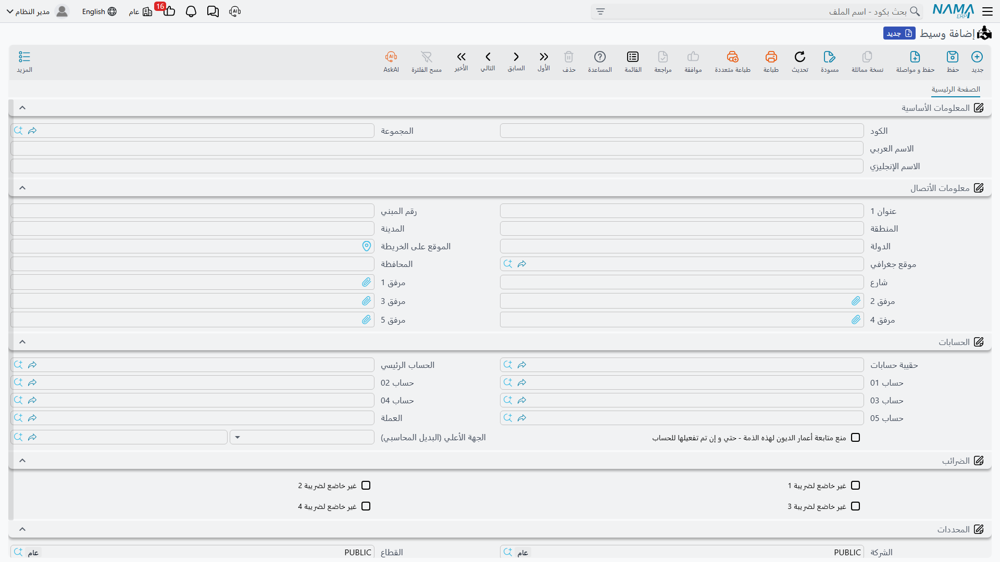

# الوسطاء والوكلاء

**وسيط / mediator** — `خدمة العملاء > الدعم > وسيط`.
**وكيل / Agent** — `خدمة العملاء > الدعم > وكيل`.

::: info الترخيص المطلوب
`crm`.
:::

قلّ أن تبيع محطة تكييف لفندق دون أن يكون بينك وبينه أحد. فمكتب استشاري يكتب المواصفات ويضعك في قائمة
المناقصة، ووكالة فنية في محافظة أخرى تحمل اسمك وتُغلق صفقات لم تزرها قط. ونما تحفظ الطرفين في وحدة
خدمة العملاء، في ملفين اسمهما **وسيط** و**وكيل**.

والبداية الصريحة هي هذه: **الملفان متطابقان**. الحقول نفسها، والشاشة نفسها، والمجموعات نفسها، بالترتيب
نفسه. ولا شيء في المنتج يمنعك من إدخال الشركة ذاتها في الاثنين، ولا شيء يخبرك أيهما كان المقصود. والفرق
الحقيقي الوحيد — وهو التمييز الوحيد الذي يفرضه المنتج فعلاً — هو *من أين يمكن اختيار كل منهما*.

## أيهما أستخدم؟

**الوسيط هو الحامل للثقل.** فحقل «الوسيط» موجود على نحو خمس وعشرين شاشة في الوحدة:
[خيوط البيع](/ar/modules/crm/sales-pipeline/crm-leads.md) و[الفرص](/ar/modules/crm/sales-pipeline/crm-potentials.md)،
و[المكالمات](/ar/modules/crm/activities/crm-calls.md) و[الزيارات](/ar/modules/crm/activities/crm-visits.md)،
وطلبات الزيارة، و[الحملات](/ar/modules/crm/marketing/crm-campaigns.md) وأنواعها،
و[الشكاوى](/ar/modules/crm/support/crm-complaints.md) وملفات أنواعها ومصادرها،
و[طلبات الدعم](/ar/modules/crm/support/crm-trouble-tickets.md) وتنفيذاتها ومتابعاتها، والمهام،
والمشروعات، والاستبيانات وقوالبها وأسئلتها، وخطط التسويق وخطط الأهداف،
و[الضمانات](/ar/modules/crm/master-files/crm-warranties.md)، و[الأسئلة الشائعة](/ar/modules/crm/master-files/crm-faq.md)،
والمجالات، و[عقد الخدمة](/ar/modules/crm/support/crm-service-contracts.md) في أربعة مواضع منفصلة.
فإن كنت ستعتني بأحد الملفين فاعتنِ بهذا.

**أما الوكيل فيصل إلى ثلاثة حقول في النظام كله**، وكلها على مستندات لا تلمسها أغلب المواقع: حقل
«الوكيل» على عقد خدمة العملاء، وحقل «الوكيل» الثاني في صفحة «تفاصيل عقد الصيانة» من العقد نفسه، وحقل
«الوكيل» على مشروع خدمة العملاء. فإن كنت لا تستخدم عقود الخدمة ولا مشروعات خدمة العملاء فلا موضع
لاختيار الوكيل أصلاً، ولا داعي لملء الملف.

وفي المثال المرجعي، `MED-07` **مكتب الرواد للاستشارات الهندسية** هو المكتب الذي عرّف النخبة على فنادق
مارينا بلازا، وهو محمول على خيط البيع وعلى عقد الخدمة وعلى كل ما بينهما. أما `AGT-02`
**وكالة الدلتا للخدمات الفنية** فموجودة فقط لأن عقد الخدمة فيه حقل لها.

## الشاشة

يفتح الملفان الصفحة الواحدة ذاتها.

### معلومات أساسية

| الحقل | ملاحظات |
|---|---|
| الكود (Code) | كود السجل. |
| المجموعة (Group) | شجرة المجموعات، إن كنت تستخدمها. |
| الاسم العربي (Name1) | الاسم بالعربية. |
| الاسم الإنجليزي (Name2) | الاسم بالإنجليزية. |

ولا يوجد حقل ملاحظات على أي من الشاشتين — فإن احتجت تدوين ملحوظة عن وسيط فمكانها الاسم أو مرفق.

### معلومات الاتصال

تسعة حقول عنوان وخمسة مرفقات، لا غير:

| الحقل | ملاحظات |
|---|---|
| عنوان 1، عنوان 2 (Address 1, Address 2) | نص حر. |
| شارع، المنطقة، منطقة جغرافيه، المدينة، المحافظة، الدولة (Street, Area, Region, City, State, Country) | تفصيل العنوان. |
| الموقع على الخريطة (Map Location) | إشارة على الخريطة. |
| مرفق 1 … مرفق 5 (Attachment 1 … 5) | ملفات تريد حفظها مع السجل. |

::: warning «معلومات الاتصال» تحوي عنواناً ولا شيء غيره
المجموعة اسمها **معلومات الاتصال / Contact Info**، ومع ذلك **لا يوجد فيها هاتف ولا محمول ولا فاكس ولا
بريد إلكتروني ولا موقع إلكتروني**. والسجل قادر على تخزينها جميعاً — لكنها ببساطة ليست على الشاشة كما
تُشحن.

ولهذا أثران يستحقان المعرفة قبل تخطيط بياناتك:

- لا يمكن كتابة هاتف الوسيط ولا بريده الإلكتروني إطلاقاً. ولا سبيل إليهما إلا باستيراد البيانات أو عبر
  خدمة ويب، أو بعد أن يضيف أحدهم هذه الحقول إلى تصميم الشاشة.
- حفظ الوسيط أو الوكيل يكتبه في فهرس معلومات الاتصال العام في النظام — ذاك الذي يتيح إيجاد طرف من بريده
  الإلكتروني. وبما أن حقل البريد خارج الشاشة، يُكتب هذا الفهرس فارغاً، فلا يظهر الوسيط بهذه الطريقة.
:::

### حافظة الحسابات والمحددات

يحمل الملفان مجموعة **حافظة الحسابات (Subsidiary Accounts)**، وكلاهما مسجّل كنوع ذمة محاسبية. أي أن
الوسيط أو الوكيل يمكن أن يكون طرفاً في قيد محاسبي تماماً كالعميل أو المورد — املأ هذه المجموعة إن كان
قسم الحسابات سيسجّل عليهما يوماً.

::: warning لا شيء في خدمة العملاء يسجّل على وسيط أو وكيل
ملء حافظة الحسابات يجعل الطرف *متاحاً* للمحاسبة، ولا يجعل خدمة العملاء تستخدمه. وعلى وجه الخصوص فإن
نسب حصة الوسيط وحصة الوكيل وحصة المركز الرئيسي على
[عقد الخدمة](/ar/modules/crm/support/crm-service-contracts.md) أرقام تُكتب بحرية: لا تُراجَع ولا تُجمَع
ولا تتحول إلى عمولة ولا إلى مستحق ولا تُعالَج في أي مكان. فإن كانت العمولات تهمّك فهي عمل محاسبي لا
عمل خدمة عملاء.
:::

وتنتهي الصفحة بمجموعة **المحددات (Dimensions)** المعتادة — الشركة والقطاع والفرع والإدارة ومجموعة
التحليل.

## الإعداد

لا ترتيب يُلتزم ولا خيار يُفعَّل. أنشئ الوسطاء الذين تعمل من خلالهم فعلاً، ومبكراً، لأن قدراً كبيراً من
الوحدة يشير إليهم؛ وأضف مجموعة الحسابات لمن تدفع لهم؛ ولا تنشئ سجلات وكلاء إلا إذا بلغت مرحلة استخدام
عقود الخدمة أو مشروعات خدمة العملاء.

ولا تملأ أي من الشاشتين شيئاً لك عند الضغط على «جديد»، ولا تتحقق أي منهما من شيء عند الحفظ سوى الكود.

## التقارير

التقارير: لا شيء. لا تُشحن هذه الوحدة بأي تقارير نظام، ولا يوجد لهذه الشاشة نموذج طباعة. ولإخراج قائمة
بالوسطاء أو الوكلاء استخدم فلاتر شاشة القائمة والتصدير إلى إكسل، أو ابنِ ما تحتاجه في BI.
