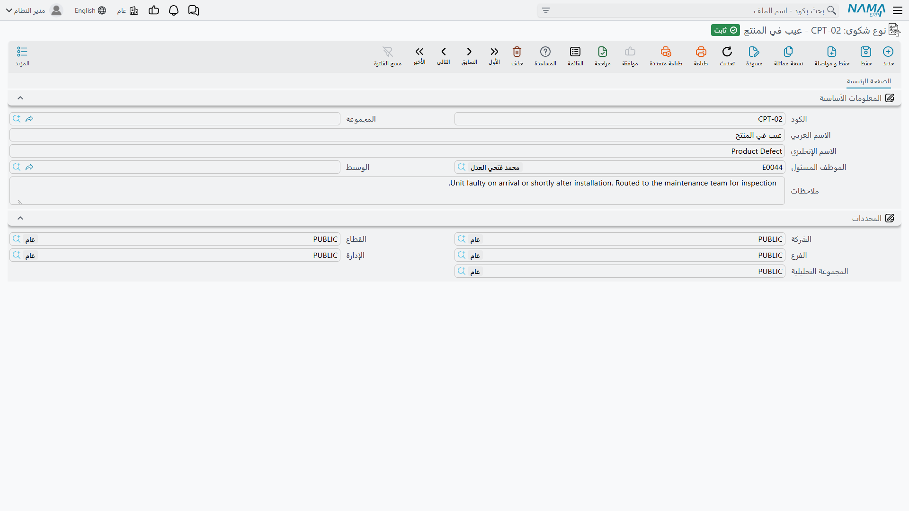

# كتالوجات المشكلات والشكاوى

::: info الترخيص المطلوب
`crm`.
:::

حين يتصل عميل ليقول إن وحدة توقفت عن العمل، على من يتلقى المكالمة أن يسجّل أمرين مختلفين: *كيف وصلتنا
الشكوى وما نوعها*، و*ما العطل فعلاً*. وأربعة ملفات أساسية تغطي هذين السؤالين — نوع شكوى ومصدر شكوى
للأول، وتصنيف مشكله ومشكلة شائعة للثاني.

::: info هذه الأربعة تخدم الشكاوى وحدها
كل واحد منها تقرؤه شاشة [الشكوى](/ar/modules/crm/support/crm-complaints.md) ولا يقرؤه سواها. فـ
[طلب الدعم](/ar/modules/crm/support/crm-trouble-tickets.md) لا كتالوج مشكلات له إطلاقاً، ونصف صيانة
الآلات من الوحدة يحتفظ بمفرداته **الخاصة** للأعطال — الأعطال ومستويات الصعوبة وأوصاف الأعطال — في
[كتالوجات الأعطال](/ar/modules/crm/maintenance-setup/crm-fault-catalogues.md). والمجموعتان لا تقرأ
إحداهما الأخرى. فالمشكلة التي تعرّفها هنا لا يمكن اختيارها على أمر صيانة، والعطل المعرّف هناك لا يمكن
اختياره على شكوى. فإن احتاج عملك الاثنين فتوقّع صيانة الاثنين.
:::

## الملفات الأربعة

| الملف | القائمة | أين يُختار |
|---|---|---|
| **نوع شكوى (Complaint Type)** | الدعم | حقل «نوع الشكوي» على الشكوى |
| **مصدر شكوى (Complaint Source)** | الدعم | حقل «مصدر الشكوي» على الشكوى |
| **تصنيف مشكله (Problem Classification)** | الدعم | ملف المشكلة، وعمود التصنيف في جدول مشكلات الشكوى |
| **مشكلة شائعة (Problem)** | الدعم | عمود المشكلة في جدول مشكلات الشكوى |

والقيد الوحيد على الترتيب: **تصنيف المشكلة قبل المشكلة**، لأن كل مشكلة تسمّي التصنيف الذي تنتمي إليه.
وفي المثال المرجعي يُنشأ `PCL-02` (أعطال كهربائية) أولاً، ثم تُدرج `PRB-11` (الوحدة لا تعمل) تحته. ثم
تحمل الشكوى `CMPL-0207` نوع الشكوى `CTY-02` (عطل فني) ومصدرها `CSR-01` (مكالمة هاتفية)، وسطر مشكلة
واحداً يشير إلى `PCL-02` / `PRB-11`.

## الشاشات

**نوع شكوى** و**مصدر شكوى** هما الشاشة نفسها مرتين: **الكود والمجموعة والاسم العربي والاسم الإنجليزي
والموظف المسئول (Responsible Employee) والوسيط (Mediator) والملاحظات**، ثم مجموعة
**المحددات (Dimensions)**.

وكلاهما يملأ الموظف المسئول بموظف مستخدمك لحظة الضغط على «جديد»، ويفعلها **دون شرط** — فإعداد *السماح
بجعل القيمة الافتراضية للموظف بالمسئول بالحالي* [في الإعدادات](/ar/modules/crm/crm-configuration.md) لا
يحكم هاتين الشاشتين، بل شاشة خيط البيع وحدها.

و**مشكلة شائعة** تحمل **الكود والمجموعة والاسم العربي والاسم الإنجليزي** وحقلاً إضافياً واحداً هو
**تصنيف المشكله (Problem Classification)**، ثم المحددات. أما **تصنيف مشكله** فيحمل الحقول الأساسية
الأربعة لا غير. وليس لأي منهما حقل ملاحظات، ولا يملأ أي منهما شيئاً لك.

## كيف تصيب الحقل الصحيح على شاشة الشكوى

هنا يقع اللبس الذي يولّد اتصالات الدعم، فلنكن دقيقين. تعرض شاشة الشكوى **أربعة** حقول تتداخل أسماؤها
تداخلاً شبه تام، واثنان منها فقط تغذّيهما ملفات هذه الصفحة:

| الحقل على الشكوى | ما هو |
|---|---|
| **النوع (Type)** | قائمة نظام ثابتة — شكوي، اقتراح، ملاحظة. ليست ملفاً أساسياً ولا يمكنك الإضافة إليها. |
| **نوع الشكوي (Complaint Type)** | قائمتك **أنت**، من ملف نوع شكوى. |
| **المصدر (Source)** | قائمة نظام ثابتة — فاتورة مبيعات أو عقد خدمة. ليست ملفاً أساسياً. وهي التي تقرر ما يبحث فيه زر بحث الفواتير على الشكوى، وقيمتها الابتدائية تأتي من إعدادات خدمة العملاء. |
| **مصدر الشكوي (Complaint Source)** | قائمتك **أنت**، من ملف مصدر شكوى. |

فـ«النوع» و«المصدر» سلوك نظام، و«نوع الشكوي» و«مصدر الشكوي» مفرداتك أنت ولا تقودان شيئاً سوى أن
تُسجَّلا ويمكن العدّ عليهما.

## جدول المشكلات

للشكوى جدول للأعطال المبلَّغ عنها في المكالمة. ويأخذ كل سطر **تصنيف مشكله** و**مشكلة شائعة**، ووصفاً
حراً لما قاله العميل فعلاً.

والعمودان يتعاونان: اختر التصنيف على سطر فيضيق منتقي المشكلة على السطر نفسه ليعرض مشكلات ذلك التصنيف
وحدها. وهذا كل سلوك هذين الملفين. فاختيار مشكلة لا يسعّر شيئاً ولا يوجّه شيئاً ولا يقترح حلاً ولا ينشئ
مستنداً — إنما يسجّل ما كان معطلاً، بألفاظ اتفق عليها فريقك سلفاً، حتى يمكن عدّ شهر من الشكاوى بالسبب
بدل قراءتها واحدة واحدة.

ولهذا السبب بالضبط أبقِ القوائم قصيرة. فقائمة مشكلات فيها مئتا مدخل شبه متكرر لا تعطيك بصيرة أكثر مما
يعطيه النص الحر.

## التقارير

التقارير: لا شيء. لا تُشحن هذه الوحدة بأي تقارير نظام، ولا يوجد لهذه الشاشة نموذج طباعة. وعدّ الشكاوى
بالنوع أو المصدر أو المشكلة يتم من فلاتر شاشة قائمة الشكاوى والتصدير إلى إكسل، أو في BI.
