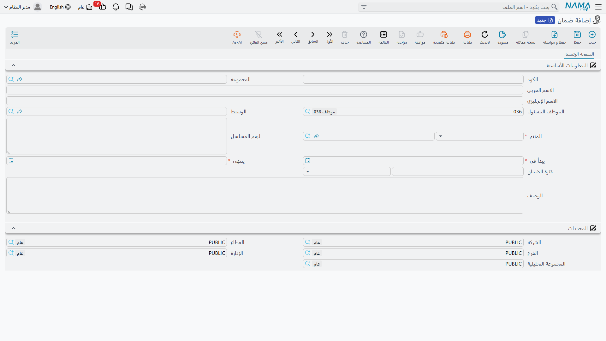

# الضمانات

**ضمان / CRM Warranty** — `خدمة العملاء > الدعم > ضمان`.

::: info الترخيص المطلوب
`crm`.
:::

الضمان في خدمة العملاء سجل صغير يقول: *هذا المنتج، وربما هذا الرقم المسلسل، في الضمان بين هذين
التاريخين*. سجل لكل ضمان. وهو موجود لسبب واحد بعينه: أنه حين يفتح موظف الدعم
[طلب دعم](/ar/modules/crm/support/crm-trouble-tickets.md) عن ذلك المنتج، يُظهر له الطلب ما إذا كان ثمّة
ضمان سارٍ.

وهذه الجملة الواحدة هي أيضاً كل ما يفعله، وبقية هذه الصفحة في معظمها عن مدى ضيق ذلك. اقرأ صندوق الخطر
أدناه قبل أن تبني شيئاً على هذا الملف.

## الشاشة

صفحة واحدة. وكل ما فيها يُكتب باليد.

| الحقل | ملاحظات |
|---|---|
| الكود والمجموعة والاسم العربي والاسم الإنجليزي | المجموعة الأساسية المعتادة. |
| الموظف المسئول (Responsible Employee) | يُملأ بموظف مستخدمك عند الضغط على «جديد» — **دون شرط**، مهما قال إعداد *السماح بجعل القيمة الافتراضية للموظف بالمسئول بالحالي* [في الإعدادات](/ar/modules/crm/crm-configuration.md). فذلك الخيار تلتزم به شاشة خيط البيع وحدها. |
| الوسيط (Mediator) | اختياري. |
| المنتج (Product) | **إلزامي.** صنف مخزني أو وحدة تأجيرية. |
| الرقم المسلسل (Serial Number) | الوحدة بعينها، حين يكون المنتج متتبَّعاً بمسلسل. |
| يبدأ في (Start In) | **إلزامي.** |
| ينتهى (End In) | **إلزامي.** |
| فترة الضمان (Warranty Period) | مدة زمنية — رقم ووحدة قياس. |
| الوصف (Description) | حقل الملاحظات. وهو معنون **الوصف** لا «ملاحظات»، على هذه الشاشة وحدها. |

ثم مجموعة **المحددات (Dimensions)**.

وشاشة القائمة تعرض المنتج والرقم المسلسل وتتيح الفلترة بالمنتج.

### التواريخ والمدة يملأ بعضها بعضاً

لست مضطراً لحساب القيمة الثالثة بنفسك. اكتب أي اثنين من **يبدأ في** و**ينتهى** و**فترة الضمان** فتوفّر
الشاشة الناقص:

- اكتب **يبدأ في** و«ينتهى» موجود سلفاً ← تُحسب **فترة الضمان** من الفارق.
- اكتب **يبدأ في** و«ينتهى» فارغ والمدة موجودة ← **ينتهى** = يبدأ في + المدة.
- اكتب **ينتهى** و«يبدأ في» موجود سلفاً ← تُحسب **فترة الضمان** من الفارق.
- اكتب **ينتهى** و«يبدأ في» فارغ والمدة موجودة ← يُحسب **يبدأ في** رجوعاً للخلف.
- غيّر **فترة الضمان** و«يبدأ في» موجود ← يُعاد حساب **ينتهى**.

::: tip راجع التاريخ حين يُحسب رجوعاً
ملء «ينتهى» أولاً وترك النظام يستخرج «يبدأ في» هو الاتجاه الوحيد غير المراعي للتقويم: فهو يقيس المدة
بوحدات ثابتة الطول لا بأشهر حقيقية، فقد يقع ضمان «شهر واحد» على بُعد يوم أو يومين مما توقعت. ألقِ نظرة
على «يبدأ في» الذي أنتجه قبل الحفظ.
:::

### الرقم المسلسل يُفعّل ويُعطّل نفسه

يتبع حقل الرقم المسلسل المنتج الذي اخترته. اختر صنفاً مخزنياً متتبَّعاً بمسلسل فيصير الحقل مفعّلاً.
واختر صنفاً غير متتبَّع فيُمسح ما كُتب فيه. واختر وحدة تأجيرية فيصير باهتاً — إذ لا مسلسلات للوحدات
التأجيرية.

### ما لا يُتحقَّق منه

قاعدة واحدة تُفرض عند الحفظ: **«يبدأ في» لا يجوز أن يكون بعد «ينتهى»**، وتُبرز الشاشة التاريخين معاً إن
حدث. و**لا يوجد تحقق من التفرد ولا من التداخل** — فضمانان يغطيان المنتج نفسه والمسلسل نفسه والتواريخ
نفسها يُحفظان دون اعتراض، ثم يطابقان طلب الدعم نفسه.

## ما يفعله الضمان فعلاً — وما لا يفعله

يحمل طلب الدعم حقلين للقراءة فقط، **نوع التغطيه (Covering Type)** و**سند التغطية (Covering Document)**،
يُعاد حسابهما كلما فُتح الطلب. يبحثان عن سطر
[عقد خدمة](/ar/modules/crm/support/crm-service-contracts.md) أولاً ثم عن ضمان ثانياً، ويعلنان
*مغطي بعقد خدمة* أو *في فترة الضمان* أو *غير مغطي*. **والعقد يغلب الضمان دائماً.**

وفي المثال المرجعي يغطي `WR-00219` الصنف `AC-SPL-24` بمسلسل `SPL24-2025-11-0783` من 2025-11-18 إلى
2026-11-18. وطلب الدعم `TKT-0451` المفتوح في 2026-04-06 على تلك الوحدة بعينها يقع داخل المدة — ومع ذلك
يعلن **مغطي بعقد خدمة**، لأن `CSC-0044` يغطي المسلسل نفسه والعقود تغلب. ولولا وجود العقد لقرأ الطلب
*في فترة الضمان* وأشار إلى `WR-00219`.

::: danger التغطية للعرض فقط، وهي لا تنظر إلى العميل إطلاقاً
هذه أهم حقيقة في سجل ضمانات خدمة العملاء، وهي تفاجئ الجميع.

**ما تستخدمه المطابقة:** **منتج** الطلب، و**الرقم المسلسل** للطلب *فقط إن كان الطلب يحمل واحداً*،
و**تاريخ الطلب** واقعاً بين **يبدأ في** و**ينتهى** في السجل.

**وما تتجاهله المطابقة:** **العميل** — فضمان أو عقد أي عميل يغطي طلب أي عميل آخر؛ و**حالة العقد**، فعقد
ملغى أو منتهٍ أو مجدَّد ما زال يغطي؛ وما إذا كان العقد قد اعتُمد أصلاً، فالمسودّات تغطي؛ وتمديد التجميد،
فقد تعرض الشاشة تاريخ نهاية أبعد مما تختبره التغطية؛ وكل المحددات — فالشركة والفرع والقطاع ليست جزءاً
من المطابقة.

**وما تفعله التغطية:** لا شيء سوى العرض. فلا قاعدة ترفض تحصيل قيمة، ولا تغيّر سعراً، ولا تمنع تغيير
حالة، ولا تنتج مستنداً مختلفاً لأن الطلب قال *في فترة الضمان*. ولا يوجد على طلب الدعم توجيه مستند يمكن
أن يتفاعل معها. وقرار مجانية الإصلاح من عدمها قرار يتخذه موظفك ويسجّله بيده.

**والتعليمة العملية:** املأ **الرقم المسلسل** دائماً على الأصناف المتتبَّعة بمسلسل. فالضمان المسجَّل على
منتج مع ترك المسلسل فارغاً سيطابق **كل طلب دعم يُفتح على ذلك المنتج، لأي عميل، وفي أي فرع**، وسيُعرض
عليهم جميعاً بوصفه ضمانهم.
:::

## هناك نظاما ضمان، وهما غريبان عن بعضهما

تتكرر كلمة «ضمان» في أكثر من موضع في هذه الوحدة، والمواضع لا يكلّم بعضها بعضاً.

- **السجل الذي في هذه الصفحة** يقرؤه طلب الدعم، ولا يقرؤه سواه.
- **وسويّة صيانة الآلات لها نظامها الخاص**: أنواع فترات ضمان مسمّاة، وتاريخا بداية ونهاية ضمان على
  [ملف الآلة](/ar/modules/crm/maintenance-setup/crm-machines.md)، وسجل ضمانات أعطال تكتبه أوامر الصيانة
  وتقرؤه من جديد. وذلك النظام يعمل فعلاً — وهو لا ينظر أبداً إلى ضمان خدمة العملاء، وطلب الدعم لا ينظر
  إليه أبداً.
- ولشاشة [الشكوى](/ar/modules/crm/support/crm-complaints.md) حقلا *مدة الضمان* و*تاريخ نهاية الضمان*
  الخاصان بها، يُملآن من بحث الفاتورة. وهما ملاحظتان على تلك الشكوى؛ ولا يقرؤهما شيء كذلك.
- ولسطر [عقد الخدمة](/ar/modules/crm/support/crm-service-contracts.md) تاريخا بداية ونهاية خاصان به،
  وهما ما يفضّله فحص التغطية على طلب الدعم.

فإصلاح آلة بأمر صيانة **لا** يجعل طلب دعم يقول *في فترة الضمان*، وتسجيل ضمان في خدمة العملاء **لا**
يظهر في أي من مستندات الصيانة. والموقع الذي يستخدم نصفَي الوحدة عليه إدخال بيانات ضماناته مرتين، في
شاشتين لا صلة بينهما، بشكلين مختلفين.

## الإعداد

أنشئ سجلاً لكل ضمان تريد أن يراه الموظف: المنتج، والمسلسل إن وُجد، والتاريخين، ووصفاً يقرؤه إنسان بلمحة.
واحتفظ بها للمنتجات التي يتلقى مكتب دعمك اتصالات عنها فعلاً — فالسجل الذي يغطي كل ما بعته يوماً سجل لا
يثق به أحد، خصوصاً أن المدخل بلا مسلسل يطابق كل عميل.

## التقارير

التقارير: لا شيء. لا تُشحن هذه الوحدة بأي تقارير نظام، ولا يوجد لهذه الشاشة نموذج طباعة. والضمانات
المشارفة على الانتهاء تُستخرج من شاشة القائمة والتصدير إلى إكسل أو من BI — فليس في الوحدة كلها منبّه
انتهاء ولا تذكير ولا إشعار.
