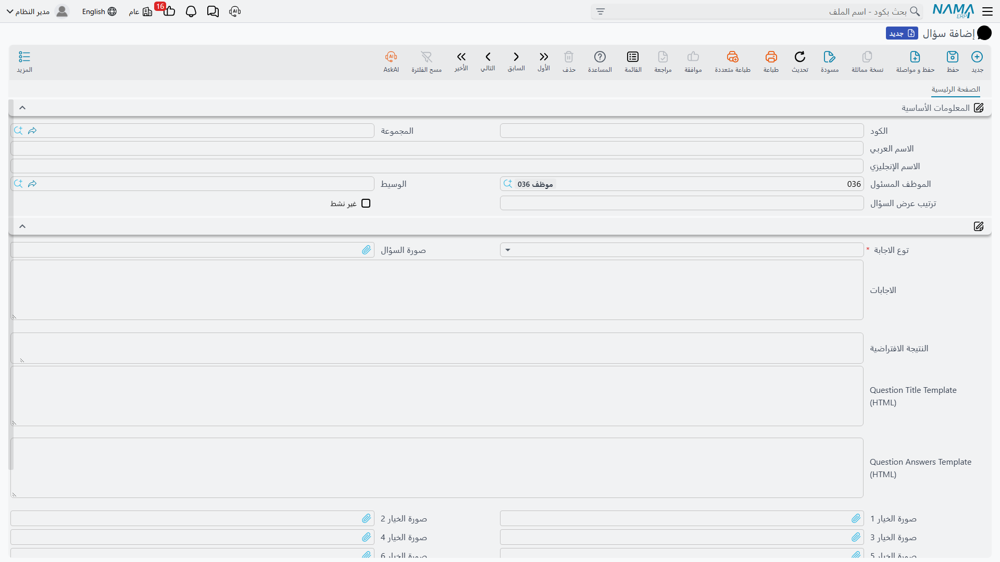
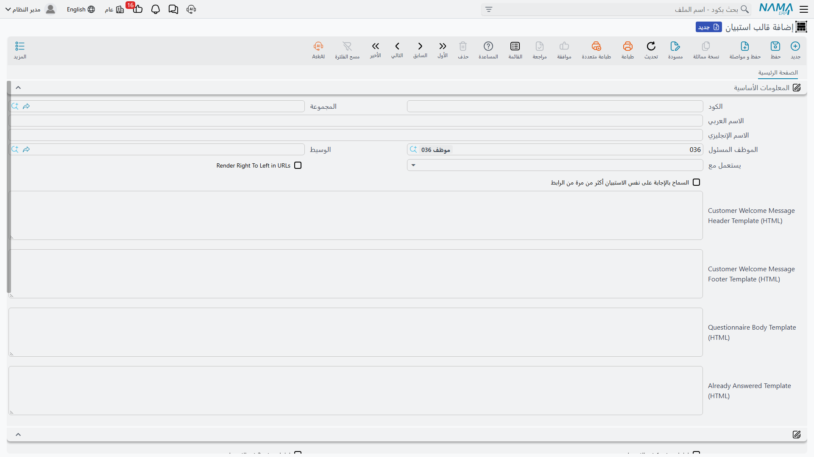

# قوالب الاستبيان والأسئلة (Questionair Template)

بعد أسبوعين من صيانة النخبة لوحدات تبريد أحد العملاء، يتصل أحدهم بالعميل ويسأله أربعة أسئلة: هل جاء
الفنيون في موعدهم، وهل شُرح العمل، وكيف تقيّم الخدمة من عشرة، وهل تحب أن نتصل بك مرة أخرى. أربعة
أسئلة تُطرح بالطريقة نفسها في كل مرة، وتُحفظ إجاباتها حيث يجدها الجميع.

بناء ذلك الاستبيان يحتاج شاشتين. ملف **سؤال (Question)** مكتبة أسئلة مفردة تُكتب مرة وتُعاد
استعمالها. و**قالب استبيان (Questionair Template)** هو الاستبيان نفسه: قائمة مرتبة بالأسئلة، ومعها
الإعدادات التي تحكم شكل الاستبيان حين يُرسل كرابط على الويب. أما الشاشة الثالثة —
[الاستبيان](/ar/modules/crm/questionnaires/crm-questionnaires.md) نفسه — فهي إجابات مجيب واحد، ولها
صفحتها الخاصة.

::: info الترخيص المطلوب
`crm`
:::

| الشاشة | مكانها |
|---|---|
| سؤال | خدمة العملاء > استبيانات > سؤال |
| قالب استبيان | خدمة العملاء > استبيانات > قالب استبيان |

## مكتبة الأسئلة

السؤال ملف رئيسي صغير. **اسمه العربي** هو نص السؤال كما يراه المجيب افتراضيًا، ومعه الاسم
الإنجليزي، إضافة إلى الكود والمجموعة والموظف المسئول والوسيط المعتادة.

وقلبه حقل **توع الاجابة (Response Type)** — وهو إجباري، ولاحظ أن عنوانه العربي مكتوب هكذا بخطأ
إملائي في الشاشة، وصوابه «نوع الإجابة» — ويعرض أربعة اختيارات لا خامس لها:

| نوع الإجابة | ما يحصل عليه المجيب | أين تُخزَّن الإجابة |
|---|---|---|
| نصي (Text) | مربع نص حر | عمود الإجابة النصية |
| اختيار (Choices) | قائمة منسدلة بالخيارات التي سردتها | عمود الإجابة النصية |
| رقم (Number) | مربع رقمي | عمود الإجابة الرقمية |
| تاريخ (Date) | مربع تاريخ | عمود الإجابة التاريخية |

ولسؤال من نوع «اختيار» اكتب الخيارات في مربع **الاجابات (Answers)** — **خيارًا في كل سطر**. فكتابة
«ممتاز» و«جيد» و«مقبول» و«ضعيف» في أربعة أسطر تصير قائمة منسدلة بأربعة خيارات.

ويحمل مربع **النتيجة الافتراضية (Default Answer)** قيمة تُنسخ إلى عمود الإجابة كلما أُضيف هذا السؤال
إلى استبيان. وتُقرأ حسب نوع الإجابة، فافتراضي السؤال الرقمي لا بد أن يكون رقمًا، وافتراضي السؤال
التاريخي تاريخًا.

::: tip لا يوجد مقياس تقييم ولا اختيار متعدد
هذا أول توقع يجب تصحيحه. لا يوجد نوع تقييم، ولا مقياس نجوم، ولا شريط تدريج، ولا مصفوفة، ولا سؤال
بإجابات متعددة. فسؤال «قيّمنا من عشرة» سؤال **رقمي**، أو سؤال **اختيار** بعشرة أسطر — والقائمة
المنسدلة تقبل إجابة **واحدة** فقط.

ولا يوجد كذلك وزن ولا قيمة خلف الخيار. فـ«ممتاز» نص لا رقم ٥، ولذلك **لا شيء في الموديول يستطيع
تقييم استبيان بدرجة.** فإن أردت درجة فاطلب رقمًا واجمع الأرقام بنفسك خارج النظام.
:::

::: warning اترك مربع *Question Answers Template (HTML)* فارغًا
يحمل السؤال مربعي HTML للمواقع التي تريد التحكم في رسم السؤال على نموذج الويب. ومربع
*Question Title Template (HTML)* يعمل — فهو يستبدل نص السؤال المعروض.

أما *Question Answers Template (HTML)* فلا يعمل. فملؤه يجعل نموذج الويب يطبع عنوان السؤال مرة ثانية
ولا يُخرج **أي مربع إجابة** لذلك السؤال، فيصير السؤال غير قابل للإجابة من الرابط. وإن كان مربع
العنوان فارغًا كذلك فالصفحة تفشل تمامًا. اترك هذا المربع فارغًا في كل سؤال.
:::

::: warning حقول الصور والترتيب تخص تطبيق جوال منفصل
تعرض شاشة السؤال *صورة السؤال*، وسبع خانات *صورة الخيار*، ومربع *ترتيب عرض السؤال*. ولا يقرأ هذه
الحقول إلا تطبيق جوال منفصل. **وهي لا تُرسم في أي مكان داخل النظام ولا في استبيان الويب**، ورقم
ترتيب العرض لا يُطبَّق أبدًا — فسطور الاستبيان تخرج دائمًا بالترتيب الذي يسرده القالب.

كما تحمل صور الخيارات تحققًا يوقع الناس في الحيرة: املأ **صورة خيار واحدة** في سؤال اختيار، فيرفض
السجل الحفظ حتى يتساوى عدد الصور مع عدد أسطر الخيارات تمامًا. وبما أن الصور لا تُعرض أصلًا، فأبسط
نصيحة أن تترك خانات الصور الثماني فارغة كلها.
:::

وأمر صغير أخير: علامة **غير نشط (Inactive)** لا أثر لها داخل النظام. فوضعها لا يزيل السؤال من قائمة
الاختيار في سطر قالب جديد، ولا يزيله من القوالب أو الاستبيانات التي تستعمله بالفعل. ولإحالة سؤال إلى
التقاعد أخرجه من القوالب.

## القالب — الاستبيان نفسه

القالب هو الاستبيان: كود، واسم عربي وإنجليزي، وبضعة إعدادات، وجدول أسئلة.

**جدول التفاصيل.** سطر لكل سؤال، بالترتيب الذي تريد طرحه به. ولا يجوز تكرار السؤال نفسه — فترفض
الشاشة الحفظ وتشير إلى السطر المخالف. وفي السطر كذلك خمسة أعمدة وصف حر لا يقرؤها شيء؛ تجاهلها.

::: tip عنوان العمود الإنجليزي يقول «Criteria»
في جدول أسئلة القالب وجدول إجابات الاستبيان معًا، يقرأ العنوان الإنجليزي لعمود السؤال **«Criteria»**.
وهو عمود السؤال لا غير؛ والعنوان العربي (السؤال) صحيح. ونذكره هنا لتجد العمود لا لتستعمل الكلمة.
:::

ويحدد **يستعمل مع (Used With)** أين يمكن اختيار القالب: *الاتصالات فقط*، أو *الاستبيانات فقط*، أو
*أى منهما*. وتركه فارغًا يعني كليهما. وهو يفلتر قائمة اختيار القالب في شاشة
[الاستبيان](/ar/modules/crm/questionnaires/crm-questionnaires.md) وفي شاشة
[الاتصال](/ar/modules/crm/activities/crm-calls.md).

::: warning الاستبيان وحده هو الذي يبني ورقة إجابات من القالب
اختيار قالب في **الاستبيان** ينشئ سطر إجابة لكل سؤال في القالب. أما اختيار قالب في **الاتصال** فلا
ينشئ شيئًا — إذ يبقى جدول الإجابات في الاتصال كما هو، وتُكتب سطوره باليد. فلا تخطط لمسار عمل من نوع
«كتابة نص المكالمة من قالب»؛ فمربع القالب في الاتصال يسجل اختيارًا ليس إلا.
:::

### إعدادات لا تؤثر إلا في رابط الويب العام

بقية الإعدادات لا تهم إلا حين يُجاب الاستبيان من رابط ويب بدل أن يكتبه موظفوك. وهذه القناة وشرطها
الوحيد موصوفان في صفحة [الاستبيانات](/ar/modules/crm/questionnaires/crm-questionnaires.md).

- **Render Right To Left in URLs** — يرسم صفحة الويب من اليمين إلى اليسار ويكتب عناوين خانات الرفع
  فيها بالعربية. ضع علامته للاستبيانات العربية. (العنوان نفسه إنجليزي في الشاشة العربية، وكذلك
  مربعات HTML الأربعة تحته.)
- **Customer Welcome Message Header/Footer Template (HTML)** — كود HTML حر يُعرض فوق الأسئلة وتحتها.
  هنا يوضع الشعار وعبارة الترحيب وسطر الشكر.
- **Questionnaire Body Template (HTML)** — إن ملأته **حلّ محل الصفحة المولَّدة كلها**. واتركه فارغًا
  فيبني لك النظام نموذجًا قياسيًا نظيفًا؛ وهذا هو الاختيار الصحيح ما لم يكن هناك من يتعهد كود الـHTML
  بالصيانة.
- **Already Answered Template (HTML)** — انظر التنبيه أدناه.
- **اظهار مرفق N في الاستبيان**، ثماني علامات. كل خانة تضع عليها علامة تضيف مربع رفع ملف إلى نموذج
  الويب، ويهبط الملف المرفوع في خانة المرفق المقابلة في مستند الاستبيان. وحد الملف ٢٠ ميجابايت.

::: warning «السماح بالإجابة أكثر من مرة» وصفحة «تمت الإجابة من قبل»
يبدو خيار **السماح بالإجابة على نفس الاستبيان أكثر من مرة من الرابط** ضابطًا لتكرار الإجابات. وهو
ليس كذلك. فهو لا يقرر إلا ما **يراه** المجيب حين يعيد فتح رابطًا استعمله من قبل؛ أما النموذج الذي
يُرسل مرة ثانية — رجوع وإعادة إرسال في المتصفح، أو تحديث للصفحة، أو إرسال آلي — فإنه **يستبدل
الإجابات المخزنة بغض النظر عن هذا الإعداد**. فلا تصف استبيانًا أبدًا بأنه محمي من تكرار الإجابات.

وصفحة «تمت الإجابة من قبل» التي ينتجها غير موثوقة في ذاتها: فالقالب الذي مُلئ فيه
*Already Answered Template (HTML)* يعرض رسالة النظام المدمجة بدل رسالتك، والقالب الذي تُرك فيه فارغًا
يعرض كتلة فارغة قد تفشل تمامًا.

ولأن الإعداد لا يحمي شيئًا والصفحة التي يحرسها غير موثوقة، فالنصيحة العملية أن **تضع علامة «السماح
بالإجابة أكثر من مرة»** وتتعامل مع تكرار الإجابات كأمر تلاحظه بالنظر — فالاستبيان يسجّل تاريخ
الإجابة من الرابط، فتظهر الإجابة الثانية في السجل.
:::

::: tip ابنِ القالب قبل الاستبيانات التي تستعمله
ينسخ الاستبيان أسئلة القالب إلى جدول إجاباته لحظة اختيارك للقالب. وإضافة سؤال إلى القالب بعد ذلك
**لا تصل** إلى الاستبيانات المنشأة من قبل — فهي تحتفظ بالقائمة التي بُنيت بها. أكمل القالب أولًا ثم
ابدأ الإرسال.
:::

::: info التقارير
التقارير: لا يوجد. لا يشحن هذا الموديول أي تقارير نظام، وليس لهاتين الشاشتين نموذج طباعة.
:::
