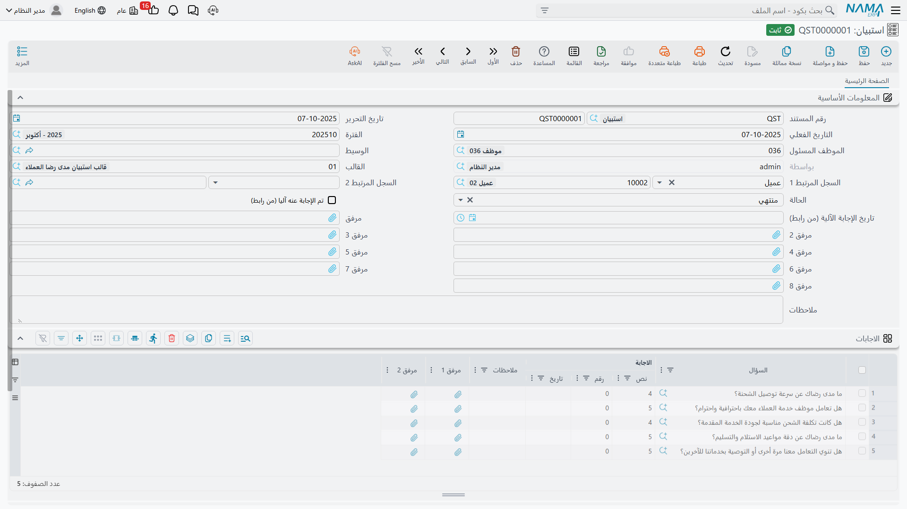

# استبيانات خدمة العملاء (Questionair)

القالب هو الاستبيان، و**الاستبيان (Questionair)** نسخة واحدة منه مملوءة. مجيب واحد، ومستند واحد،
ومجموعة إجابات واحدة. فإن سألت مائتي عميل عن مستوى الخدمة صار عندك مائتا استبيان.

يستحق هذا التصميم أن يُفهم مبكرًا، لأنه يحدد كل ما تبقى في هذه الصفحة — كيف تُجمع الإجابات، وكيف
تُقرأ بعد ذلك. أما جمعها فيعمل جيدًا. وأما قراءتها فهنا تقف هذه الخاصية، والصورة الصادقة عن ذلك هي
أنفع ما في هذه الصفحة.

::: info الترخيص المطلوب
`crm`
:::

| الشاشة | مكانها |
|---|---|
| استبيان | خدمة العملاء > استبيانات > استبيان |

وخلافًا لشاشات التسويق، الاستبيان **مستند** حقًا: يأخذ دفتر مستندات ورقم مستند، وله تاريخ إصدار
وتاريخ استحقاق وفترة مالية. ولا يحتاج **توجيه مستند**، وليس له أثر محاسبي ولا مخزني، ولا يولّد شيئًا.

## إنشاؤه وتعبئته

هناك طريقان للدخول. أولهما المباشر: مدخل القائمة أعلاه. وثانيهما الأيسر: إجراء **إنشاء استبيان
(Create Questionair)** الذي يظهر في قائمة *المزيد* في شاشات أخرى — عميل، أو خيط بيع، أو طلب دعم —
فيفتح استبيانًا جديدًا وقد وُضع فيه السجل في *السجل المرتبط 1*، ووُضع عميل السجل أو مورده في *السجل
المرتبط 2*. وتكسب تلك الشاشات نفسها صفحة **استبيانات** تسرد كل استبيان مرتبط بالسجل.

::: tip هذا الزر وتلك الصفحة يحتاجان تشغيلًا، شاشةً شاشة
لا يظهر الإجراء ولا صفحة الاستبيانات المرتبطة إلا في الشاشات التي تدرجها في
[إعدادات خدمة العملاء](/ar/modules/crm/crm-configuration.md) تحت *إضافة صفحة الاستبيانات الي*. كما
أنهما لا يظهران إلا في التصميم **الافتراضي** للشاشة — فإن كان موقعك قد بنى تصميمًا مخصصًا لتلك
الشاشة فالصفحة لا تُضاف إليه.
:::

وحين يُفتح الاستبيان، اختر **القالب (Template)**. تلك هي اللحظة التي يجري فيها العمل: يمتلئ جدول
الإجابات بسطر لكل سؤال في القالب، وبترتيب القالب، وكل سطر معبأ مسبقًا بالإجابة الافتراضية للسؤال.
ومن هناك:

- لا يقبل التعديل إلا عمود الإجابة الموافق لنوع إجابة السؤال. فالسؤال الرقمي يعرض المربع الرقمي لا
  غير؛ وإن كان السؤال بلا نوع إجابة أُقفلت الأعمدة الثلاثة كلها.
- والكتابة في الإجابة النصية لسؤال اختيار تقترح عليك الخيارات المطابقة من قائمة إجابات السؤال أثناء
  الكتابة.
- ولا يجوز تكرار السؤال نفسه في الورقة.
- ولكل سطر إجابة مربع ملاحظات وخانتا مرفقات.

واملأ *السجل المرتبط 1* (عميل أو مورد) و*السجل المرتبط 2* (أي شيء) حتى يمكن العثور على الاستبيان من
السجل الذي يتحدث عنه — فهذان المرجعان هما الطريق الوحيد لربط الاستبيان ببقية النظام.

::: warning حقل الحالة مذكّرة لك أنت
يعرض حقل **الحالة (Status)** القيم: مبدئي، واتصال مفقود أول، واتصال مفقود ثاني، ومغلقة، ومرفوض،
وشكوي، ومنتهي. ولا شيء في النظام يضبطه أو يقرؤه أو يتحقق منه أو يتصرف بناءً عليه — بما في ذلك
الإجابة من رابط الويب، فهي **لا** تنقل الحالة إلى «منتهي». هو لافتة يدوية، تنفع في فلترة شاشة
قائمتك لا أكثر.
:::

## إيصال الاستبيان إلى المجيب

**باليد داخل النظام.** يتصل أحدهم بالعميل، أو يناوله جهازًا لوحيًا، ويكتب الإجابات في الجدول. وهذه
القناة بلا مفاجآت، ولمكالمة متابعة من أربعة أسئلة هي الخيار الصحيح عادةً.

**من تطبيق نما للجوال.** يستطيع المندوب تعبئة استبيان في الميدان، ويلتقط التطبيق كذلك توقيع العميل
وتوقيع المندوب.

::: warning توقيعا الجوال يهبطان في المرفقين ١ و٢
يُخزَّن التوقيعان في خانتي المرفقات الأولى والثانية في الاستبيان — وهما الخانتان نفساهما اللتان
يرفع نموذج الويب إليهما. فإن رفع المجيب ملفين عبر الرابط ثم حُفظ الاستبيان نفسه لاحقًا من تطبيق
الجوال، استُبدلت صور التوقيعات بهذين الملفين. فلا تستعمل المرفقين ١ و٢ لرفع ملفات المجيبين في أي
استبيان يُستعمل من التطبيق أيضًا؛ وضع علامة على الخانات من ٣ فصاعدًا في القالب بدلًا منهما.
:::

**من رابط ويب عام.** يمكن نشر الاستبيان كصفحة يفتحها العميل في متصفحه ويرسلها. وهذا يعمل — لكن
إيصال الرابط إلى العميل يحتاج خطوة إعداد واحدة لا تخبرك بها الشاشة.

::: danger لا يوجد زر *إرسال* ولا زر *نسخ الرابط* — في أي مكان
لا شيء في شاشة الاستبيان، ولا في قائمة *المزيد* فيها، يرسل استبيانًا أو يعرض رابطه العام. ولا يُعرض
الرابط في الواجهة إطلاقًا.

والسبيل الوحيد لوصوله إلى المجيب هو **قالب بريد أو إشعار** يبنيه موقعك مستعملًا رموز الاستبيان
الموثقة في [دليل Tempo](/ar/admin/tempo.md): رمز يُدرج الرابط في الرسالة، وآخر يُضمّن النموذج كله في
متن الرسالة. وحتى يوجد ذلك القالب تظل قناة الويب غير متاحة — ولن يخرج لك أي قدر من الضغط في
الاستبيان رابطًا.
:::

::: warning اختر قالبًا دائمًا قبل الحفظ
الاستبيان المحفوظ بلا قالب صفحته العامة لا يمكن بناؤها: ففتح رابطه لا يعرض إلا رسالة عامة
*«حدث خطأ، نأسف لأي إزعاج»* بلا تفسير. فإن أبلغك مجيب بذلك، فأول ما تفحصه مربع *القالب* في
الاستبيان.
:::

وأمران ينبغي توقعهما في الصفحة العامة: تخرج الأسئلة بترتيب القالب وتحتها زر إرسال، ومعها ما يحدده
القالب من ترويسة ترحيب وتذييل، ومربع رفع لكل خانة مرفق يفعّلها القالب. وبعد الإرسال يرى المجيب رسالة
تأكيد إنجليزية قصيرة ثابتة — `Thanks for your reponse`، بخطئها الإملائي. وهي غير قابلة للترجمة ولا
للتهيئة؛ فإن كان ذلك يهم في استبيان موجّه للعملاء، فأبقِ الاستبيان في يد فريقك، أو اجعل موقعك يضع
عبارة الختام في تذييل القالب.

وحين تصل الإجابات يُحدَّث الاستبيان في مكانه ويُعلَّم بأنه أُجيب من الرابط، ومعه تاريخ الإجابة
ووقتها.

## قراءة النتائج

::: danger إجابات الاستبيانات لا تُجمَّع أبدًا
لا توجد **درجة، ولا ملخص، ولا شاشة نتائج، ولا تقرير، ولا لوحة معلومات، ولا شاشة تجمع أكثر من
استبيان** في أي موضع من الموديول. لا شيء يعدّ كم شخصًا أجاب «ممتاز»، ولا شيء يحسب متوسط تقييم، ولا
شيء يقارن هذا الربع بالذي قبله، ولا يوجد إجمالي في الاستبيان نفسه.

والتقييم بدرجة ليس مجرد شاشة ناقصة — بل هو غير ممكن في بيانات الموديول أصلًا، لأن الخيار لا يحمل
وزنًا رقميًا وليس للاستبيان حقل إجمالي.

والعرض الوحيد الذي يتجاوز السجل الواحد هو صفحة *استبيانات* في السجل المرتبط، وهي تسرد **أي**
استبيانات تخص ذلك العميل — لا ما أجاب به أحد.
:::

فاستبيان بمائتي مجيب يُقرأ بإحدى طريقتين، ويحسن اختيار الطريقة قبل تشغيله لا بعده:

1. **مستندًا مستندًا.** وهذا معقول تمامًا لاستبيان متابعة صغير نوعي سيقرأ فيه أحدهم كل إجابة ويتصرف
   على أساسها.
2. **التصدير والتحليل في إكسل.** فشاشة قائمة الاستبيانات تُصدَّر إلى إكسل — ومنها إجراء *تصدير مبسط
   للمستندات* الذي يخرج سطور الإجابات مع المستندات. حلّلها في ملف الإكسل فتحصل على الأعداد
   والمتوسطات في دقائق. وهذا هو الجواب المعتاد لأي استبيان أكبر من أن تُقرأ إجاباته فرادى.
3. ولاستبيان تشغّله باستمرار — كسؤال رضا بعد كل عملية خدمة — اطلب من موقعك بناء **لوحة معلومات في
   نظام ذكاء الأعمال (BI)** فوق إجابات الاستبيانات. فالبيانات كاملة وقابلة للعدّ تمامًا، والناقص
   شاشة تجمعها، وهذا بالضبط ما وُجد له نظام ذكاء الأعمال.

وصمّم أسئلتك وأنت تفكر في القراءة اللاحقة. فأسئلة **الاختيار** و**الرقم** تتحلل في ملف إكسل بنظافة،
والإجابات النصية الحرة لا. فإن أردت أن تستطيع القول «٨٢٪ راضون»، فاسأل سؤال اختيار بقائمة خيارات
قصيرة ثابتة، وحافظ على صياغة الخيارات نفسها بين الاستبيانات.

::: info التقارير
التقارير: لا يوجد. لا يشحن هذا الموديول أي تقارير نظام، وليس لهذه الشاشة نموذج طباعة. استعمل شاشة
قائمة الاستبيانات، أو تصديرها إلى إكسل، أو نظام ذكاء الأعمال.
:::
