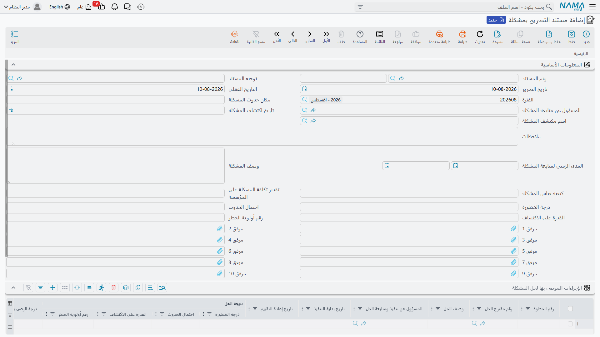
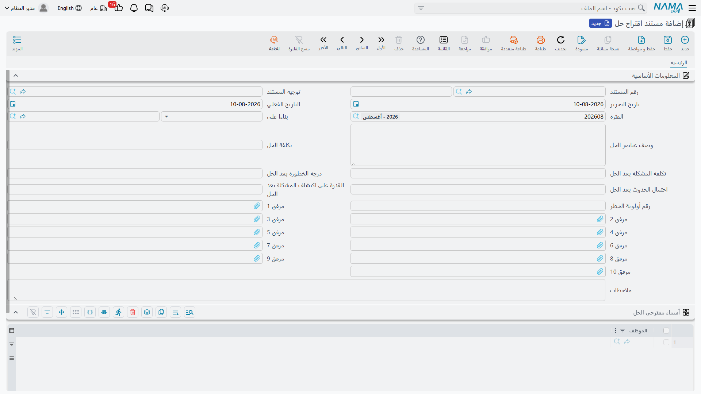

# سجل المخاطر

::: info الترخيص
الشاشات الثلاث المشروحة هنا تحتاج كود الترخيص `crm`.
:::

افتح قائمة خدمة العملاء، وتجاوز مجلدي الدعم والتسويق، وستجد مجلدًا اسمه **الإدارة والتنظيم**
(Management And Organization Documents) يضم ثلاثة مستندات: **مستند التصريح بمشكلة**
(SMF Problem Declaration Document)، و**مستند اقتراح حل** (SMF Solution Suggestion Document)،
و**مستند العمليات المبدئية** (SMF Initial Operation Document).

يصادف معظم المستخدمين هذه الشاشات بالمصادفة، فيفترضون أنها جزء من دعم العملاء، ثم يبحثون عن الزر
الذي يربط أحدها بطلب دعم. لا يوجد مثل هذا الزر. هذه الشاشات الثلاث هي **سجل مخاطر داخلي** — دفتر
لتحسين جودة عمليات الشركة نفسها. وهي لا تعرف أن العملاء موجودون أصلًا.

## ما الغرض من السجل

النموذج هو نموذج تحليل أنماط الأعطال وآثارها المعروف. يلاحظ أحدهم أن شيئًا ما داخل الشركة يتكرر
خطؤه — مخزن الصيانة ينفد منه الفلتر نفسه كل ربع سنة مثلًا، أو فرق التركيب تصل إلى الموقع دون تصريح
الدخول من العميل. تُسجّل ذلك بوصفه **مشكلة**، وتُقيّمه بثلاثة عوامل، وتضرب الثلاثة في بعضها للحصول
على رقم واحد يمكنك ترتيب القائمة عليه. ثم تكتب اقتراح حل أو أكثر، لكل منها تكلفته والدرجة التي
ستؤول إليها المشكلة **بعد** الحل، وتسجّل الخطوة التي اتخذتها بعد ذلك.

هذا هو المنتج كله. لا شيء يُنشأ تلقائيًا، ولا شيء يُعتمد، ولا شيء يُصعَّد.

## العوامل الثلاثة ورقم أولوية الخطر

كل تقييم في مستندَي التقييم مبني على الخانات الثلاث نفسها:

| الحقل | المسمى الإنجليزي | ما الذي يسجله |
|---|---|---|
| درجة الخطورة | Risk Degree | حجم الضرر عند وقوع المشكلة |
| احتمال الحدوث | Probability Of Risk Occurrence | كم مرة تحدث |
| القدرة على الاكتشاف | Ability To Discover Risk | مدى قدرتك على اكتشافها قبل أن تضر |
| رقم أولوية الخطر | Risk Priority Number | حاصل ضرب العوامل الثلاثة |

هذه خانات رقمية عادية. لا يفرض النظام مقياسًا من 1 إلى 10 ولا حدًا أعلى، لذا اتفقوا داخليًا على
مقياس واحد واكتبوه في إجراءاتكم — وإلا وجدتَ الرقم 8 من إدارة والرقم 80 من إدارة أخرى في القائمة
المرتبة نفسها.

قيّم نفاد صنف متكرر بدرجة خطورة 8 واحتمال حدوث 5 وقدرة على الاكتشاف 3، فيصبح رقم أولوية الخطر 120.
عالِج حد إعادة الطلب حتى يصبح النفاد نادرًا وسهل الملاحظة، فقد تسجّل على مستند اقتراح الحل درجة بعد
الحل مقدارها 8 × 2 × 2 = 32.

## مستند التصريح بمشكلة

هنا تُفتح المشكلة. إلى جانب الدفتر والكود والتواريخ المعتادة، تطلب مجموعة المعلومات الأساسية
**مكان حدوث المشكلة**، و**المسؤول عن متابعة المشكلة**، و**تاريخ اكتشاف المشكلة**، و**اسم مكتشف
المشكلة**، و**المدى الزمني لمتابعة المشكلة** من تاريخ إلى تاريخ، و**وصف المشكلة**، و**كيفية قياس
المشكلة** (أي كيف ستعرف أنها تتحسن)، و**تقدير تكلفة المشكلة على المؤسسة**، ثم العوامل الثلاثة ورقم
أولوية الخطر. وهناك عشرة مرفقات للصور والتقارير ورسائل البريد التي تخص الحالة.

وتحته جدول **الإجراءات الموصى بها لحل المشكلة** (Problem Recommended Measures) — سطر لكل إجراء
مضاد. يحمل كل سطر رقم الخطوة، و**رقم مقترح الحل**، و**وصف الحل**، و**المسؤول عن تنفيذ ومتابعة
الحل**، و**تاريخ بداية التنفيذ**، و**تاريخ إعادة التقييم**، ونسخته الخاصة من العوامل الثلاثة ورقم
أولوية الخطر، و**درجة الرضى بالحل**، و**الخطوة المقبلة**، وملاحظات، و**تكلفة المشكلة بعد الحل**.

اختر مستند اقتراح حل في أحد السطور، فيُنسخ وصف عناصر الحل من ذلك المستند إلى خانة **وصف الحل** في
السطر. هذه هي التسهيلة التلقائية الوحيدة في هذه المنطقة كلها.

تعرض **الخطوة المقبلة** القيم: **تم حل المشكلة مؤقتًا**، و**الانتقال إلى حل آخر**، و**الاستعانة
بخبير**، و**اعتماد الحل كـ BP**، و**أخري**.

::: warning رقم أولوية الخطر يُحسب في موضع واحد فقط
في مستند التصريح بمشكلة يملأ رقم أولوية الخطر نفسه من العوامل الثلاثة، في الرأس وفي كل سطر من سطور
الإجراءات. أما في **مستند اقتراح حل** فالحقل الذي يحمل الاسم نفسه **يُكتب باليد**، ولا يُقارن أبدًا
بالعوامل الثلاثة بعد الحل المكتوبة فوقه مباشرة. فمن يملأ تلك الشاشة عليه إجراء عملية الضرب بنفسه.
:::

## مستند اقتراح حل

اقتراح لعلاج مشكلة مُصرَّح بها. يحمل **بناءا على** (From Document)، و**وصف عناصر الحل**، و**تكلفة
الحل**، و**تكلفة المشكلة بعد الحل**، والعوامل الثلاثة بعد الحل، ورقم أولوية الخطر المكتوب باليد،
وعشرة مرفقات، وجدولًا من عمود واحد اسمه **أسماء مقترحي الحل** (Solution Proposers) يضم الموظفين
أصحاب الفكرة.

يقبل حقل **بناءا على** مستند تصريح بمشكلة أو مستند اقتراح حل آخر، ولا يقبل غيرهما. وجّهه إلى مستند
اقتراح حل آخر، فتُنسخ أسماء مقترحي الحل من ذلك المستند إلى جدولك — ومن تلك اللحظة لا يمكنك حذف أي
اسم منسوخ: الحفظ بدون أحدهم يُرفض برسالة تذكر اسم الموظف واسم المستند المصدر. يمكنك إضافة مقترحين
بحرية، أما حذف اسم موروث فيتطلب إفراغ حقل **بناءا على** أولًا.

فالمستندان إذن يشيران إلى بعضهما في الاتجاهين: مستند التصريح بمشكلة يشير إلى اقتراحات الحل عبر سطور
الإجراءات، ومستند اقتراح الحل يشير إلى مشكلته عبر حقل **بناءا على**.

## مستند العمليات المبدئية — استبيان قائم بذاته

المستند الثالث ليس تقييم مخاطر أصلًا. إنه استبيان لوصف كيف تسير عملية ما اليوم قبل أن يحاول أحد
تحسينها: **إسم العملية**، و**الموظف** المسؤول، و**الأقدمية في تنفيذ العملية**، و**وصف العملية**،
و**أهم المهام التي تحتويها العملية**، و**التكرار الزمني للعملية**، و**المدة التي تستغرقها العملية**،
و**مكان تنفيذ العملية**، و**أهمية العملية**، و**عدد الموظفين المنخرطين في العملية** و**ما هي
وظائفهم**، و**أهم مخرجات العملية**، و**متوسط نسبة نجاح العملية**، و**أهم التغييرات التي تريد
إحداثها على العملية**، وأخيرًا **اقتراح لتكون من العمليات المثلى** بإجابات **نعم** أو **لا** أو
**نعم بعد التعديل**. وعشرة مرفقات كذلك.

::: warning مستند العمليات المبدئية غير مرتبط بأي شيء على الإطلاق
لا شيء يُنشئه، ولا شيء يقرأه، وهو غير مرتبط بالمستندين الآخرين في المجلد نفسه. لا يمكن اختياره في
سطور إجراءات مستند التصريح بمشكلة ولا في حقل **بناءا على** بمستند اقتراح حل، ولا يشير إليه أي منهما.
تعامل معه كنموذج مستقل تملؤه وتحفظه — لا كخطوة أولى في دورة من ثلاث خطوات.
:::

## ما الذي لا يمسّه هذا السجل

يستحق هذا الوضوح، لأن موضع المستندات في القائمة يوحي بالعكس تمامًا:

- **لا عميل ولا طلب دعم ولا شكوى.** لا يحمل أي من المستندات الثلاثة حقل عميل، ولا يمكن ربط طلب دعم
  أو شكوى أو عقد خدمة أو سؤال شائع بها في أي من الاتجاهين.
- **لا آلة ولا صيانة.** لا شيء في منظومتي الصيانة يشير إليها، وهي لا تشير إلى شيء فيهما.
- **لا مال ولا مخزون.** أرقام التكلفة تُكتب لسجلاتك الخاصة. لا شيء منها يصل إلى دفتر الأستاذ أو
  المخزن، وحفظ أي من هذه المستندات لا ينشئ أي طلب أعمال.
- **لا تقرير ولا لوحة معلومات.** كما في خدمة العملاء كلها، لا يوجد تقرير جاهز هنا. اقرأ السجل من
  شاشات القوائم، ورتّبه على رقم أولوية الخطر، واستخدم التصدير إلى Excel أو منظومة ذكاء الأعمال إن
  احتجت أكثر من ذلك.
- **لا تنبيه.** تاريخ إعادة التقييم في سطر الإجراء ملاحظة لك أنت. لا يوجد في خدمة العملاء أي جدولة
  زمنية أو منبه أو إشعار، فلن يخبرك أحد بحلول ذلك التاريخ.

ملاحظة أخيرة صغيرة: تعرض الشاشات الثلاث حقل **توجيه المستند** رغم أن أيًّا منها لا يستخدم توجيهًا،
ولا توجد خلفه أي إعدادات. اتركه فارغًا — راجع
[كيف تعمل توجيهات مستندات خدمة العملاء](/ar/modules/crm/document-terms/crm-terms-basics).
