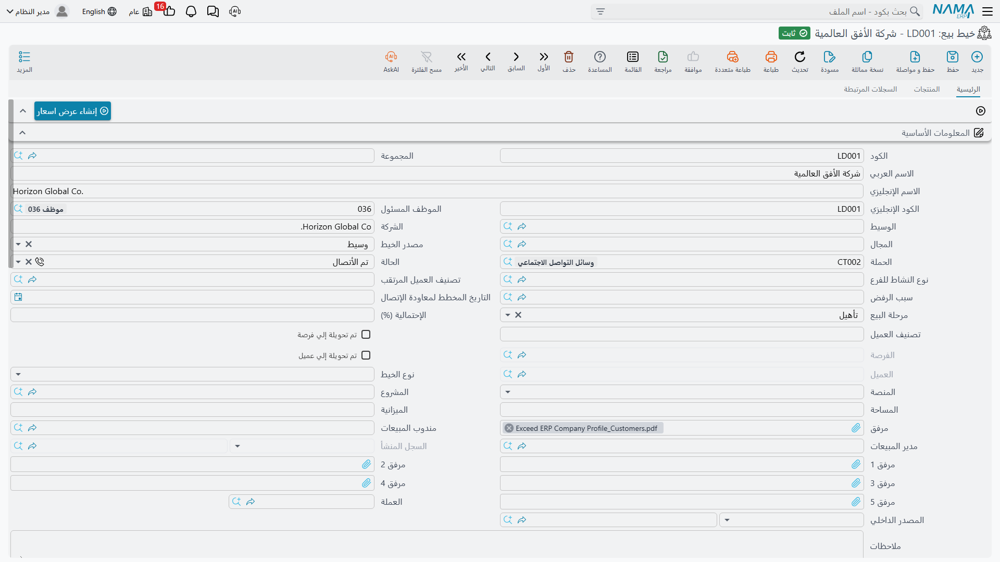

# خيوط البيع

خيط البيع هو السجل الذي تفتحه في اللحظة التي يصير فيها العميل المرتقب حقيقياً بما يكفي لتتذكره. أحدهم دخل الجناح، أو اتصل بالخط الساخن، أو أرسل وسيط اسماً — وصار الأمر يحتاج مالكاً وخطوة تالية ومكاناً تحفظ فيه أرقام الهواتف.

و**خيط البيع** في NaMa **ملف أساسي** لا مستند: بلا دفتر، وبلا توجيه، وبلا تاريخ فعلي ولا رقم مستند ولا دورة اعتماد. تنشئه، وتظل تعدّله كلما تطورت القصة، حتى يتحول في النهاية إلى عميل أو يبرد بهدوء.

::: info الرخصة المطلوبة
تُفتح شاشة خيط البيع برخصة كودها `crm`.
:::

تجدها في **خدمة العملاء ← التسويق ← خيط بيع**.

ونتابع في هذه الصفحة خيط البيع `LD-00417` الذي فتحته هالة سمير عبد الرحمن (`EMP-1042`) يوم 12 يناير 2026 لـ**فنادق مارينا بلازا** بعد المعرض الدولي للتبريد.

## صفحة الرئيسية

الصفحة الأولى فيها مجموعة كبيرة من حقول الرأس، ثم مجموعة معلومات الاتصال، ثم جدولان.

| الحقل (بالعربية / بالإنجليزية) | ما هو | في `LD-00417` |
|---|---|---|
| الكود، الاسم العربي، الاسم الإنجليزي (Code, Name) | هوية الملف الأساسي | `LD-00417`، فنادق مارينا بلازا، Marina Plaza Hotels |
| الشركة (Legal Entity) | **نص حر** باسم شركة العميل المرتقب نفسه | فنادق مارينا بلازا |
| الموظف المسئول (Responsible Employee) | مالك السجل | `EMP-1042` |
| مندوب المبيعات (Salesman) | يجب أن يكون موظفاً معلّماً كمندوب مبيعات | `EMP-1042` |
| مدير المبيعات (Sales Manager) | مرجع موظف حر | `EMP-1001` طارق يوسف المنسي |
| الوسيط (Mediator) | الوسيط أو المكتب الاستشاري الذي جاء بالصفقة | `MED-07` مكتب الرواد للاستشارات الهندسية |
| المجال (Industry) | ملف تصنيف | `IND-04` الفنادق والضيافة |
| مصدر الخيط (Lead Source) | من أين جاء خيط البيع | معرض تجاري |
| الحملة (Campaign) | الحملة التسويقية التي يُنسب إليها | `CAMP-2026-01` |
| الحالة (Status) | أين وصلت المحادثة | مبدئي عند الإنشاء |
| تصنيف العميل المرتقب (Lead Classification) | ملف تصنيف | `LC-B` عميل متوسط |
| نوع النشاط للفرع (Activity Type) | نوع الاتصال التالي المخطط | `AT-01` مكالمة متابعة |
| سبب الرفض (Rejection Reason) | يُملأ حين يموت خيط البيع | فارغ |
| التاريخ المخطط لمعاودة الإتصال (Planned Re-Call Date) | التاريخ الذي تنوي المعاودة فيه | يضبطه مستند الاتصال |
| مرحلة البيع (Sales Stage) | واحدة من اثنتي عشرة قيمة | تأهيل |
| الإحتمالية (%) (Probability) | رقم تكتبه بيدك | 40 |
| نوع الخيط (Lead Type) | جديد أو إتصال ارتجالي أو ثلاث قيم احتياطية | جديد |
| المنصة (Platform) | القناة التي وصل منها | زيارة مباشرة |
| تصنيف العميل (Customer Classification) | يُنقل إلى ملف العميل عند التحويل | — |
| المصدر الداخلي (Internal Source) | موظف أو شريك أرشد إليه | — |
| المشروع، المساحة (Project, Area) | حقلان عقاريان: مرجع لمشروع عقاري ومساحة كنص حر | — |
| الميزانية (Budget) | **نص حر** | `حوالي 4.5 مليون جنيه` |
| ملاحظات وستة مرفقات | نص حر وملفات | — |
| مجموعة العملة (Currency) | العملة وسعر الصرف | جنيه مصري |
| المحددات (Dimensions) | الشركة والقطاع والفرع والإدارة ومجموعة التحليل | `NOK`، `SEC-SRV`، `BR-ALX`، `DPT-SLS` |

وهناك خمسة حقول أخرى على الشاشة للقراءة فقط، تتولّاها أزرار التحويل: **تم تحويلة إلي فرصة** و**الفرصة** و**تم تحويلة إلي عميل** و**العميل** و**السجل المنشأ**. لا تكتب فيها أبداً — راجع [تحويل خيط البيع](/ar/modules/crm/sales-pipeline/crm-lead-conversion).

::: warning حقلان مختلفان يحملان الاسم نفسه: «الشركة»
**الشركة** في مجموعة الرأس نصٌّ حر باسم شركة *العميل المرتقب* — وإن تركته فارغاً يُملأ باسم خيط البيع العربي في كل حفظ. أما **الشركة** في مجموعة المحددات فهي محدد الشركة عندك أنت. حقلان لا علاقة بينهما ولهما التسمية نفسها؛ اقرأ عنوان المجموعة لتميّز بينهما.
:::

::: warning قيمة الصفقة ليست على هذه الشاشة
مجموعة **العملة** تعرض عملة وسعر صرف فقط — والمبلغ الذي يقابلهما غير معروض. وخانة **الميزانية** نص حر لا يُجمع ولا يُرتَّب. فلا يمكن تسجيل قيمة خيط البيع هنا في التركيب الافتراضي، ولذلك لا توجد قيمة لمسار البيع ولا تنبؤ مرجّح ولا شيء يُبنى عليه تقرير. راجع [مسار البيع](/ar/modules/crm/sales-pipeline/crm-pipeline-overview).
:::

### الحالات

لحقل **الحالة** اثنتا عشرة قيمة ولا قواعد انتقال بينها — فأي حالة تصلح أن تلي أي حالة، ولا شيء يضبطها تلقائياً إلا الاتصال أو الزيارة.

| بالعربية | بالإنجليزية |
|---|---|
| مبدئي | Initial |
| لم يتم الأتصال | Not Contacted |
| محاولة الأتصال | Attempted To Contact |
| تم الأتصال | Contacted |
| الأتصال مستقبلا | Contact In Future |
| مؤهل مبدئيا | PreQualified |
| مؤهل | Qualified |
| دافئ | Warm |
| ساخن | Hot |
| بارد | Cold |
| بدون قيمة | Junk Lead |
| فاشل | Lost Lead |

ويقدّم **مصدر الخيط** القيم: إتصال ارتجالي، عميل حالي، من تلقاء نفسة، موظف، شريك، علاقات عامة، بريد مباشر، مؤتمر، معرض تجاري، موقع ويب، توصية، حملة، وسيط، منحة، مواقع التواصل الاجتماعي، وأخري. وتقدّم **المنصة**: وسيط، واتساب، حملة رسائل نصية، مركز اتصال العملاء، المالك، مستقل، شخصي، الخط الساخن، زيارة مباشرة، إنستغرام، جوجل، إعلان خارجي، فيسبوك، منصة فارغة، وثلاث قيم احتياطية. أما **نوع الخيط** فليس فيه إلا: جديد، وإتصال ارتجالي، وثلاث قيم احتياطية.

::: warning حقل الحملة يعرض كل الحملات
يبدو حقل الحملة كأنه يستبعد الحملات الملغاة وغير النشطة. وهو لا يفعل — فالفلتر خلفه لا يستبعد شيئاً على الإطلاق، وكل حملات النظام معروضة فيه. تحقق من حالة الحملة بنفسك قبل اختيارها.
:::

## جدول جهات الاتصال، وإنشاء جهات اتصال حقيقية

جدول **جهات الاتصال** يحفظ الأشخاص: كود جهة الاتصال، ومجموعة التكويد، واللقب، والاسم، والمسمى الوظيفي، والمحمول، والهاتف، والفاكس، والبريد، والعنوان. وهو في ذاته مجرد قائمة داخل خيط البيع.

لكن حقلين فوقه يغيّران ذلك. علّم **إنشاء جهة اتصال لكل سطر** واختر **مجموعة تكويد جهات الاتصال المنشأة**، فيصير كل سطر في الجدول **جهة اتصال** حقيقية بمجرد الحفظ. وهكذا نشأت في `LD-00417` جهتا الاتصال `CNT-0904` (م. رامي عبد المنعم، المهندس الرئيسي) و`CNT-0905` (أ. منى شعبان، المشتريات)، ويظهر السجل المنشأ في عمود **جهة الاتصال** للقراءة فقط داخل الجدول.

وهناك سلوكان ينبغي معرفتهما قبل تشغيل هذا الخيار:

- **حذف السطر يحذف جهة الاتصال التي أنشأها.** فالجدول يُعامَل كقائمة أصلية لا كاستيراد لمرة واحدة.
- الاسم العربي والإنجليزي لجهة الاتصال المنشأة يأخذان كلاهما قيمة **الاسم** الواحد الذي كتبته في السطر، فتبقى التسميتان متطابقتين حتى يعدّلهما أحد.

وإن علّمت الخيار دون مجموعة تكويد ودون كود في السطر، يُرفض الحفظ برسالة *«يجب أن تقوم باختيار مجموعة تكويد جهات الاتصال المنشأة أو تقوم بإدخال كود جهة الاتصال في السطر يدوياً»*.

## صفحة المنتجات

يسجّل جدول **المنتجات** ما يهتم به العميل المرتقب ومَن ينافسك عليه: **المنتج** (صنف مخزني، أو وحدة تأجيرية في التركيب العقاري)، و**الشركة المنافسة**، و**صنف الشركة المنافسة**، وملاحظات.

وفي `LD-00417` سطران: وحدة التبريد المركزية `AC-CHL-300` أمام `COMP-03` شركة الأفق للتكييف وصنفها `CITM-011` تشيلر أفق 300 طن؛ ووحدة مناولة الهواء `AC-AHU-12` بلا منافس مذكور.

واختيار صنف منافس يملأ لك الشركة المنافسة، كما أن قائمة أصناف المنافس مفلترة بالمنتج والشركة المختارين في السطر. ولا توجد كميات ولا أسعار في هذا الجدول — فهو قائمة اهتمام لا عرض أسعار.

## الإسناد: ثلاثة أشياء منفصلة

تقدّم الشاشة ثلاث طرق لوضع اسم على خيط البيع، ولا تتحدث إحداها مع الأخرى.

1. **الموظف المسئول** — موظف واحد، يُملأ تلقائياً بموظف المستخدم الحالي عند إنشاء خيط البيع. وهذه هي الشاشة الوحيدة في خدمة العملاء التي يحكم فيها هذا الملء التلقائي خيارٌ في الإعدادات؛ راجع [إعدادات خدمة العملاء](/ar/modules/crm/crm-configuration).
2. **مندوب المبيعات ومدير المبيعات** — مرجعان حران. وقائمة مندوب المبيعات لا تعرض إلا الموظفين المعلّمين كمندوبي مبيعات، والحفظ بغيرهم مرفوض برسالة *«يجب أن يكون مندرب مبيعات»* (هكذا تظهر على الشاشة، بالخطأ الإملائي). ولا يوجد في الوحدة كلها مناطق بيعية ولا حصص ولا عمولات.
3. **جدول مسند إلي** — وهو الإسناد الحقيقي، سطر لكل موظف. وفي `LD-00417` فيه `EMP-1042` و`EMP-1001`.

وفي كل حفظ يقارن النظام الجدول بما كان عليه ويكتب الفرق في **سجل التصعيدات**، وهي القائمة للقراءة فقط في صفحة السجلات المرتبطة: سطر لكل موظف أُضيف، مختوم بالتاريخ والوقت والمستخدم الذي أسند، وتاريخ إغلاق يُكتب على سطور الموظفين الذين أُزيلوا. وهو أثر تدقيق حقيقي يُصان لك تلقائياً.

واختيار **حملة** يضيف موظفي تلك الحملة إلى الجدول — وهو الشيء الوحيد الذي يملؤه تلقائياً. وهكذا وصل `EMP-1042` إلى جدول `LD-00417`.

::: warning لا أحد يُخطَر، أبداً
إسناد خيط بيع لا يُنتج بريداً ولا تنبيهاً ولا مهمة ولا تذكيراً. والموظف المسند إليه يعرف بذلك حين يفتح شاشة القائمة ويفلتر على اسمه. ولا شيء يتحقق أصلاً من أن لخيط البيع مسنداً إليه.
:::

## صفحة السجلات المرتبطة

الصفحة الثالثة كلها للقراءة فقط: **جهات الاتصال** المنشأة من خيط البيع، و**مهام خدمة العملاء** و**الاتصالات** و**الزيارات** التي تشير إليه، و**سجل التصعيدات** الموصوف أعلاه. ولا يمكن تعديل شيء في هذه الصفحة؛ فهي عرض «ماذا جرى لخيط البيع هذا».

## أزرار الشاشة

| الزر | ماذا يفعل |
|---|---|
| تحويل إلي فرصة | يفتح فرصة جديدة غير محفوظة — راجع [تحويل خيط البيع](/ar/modules/crm/sales-pipeline/crm-lead-conversion) |
| تحويل إلي عميل | يفتح عميلاً جديداً غير محفوظ |
| تحويل الي مشتري | يفتح مشترياً عقارياً جديداً غير محفوظ؛ ولا يظهر إلا مع وحدة العقارات |
| إنشاء عرض أسعار | مرفوض قبل أن يتحول خيط البيع إلى عميل |
| إنشاء جهة اتصال | جهة اتصال جديدة مرتبطة بخيط البيع، وبيانات الاتصال في الرأس منسوخة إليها |
| إنشاء اتصال | اتصال جديد محمّل مسبقاً بحالة خيط البيع وتصنيفه ونوع نشاطه وسبب رفضه الحاليين |
| إنشاء مهمة خدمة العملاء | مهمة جديدة مرتبطة بخيط البيع |

وكلها تفتح **شاشة جديدة غير محفوظة**. ولا يُنشأ شيء حتى تحفظ ما فُتح.

## شاشة القائمة

تحمل قائمة خيوط البيع مرشِّحي فرز سريع على **الحالة** و**مرحلة البيع**، ومعايير للوسيط والحملة والحالة والاحتمالية والفرصة والعميل ونوع الخيط والمساحة والميزانية. وفي شريط أدواتها إجراءان جماعيان:

- **تغيير الحالة** — يسأل عن حالة ثم يكتبها على كل خيط بيع محدد.
- **تصعيد إلي** — يسأل عن موظف واحد ثم يطبّقه على كل خيط بيع محدد.

::: danger «تصعيد إلي» يستبدل المسند إليهم ولا يضيف واحداً
هذا الإجراء **يمسح جدول «مسند إلي» بالكامل** في كل سجل محدد ويترك سطراً واحداً للموظف الذي اخترته. فالمشرف الذي يستخدمه ليضيف مندوباً ثانياً إلى دفعة من خيوط البيع يزيل الأول منها كلها بصمت. وسيسجّل **سجل التصعيدات** ما جرى بأمانة — إذ يُغلق سطر الموظف السابق — لكن الجدول يكون قد ذهب.

ولإضافة موظف دون فقد الموجودين، افتح خيط البيع وأضف سطراً إلى الجدول بيدك.
:::

## ما الذي يرفضه النظام فعلاً

لا تُطبَّق على هذه الشاشة إلا قاعدتان، ويستحق قِصَر القائمة أن يُعرف:

- **مندوب المبيعات يجب أن يكون معلّماً كمندوب مبيعات.** وأي غير ذلك مرفوض برسالة *«يجب أن يكون مندرب مبيعات»* (هكذا تظهر على الشاشة، بالخطأ الإملائي).
- **خيط البيع المحوَّل لا يقبل التعديل.** فبمجرد تعليم **تم تحويلة إلي عميل** يفشل الحفظ برسالة *«لا يمكن التعديل - تم تحويلة لعميل»* — إلا إذا شُغِّل خيار **السماح بتعديل خيط البيع بعد ربطه** في [إعدادات خدمة العملاء](/ar/modules/crm/crm-configuration).

وما عدا ذلك — احتمالية 900، أو خيط بيع «أنتهي بنجاح» بلا عميل، أو جدول إسناد فارغ — يُحفظ دون اعتراض.

::: info القفل لا يمنع الاتصال من تحريك خيط البيع
[الاتصال](/ar/modules/crm/activities/crm-calls) أو [الزيارة](/ar/modules/crm/activities/crm-visits) عند الاعتماد يكتب قيمة *تغيير الحالة إلي* على خيط البيع رغم القفل. وهذا مقصود: فمستندات الأنشطة هي الطريق الطبيعي لتحرك حالة خيط البيع. وانتبه إلى أن إلغاء ذلك الاتصال بعد ذلك **لا يعيد الحالة كما كانت** — فيبقى خيط البيع على ما أعطاه إياه المستند الملغى، وتصحّحه أنت بيدك.
:::

## التقارير

**التقارير: لا شيء.** لا تشحن هذه الوحدة أي تقارير نظام، ولا يوجد نموذج طباعة لهذه الشاشة. استخدم مرشِّحات شاشة القائمة، أو صدّر إلى Excel، أو ابنِ عرضاً في ذكاء الأعمال.
