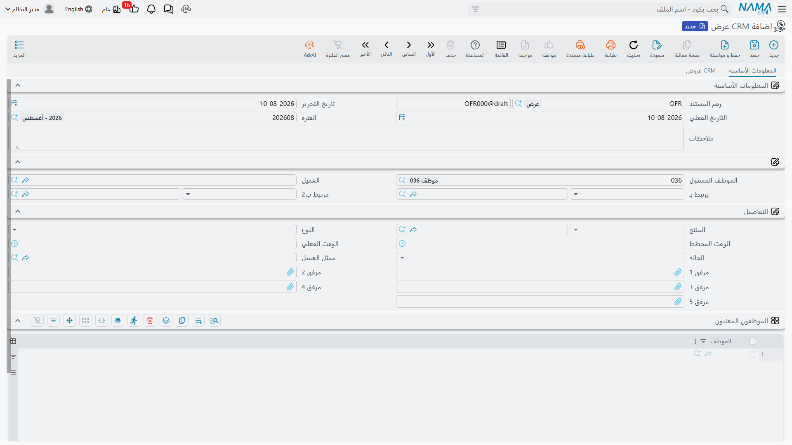

# العروض

الشاشة المسماة **CRM عرض** هي أكثر ما يُساء فهمه في قائمة خدمة العملاء، ويستحق الأمر أن يُحسم في الفقرة الأولى: **هي ليست عرض سعر.** فليس عليها كمية، ولا سعر وحدة، ولا خصم، ولا ضريبة، ولا إجمالي، ولا تاريخ سريان، ولا عملة، ولا قائمة أسعار، ولا شروط وأحكام. ولا يوجد في الشاشة كلها ما يحمل مالاً.

وما تحمله فعلاً هو **حزمة عمل**: من المسند إليه هذا الجزء من العمل، وما نوعه، وكم كان متوقعاً أن يستغرق، وكم استغرق فعلاً. وهي تنتمي إلى جانب التنفيذ من المشروع — التجهيز والتدريب الذي تلتزم به حول عملية تركيب — لا إلى الجانب التجاري من البيع.

فإن كان ما تحتاجه عرض سعر مسعّراً لعميل، فذلك **عرض أسعار** في سلاسل الإمداد، يُفتح من خيط البيع أو الفرصة بزر **إنشاء عرض أسعار**. راجع [تحويل خيط البيع](/ar/modules/crm/sales-pipeline/crm-lead-conversion).

::: info الرخصة المطلوبة
تُفتح شاشة العرض برخصة كودها `crm`.
:::

تجدها في **خدمة العملاء ← التسويق ← CRM عرض**.

## هي ليست تالية لشيء

::: danger لا شيء ينشئ عرضاً، ولا شيء يُنشأ منه
**لا يوجد على شاشة خيط البيع ولا على شاشة الفرصة أي زر ينشئ عرضاً.** فأنت تنشئه من القائمة، من الصفر، في كل مرة.

وفي الاتجاه الآخر، لا ينتج العرض شيئاً على الإطلاق: لا عرض أسعار، ولا أمر بيع، ولا فاتورة، ولا مشروعاً، ولا قيداً محاسبياً، ولا حركة مخزنية. وصلاته الخارجية الوحيدة حقلا مرجع يملؤهما إنسان بيده.

وبوجه خاص: لا يمكن ربط العرض بـ**CRM مشروع** أبداً. فحقل **يرتبط بـ** في المشروع لا يقبل عرضاً، فلا سبيل — حتى يدوياً — لتسجيل أن هذا المشروع خرج من هذا العرض. راجع [مسار البيع](/ar/modules/crm/sales-pipeline/crm-pipeline-overview).
:::

## صفحة المعلومات الأساسية

بخلاف خيط البيع والفرصة، العرض **مستند** حقيقي: له رقم مستند مكوَّن من **دفتر** ورقم، وتاريخ تحرير، وتاريخ فعلي، وفترة.

::: info لا توجد توجيهات لهذا المستند
لا يستخدم العرض توجيهاً — فالشاشة لا تطلبه ولا تعرضه، ولا يوجد ما يُضبط لكل توجيه. أما **دفتر المستندات** فمطلوب، لأنه مصدر الرقم.
:::

ثم يحمل الرأس:

| الحقل (بالعربية / بالإنجليزية) | ما هو |
|---|---|
| الموظف المسئول (Responsible Employee) | يُملأ بموظف المستخدم الحالي في كل سجل جديد |
| العميل (Customer) | من يُنفَّذ له العمل |
| يرتبط بـ (Related To) | **خيط بيع** أو **فرصة** — يُملأ باليد |
| مرتبط ب2 (Related To 2) | **تحليل** أو **خيط بيع** — يُملأ باليد |

وتحت ذلك مجموعة **التفاصيل** التي تصف حزمة العمل ككل: **المنتج**، و**النوع**، و**الوقت المخطط**، و**الوقت الفعلي**، و**الحالة**، و**ممثل العميل**، وخمسة مرفقات. ثم جدول بعمود واحد اسمه **الموظفون المعنيون** يسرد من سينفّذ العمل — وأخيراً مجموعة المحددات.

ولو أُنشئ عرض من هذا النوع لتركيب مارينا بلازا، لسمّى العميل، وأشار بحقل **يرتبط بـ** إلى الفرصة، وحمل `AC-CHL-300` منتجاً، ووقف عند النوع *تجهيز* أثناء إعداد غرفة التبريد، وأدرج هالة سمير عبد الرحمن والفني محمود عادل حسن في جدول الموظفين المعنيين.

### النوع والحالة

لحقل **النوع** أربع قيم، ويستحق نقل تسمياتها كما هي لأن اثنتين منها تُقرآن على نحو غريب:

| بالعربية | بالإنجليزية |
|---|---|
| عرض | Offer |
| تجهيز | preparement |
| تدريب | Training |
| دعم | TroubleTicket |

والسطر الأخير مسمّى فعلاً *TroubleTicket* بالإنجليزية و*دعم* بالعربية — ومعناه أعمال الدعم، ولا علاقة له البتة بشاشة طلب الدعم في مجلد الدعم.

ولحقل **الحالة** ثلاث قيم: *مخطّطة* و*تحت التنفيذ (Excuting)* و*تم التنفيذ (Excuted)*. وهذان الإملاءان الإنجليزيان هما ما يظهر على الشاشة فعلاً.

ولا يحرّك أيٌّ من الحقلين شيئاً. فلا قاعدة تلزم الحالة بالتقدم للأمام، ولا قاعدة تمنع ملء الوقت الفعلي قبل أن تصير الحالة *تم التنفيذ*، ولا حساب في أي موضع يقارن الوقت المخطط بالوقت الفعلي. و**الوقت المخطط** و**الوقت الفعلي** قيمتان على هيئة ساعة (ساعات ودقائق) لا يقرؤهما شيء ولا يجمعهما ولا يقارنهما — فالفرق بينهما تستخرجه بعينك.

## صفحة العروض

الصفحة الثانية هي حيث تُفصَّل حزمة العمل. وفي جدول **التفاصيل** سطرٌ لكل جزء من العمل، وفيه: **المنتج**، و**ممثل العميل**، و**مسند الي**، و**الحالة**، و**النوع**، و**الوقت المخطط**، و**الوقت الفعلي**، و**تاريخ البداية**، و**تاريخ النهاية**، ومرفق.

فقد يحمل عرض واحد لمارينا بلازا سطر *تجهيز* لمعاينة غرفة التبريد، وسطر *تدريب* لمهندسي الفندق على أجهزة التحكم في التشيلر، وسطر *دعم* لأول شهر من المتابعة بعد التشغيل — لكلٍّ مسند إليه ووقت مخطط وفعلي خاص به.

وتحت هذا الجدول جدولٌ ثانٍ بعمود واحد لمحاضر الاجتماعات، عنوان عموده **دقائق ملاحظات الاجتماع / Training preparing remarks**.

::: warning هذا الجدول الثاني بلا عنوان
يعرض جدول الملاحظات في هذه الصفحة المفتاح الخام **`CRMOffers.remarkLines`** في موضع عنوانه — بالعربية والإنجليزية معاً، لأن التسمية ببساطة غير موجودة. وهو جدول محاضر الاجتماعات؛ ولا خلل في الجدول نفسه، إنما في عنوانه.
:::

## الرابط الوحيد الذي يفعل شيئاً

املأ حقل **مرتبط ب2** بـ**تحليل**، فينسخ العرض عنه خمسة أشياء: المنتج، والنوع، والحالة، وممثل العميل، والموظف المسئول. وهذا هو السلوك التلقائي الوحيد في الشاشة كلها.

ولهذا المرجع نفسه أثر آخر: فشاشة التحليل تحمل في صفحة سجلاتها المرتبطة قائمة **CRM عروض** للقراءة فقط، وهي مبنية على حقل **مرتبط ب2**. وهي الموضع الوحيد في المنتج الذي يُعرض فيه التحليل والعروض المرفوعة عليه معاً — فإن أردت هذا العرض، فلا بد أن تربط العرض بالحقل المرجعي **الثاني** لا بالأول.

راجع [المشروعات والتحليل وطلبات التطوير](/ar/modules/crm/sales-pipeline/crm-projects-and-analysis) لشاشة التحليل نفسها.

## لا شيء هنا يخضع لتحقق

::: warning العرض يقبل كل ما تكتبه
لا تُطبَّق أي قاعدة على هذه الشاشة. فالعرض بلا سطور يُحفظ. والسطر الذي مُلئ وقته الفعلي وحالته ما زالت *مخطّطة* يُحفظ. وتاريخ نهاية قبل تاريخ بدايته يُحفظ. و**يرتبط بـ** و**مرتبط ب2** يشيران إلى عميلين مرتقبين لا صلة بينهما، ويُحفظ.

فلا تبنِ إجراءً على افتراض أن النظام سيلتقط الخطأ هنا — لن يفعل. وما تحتاجه من انضباط لا بد أن يأتي من خطوة مراجعة عندك.
:::

## التأثيرات

لا توجد. فليس للعرض **تأثير محاسبي ولا تأثير مخزني**، واعتماده لا يُنشئ طلب أعمال ولا مستنداً تالياً. وحفظ السجل هو كل النتيجة.

## التقارير

**التقارير: لا شيء.** لا تشحن هذه الوحدة أي تقارير نظام، ولا يوجد نموذج طباعة لهذه الشاشة. استخدم شاشة قائمة العروض وتصدير Excel، أو ابنِ عرضاً في ذكاء الأعمال، إن أردت مقارنة الوقت المخطط بالفعلي عبر العروض.
