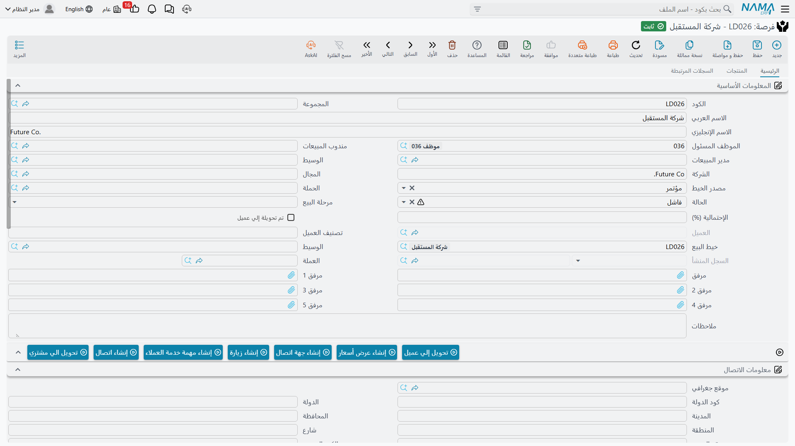

# الفرص

في 2 فبراير 2026، بعد ثلاثة أسابيع من أول اتصال وأسبوعين من زيارة الموقع، ضغطت هالة **تحويل إلي فرصة** على `LD-00417` وحفظت `PT-00203`. لم تعد مارينا بلازا اسماً على جناح معرض، بل صارت صفقة يتوقع أحدهم كسبها.

وهذا هو الغرض من شاشة **الفرصة**: العميل المرتقب نفسه بعد ترقيته، حتى تنفصل قائمة ما تطارده فعلاً عن قائمة ما تزال تؤهّله. وهي كخيط البيع **ملف أساسي** — بلا دفتر، وبلا توجيه، وبلا تاريخ فعلي، وبلا دورة اعتماد.

::: info الرخصة المطلوبة
تُفتح شاشة الفرصة برخصة كودها `crm`.
:::

تجدها في **خدمة العملاء ← التسويق ← فرصة**.

## هي شاشة خيط البيع، أصغر قليلاً

الوصف الصادق لشاشة الفرصة أنها شاشة [خيط البيع](/ar/modules/crm/sales-pipeline/crm-leads) بحقل واحد مضاف وأحد عشر حقلاً محذوفاً. فهي ليست شاشة أغنى، ولا تفتح شيئاً كان خيط البيع عاجزاً عنه.

**ما تضيفه:** حقل **خيط البيع** (Source Lead)، وهو مرجع للقراءة فقط إلى خيط البيع الذي رُقّيت منه هذه الفرصة. يملؤه زر التحويل ولا تكتبه أنت.

**ما تحذفه من الشاشة:** الكود الإنجليزي، ونوع النشاط للفرع، وتصنيف العميل المرتقب، وسبب الرفض، والتاريخ المخطط لمعاودة الإتصال، ونوع الخيط، والمنصة، والمشروع، والمساحة، والميزانية، والمصدر الداخلي.

وما عدا ذلك فهو نفسه: الاسم، ونص الشركة، والموظف المسئول، ومندوب المبيعات ومدير المبيعات، والوسيط، والمجال، ومصدر الخيط، والحملة، والحالة، ومرحلة البيع، والاحتمالية، وتصنيف العميل، والملاحظات والمرفقات، ومجموعة العملة، ومجموعة معلومات الاتصال، وجدول **جهات الاتصال** بخيار *إنشاء جهة اتصال لكل سطر*، وجدول **المنتجات** بأعمدة المنافس، وجدول **مسند إلي** مع سجل التصعيدات، والمحددات، وحقول **تم تحويلة إلي عميل** و**العميل** و**السجل المنشأ** للقراءة فقط.

::: info أربعة من الحقول المحذوفة ما زالت حيّة خلف الشاشة
نوع النشاط للفرع وتصنيف العميل المرتقب وسبب الرفض والتاريخ المخطط لمعاودة الإتصال غائبة عن شاشة الفرصة لكنها ما زالت موجودة على السجل — و[الاتصال](/ar/modules/crm/activities/crm-calls) أو [الزيارة](/ar/modules/crm/activities/crm-visits) عند الاعتماد ما زال يكتب فيها. فقد تحمل الفرصة تصنيفاً وتاريخ معاودة اتصال لا يراهما أحد على الشاشة. اقرأهما من أعمدة شاشة القائمة أو من تصدير Excel إن احتجتهما.
:::

::: warning حقل الوسيط يظهر مرتين
على شاشة الفرصة أُضيف حقل **الوسيط** إلى المجموعة نفسها مرتين، فقد ترى خانتين متطابقتين جنباً إلى جنب. وهما الحقل نفسه — املأ أياً منهما.
:::

## مشكلة قيمة الصفقة أسوأ هنا

::: danger الفرصة بلا قيمة ظاهرة على الإطلاق
تحمل الفرصة حقلاً اسمه *Value Of Deal*. وهو **ليس على الشاشة**، و**ليس له اسم عربي ولا إنجليزي** — فالنظام لا يملك تسمية يعرضها له. ومجموعة العملة إلى جواره تعرض عملة وسعر صرف بلا مبلغ، تماماً كما في خيط البيع، أما خانة **الميزانية** ذات النص الحر فليست على شاشة الفرصة أصلاً.

والأثر العملي: السجل الذي يفترض أن يمثل صفقة تتوقع كسبها لا يستطيع أن يخبرك بقيمتها. فلا إجمالي لمسار البيع، ولا قيمة مرجّحة، ولا تنبؤ في الوحدة كلها. وإن احتاج الموقع قيمةً لكل فرصة، فلا بد أن يضع مسؤول التطبيق الحقل على الشاشة.
:::

## ما الذي يرفضه النظام

قاعدة واحدة فقط تُطبَّق على هذه الشاشة:

- **لا تستطيع الفرصة أن تدّعي خيط بيع تملكه فرصة أخرى.** فيفشل الحفظ برسالة تظهر بالإنجليزية وحدها — *«Lead has a different potential …»* — مسمّيةً الفرصة الأخرى. وهذا ما يمنع ترقية خيط البيع مرتين.

وما عدا ذلك، لا تتحقق الفرصة من شيء.

::: warning الفرصة المحوَّلة تبقى قابلة للتعديل
لخيط البيع قفل: فبعد تحويله إلى عميل يُرفض حفظه إلا إذا شُغِّل خيار **السماح بتعديل خيط البيع بعد ربطه**. أما **الفرصة فليس لها قفل مماثل**. فالفرصة التي أنتجت عميلاً بالفعل — وتحمل علامة **تم تحويلة إلي عميل** إثباتاً لذلك — يمكن لأي أحد أن يفتحها ويعدّلها بحرية، ولا يوجد خيار يغيّر ذلك.

فإن كانت إجراءاتك تعتمد على تجميد السجل بعد الكسب، فهذا الضمان موجود على خيط البيع وحده.
:::

## أزرار الشاشة

| الزر | ماذا يفعل |
|---|---|
| تحويل إلي عميل | يفتح عميلاً جديداً غير محفوظ — راجع [تحويل خيط البيع](/ar/modules/crm/sales-pipeline/crm-lead-conversion) |
| تحويل الي مشتري | يفتح مشترياً عقارياً جديداً غير محفوظ؛ ولا يظهر إلا مع وحدة العقارات |
| إنشاء عرض أسعار | مرفوض قبل أن تتحول الفرصة إلى عميل |
| إنشاء جهة اتصال | جهة اتصال جديدة مرتبطة، وبيانات الاتصال في الرأس منسوخة إليها |
| إنشاء اتصال | اتصال جديد محمّل مسبقاً بحالة الفرصة الحالية |
| إنشاء زيارة | زيارة جديدة مرتبطة بهذه الفرصة |
| إنشاء مهمة خدمة العملاء | مهمة جديدة مرتبطة بهذه الفرصة |

ولا يوجد — عن قصد — **زر تحويل إلى عرض**، ولا زر ينتج تحليلاً أو CRM مشروع. فهذه الشاشات الثلاث ليست تالية للفرصة؛ راجع [مسار البيع](/ar/modules/crm/sales-pipeline/crm-pipeline-overview).

## شاشة القائمة

تعرض قائمة الفرص أعمدة الحالة ومرحلة البيع والاحتمالية والعميل ومندوب المبيعات ومدير المبيعات، ومعها مرشِّحا الفرز السريع نفساهما (الحالة ومرحلة البيع) والمعايير نفسها الموجودة في قائمة خيوط البيع. وفي شريط أدواتها الإجراءان الجماعيان نفساهما — والمفاجأة نفسها:

::: danger «تصعيد إلي» يستبدل المسند إليهم
في قائمة الفرص، تماماً كما في قائمة خيوط البيع، يمسح إجراء **تصعيد إلي** جدول *مسند إلي* بالكامل في كل سجل محدد ويترك سطراً واحداً للموظف الذي اخترته. فهو أداة إعادة إسناد لا أداة إضافة. ولإضافة موظف، افتح الفرصة وأضف سطراً في الجدول بيدك.
:::

## خيار إعدادات لا ينطبق هنا

خيار **السماح بجعل القيمة الافتراضية للموظف بالمسئول بالحالي** يحكم **شاشة خيط البيع وحدها**. أما في الفرصة — وكذلك في العرض والتحليل والمشروع وطلب التطوير — فيُملأ الموظف المسئول بموظف المستخدم الحالي في كل سجل جديد دون شرط، مهما كان وضع ذلك الخيار. وإطفاؤه لا يغيّر شيئاً هنا.

## التقارير

**التقارير: لا شيء.** لا تشحن هذه الوحدة أي تقارير نظام، ولا يوجد نموذج طباعة لهذه الشاشة. وشاشة القائمة وتصدير Excel وذكاء الأعمال هي التقارير.
