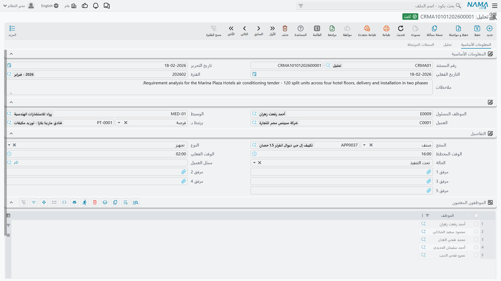
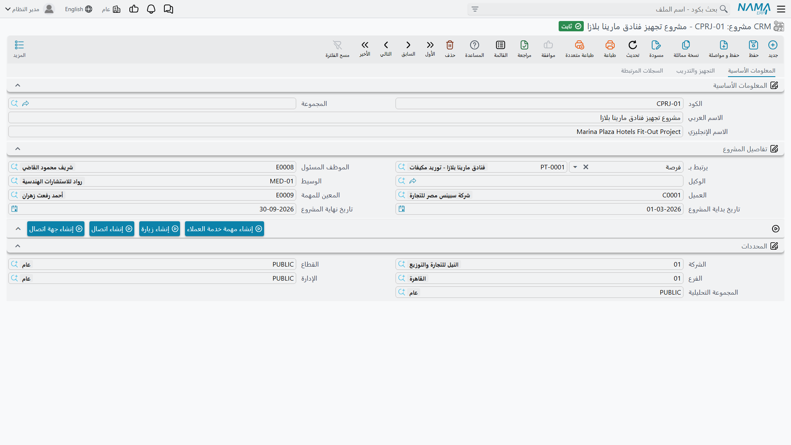
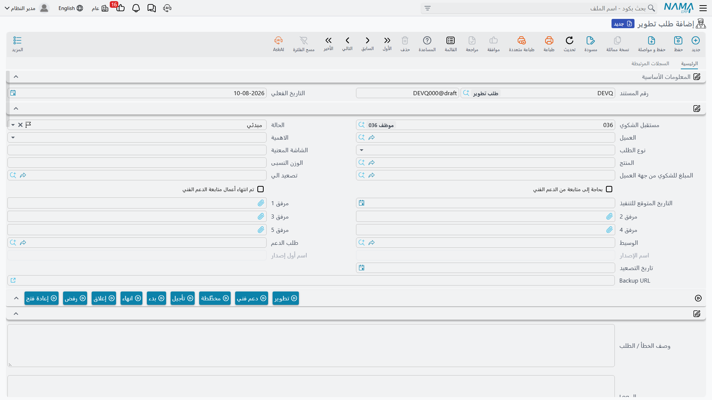

# المشروعات والتحليل وطلبات التطوير

إلى جوار مسار البيع تجلس ثلاث شاشات أخرى في قائمة خدمة العملاء، وكلها تصف **التنفيذ** لا البيع: ما الذي جرى تحليله، وما الذي يجب بناؤه أو تدريس الناس عليه، وما الذي أُعيد ليُصلَح. وهي تبدو الامتداد الطبيعي لسلسلة خيط بيع ← فرصة ← عميل. وهي ليست كذلك.

::: info الرخصة المطلوبة
الشاشات الثلاث تُفتح برخصة كودها `crm`.
:::

وقبل التفاصيل، هذه صورة العلاقة:

```text
   تحليل   (Analysis)          ما الذي يحتاجه العميل
       :
       :  حقل المرجع الثاني في العرض، يُملأ باليد
       v
   CRM عرض  (Offer)            حزمة العمل - لا مال عليها إطلاقاً
                               راجع صفحة العروض

   CRM مشروع  (CRM Project)    خطة التنفيذ
       ^
       :  حقل «يرتبط بـ»، يُملأ باليد - وهو يقبل خيط بيع أو فرصة
          أو مشروعاً أو حملة أو طلب دعم أو عميلاً أو طلب تطوير.
          وهو لا يقبل عرضاً ولا تحليلاً.
```

والخطوط المنقطة حقول مرجع يكتبها إنسان. فلا يوجد **أي زر** يحوّل تحليلاً إلى عرض، ولا عرضاً إلى مشروع — بل، كما يقول الشكل، لا يمكن حتى توجيه المشروع إلى العرض أو التحليل الذي سبقه. واقرأ [مسار البيع](/ar/modules/crm/sales-pipeline/crm-pipeline-overview) إن لم تكن قد قرأته.

## التحليل

**القائمة:** خدمة العملاء ← التسويق ← تحليل.

التحليل مستند — الدفتر يعطيه رقمه، وهو مثل [العرض](/ar/modules/crm/sales-pipeline/crm-offers) **لا يحتاج توجيهاً**. وهو بنيوياً شاشة العرض مع فارقين: يضيف **الوسيط** إلى الرأس، وحقل **يرتبط بـ** فيه يقبل **خيط بيع** أو **فرصة** أو **CRM مشروع** (ولا يوجد حقل مرجع ثانٍ).

وما عدا ذلك تعرفه من العرض: رأسٌ فيه الموظف المسئول والعميل وحقل المرجع؛ ومجموعة **التفاصيل** بالمنتج والنوع والوقت المخطط والوقت الفعلي والحالة وممثل العميل؛ وجدول **الموظفون المعنيون** بعمود واحد؛ وصفحة ثانية يفصّل جدولها أعمال التحليل في سطور لكلٍّ مسند إليه وحالة ووقت مخطط وفعلي وتواريخ، يليه جدول محاضر الاجتماعات — الذي يعرض، كما في العرض، مفتاحاً خاماً بدل عنوانه.

والشيء الوحيد الذي يزيده التحليل على العرض هو صفحة ثالثة، **السجلات المرتبطة**، فيها قائمة **CRM عروض** للقراءة فقط. وهي تعرض العروض التي يشير حقلها المرجعي **الثاني** (مرتبط ب2) إلى هذا التحليل. وهذه القائمة هي الموضع الوحيد في المنتج كله الذي يظهر فيه التحليل وعروضه معاً — ولذلك، إن أردت هذا العرض، فاربط العرض عبر **مرتبط ب2** لا عبر **يرتبط بـ**.

ولا مال على شاشة التحليل أيضاً: لا كمية، ولا سعر، ولا تكلفة، ولا ضريبة، ولا إجمالي.



## CRM مشروع

**القائمة:** خدمة العملاء ← الدعم ← CRM مشروع.

انتبه إلى المجلد — فالمشروع مصنّف تحت **الدعم** لا التسويق، وهذا يخبرك بحقيقة الغرض منه: خدمة التنفيذ والتدريب التي تلي البيع، لا البيع نفسه.

وهو **ملف أساسي**، فلا دفتر ولا توجيه ولا تاريخ فعلي ولا دورة اعتماد. وله ثلاث صفحات.



### المعلومات الأساسية

الكود والمجموعة والاسمان، ثم مجموعة **تفاصيل المشروع**:

| الحقل (بالعربية / بالإنجليزية) | ملاحظات |
|---|---|
| يرتبط بـ (Related To) | خيط بيع أو فرصة أو مشروع آخر أو حملة أو طلب دعم أو عميل أو طلب تطوير — و**ليس** عرضاً و**ليس** تحليلاً |
| الموظف المسئول (Responsible Employee) | يُملأ بموظف المستخدم الحالي في كل سجل جديد |
| الوكيل (Agent) والوسيط (Mediator) | الأطراف الخارجية المشاركة |
| العميل (Customer) | من يُنفَّذ له المشروع |
| المعين للمهمة (Assignee) | الموظف الذي يملك التنفيذ |
| تاريخ بداية المشروع / تاريخ نهاية المشروع | تاريخان عاديان |

::: danger لا ميزانية ولا تكلفة ولا نسبة إنجاز في CRM مشروع
ليس في الشاشة حقل ميزانية، ولا حقل تكلفة، ولا إيراد، ولا نسبة إنجاز، ولا محطات إنجاز، ولا علامة اكتمال. ولا شيء يُجمَّع من السطور، ولا شيء يُقارَن بشيء.

وهو أيضاً لا علاقة له البتة بمشروعات وحدة **المقاولات**: شاشات مختلفة، وبيانات مختلفة، ولا مرجع في أي من الاتجاهين، ولا تقارير مشتركة. فإن كنت تبحث عن تكاليف المشروعات والموازنات والمستخلصات والفوترة بحسب الإنجاز، فذلك في وحدة المقاولات ولا شأن لهذه الشاشة به.
:::

### التجهيز والتدريب

الصفحة الثانية هي الخطة. حقل ملاحظات، ثم جدول بسطر لكل مرحلة: **المسلسل**، و**المرحلة**، و**الوصف**، والمنتج، وممثل العميل، و**مسند الي**، والحالة، والنوع، والوقت المخطط، والوقت الفعلي، وتاريخ البداية، وتاريخ النهاية، ومرفق. وقيم الحالة والنوع هي القوائم القصيرة نفسها المستخدمة في العرض.

اختر سطراً واضغط **إنشاء زيارة من السطر المختار** فتُفتح [زيارة](/ar/modules/crm/activities/crm-visits) جديدة تحمل مسلسل السطر ووصفه ومرحلته والمسند إليه. وكالعادة، تبقى الزيارة غير محفوظة حتى تحفظها، ولا يُكتب أي رابط عائد على سطر المشروع.

وتحت الجدول يجلس جدول محاضر الاجتماعات نفسه الذي رأيته في العرض، وفيه المشكلة نفسها: يظهر عنوانه على هيئة المفتاح الخام **`CRMProject.remarkLines`** باللغتين.

### السجلات المرتبطة

الصفحة الثالثة للقراءة فقط: جهات الاتصال ومهام خدمة العملاء والاتصالات والزيارات التي تشير إلى هذا المشروع.

### الأزرار، ومنها اثنان بلا اسم

يقدّم شريط أدوات المشروع **إنشاء مهمة خدمة العملاء** و**إنشاء جهة اتصال**، وزرين ينشئان اتصالاً وزيارة مرتبطين بالمشروع.

::: warning زران يعرضان اسمهما الداخلي بدل التسمية
على شاشة CRM مشروع، زر الزيارة **ليس له اسم عربي ولا إنجليزي إطلاقاً** فيظهر بالنص الخام `CreateVisit`؛ وزر الاتصال له اسم عربي (إنشاء اتصال) لكن بلا إنجليزي، فيرى المستخدم الإنجليزي `CreateCalling`. وهما يعملان — لكنهما لم يُسمَّيا. فلا تبحث عن زر باسم آخر؛ هذان هما.
:::

::: warning لا تستخدم زر «Convert To Project Contract» على عقد الخدمة
تحمل شاشة عقد خدمة العملاء زراً ينشئ CRM مشروع من العقد. وله مشكلة التسمية المفقودة نفسها — إذ يظهر بالنص الخام `convertToProjectContract` — لكن الأهم أن **المشروع الذي ينتجه يُوجَّه إلى نوع لا يقبله حقله المرجعي أصلاً**. فالعقد ليس من القيم التي يسمح بها حقل **يرتبط بـ**، فيعود المشروع حاملاً قيمة لا تستطيع نافذة الاختيار إعادة اختيارها، وسلوك ذلك السجل لم يُختبر.

فاعتبر مسار «عقد خدمة ← CRM مشروع» غير مدعوم. وإن احتجت الربط، فأنشئ المشروع من قائمته ووجّه **يرتبط بـ** إلى العميل بدلاً من ذلك.
:::

### لا شيء هنا يخضع لتحقق

::: warning المشروع يقبل كل شيء
المشروع — كالعرض والتحليل — لا يطبّق أي قاعدة إطلاقاً. فتاريخ نهاية قبل تاريخ البداية يُحفظ. وسطر سُجّل له وقت فعلي وحالته ما زالت *مخطّطة* يُحفظ. ومشروع بلا عميل ولا مسند إليه ولا سطور يُحفظ.

فلا شيء في هذه الشاشات الثلاث سيوقف خطأً، ولا تكتب في إجراءاتك عنها عبارة «النظام سيمنع…».
:::

## طلبات التطوير

**القائمة:** خدمة العملاء ← الدعم ← طلب تطوير.

هذه الشاشة هي **سجل أعمال التطوير الداخلي الخاص بشركة نما سوفت**، وهي تُشحن مع كل تركيب يحمل رخصة `crm`. وليست خاصية موجهة للعميل، وليست أداة لإدارة المشروعات أو طلبات التغيير في منشأتك.

ويتضح ذلك من الشاشة نفسها: فقائمة حالاتها تسمّي الأقسام الداخلية لنما سوفت (*بانتظار رد قسم التطوير*، و*بانتظار رد الدعم الفني*، و*بانتظار رد قسم المبيعات*)، وهي تحمل اسم الإصدار واسم أول إصدار، وفيها سلسلة نقاش من عشرين خانة تُختم كل خانة فيها بالموظف الذي كتبها ووقت كتابتها. والطلب يُرفع عادةً من طلب دعم لا يُكتب من القائمة، وبمجرد ختمه باسم إصدار تتجمد حالته — والطريق الوحيد للأمام هو زر **إعادة فتح** الذي يولّد طلباً جديداً مرتبطاً بالقديم.



وملاحظتان عمليتان لمن يفتح الشاشة:

- أزرار الحالة التسعة في الشريط (تطوير، دعم فني، مخطّطة، تأجيل، بدء، انهاء، إغلاق، رفض، إعادة فتح) تكتب قيمة في حقل **الحالة** على الشاشة فحسب. ولا يُحفظ شيء حتى تحفظ السجل بنفسك، ولا يحدث شيء آخر.
- عمود **الوصف الكامل** في شاشة القائمة يُبنى من قالب بريد بعينه يجب أن يكون موجوداً في التركيب بكود ثابت. وحيث لم يُنشأ ذلك القالب يبقى العمود فارغاً على الدوام — وهذا هو التفسير، ولا يوجد إعداد يغيّره.

::: warning طلبات التطوير لا يمكن حذفها
إجراء الحذف مرفوض في هذه الشاشة دون شرط — فلا يوجد إعداد ولا صلاحية تسمح به. ورسالة الرفض مكتوبة بالإنجليزية وحدها وموجّهة إلى موظفي نما سوفت أنفسهم، فستبدو في غير موضعها لمن يراها من غيرهم. وإن أُنشئ طلب بالخطأ، فأغلقه أو ارفضه بدلاً من حذفه.
:::

## التقارير

**التقارير: لا شيء.** لا تشحن هذه الوحدة أي تقارير نظام، ولا يوجد نموذج طباعة لأي من هذه الشاشات. وشاشات القوائم وتصدير Excel وذكاء الأعمال هي الطريق الوحيد لرؤية المشروعات أو التحليلات أو العروض مجتمعة.
