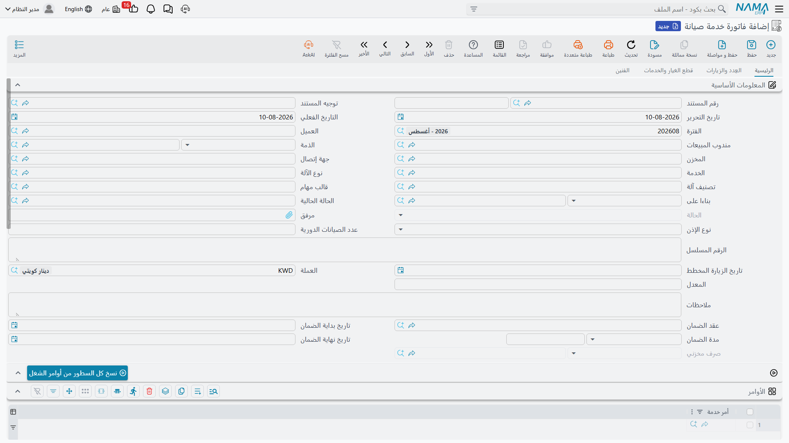

# فوترة خدمات الصيانة

هذه هي الصفحة التي تقرّر ما إذا كان فرع سندات خدمات الصيانة يصلح لتشغيل عملك. اقرأ صندوق الخطر قبل أي شيء آخر.

::: info الرخصة المطلوبة
فاتورة خدمة الصيانة ومردود فاتورة خدمة الصيانة يحتاجان كود الرخصة `crm-maintenance-services`.
:::

::: danger فرع الخدمات لا يستطيع أن يحاسب إلا على قطع الغيار
سطر الخدمة في هذا الفرع بلا صنف وبلا كمية وبلا سعر. ولا مكان على أي شاشة تضع فيه أجرًا للعمل نفسه. وخانة **إجمالي سعر الخدمات** **صفر دائمًا** — على العقد والأمر وسند التنفيذ والفاتورة والمردود — و**إيراد الخدمة لا يصل إلى الدفاتر أبدًا**.

**فاتورة خدمة الصيانة تحاسب على قطع الغيار ولا شيء غيرها.**

فإن كان منتجك *هو* العمالة — نظافة أو حراسة أو صيانة شهرية بأجر مقطوع — فهذه المجموعة لا تستطيع فوترته بوضعها الحالي. والطريق الوحيد الذي يدعمه المنتج هو تسجيل أجر الخدمة كصنف مخزني أو خدمي ووضعه في جدول **قطع الغيار** ليُحاسَب عليه كقطعة. فإن لم يكن ذلك مقبولًا، فاستعمل فرع صيانة الآلات الذي فيه سطور خدمات مسعّرة؛ وصفحة [خدمات أم آلات؟](/ar/modules/crm/services-suite/crm-services-suite-overview) تشرح المفاضلة.
:::

## إصدار الفاتورة

هناك زرّان ينتجانها، وسلوكهما واحد: **إنشاء فاتورة خدمة** على أمر خدمة الصيانة، ونظيره على سند تنفيذ أمر خدمة الصيانة. وكلاهما يفتح فاتورة خدمة صيانة جديدة منسوخًا فيها المستند المصدر كاملًا — العميل والاتصال والخدمة والحالة ونوع الأمر ومندوب المبيعات والرقم المسلسل وحقول الضمان ومجموعات المال الأربع في الرأس، والخدمات والأعطال والعُدد وقطع الغيار والفنيون ومجموعات الصيانة وقطع الغيار المرتجعة في الجداول. ويُدرَج الأمر الذي تجري فوترته في جدول الأوامر على الفاتورة.

وتُصدر «النخبة» فاتورة الأمر `SO-0058` يوم ١٦ مايو ٢٠٢٦ بالرقم `SINV-0033`:

| | |
|---|---|
| قطعة الغيار `SP-FLT-10` × ٨ بسعر ١٨٠٫٠٠ | **١٬٤٤٠٫٠٠** |
| **إجمالي سعر الخدمات** | **٠٫٠٠** |
| الإجمالي | ١٬٤٤٠٫٠٠ |
| ضريبة مبيعات ١٤٪ | ٢٠١٫٦٠ |
| صافي القيمة | **١٬٦٤١٫٦٠** |

ساعتان ونصف من وقت الفني دخلت تلك الزيارة، ولا شيء منها يظهر على الفاتورة، لأنه لا مكان لها فيها.

## ماذا يفعل حفظ الفاتورة

الحفظ فوري، وتُنشأ الآثار كطلبات أعمال تُعالَج في الخلفية، فراقب حالة المعالجة على المستند لا زرّ الحفظ. وإن فشل شيء أُعيدت معالجته من شاشة قائمة **طلبات الأعمال** — افلترها على الحالة الفاشلة، واختر السطور، ثم **المزيد ← إعادة المعالجة**.

**القيد المحاسبي.** تُنشئ الفاتورة قيدًا بيعيًا كاملًا من الطرفين المدين والدائن على توجيه مستندها، مع أطراف الضريبة والخصم والنقدية ورسوم الخدمة المضبوطة هناك. وفي `SINV-0033` هو ١٬٦٤١٫٦٠ على ذمة العميل، و١٬٤٤٠٫٠٠ لإيراد قطع الغيار، و٢٠١٫٦٠ لضريبة المبيعات. ولا تحمل قيمةً إلى القيد إلا سطور قطع الغيار — إذ لا يوجد غيرها ليحمل شيئًا.

**سند الصرف المخزني.** إن كان توجيه مستند الفاتورة يسمّي دفتر صرف مخزني وتوجيهه وكان خيار **إنشاء سند صرف مخزني بقطع الغيار** مؤشَّرًا، أنشأ حفظُ الفاتورة سندَ صرف مخزني حقيقيًا وتذكّره في حقل **صرف مخزني** للقراءة فقط في الرأس. وتنتج `SINV-0033` السند `SI-1955` من المخزن `WH-ALX` بـ ٨ × `SP-FLT-10`. **وهذا هو المستند الذي يُخرج القطع من المخزن فعلًا** — لا الأمر ولا سند التنفيذ.

::: warning القطع تخرج دائمًا من مخزن الرأس
يأخذ سند الصرف المولَّد مخزنه من **رأس** الفاتورة. أما عمودا المخزن والموقع على سطور قطع الغيار فيُتجاهلان، وكذلك أسعار السطور ومحددات الصنف والملاحظات. فالزيارة التي تسحب قطعًا من مخزنين مختلفين لا يمكن تسجيلها بشكل صحيح على فاتورة واحدة — قسّمها.

والأسوأ أن فاتورة خدمة الصيانة **لا تشترط** وجود مخزن في الرأس رغم أنها تولّد سند صرف. وتركه فارغًا ينتج خطأ فنيًا خامًا عند الحفظ بدل رسالة تحقق مفهومة. فاملأه دائمًا. (أما مردود فاتورة خدمة الصيانة فيشترطه.)
:::

::: warning خياران على التوجيه لا يفعلان شيئًا هنا
تأشير **إنشاء سند صرف مخزني بأصناف الخدمات** على توجيه الفاتورة ينتج سند صرف **فارغًا**، لأنه لا توجد سطور خدمات مسعّرة ليقرأها.

وعدد آخر من الخيارات على شاشتَي توجيه الفاتورة والعقد لا أثر له في هذا الفرع كذلك: *نقل المتبقي إلى النقدية*، و*سداد الأقساط بالترتيب*، و*السماح بسداد أكثر من قيمة الفاتورة*، و*استخدام مستندات السداد في أعمار الديون*، و*السعر الافتراضي من قائمة الأسعار*. فهذا الفرع بلا سطور سداد وبلا أقساط وبلا مدفوعات خارجية إطلاقًا. بل إن *سداد الأقساط بالترتيب* يظهر **مرتين** على توجيه العقد. اتركها كلها؛ فتأشيرها لا يغيّر شيئًا.
:::

## إلغاء الفاتورة لا يتراجع عنها

::: danger الفاتورة الملغاة تترك قيدها المحاسبي وسند صرفها المخزني قائمَين
إلغاء **فاتورة خدمة الصيانة** أو حذفها **لا** يعكس قيدها المحاسبي و**لا** يلغي سند الصرف المخزني الذي ولّدته. فالقيد يبقى في الدفاتر والقطع تبقى مصروفة. وتعديل فاتورة محفوظة يعيد تطبيق أثرها **بدون** عكس الأثر السابق أولًا، فقد تترك الفاتورة المعدَّلة قيدًا مضاعفًا خلفها.

ومردود فاتورة خدمة الصيانة هو الطريق الصحيح الوحيد لعكس فاتورة خدمة. لا تُلغِ الفاتورة وتفترض أن الدفاتر سليمة — بل افحص القيد وسند الصرف يدويًا إن كان أحدهم قد فعلها بالفعل.
:::

وهذا هو الفرق الأغلى ثمنًا بين هذا الفرع وفرع الآلات، حيث تعكس الفاتورة نفسها بشكل سليم. فابنِ إجراءات عملك عليه: **صحّح بمردود، لا بإلغاء أبدًا.**

::: warning لا تضغط «إعادة إنشاء الآثار المحاسبية» على فاتورة خدمة أو عقد خدمة
الإجراء موجود في شريط الأدوات على الشاشتين وهو لا يعمل على أيٍّ منهما. وضغطه إما أن يفشل تمامًا أو يفرّغ قيد المستند. فإن احتاج قيدٌ إلى إعادة بناء، فاطرح الأمر على ممثل «نما» بدل ضغط الزر.
:::

## استحقاق العقد لا يُستهلك أبدًا

إن كان عقدك يسرد استحقاقًا — و`SVC-0006` يحمل ٣١٢ فلترًا — فستتوقع أن فوترة ٨ منها تترك ٣٠٤ متبقية. وهذا لا يحدث.

::: warning «ما تم بيعه» و«المتبقي» عمودان يدويان
لا شيء في فرع الخدمات يستهلك استحقاق العقد. فالفوترة لا تزيد **ما تم بيعه** ولا تنقص **المتبقي**، والتحقق الذي يُفترض أن يرفض كمية تتجاوز المتبقي لا يعمل هنا. وبعد تسع وثلاثين زيارة يظل `SVC-0006` يعرض ٣١٢ متبقية.

وهناك غرابة مقابلة في طريق العودة: إلغاء **مردود فاتورة خدمة الصيانة** *يعدّل* العقد فعلًا — إذ يضيف الكمية إلى المتبقي ويطرحها مما تم بيعه — رغم أن شيئًا لم يأخذها أصلًا. فيدفع ذلك «ما تم بيعه» إلى قيمة سالبة. فإن رأيت «ما تم بيعه» بالسالب على عقد خدمة فهذا هو السبب؛ صحّح كميات العقد يدويًا.
:::

## المردودات

**مردود فاتورة خدمة الصيانة** هو عكس الفاتورة، وهو الأحسن سلوكًا بينهما. ينشئ قيدًا شرائيًا من توجيه مستنده الخاص، ويولّد **سند توريد مخزني** من دفتر التوريد وتوجيهه على التوجيه حين يكون خيار *إنشاء سند توريد مخزني بقطع الغيار* مؤشَّرًا. وبخلاف الفاتورة، فهو يعلن مجموعة آثاره كاملة، فإلغاء المردود **يعكس** قيده فعلًا ويلغي سند التوريد.

كما أنه **يشترط وجود مخزن** قبل الحفظ — وهو التحقق الوحيد الناقص على الفاتورة.

ومثل الفاتورة، خيار *إنشاء سند توريد مخزني بأصناف الخدمات* عليه لا يفعل شيئًا، و«إجمالي سعر الخدمات» عليه ٠٫٠٠.

## حين يرفض مستند الحفظ بخطأ فني

تقرأ الفاتورة والمردود توجيه مستندهما دون التحقق من أن إعداداته مُلئت أصلًا. والمستند المحفوظ على توجيه تُركت صفحة إعداداته فارغة يفشل بخطأ فني خام بدل رسالة مفهومة. فإن أبلغ مستخدم عن خطأ غير مفهوم عند الحفظ، فافحص توجيه المستند أولًا: فهو في الغالب توجيه أُنشئ ولم يُضبط قط.

وإعدادات التوجيه المهمة فعلًا هنا مشروحة في [توجيهات مستندات الصيانة](/ar/modules/crm/document-terms/crm-maintenance-terms).

## التقارير عن أي من هذا

**لا توجد تقارير نظام ولا لوحات معلومات لخدمة العملاء إطلاقًا**، ولا شيء منها لهذا الفرع بخاصة. والمتاح لك هو شاشة القائمة وأعمدتها وفلاترها، والتصدير إلى Excel، وما يبنيه موقعك من لوحات ذكاء أعمال. فإن طلب أحدهم «تقرير إيرادات الخدمات»، فالجواب الصادق الأول هو ما في أعلى هذه الصفحة: في هذا الفرع لا وجود لإيراد الخدمة كرقم يحتفظ به النظام.
