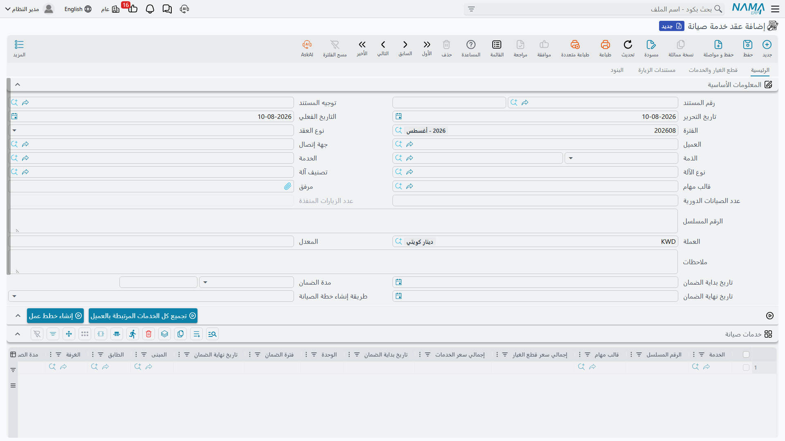
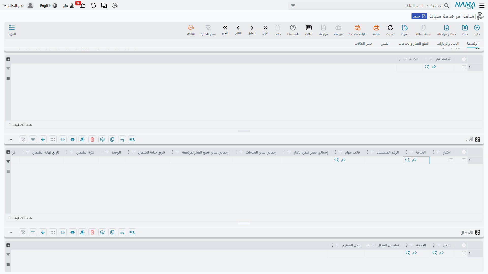
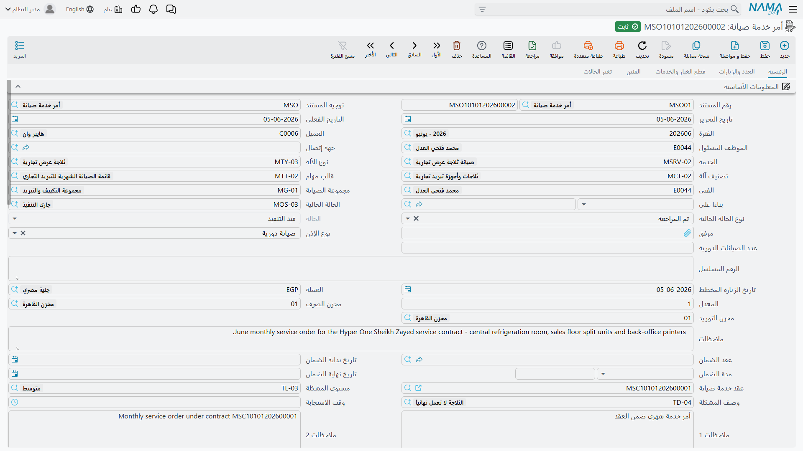

# أوامر الخدمة وسندات تنفيذها

تتابع هذه الصفحة عقدًا واحدًا من يوم توقيعه إلى يوم يؤشّر فيه الفني على آخر بند في قائمة المهام. وهي النصف العملي من مجلد سندات خدمات الصيانة؛ أما المال ففي صفحة [فوترة خدمات الصيانة](/ar/modules/crm/services-suite/crm-service-invoicing).

::: info الرخصة المطلوبة
كل شاشة في هذه الصفحة تحتاج كود الرخصة `crm-maintenance-services`. أما قوالب المهام والحالات والمباني والتصنيفات التي تشير إليها فمرخّصة تحت `crm-maintenance`.
:::

## سلسلة العمل، وأي خطوة تلقائية

| من | إلى | كيف |
|---|---|---|
| عرض أسعار خدمة صيانة | أمر بيع خدمة صيانة | يدويًا |
| أمر بيع خدمة صيانة | عقد خدمة صيانة | يدويًا |
| عقد خدمة صيانة | خطط عمل خدمة صيانة | زر **إنشاء خطط عمل** |
| خطة عمل خدمة صيانة | أوامر خدمة صيانة | زر **إنشاء أوامر** |
| بلاغ خدمة صيانة | أمر خدمة صيانة | يدويًا، بجعل البلاغ *مستند المصدر* |
| أمر خدمة صيانة | تنفيذ أمر خدمة صيانة | زر **إنشاء سند تنفيذ لكل السطور** |
| تنفيذ أمر خدمة صيانة | حالة السطر على الأمر | تلقائيًا عند الحفظ |

كل خطوة في هذا الجدول **زرّ يضغطه إنسان**. ولا شيء في هذا المجلد يحدث بمؤقت. لا مجدول ولا تذكير ولا منبّه ولا إشعار في وحدة خدمة العملاء كلها، فالعقد الذي لا يفتحه أحد لا ينتج خطط عمل، وخطة العمل التي لا يفتحها أحد لا تنتج أوامر.

## عقد خدمة الصيانة

العقد هو موضع تسجيل الاتفاق التجاري، ومنه يأتي تقويم الزيارات. واتفاق «النخبة» مع بنك النيل التجاري هو العقد `SVC-0006` بتاريخ ١ مايو ٢٠٢٦.

**في التبويب الرئيسي** تضبط نوع العقد والعميل (`C-02240`) والاتصال و**الذمة** — الحساب الذي سيُقيَّد عليه — إضافة إلى العملة ونوع إنشاء خطة العمل.

::: tip تواريخ العقد معنونة بـ«الضمان»
تاريخا بداية العقد ونهايته هما الحقلان المعنونان **تاريخ بداية الضمان** و**تاريخ نهاية الضمان**. وليسا ضمانًا بأي معنى مفيد هنا — بل هما مدة سريان العقد، ومولّد خطط العمل يقرأ هذين الحقلين بالضبط. وفي `SVC-0006` يحملان ١ مايو ٢٠٢٦ و١ نوفمبر ٢٠٢٦. وكثير من المواقع تعيد تسميتهما إلى *تاريخ بداية العقد* و*تاريخ نهاية العقد*، وهو تعديل يستحق العناء.
:::

**جدول الخدمات** يحمل سطرًا لكل موقع مخدوم. ولكل سطر تختار **أنواع الزيارات من ١ إلى ٧** — حتى سبعة تكرارات مستقلة على الموقع نفسه — لكلٍّ منها قالب مهام خاص، إضافة إلى الموظف الذي سينفّذ العمل والمبنى. وفروع بنك النيل الثلاثة كلها **نصف شهرية** بقالب `TT-BRN-B` والموظف `EMP-2014`.

::: warning جدول الخدمات على هذه الشاشة وعلى أمر الخدمة معنون «ألآت»
على أمر خدمة الصيانة يحمل الجدول الذي يضم سطور الخدمات عنوان **ألآت**، ويحمل كذلك أعمدة تصنيف الآلة والعدّاد. وكل سطر فيه خدمة. العنوان خطأ والسطور صحيحة؛ تجاوز العنوان. ولا تضيّع وقتك بحثًا عن جدول آلات منفصل، فلا وجود له في هذا الفرع إطلاقًا.
:::

وهذا هو الجدول المقصود — معنوناً **ألآت**، وأول أعمدته الخدمة وقالب المهام:

**تبويب قطع الغيار والخدمات** يحمل استحقاق القطع — وفي `SVC-0006` هو ٣١٢ فلترًا (`SP-FLT-10`) بسعر ١٨٠٫٠٠ للواحد، أي ٣٩ زيارة مخططة × ٨ فلاتر لكل زيارة — ومعه عمودا **ما تم بيعه** و**المتبقي**. وتحت القطع تجلس مجموعة **إجمالي سعر الخدمات** وقيمتها ٠٫٠٠، وستبقى ٠٫٠٠ طوال عمر العقد: فسطور الخدمات في هذا الفرع بلا سعر إطلاقًا.

**تبويب البنود** هو جدول مستوى الخدمة: مستوى العطل ووصفه وزمن الاستجابة، ومعها عمودا ملاحظات. وهو جدول مرجعي على العقد؛ ولا شيء يقيس استجابة فعلية عليه.

**وعند حفظ العقد** يُنشَأ قيد محاسبي على **سطور قطع الغيار وحدها** — وفي `SVC-0006` هو ٦٤٬٠٢٢٫٤٠ على ذمة العميل، و٥٦٬١٦٠٫٠٠ لإيراد قطع الغيار، و٧٬٨٦٢٫٤٠ ضريبة مبيعات. ولا يحدث ذلك إلا إذا كان توجيه مستند العقد يحمل طرفًا مدينًا **وطرفًا** دائنًا معًا؛ فإن خلا أحدهما لم يُنشَأ شيء وأُلغي أي قيد قائم. وكسائر آثار المستندات تُعالَج هذه في الخلفية، فالحفظ فوري وحالة المعالجة ظاهرة على المستند. والعقد لا يحرّك مخزونًا.

::: warning الاستحقاق لا يُستهلك أبدًا
لا شيء في هذا الفرع يزيد «ما تم بيعه» أو ينقص «المتبقي». فالأوامر والفواتير لا تستهلك العقد، والتحقق الذي يُفترض أن يرفض كمية تتجاوز المتبقي لا يعمل هنا إطلاقًا. عامل هذين العمودين على أنهما مسك دفاتر يدوي وسوِّهما بنفسك.
:::

::: warning تبويبان فارغان دائمًا
تبويب **عدد الزيارات** على العقد — وقائمة **زيارات الصيانة** في تبويب العُدد والزيارات على الأمر والفاتورة والمردود — كلها تعرض مستند الزيارة الخاص بمجموعة **الآلات**. ولا يوجد مستند زيارة في فرع الخدمات، فلا يمكن أن تظهر فيها سطور مهما أُنجز من عمل. سند التنفيذ هو ما يسجّل الزيارة هنا.
:::

## إنشاء خطط العمل

بعد حفظ العقد اضغط **إنشاء خطط عمل**. يحتاج المولّد إلى دفتر خطة العمل وتوجيهها مذكورَين في توجيه مستند العقد، ويحتاج إلى تاريخَي بداية العقد ونهايته؛ ويرفض العمل بدونها.

فلكل سطر خدمة، ولكل نوع زيارة عليه، يمشي إلى الأمام من تاريخ بداية العقد خطوة خطوة ويُخرج زيارة مخططة حتى يتجاوز تاريخ نهاية العقد. وأطوال الخطوات هي:

| نوع الزيارة | الخطوة |
|---|---|
| يومية | يوم واحد |
| أسبوعية | ٧ أيام |
| **نصف شهرية** | **١٤ يومًا** |
| شهرية | شهر |
| ربع سنوية | ٣ أشهر |
| نصف سنوية | ٦ أشهر |
| سنوية | ١٢ شهرًا |

::: warning «نصف شهرية» خطوتها ١٤ يومًا لا شهران
الاسم الإنجليزي *Bimonthly* يُقرأ «كل شهرين»، بينما العربي «نصف شهرية» يُقرأ «مرتين في الشهر» — والعربي هو المطابق للسلوك. فإن كنت تقصد كل شهرين فلا يوجد نوع زيارة لذلك: استعمل الشهرية واحذف السطور بالتناوب، أو استعمل ربع السنوية.
:::

وفي `SVC-0006` يعطي ذلك ١٣ تاريخًا لكل فرع — ١٥ و٢٩ مايو، و١٢ و٢٦ يونيو، وهكذا حتى ٣٠ أكتوبر، إذ يقع التالي بعد نهاية العقد — أي ١٣ × ٣ فروع = **٣٩ زيارة مخططة**، ومن هنا جاء الـ ٣١٢ فلترًا. وتُجمَّع هذه السطور الـ ٣٩ في خطط عمل بحسب **نوع إنشاء خطة العمل**؛ و`SVC-0006` يستعمل *إنشاء خطة الصيانة بناء على فترة العقد*، الذي يجمّع بحسب شهر التاريخ المتوقع، فينتج ست خطط عمل من `SWP-0011` إلى `SWP-0016`.

وإن وقع أول تاريخ زيارة محسوب بعد تاريخ نهاية العقد، فشل الإجراء كله برسالة *«نوع الزيارة {0} بعد تاريخ نهاية العقد {1} في السطر رقم {2}»* — وغالبًا ما يعني ذلك أن تاريخَي العقد معكوسان.

::: warning إعادة تشغيل المولّد تحذف خطط عمل
ضغط *إنشاء خطط عمل* مرة أخرى ليس تحديثًا آمنًا. فخطط العمل التي لم يعد تجميعها مطابقًا **تُحذف**، وتأخذ معها روابط سطورها بالأوامر. فإن غيّرت تواريخ العقد أو أنواع الزيارات على عقد له أوامر جارية، فتوقّع فقدان الأثر بينها.
:::

وخطة العمل **بلا أثر محاسبي وبلا أثر مخزني** — هي تقويم يحمل رقم مستند.

## إنشاء الأوامر

افتح خطة عمل واضغط **إنشاء أوامر**. ويأتي دفتر الأوامر الجديدة وتوجيهها من توجيه مستند خطة العمل.

تُجمَّع السطور بحسب **(التاريخ المتوقع، الموظف، المبنى)** ويُنشأ أمر خدمة واحد لكل مجموعة. وتحمل `SWP-0011` تاريخين على ثلاثة مبانٍ، فتنتج ستة أوامر من `SO-0058` إلى `SO-0063`. ويأخذ كل أمر تاريخه الفعلي من التاريخ المتوقع للسطر، وعقد خدمة الصيانة من مستند مصدر خطة العمل، وتُنسخ إليه خدمة الرأس وقالب المهام والفني ومجموعة الصيانة والاتصال والعميل وحقول الضمان ومصنّفات السعر.

وضغط الزر ثانية **يعدّل الأمر الذي أنشأه في المرة السابقة** بدل إنشاء نسخة مكررة — فسطر خطة العمل يتذكر الأمر الذي أنتجه.

وهناك طريق ثانٍ أنظف إلى الشاشة نفسها: زر **تجميع الخدمات ذات نفس الخصائص** يضمّ سطور خطة العمل المتشابهة في خصائصها قبل الإنشاء، وهو مفيد للعقود ذات المواقع الكثيرة على جداول متطابقة.

## أمر خدمة الصيانة

الأمر `SO-0058` — تاريخه الفعلي ١٥ مايو ٢٠٢٦، ومستند مصدره `SWP-0011`، وعقد خدمة الصيانة `SVC-0006`، والخدمة `SRV-0071`، والموظف `EMP-2014` — هو أمر عمل. يسرد الخدمات المطلوب زيارتها، والأعطال المكتشفة، وقطع الغيار المتوقعة (٨ × `SP-FLT-10` بقيمة ١٬٤٤٠٫٠٠)، والعُدد التي ستُحمل، والفنيين ومكافآتهم، ويحتفظ بسجل الحالات.

::: warning أمر الخدمة لا يُنشئ شيئًا في الدفاتر ولا يحرّك مخزونًا
بخلاف أمر الصيانة في مجموعة الآلات، فأمر خدمة الصيانة **بلا أثر محاسبي إطلاقًا** — فطبقة المحاسبة في مستند الأمر تخص فرع الآلات وحده. والصفحتان المدينة والدائنة مخفيتان بشكل صحيح على توجيه مستنده، وهذه هي الإشارة الصادقة. و«إجمالي سعر الخدمات» عليه ٠٫٠٠ كما في كل مكان. لا شيء من الأمر يصل إلى دفتر الأستاذ العام؛ الفاتورة وحدها هي التي تصل.
:::

وحقلان في الرأس يسببان مشكلات متكررة:

::: warning استعمل «عقد خدمة صيانة» لا «عقد الضمان»
يحمل الرأس حقلَي **عقد خدمة صيانة** و**عقد الضمان**. والأول وحده عقد خدمة. أما بحث «عقد الضمان» فيبحث في عقود مجموعة **الآلات**، ويُتوقع أن يفشل اختيار أحدها بخطأ فني بدل نسخ أي تواريخ. املأ «عقد خدمة صيانة» واترك «عقد الضمان» فارغًا. والمصيدة نفسها موجودة على بلاغ خدمة الصيانة وفاتورة خدمة الصيانة.
:::

::: warning أعمدة الإجماليات والعدّاد لا تملأ نفسها أبدًا
إجمالي سعر قطع الغيار، وإجمالي سعر الخدمات، وإجمالي سعر قطع الغيار المرتجعة، وآخر عدّاد، والعدّاد الحالي، و«الفرق بين العدّاد الحالي والسابق» على سطور الخدمة لا يحسبها شيء في هذا الفرع. تبقى فارغة ما لم يكتب فيها أحد، واختيار خدمة لا يملأ عميل الرأس ولا الاتصال تلقائيًا. ولا يوجد تتبّع عدّاد للخدمات — ومع ذلك يرفض الأمر الحفظ إن تساوى تاريخ العدّاد الحالي مع تاريخ العدّاد السابق على سطر، فاترك الحقلين فارغين.
:::

**وما الذي يرفض الأمر الحفظ لأجله.** مجموع مكافآت الفنيين في الجدول يجب أن يساوي مكافأة الرأس؛ وكل خدمة مستعملة في سطر قطع غيار أو عُدد أو أعطال يجب أن تظهر في جدول الخدمات؛ ولا يجوز إدراج الخدمة نفسها وقالب المهام نفسه مرتين؛ ولا يجوز إضافة سطور تغيّر الحالات أو حذفها أو تعديلها يدويًا. وهذه القاعدة الأخيرة هي سبب كون تبويب **تغير الحالات** للقراءة فقط على الشاشة: فكل سطر فيه يُكتب تلقائيًا عند تغيير الحالة الحالية، مسجّلًا الحالة السابقة والحالة الجديدة والتوقيت والمستخدم والملاحظة، ثم يفرّغ خانة الملاحظة.

**ونوع الحالة** يُنسخ من الحالة التي تختارها. فإن كانت سجلات حالة أمر الصيانة لديك بلا نوع حالة، فدورة حياة الأمر لا تسجّل شيئًا مفيدًا — وتفصيل هذا الإعداد موجود مع الحالات نفسها في ملفات الصيانة.

**وإخراج القطع من المخزن** خطوة يدوية هنا. فزرّا **طلب صرف قطع غيار** و**طلب صرف عِدد** على الأمر يفتحان طلب صرف مخزني معبّأً مسبقًا على المستخدم أن يحفظه؛ وزر **طلب توريد قطع غيار المرتجعة** يفعل المثل للقطع المرتجعة. ولا شيء يخرج من المخزن عند حفظ الأمر. وتنبيهان: زر طلب صرف العُدد يظهر مرتين بالعنوان نفسه، وأحدهما ينتج في الحقيقة طلب **توريد** لا طلب صرف — فافحص المستند الذي يُفتح قبل حفظه. كما يصل طلب التوريد بحقل «مستند المصدر» فارغًا، فاكتب الرابط بنفسك إن كنت تعتمد عليه.

## العمل الطارئ: بلاغ خدمة الصيانة

ليس كل شيء مخططًا. فحين يبلّغ فرع عن عطل، يكون مستند الاستقبال هو **بلاغ خدمة صيانة**: العميل والخدمة ومستوى العطل ووصفه وزمن الاستجابة والأعطال المكتشفة وأي قطع يُرجّح لزومها. حرّكه بين الحالات مع تقدّم العمل — فكل تغيير يُسجَّل على تبويب تغير الحالات تلقائيًا — ثم افتح أمر خدمة صيانة وضع البلاغ **مستندَ المصدر** له.

والبلاغ **بلا أثر محاسبي وبلا أثر مخزني**. هو سجل عطل لا أكثر. وليس له **توجيه مستند**، فحقل التوجيه على شاشته بلا خيارات خلفه. وبخلاف بلاغ مجموعة الآلات، **لا يوجد عليه تسجيل حضور وانصراف من الجوال** — فخاصية حضور الفني في تطبيق «نما» تخص فرع الآلات وحده.

## سند التنفيذ

سند التنفيذ هو ما يملؤه الفني. فمن الأمر يُنشئ زر **إنشاء سند تنفيذ لكل السطور** — أو *للسطور المختارة* — سندَ **تنفيذ أمر خدمة صيانة** لكل سطر خدمة، بدفتر وتوجيه من توجيه مستند الأمر. وإن كان ذلك التوجيه يحمل خيار اعتبار مهام قالب المهام مفعّلًا، وصل كل سند تنفيذ وقائمة المهام محمّلة فيه.

والسند `SEX-0090` هو تنفيذ `SRV-0071` يوم ١٥ مايو ٢٠٢٦. يضغط الفني **بدء** الساعة ٩:٠٠ لتثبيت وقت البداية، ويمر على بنود القائمة الخمسة، ويسجّل القطع المستعملة فعلًا (٨ × `SP-FLT-10`)، ثم يضغط **إنهاء** الساعة ١١:٣٠. فيخرج صافي الوقت ٢:٣٠. وزر **تعليم كل السطور كمنفذة** يؤشّر القائمة كلها دفعة واحدة، وزر **تغيير الحالة إلى جارٍ التنفيذ** موجود للعمل الممتد على أيام.

**وماذا يفعل الحفظ:** يكتب سند التنفيذ حالته على السطر المطابق في الأمر الأب، ثم يضبط نوع حالة الأمر كله — *جارٍ التنفيذ* إن كان أي سطر ما زال جاريًا أو أُعيد فتحه، و*منتهٍ* فيما عدا ذلك. وإلغاء سند التنفيذ يمسح الرابط والحالة من تلك السطور.

::: warning سند التنفيذ لا يحرّك مخزونًا ولا مالًا
رغم أنه يسرد قطع الغيار ويعرض إجماليات مالية، فسند تنفيذ أمر خدمة الصيانة **بلا أثر محاسبي وبلا أثر مخزني**. هو سجل عمل. والقطع تتحرك إما بحفظ أحد طلبات المخزن المعبّأة التي تفتحها أزراره، وإما بالفاتورة — ولا شيء يتحقق من أن أحدهما قد تم.
:::

وسند التنفيذ هو أيضًا المستند الوحيد في هذا المجلد الذي **ليس له صنف توجيه مستند إطلاقًا**. حقل التوجيه على شاشته؛ ولا إعدادات خلفه. ولنظيره في مجموعة الآلات توجيه، ولذلك تتشابه الشاشتان وتختلف السلوكيات.

وأربعة مستندات في هذا المجلد — خطة العمل وأمر البيع وعرض الأسعار وسند التنفيذ — **لا تجري أي تحقق إطلاقًا** عند الحفظ. فما عدا الدفتر والكود والمحددات، لا يُفحص شيء عليها. لا تعتمد على النظام في التقاط خطأ في خطة عمل.

وحين ينتهي العمل تكون [فوترة خدمات الصيانة](/ar/modules/crm/services-suite/crm-service-invoicing) هي الخطوة التالية والأخيرة — وهي صاحبة أهم تحذير في هذا المجلد.
