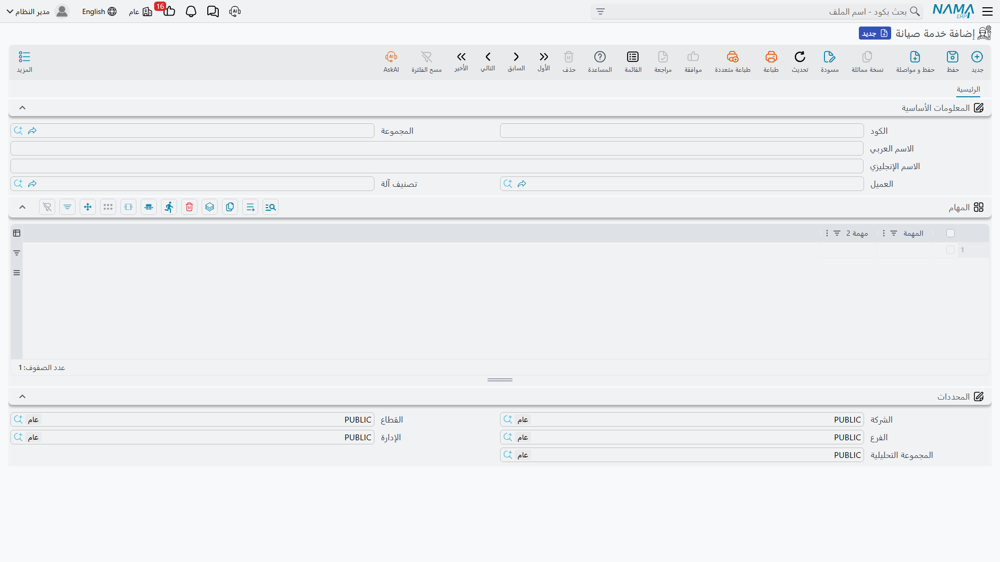

# سجلات الخدمة

كل مستند في مجلد سندات خدمات الصيانة يشير إلى شيء يجري خدمته. في مجلد صيانة الآلات ذلك الشيء آلة — ضاغط له رقم مسلسل وضمان ومالك. أما هنا فهو **خدمة صيانة** (Maintenance Service): عمل دوري باسم معيّن في مكان معيّن.

تخدم «النخبة» التكييف في ثلاثة فروع لبنك النيل التجاري. وهذه ليست خدمة واحدة ولا ثلاث آلات — بل ثلاثة سجلات خدمة:

| الكود | الاسم العربي | الاسم الإنجليزي | العميل |
|---|---|---|---|
| `SRV-0071` | صيانة تكييف فرع سموحة | AC servicing – Smouha Branch | `C-02240` |
| `SRV-0072` | صيانة تكييف فرع سيدي جابر | AC servicing – Sidi Gaber Branch | `C-02240` |
| `SRV-0073` | صيانة تكييف فرع المنشية | AC servicing – Manshia Branch | `C-02240` |

كل واحد منها سطر على العقد، وسطر على خطة العمل، وأمر خدمة مستقل، وسند تنفيذ مستقل. فإن ضبطت درجة تفصيل هذه السجلات جاء باقي المجلد سهلًا؛ وإن أخطأتها — بسجل واحد للبنك كله مثلًا — وجدت أنك لا تستطيع إرسال فني إلى فرع بعينه.

::: info الرخصة المطلوبة
ملف خدمة الصيانة يحتاج كود الرخصة `crm-maintenance-services`. لكن معظم حقول المرجع التي عليه تابعة للرخصة `crm-maintenance` — انظر الملاحظة في آخر الصفحة.
:::

## ما الموجود على السجل

ملف قصير، وعن قصد:

| الحقل | بالإنجليزية | ملاحظات |
|---|---|---|
| الاسم | Name | الاسم العربي هو `name1` والاسم الإنجليزي هو `name2` |
| العميل | Customer | حامل للحِمل — انظر أدناه |
| تصنيف آلة | Machine Category | مستعمل فعلًا: يفلتر بحث قالب المهام على المستندات |
| المهام | Tasks | قائمة المهام المحفوظة على هذا السجل |

وهذا يكاد يكون الملف كله. **لا رقم مسلسل ولا فترة ضمان ولا عدّاد ولا سجل ملكية ولا سعر** على سجل الخدمة. وإن كنت قرأت صفحة ملف الآلة فستلاحظ حجم ما هو غائب — وهذا الغياب هو الفرق الصادق بين الفرعين، لا شيء ينتظر التفعيل.

::: tip السجل ملف رئيسي لا مستند
«خدمة صيانة» ليس لها دفتر ولا توجيه مستند ولا تاريخ فعلي ولا رقم مستند ولا دورة اعتماد. ولا شيء يُعالَج عند حفظها، وليس لها أثر محاسبي ولا مخزني. تعامل معها تمامًا كما تتعامل مع عميل أو صنف: بيانات مرجعية تشير إليها المستندات.
:::

### حقل العميل هو الحقل المهم

كل ما بعد ذلك تقريبًا يرتكز على العميل المسجَّل هنا.

على شاشة العقد زرّ **تجميع كل الخدمات المرتبطة بالعميل**، يحمّل كل سجل خدمة يطابق عميله عميلَ رأس العقد ويستبدل جدول الخدمات بسطر لكل سجل. وهو أسرع طريقة لبناء عقد لعميل له عشرات المواقع — وهو أعمى تمامًا عن أي سجل خانة العميل فيه فارغة. الخدمة بلا عميل غير مرئية له، والزر نفسه يردّ برسالة *«يجب إدخال العميل»* إن كان رأس العقد بلا عميل.

### من أين يأتي الموقع

يحمل السجل داخليًا حقول المبنى والدور والغرفة، لكن **هذه الحقول ليست على شاشته**. وعمليًا تضبط الموقع على **سطور المستند** — فجدول الخدمات على العقد أو خطة العمل أو الأمر أو سند التنفيذ يحمل أعمدة المبنى والدور والغرفة الخاصة به، وهي التي يستعملها مولّد الأوامر حين يقرّر كم أمر خدمة يُنشئ لليوم الواحد.

ويستحق هذا أن تعرفه قبل تصميم بياناتك: فرعان في المبنى نفسه سيُجمعان في أمر خدمة واحد، لأن مفتاح التجميع هو التاريخ والموظف و**المبنى**.

## إنشاء سجلات الخدمة

هناك طريقان، وليسا متساويين في الاكتمال.

### يدويًا

افتح **خدمة العملاء ← سندات خدمات الصيانة ← خدمة صيانة**، وأعطها اسمًا عربيًا وآخر إنجليزيًا، واضبط العميل، واضبط «تصنيف آلة» ليمكن العثور على قوالب المهام، واملأ قائمة المهام. هذا هو الطريق الذي ينتج سجلًا صالحًا للاستعمال، وهو الطريق الصحيح لعدد محدود من المواقع.

### من أمر بيع خدمة

حين تعرض على عميل له أربعون فرعًا، فكتابة أربعين ملفًا رئيسيًا أولًا ليست معقولة. لذلك يتيح لك عرض الأسعار وأمر البيع كتابة **اسم الخدمة** في كل سطر من جدول الخدمات ثم إنشاء الملفات الرئيسية بعد ذلك: املأ السطور، واحفظ أمر البيع، ثم اضغط **إنشاء الخدمة**. فلكل سطر له اسم بلا مرجع خدمة يُنشأ سجل «خدمة صيانة» ويُربط بالسطر.

::: warning سجلات الخدمة المولَّدة قوالب ناقصة يجب إتمامها يدويًا
لا يملأ المولّد إلا **الاسم العربي** (من اسم الخدمة في السطر) والكود (من مجموعة الخدمة) والمبنى والدور والغرفة والمحددات. وهو **لا** يضبط **العميل**، ولا يملأ **قائمة المهام**، ويترك **الاسم الإنجليزي فارغًا**.

ولذلك نتيجتان تظهران فورًا:

- *تجميع كل الخدمات المرتبطة بالعميل* لا يجد أيًّا منها، لأنها بلا عميل.
- سندات التنفيذ المولَّدة لها تصل بلا قائمة مهام يؤشّر عليها الفني.

فبعد ضغط *إنشاء الخدمة*، افتح كل سجل أنشأه وأعطه عميلًا واسمًا إنجليزيًا ومهامه. ولا شيء ينبّهك إلى أن هذه الخطوة ما زالت معلّقة.
:::

وهناك أمر آخر ينبغي أن تعرفه عن مستندات البيع ما دمت هناك: فيها حقل **اسم الخدمة** على الرأس إلى جانب عمود الجدول، لكن حقل الرأس **لا يظهر على أي تبويب إطلاقًا**. الموجود على الشاشة هو عمود الجدول فقط، وعمود الجدول هو ما يقرأه زر *إنشاء الخدمة*. فلا تبحث عن حقل الرأس.

## كيف تستعمل المستنداتُ السجلَّ

بعد وجود السجل يصبح سلوكه على المستندات متسقًا في المجلد كله:

- ضبط الحقل **الخدمة** في رأس أمر أو بلاغ أو فاتورة أو مردود **يُدرج سطرًا مطابقًا** في جدول الخدمات إن لم يكن موجودًا، بعد حذف أي سطر خدمته فارغة. فلا حاجة إلى إضافة خدمة الرأس إلى الجدول بنفسك.
- كل خدمة مذكورة في جدول قطع الغيار أو العُدد أو الأعطال **يجب أن تظهر أيضًا في جدول الخدمات**، وإلا رفض المستند الحفظ برسالة *«لا يمكن استخدام الخدمة {0} لأنها غير موجودة في جدول الخدمات»*.
- لا يجوز تكرار الزوج نفسه **(خدمة، قالب مهام)** في جدول الخدمات — *«الخدمة {0} في السطر {1} مكررة»*.
- بحث **قالب المهام** على سطر الخدمة مفلتر بـ**تصنيف آلة** الخاص بالسجل وبأنواع الزيارات المختارة على السطر. فإن قال لك فني إن قالبًا معينًا «غير موجود في القائمة»، فافحص تصنيف الآلة على سجل الخدمة أولًا.

## مفردات الآلات، مرة أخرى

يُوصَف سجل الخدمة بحقول عناوينها تتكلم عن آلات: **تصنيف آلة** هنا، وعلى المستندات التي تشير إليه **نوع الآلة** و**تصنيف آلة ١..٥** و**الرقم المسلسل**. ولا يفعل شيئًا في هذا الجانب من المنتج إلا «تصنيف آلة» — فهو يقود فلتر قالب المهام. أما البقية فحقول موروثة تستعملها بيانات مرجع حرّة أو تتركها.

ولا تخلط بين هذا الملف و**خدمة صيانة ماكينة** (Machine Maintenance Service)، وهو ملف مختلف تمامًا تحت رخصة `crm-maintenance`: بند في ملف مسعّر له سعر وخطة ضرائب تبيعه على سطر أمر آلة. وصفحة [خدمات أم آلات؟](/ar/modules/crm/services-suite/crm-services-suite-overview) تضع الملفين جنبًا إلى جنب.

## بيانات مرجعية تحتاجها أيضًا

تصنيف الآلة، والمباني والأدوار والغرف، وقوالب المهام، والتصنيفات، ومجموعات الصيانة، والأعطال، وحالات الأوامر التي تطلبها هذه الشاشات كلها مرخّصة تحت **`crm-maintenance`** لا تحت `crm-maintenance-services`. والموقع المرخّص بفرع الخدمات وحده يستطيع إنشاء سجلات خدمة لكنه لا يستطيع إنشاء معظم ما تشير إليه. خطط لكودَي الرخصة معًا.

التالي: [أوامر الخدمة وسندات تنفيذها](/ar/modules/crm/services-suite/crm-service-orders) تضع فروع البنك الثلاثة تحت عقد وتوصل الفني إليها.
