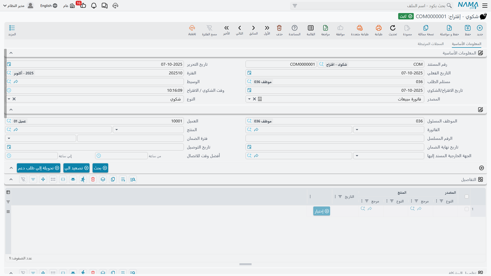

# الشكاوى

::: info الترخيص المطلوب
`crm`.
:::

اسم الشاشة **شكوي - إقتراح** (Complaint - Suggestion)، والشطر الثاني من الاسم مقصود: فهذه سجلّ الاستقبال العام للمكتب، لا سجلّ أعطال. فالعميل الذي يتصل شاكياً، والعميل الذي يتصل مقترحاً تحسيناً، والعميل الذي يتصل ليمرّر ملاحظة — كلهم ينتهون إلى النموذج نفسه، ويفرّق بينهم حقل **النوع**.

وقوتها الحقيقية في العثور على الأشياء. فالموظف الذي معه عميل على الهاتف ولا شيء غير ذلك — لا رقم فاتورة ولا رقم مسلسل ولا فكرة عن أيّ وحدات السبليت التسع في المبنى تعطّلت — يستطيع أن يختار العميل ويضغط زراً واحداً فيمشي معه فيما اشتراه فعلاً.

## ماذا يحدث حين تفتح شكوى

تصل الشكوى الجديدة معبّأةً جزئياً: **تاريخ الاقتراح/الشكوي** اليوم، و**وقت الشكوي** الآن، و**مستلم الطلب** و**الموظف المسئول** هما موظف صاحب الجلسة، و**المصدر** يأخذ قيمته الافتراضية من **مصدر الشكوي** في [إعدادات خدمة العملاء](/ar/modules/crm/crm-configuration.md).

وهذا الإعداد أخطر مما يبدو. فله قيمتان — **فاتورة مبيعات** و**عقد خدمة** — وهو الذي يقرر ما سيعرضه البحث في هذه الشاشة: سطوراً من فواتير مبيعات العميل المرحّلة، أو سطوراً من عقود خدمته المرحّلة.

## العثور على المنتج

هذا هو الجزء الجدير بالإتقان. يتلقى كريم الاتصال من مارينا بلازا في 6 أبريل 2026 فيحرّر `CMPL-0207`:

1. يختار **العميل** `C-01188`. فتمسح الشاشة حقول الفاتورة والمنتج والضمان وأوقات الاتصال، وتملأ كتلة العنوان من عنوان جهة اتصال العميل، وتعبّئ جدول **التفاصيل** بسطور مأخوذة من تاريخ ذلك العميل — سطر لكل سطر من فواتير مبيعاته المرحّلة، يعرض المستند المصدر والمنتج والتاريخ. وزر **بحث** يعيد هذا البحث عند الطلب.
2. يجد السطر الخاص بوحدة سبليت غرفة النزلاء فيضغط **إختيار**. فيُنسخ المستند المصدر في ذلك السطر إلى **الفاتورة** ومنتجه إلى **المنتج** — وهنا الفاتورة `SI-2025-4416` بتاريخ 18 نوفمبر 2025 والصنف `AC-SPL-24`.
3. واختيار الفاتورة يجرّ معه **العميل** و**تاريخ التسليم** وعنوان الشحن. واختيار المنتج يجرّ **مدة الضمان** من الصنف ومورّده الافتراضي إلى **المسئول الخارجي** — وهو `SUP-0311`. ولأن الفاتورة صارت مضبوطة تحسب الشاشة كذلك **تاريخ نهاية الضمان** = التاريخ الفعلي للفاتورة + مدة الضمان: 18 نوفمبر 2026.
4. ويكتب **الرقم المسلسل** المأخوذ من وحدة العميل: `SPL24-2025-11-0783`.

فبأربع خطوات صارت الشكوى تعرف بالضبط أي وحدة مادية موضع الشكوى، وهل ما زالت في ضمانها الأصلي تقريباً.

::: warning أمران في البحث سيفاجئانك
**جدول التفاصيل لا يُحفظ أبداً.** فهو نتيجة بحث لا جزء من المستند. أعد فتح شكوى مرحَّلة تجد الجدول فارغاً — وهذا سلوك صحيح، لكنه مفزع إن كنت تعامله سجلاً لما عُرض عليك. فما تريد الاحتفاظ به يجب سحبه إلى المستند بزر **إختيار**.

**والبحث لا يعيد أحدث المستندات.** بل يجلب عدداً ثابتاً من السطور من تاريخ العميل — يحدده **عدد مصادر الشكوى** في إعدادات خدمة العملاء، ويرجع إلى 10 إذا تُرك فارغاً — وتلك السطور **ليست** أحدث مستندات العميل. فلا تفترض أن السطر الأول هو آخر بيعة، وارفع عدد السطور إذا لم يكن ما تبحث عنه في القائمة.
:::

و**مدة الضمان** و**تاريخ نهاية الضمان** المسجَّلان هنا يُحفظان على الشكوى بيانات. وهما غير التغطية التي يحسبها طلب الدعم — فتلك بحثٌ حيٌّ في الضمانات وعقود الخدمة، موصوف في [طلبات الدعم](/ar/modules/crm/support/crm-trouble-tickets.md).

## بقية الشاشة

**النوع والتصنيف.** **النوع** شكوي أو اقتراح أو ملاحظة. وبجانبه **نوع شكوى** و**مصدر شكوى** وهما ملفاك الأساسيان — ويستعمل كريم `CTY-02` *عطل فني* و`CSR-01` *مكالمة هاتفية*. وهناك أيضاً تصنيف الشكوي وحقلا «مرتبط بـ» و**المعين للمهمة** و**مصعدة إلى**.

**تفاصيل المشكلة** — الجدول الذي يقول ما الخطب فعلاً. سطر لكل مسألة: **تصنيف المشكلة** و**المشكلة** ووصف حر. ومنتقي المشكلة مُرشَّح بالتصنيف المختار في السطر نفسه، فضبط التصنيف أولاً يضيّق القائمة تضييقاً مفيداً. وتحمل `CMPL-0207` سطراً واحداً: التصنيف `PCL-02` *أعطال كهربائية*، والمشكلة `PRB-11` *الوحدة لا تعمل*، والوصف *«لا تعمل الوحدة بعد انقطاع التيار الكهربائي»*.

**المتابعه** — جدول يدوي بحت فيه الموظف والتاريخ والملاحظة. لا شيء يكتب فيه؛ وإنما هو للموظف ليدوّن ملاحقاته.

**أفضل وقت للاتصال** — وقت بداية ونهاية، ليعرف المكتب متى يمكن بلوغ العميل فعلاً.

وتُتمّ **تفاصيل العنوان** و**المحددات** الصفحة الأولى.

**السجلات المرتبطة** — الصفحة الثانية، وهي الموضع الوحيد في المنتج الذي يُرى فيه عمل الشكوى اللاحق في شاشة واحدة: طلبات الدعم المحرَّرة من هذه الشكوى، وتنفيذاتها، ومتابعاتها.

## التحويل إلى طلب دعم

حين يتبيّن أن الاتصال يحتاج عملاً فنياً اضغط **تحويلة إلي طلب دعم**.

ويرفض الزر إن كان **المنتج** فارغاً — *«يجب إدخال المنتج»* — وهو التحقق الوحيد في هذه الشاشة كلها. وإلا فتح **طلب دعم جديداً غير محفوظ** يحمل محددات الشكوى والعميل والمنتج والرقم المسلسل والوصف وحقلي «مرتبط بـ» والمسئول الخارجي، مع مرجع للقراءة فقط يعود إلى هذه الشكوى. وعليك أن تحفظ الطلب بنفسك.

::: warning الشكوى لا تعلم أنها حُوِّلت
التحويل إلى طلب دعم لا يغيّر شيئاً في الشكوى. لا يضبط حالة، ولا يعلّمها بأنها عولجت، ولا يمنعك من ضغط الزر مرة أخرى — اضغطه ثلاثاً تحصل على ثلاثة طلبات دعم لا صلة بينها، كلها تشير إلى هنا.

والرابط في اتجاه واحد فقط. فصفحة السجلات المرتبطة في الشكوى تقرأ الطلبات التي تشير إليها؛ وليس في الشكوى حقل يسمّي طلباتها.
:::

## الحالة والتصعيد وغياب مسار العمل

::: danger حالة الشكوى لا تتغير من تلقاء نفسها
يعرض حقل **الحالة** القيم *مبدئي* و*منتهي* و*Escalated* و*مغلقة*، و**لا توجد عملية في النظام تكتبه أو تقرؤه** — بما في ذلك التحويل إلى طلب دعم. فستقرأ `CMPL-0207` *مبدئي* إلى الأبد حتى يفتحها أحد ويغيّر الحقل بيده.

هو عنوان يدوي. فإن اتّكل مكتبك عليه فضع في إجراءاتك خطوةً تقول من يحدّثه ومتى، لأن النظام لن يفعل. (و*Escalated* بلا ترجمة في أي من اللغتين وتظهر كلمةً لاتينية خاماً في القائمة.)
:::

::: warning «تصعيد الي» حقلٌ لا حالة
**تصعيد الي** يختم الموظف المختار على الشكوى ويحفظها ويرحّلها فوراً — النسخة المخزَّنة على الخادم، فأي تعديلات غير محفوظة على الشاشة تضيع. ولا يغيّر الحالة، ولا يخطر المسمّى، ولا توجد قائمة بالشكاوى المصعَّدة في أي مكان.
:::

وعلى وجه أعمّ: **الشكوى لا تتحقق من شيء.** فخلا فحص المنتج عند التحويل إلى طلب دعم، تستطيع ترحيل شكوى بلا عميل ولا منتج ولا نوع ولا سطور مشكلات. وما يلزم مكتبك من انضباط يجب أن يأتي من إجراءاتك أنت، ومن ضبط الحقول المطلوبة الذي تعدّه بنفسك عند اللزوم.

## هل تحتاج الشكاوى أصلاً؟

جوابٌ صادق، لأن السؤال يتكرر في كل تركيبة:

**استعمل الشكوى** إن كان مكتبك يسجّل كل اتصال وارد — بما فيه الاقتراحات والملاحظات التي لن تصير عملاً أبداً — أو إن كان الموظفون يحتاجون البحث في الفواتير عادةً لتحديد المنتج. فهي دفتر ملاحظات جيد بتعبئة تلقائية ممتازة.

**تجاوزها** إن كان مكتبك لا يسجّل إلا الأعطال والموظفون يعرفون المنتج سلفاً. فتحرير طلب الدعم مباشرةً لا يفقدك شيئاً: الشكوى بلا تحقق، وحالتها جامدة، وأتمتتها الوحيدة تفتح طلباً غير محفوظ كنت ستفتحه على كل حال.

والذي يجب ألا تفعله هو أن تعامل الشكوى كحالة تتقدم في مراحل بينما يتولى الطلب العمل. فالطلب وحده هو صاحب دورة الحياة.

## الآثار والتقارير

**الشكوى لا تقيّد شيئاً ولا تحرّك مخزوناً ولا تستعمل توجيه مستند.** وللتقارير استعمل شاشة قائمة الشكاوى بمعاييرها، أو صدّر إلى إكسل — فخدمة العملاء لا تشحن أي تقرير نظام ولا أي لوحة معلومات، ولا يغطي أيٌّ من النماذج المطبوعة المدمجة الشكاوى.
