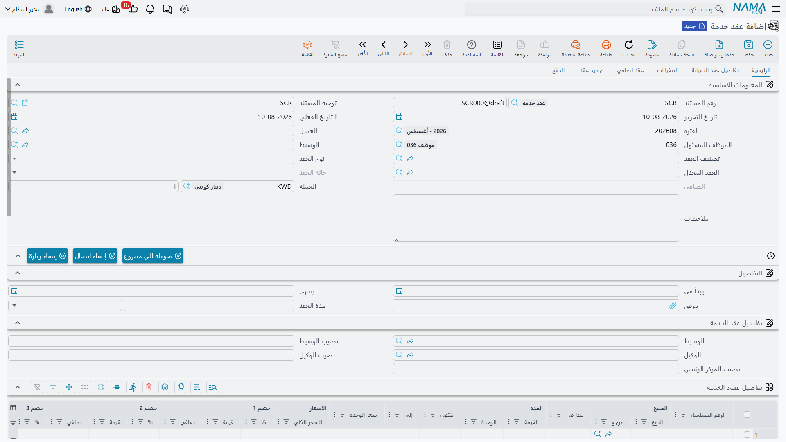
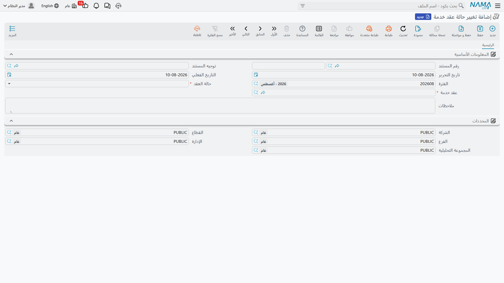

# عقود الخدمة

::: info الترخيص المطلوب
`crm`.
:::

**عقد الخدمة** (CRM Service Contract) اتفاقٌ مسعَّر محدود المدة بأن منتجات عميل بعينه المذكورة فيه مستحقة للدعم. تشتري مارينا بلازا اثني عشر شهراً من التغطية لثلاث من وحداتها في غرف النزلاء والمكاتب؛ والعقد يسجّل أي وحدات، ولأي مدة، وبأي سعر.

وقبل كل شيء، حقيقتان تحسمان هل يناسب هذا المستند نشاطك أصلاً.

::: warning العقد *هو* الفاتورة
هذا ليس عقداً يُنتج فواتير لاحقاً. فهو يحمل كتلة المال كاملة بنفسه — أسعار السطور وثمانية مستويات خصم وأربع ضرائب وصافي القيمة والمدفوع والمتبقي — وعند معالجته يقيّد **سطر أستاذ واحداً لكل سطر عقد**. فترحيل العقد هو حدث الفوترة. ولن يكون هناك حدث آخر أبداً.
:::

::: danger لا جدول سداد ولا شيء يولّد فاتورة دورية
ليس في العقد جدول أقساط، ولا صفحة جدول سداد، ولا زرّ ولا قاعدة ولا مهمة مجدولة في خدمة العملاء كلها تحرّر فاتورة منه. **واثنتا عشرة فاتورة شهرية تعني اثني عشر سند قبض تُحرَّر باليد، في المحاسبة، واحداً كل شهر، على يد من تذكّر.**

ولا شيء يذكّر أحداً. ولا إجراء تجديد ولا تنبيه بقرب الانتهاء أيضاً — فالعقد يكفّ عن التغطية في تاريخ نهايته بصمت.

فإن كنت تبيع اشتراكاً، فخطّط للفوترة الدورية خارج هذا المستند قبل أن تلتزم به.
:::

## تحرير عقد

تصل إليه من **خدمة العملاء ← الدعم ← عقد خدمة**.

**ابدأ بتوجيه المستند.** فالتوجيه هو ما يقرر هل سيقيّد العقد شيئاً أصلاً، واختياره يملأ كذلك **نوع العقد** — *عادي* لعقد جديد، أو *تجديد* أو *ملحق* أو *ترقية* أو *تحويل* لعقد يحلّ محلّ عقد سابق. ويبقى الحقل قابلاً للتعديل بعدها.

**الترويسة** — العميل والموظف المسئول (معبّأ بموظف صاحب الجلسة) والوسيط وتصنيف العقد ونوع العقد والعقد المعدل و**حالة العقد** للقراءة فقط والعملة وسعر الصرف ووصف. وتحتها كتلة **التفاصيل** الصغيرة فيها **يبدأ في** و**ينتهى** و**مدة العقد** في الترويسة.

و`CSC-0044` محرَّر في 25 فبراير 2026 بتاريخ فعلي 1 مارس، للعميل `C-01188`، والوسيط `MED-07`، ونوع العقد *عادي*، ويمتد من 1 مارس 2026 إلى 1 مارس 2027.

**السطور** — جدول **تفاصيل عقود الخدمة** قلب المستند. سطر لكل منتج مغطى:

| # | المنتج | الرقم المسلسل | يبدأ في | ينتهى | صافي القيمة |
|---|---|---|---|---|---|
| 1 | `AC-SPL-24` وحدة سبليت 24000 | `SPL24-2025-11-0783` | 2026-03-01 | 2027-03-01 | 18,000.00 |
| 2 | `AC-SPL-18` وحدة سبليت 18000 | `SPL18-2025-11-0791` | 2026-03-01 | 2027-03-01 | 14,000.00 |
| 3 | `AC-FCU-08` وحدة فان كويل | `FCU08-2025-12-0310` | 2026-03-01 | 2027-03-01 | 8,000.00 |

ويحمل كل سطر أيضاً سعر وحدة وثمانية مستويات خصم وأربع ضرائب صنف ومدةً وعمود **إلى** محسوباً نعود إليه في فقرة التجميد.

وإدراج سطر ينسخ إليه «يبدأ في» و«ينتهى» من الترويسة، وكتابة قيمة المدة أو وحدتها تحسب «ينتهى» في السطر من «يبدأ في» فيه. وأي تواريخ سطور ما زالت فارغة عند حفظ المستند تُملأ من الترويسة.

::: warning اختيار المنتج لا يملأ تواريخ السطر
هناك تعبئة تلقائية يُفترض أن تشتقّ تواريخ السطر من المنتج المختار، وهي لا تعمل: فاختيار المنتج لا يملأ شيئاً، وفي بعض الأحوال **يمحو «يبدأ في» الذي كتبته من قبل**. فراجع تواريخ كل سطر بعد اختيار المنتجات، واملأها من مدة الترويسة ولا تنتظر من المنتج أن يوفّرها.
:::

**الإجماليات** محسوبة من السطور. وعلى `CSC-0044`:

| | |
|---|---|
| الإجمالي | **40,000.00** |
| ضريبة مبيعات 14٪ | **5,600.00** |
| صافي القيمة | **45,600.00** |

## ماذا يحدث عند معالجة العقد

عند الترحيل يرفع العقد أثره المحاسبي بوصفه **طلب أعمال** يُعالَج في الخلفية — فيُحفظ المستند فوراً ويظهر قيد الأستاذ بعد لحظة. فإن أخفق ظهر في شاشة قائمة **طلبات الأعمال**، حيث تُرشِّح بحالة المعالجة وتحدّد السطور وتستعمل **قائمة المزيد ← إعادة المعالجة / إعادة الترحيل**. ولا يظهر شيء من ذلك على شاشة العقد نفسها.

والقيد الناتج عن `CSC-0044` هو **سطر أستاذ لكل سطر تفاصيل** — 18,000.00 و14,000.00 و8,000.00 — يجعل حساب مدينية العميل مديناً بـ45,600.00 ويجعل إيراد عقود الخدمة دائناً بـ40,000.00 وضريبة المبيعات المستحقة دائنة بـ5,600.00. وتؤخذ الذمم من العميل والموظف المسئول ومنتج السطر وقسم الصنف.

::: danger التوجيه بجانب محاسبي واحد لا يقيّد شيئاً، وبصمت
لا يعمل الأثر المحاسبي **إلا إذا حمل توجيه المستند جانباً مديناً وجانباً دائناً معاً.** فاضبط أحدهما واترك الآخر فارغاً يُرحَّل العقد بلا مشكلة، ولا يبلّغ عن خطأ، ولا يُنتج طلب أعمال، ولا يقيّد شيئاً البتة. ولا تحذير في أي موضع من الشاشة.

فإن كانت العقود تُرحَّل ودفتر الأستاذ خالياً فهذا هو السبب في الغالب. افحص التوجيه أولاً.
:::

وتعديل عقد مرحَّل يعيد قيده، وإلغاؤه يعكس القيد — وكلاهما يعيد فحص شرط الجانبين نفسه.

**المخزون: لا شيء.** فليس في العقد كمية ولا مخزن ولا مستند مخزني. وهو معترَف به مستندَ جهةٍ ضريبية، فإجراءات الفوترة الإلكترونية المعتادة متاحة عليه.

## تحصيل المال

السداد على هذا المستند يجري في اتجاه واحد: **وارد**. فالعقد لا يدفع فاتورةً إلى الخارج أبداً؛ بل يستقبل سندات قبض تُحرَّر في مكان آخر.

حرّر سند قبض عادياً في المحاسبة مشيراً إلى العقد، فيظهر سطرٌ من تلقاء نفسه في صفحة **الدفع** في العقد — المستند وتاريخ الدفع وقيمة الدفع وعلامة «لا يؤثر على المتبقي» — وينخفض المتبقي في العقد. وذلك الجدول **سجل يصونه النظام**، لا جدولاً تملؤه أنت.

وعلى `CSC-0044` تحصّل النخبة **اثني عشر سند قبض بقيمة 3,800.00** (3,800.00 × 12 = 45,600.00)، واحداً كل شهر، كلٌّ منها محرَّر باليد. وإن كان التوجيه يحمل **استعال سندات الدفع في أعمار الديون** مؤشَّراً، غذّت سطور القبض هذه تحليل أعمار الديون أيضاً؛ وبغير ذلك لا تفعل.

## ماذا يقدّم العقد للدعم

مستهلكه الوظيفي الوحيد هو طلب الدعم. فحين يحرّر الموظف طلباً على منتج يسأل الطلبُ: *«هل هذا المنتج تحت عقد في هذا التاريخ؟»* فيجيب العقد. وعلى `TKT-0451` كان السطر الأول من `CSC-0044` هو ما جعل الطلب يقرأ **مغطي بعقد خدمة**.

::: danger ماذا تطابق التغطية، وماذا تتجاهل
**ما تطابقه التغطية:** **المنتج** في الطلب، و**الرقم المسلسل** *فقط حين يحمله الطلب*، و**تاريخ الطلب** واقعاً داخل نافذة **يبدأ في ← ينتهى** للسطر. وعقد الخدمة يغلب الضمان حين يطابق الاثنان.

**ما تتجاهله التغطية:** **العميل** (فعقد أي عميل أو ضمانه قد يغطي طلب عميل آخر)، و**حالة العقد** (فالعقود الملغاة والمنتهية والمجدَّدة تغطّي كما هي)، وهل رُحِّل العقد أصلاً (فالمسودات تغطّي)، و**امتداد التجميد** (فالشاشة تعرض التاريخ الممدود بينما تختبر التغطية «ينتهى» الأصلي)، وكل **المحددات** — الشركة والفرع والقطاع.

**ما تفعله التغطية:** العرض ولا شيء غيره. فنوع التغطيه وسند التغطية مؤشر على الشاشة للموظف. ولا يقرؤهما أي تحقق ولا قاعدة تسعير ولا حارس حالة ولا توليد مستند، ولا يوجد توجيه مستند على طلب الدعم يستطيع الاستجابة لهما. ويبقى القرار التجاري — أنُحاسِب على العمل أم لا — يدوياً بالكامل.

**نصيحة عملية:** املأ الرقم المسلسل دائماً في الأصناف المسلسلة، وإلا فسطر عقد واحد مسجَّل بلا رقم مسلسل سيغطي كل طلب يُفتح على ذلك المنتج، لأي عميل، وفي أي فرع.
:::

**عقد أم ضمان؟** [الضمان](/ar/modules/crm/master-files/crm-warranties.md) هو التغطية المجانية التي شُحن بها المنتج — ملف أساسي بلا سعر وبلا محاسبة. وعقد الخدمة تغطيةٌ مدفوعة اشتراها العميل — مستندٌ بمال يُقيَّد. وكلاهما يغذّي البحث نفسه، والعقد يفوز.

::: info ليس هو عقد الصيانة
لحزمة صيانة الآلات عقدها الخاص، وهو أغنى، فيه جداول زيارات وأقساط، وتحت ترخيص مختلف. ولا شيء يربط الاثنين: لا حقل مرجع ولا حالة مشتركة ولا مسار ترحيل بيانات، وعقد الصيانة لا يشارك في تغطية طلبات الدعم البتة. وأيّهما تستعمل يقرره الترخيص الذي تملكه لا الملاءمة. راجع [عقود الصيانة](/ar/modules/crm/maintenance-cycle/crm-maintenance-contracts.md).
:::

## حالة العقد — عنوانٌ بلا أنياب

حقل **حالة العقد** للقراءة فقط على الشاشة وله ست قيم: *تم ترقيته* و*محول* و*مجدد* و*تم الحاقه* و*ملغي* و*منتهي*. والحالة **الفارغة** هي الحالة الحيّة العادية — فليس ثمّة قيمة تعني «سارٍ».

ويكتبها شيئان. الأول: ترحيل عقد **جديد** نوعه تجديد أو ملحق أو ترقية أو تحويل، و**العقد المعدل** فيه يشير إلى العقد القديم: فيُختم القديم بـ*مجدد* أو *تم الحاقه* أو *تم ترقيته* أو *محول* بحسب النوع. (ويرفض المستند ذلك الربط إن كان النوع فارغاً أو عادياً، ويرفض عقداً ادّعاه عقدٌ آخر من قبل.) والثاني: مستند **تغيير حالة عقد خدمة**.

::: danger حالة العقد لا تفرض شيئاً البتة
إلغاء العقد أو إنهاؤه **لا** يسحب التغطية، ولا يمنع طلبات دعم، ولا يمنع عملاً، ولا يمنع إصلاحاً مجانياً. فالعقد المعلَّم *ملغي* ما زال يعلن **مغطي بعقد خدمة** على كل طلب يُفتح داخل نافذة تواريخه، وكذلك العقد الذي ختمه خلفُه بـ*مجدد*. ولا توجد قاعدة واحدة في النظام كله تقرأ هذا الحقل.

**والشيء الوحيد الذي ينهي التغطية أبداً هو مرور تاريخ «ينتهى» في السطر.** فإن وجب أن يكفّ عقدٌ عن التغطية فقصّر تواريخ سطوره؛ فتغيير الحالة لا يحقق شيئاً.
:::

::: danger مستند تغيير الحالة قد يعيد كتابة حالة عقد آخر
**تغيير حالة عقد خدمة** مستند من حقلين — العقد، والحالة المراد تطبيقها — وله قاعدة واحدة: أن يكون تاريخه الفعلي بعد تاريخ العقد. وهو غير موثوق على نحو يسهل أن يفوت.

فحين يعمل ينظر في **كل مستندات تغيير الحالة في قاعدة البيانات**، لكل العقود، فيختار صاحب أحدث تاريخ فعلي، ويطبّق *تلك* الحالة على العقد الجاري حفظه. فتعليمك العقد «ب» بأنه *منتهي* اليوم قد يغيّر بصمت حالة العقد «أ» — عقدٍ آخر حيٍّ لعميل آخر — في المرة التالية التي يُحفظ فيها «أ». وإعادة حفظ أي عقد قد تقلبها من جديد.

فلا تستعمل هذا المستند طريقةً موثوقة لضبط حالة عقد بعينه. ومع كون الحالة لا تفرض شيئاً، تصير منظومة الحالة كلها تجميلية في أحسن أحوالها: فإن احتجت إلى تسجيل أن عقداً قد مات، فسجّله في الوصف وصحّح تواريخ السطور.
:::

ومستند تغيير الحالة نفسه بهذا الصغر:

## تجميد عقد

تتولى صفحة **تجميد عقد** تعليق الخدمة: منتج، وتاريخ بداية تجميد، وتاريخ نهايته. وهي من أحسن أجزاء الشاشة سلوكاً — فهي ترفض منتجاً ليس على العقد (*«لا يمكنك تجميد المنتج {0} لأنه غير موجود بالعقد»*)، وتجمع أيام التجميد لكل منتج وتدفع عمود **إلى** المحسوب في ذلك السطر بالعدد نفسه.

وعلى `CSC-0044` يغلق الفندق جناحاً من 1 إلى 31 يوليو 2026، فينتقل عمود *إلى* في السطر الثاني من 1 مارس 2027 إلى **1 أبريل 2027**.

::: warning التجميد لا يمدّ تغطية الدعم
الامتداد يظهر في عمود *إلى* في السطر ولا يظهر في غيره. فبحث تغطية طلب الدعم ما زال يختبر **ينتهى** الخام في السطر، ومن ثمّ فالطلب الذي يُفتح في تلك الأيام الواحد والثلاثين الزائدة يقرأ **غير مغطي** وإن كانت الشاشة تقول إن السطر يمتد إلى أبريل.

فإن وجب أن يمدّ التجميد التغطية حقاً، فعدّل «ينتهى» في السطر أيضاً.
:::

## صفحة التنفيذات

تعرض الصفحة الثالثة قائمتين للقراءة فقط: طلبات الدعم المطابَقة على هذا العقد، وسطور تنفيذها. وهي أقرب شيء في الوحدة إلى سؤال «كم كلّفتنا خدمة هذا العقد؟».

::: warning صفحة التنفيذات تُنقص التقرير
لا يظهر الطلب هنا إلا إذا صادف أن حُسب جواب التغطية أثناء حفظ الطلب. والطلبات المنشأة عبر الاستيراد أو خدمة ويب أو عملية جماعية كثيراً ما لا تظهر أبداً، وإن كان فتحها يعرض *مغطي بعقد خدمة* عرضاً سليماً تماماً.

فعامل الصفحة على أنها استئناس. وللصورة الكاملة رشِّح قائمة طلبات الدعم بالعميل والمنتج.
:::

## أجزاء الشاشة التي لا تفعل شيئاً

صفحتان كاملتان ومجموعة واحدة في هذا المستند تقبل البيانات وتحفظها ولا يقرؤها شيء.

::: danger مناطق جامدة — تسجيلٌ لا غير
**تفاصيل عقد الصيانة** (الصفحة الثانية) — كتلة موازية كاملة من التواريخ والمبالغ والنسب وعميل ووسيط ووكيل وجدول سطور خاص بها. ولا يمسّ أي كود منها إلا حقلين اثنين، وذلك فقط لتعبئتهما من عميل الترويسة ووسيطها. ولا شيء في هذه الصفحة يُجمَع أو يُتحقَّق منه أو يُفوتَر أو يُقيَّد.

**عقد اضافي** (الصفحة الرابعة) — منتج وتواريخ ومبلغ إضافة وعملة ونسب حصص. و**مبلغ الإضافة لا يزيد قيمة العقد، ولا يغيّر ما يُفوتَر، ولا يصل إلى دفتر الأستاذ.** فإن أضاف عميل معدّات في منتصف المدة، فحرّر عقداً جديداً نوعه ملحق بدلاً من ذلك.

**حصة الوسيط وحصة الوكيل وحصة المركز الرئيسي** في مجموعة *تفاصيل عقد الخدمة*، والنسب المناظرة في صفحة تفاصيل عقد الصيانة — تسجيل رقمي حرّ. فلا عمولة تُحسب، ولا إجمالي يُتحقَّق منه، ولا شيء يُقيَّد. فلا تقدّم اقتسام العمولات أو تقاسم الإيراد على أنه من خصائص هذا المستند.
:::

وتحمل كتلة الإجراءات في الصفحة الرئيسية زرَّي **إنشاء مكالمة** و**إنشاء زيارة**، وهما يفتحان مكالمة أو زيارة فارغة في نافذة منبثقة بمرجع يعود إلى العقد. وهما اختصاران لتسجيل محادثة لا جدولٌ: لا تاريخ ولا تكرار، والنشاط المنشأ لا يُتابَع مقابل العقد بأي وجه.

::: info لا جدول زيارات هنا
بخلاف عقد حزمة الصيانة، هذا العقد لا يجدول زيارات ولا يولّدها. فلا جدول زيارات فيه، ولا شيء يبسط سلسلة زيارات مخططة، ولا شيء ينبّه إلى زيارة لم تحدث.
:::

## ضبط توجيه المستند

كل الضبط ذي المعنى لهذا المستند يسكن في **توجيه المستند** لا في إعدادات خدمة العملاء. وهو ثلاث صفحات:

**التأثير** — **نوع العقد** الذي يُدفع إلى المستندات التي تستعمل هذا التوجيه؛ و**استعال سندات الدفع في أعمار الديون**؛ والجانبان **المدين** و**الدائن** (وكلاهما لازم لأي تقييد)؛ وجانب خصم التقريب؛ و**سياسة الضريبة** و**خاضع للضريبة** و**يمكن تعديل الضريبة** و**السماح بتعديل ضريبة الفاتورة في السطر**؛ و**السماح بدفع مبلغ أكبر من قيمة الفاتورة**، الذي يحدّ سندات القبض بصافي العقد حين لا يكون مؤشَّراً؛ و**ربط الفاتورة فى جريد الفواتير فى سندات القبض والدفع**، الذي يجعل العقد قابلاً للاختيار في جدول الفواتير في سندات القبض والدفع.

**تأثيرات أخرى** — الجانب النقدي وأربعة جوانب ضريبية، وجدول **تأثير سندات الدفع** الذي يتيح تقييداً مختلفاً بحسب سند القبض الذي سدّد العقد.

**تأثير الخصومات** — الجوانب المحاسبية لخصم السطر وتخفيض الفاتورة والخصومات من 2 إلى 8.

وملاحظتان على الصفحة الأخيرة: بعض الجوانب المحاسبية للخصومات تعرض أسماءها الداخلية الخام بدل عناوين مترجمة في قوائم البحث والتصدير وانتقاء الأعمدة، فعناوين المجموعات هي الدليل الموثوق؛ وجانبا الضريبة الثالث والرابع يحملان عنواناً عربياً وآخر إنجليزياً يصفان شيئين مختلفين — فاقرأ العنوان العربي على أنه المرجع.

::: info أتعاب الخدمات غير متاحة على هذا المستند
مهما رأيت في توجيهات أخرى من نوع الفاتورة، فجوانب أتعاب الخدمات والجانبان المدين والدائن الثانيان غير موجودة لعقد الخدمة. فلا تبحث عنها.
:::

## التقارير

**لا شيء.** لا تقرير نظام ولا نموذج مطبوع ولا لوحة معلومات ولا أداة ذكاء أعمال تقرأ هذا المستند. وسؤالٌ عادي مثل *«أي العقود تنتهي الشهر القادم؟»* لا جواب جاهز له — فاستعمل معايير شاشة قائمة العقود، أو صدّر إلى إكسل، أو ابنِه في وحدة ذكاء الأعمال. والأمر نفسه في إيراد العقود بحسب الفترة.

## الصورة كاملة من أولها إلى آخرها

1. **اضبط توجيه مستند** بنوع العقد الصحيح و**كلا** الجانبين المحاسبيين.
2. **سجّل الضمانات** للمنتجات التي تُشحن بتغطية مجانية، ليميّز المكتب التغطية المشتراة من المجانية.
3. **حرّر العقد** — العميل والتوجيه والمدة وسطر لكل منتج مغطى برقمه المسلسل وتواريخه وسعره. وراجع تواريخ السطور.
4. **رحّل.** فيُرفع قيد الأستاذ بوصفه طلب أعمال. *وهذه هي الفاتورة الوحيدة التي سينتجها هذا العقد.*
5. **حصّل** بسندات قبض تُحرَّر في المحاسبة، سنداً لكل قسط، باليد. وهي تكتب نفسها في صفحة الدفع.
6. **يجري الدعم.** فطلبات الدعم على المنتجات المغطاة داخل نافذة السطر تعرض *مغطي بعقد خدمة*، ويبقى القرار التجاري في المحاسبة على العمل عند موظفيك.
7. **جمّد** فترة التعليق إن احتجت — وتذكّر أن تحرّك «ينتهى» في السطر أيضاً إن كان المقصود أن تمتد التغطية حقاً.
8. **جدّد** بتحرير عقد *جديد* نوعه تجديد يشير إلى القديم. فلا زرّ تجديد ولا تنبيه بالانتهاء؛ ولا بدّ أن يعلم أحدٌ بذلك.
