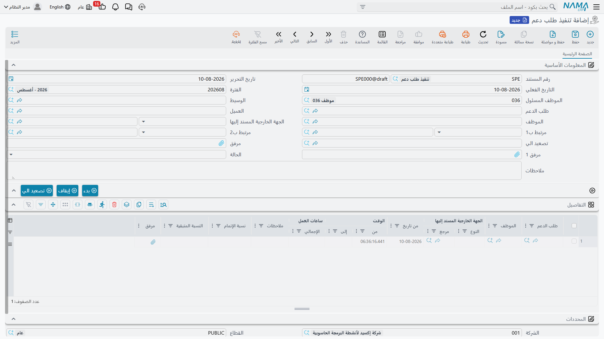

# تنفيذات طلب الدعم

::: info الترخيص المطلوب
`crm`.
:::

**تنفيذ طلب الدعم** (Ticket Execution) كشف ساعات. ينهي الفني فترة عمل على طلب دعم فيسجّلها: أي يوم، ومن أي ساعة إلى أي ساعة، وماذا عمل، وإلى أين وصل. وترحيل المستند يضيف تلك الساعات إلى وقت التنفيذ الفعلي للطلب ويحرّك حالته.

وهذا كل ما هو عليه حقاً. ويحسن أن نقول ابتداءً ما ليس هو:

- **لا يحرّك مخزوناً.** فقطع الغيار المستهلكة في الزيارة ليست على هذا المستند ولا يمكن أن تكون. وإن استُعملت قطع صرفها أحدهم بمستند مخزني عادي، ولا شيء يربط ذلك المستند بالطلب.
- **لا يقيّد شيئاً.** فلا سعر ساعة ولا تكلفة عمالة ولا فاتورة. وتُسجَّل ساعات العمل للتقارير فقط.
- **لا توجيه مستند له**، فلا شيء يُضبط عليه.

## تحرير تنفيذ

الطريق الطبيعي هو زر **تنفيذ** في طلب الدعم، فيفتح تنفيذاً غير محفوظ في نافذة منبثقة يشير إلى ذلك الطلب، بسطر تفاصيل واحد للموظف المسئول يبدأ الآن. وتستطيع كذلك فتح **خدمة العملاء ← الدعم ← تنفيذ طلب دعم** مباشرة.

تحمل الترويسة الدفتر والكود وتاريخ التحرير والتاريخ الفعلي والفترة المالية والموظف المسئول والوسيط و**طلب الدعم** و**العميل** و**الموظف** والمسئول الخارجي وتصعيد الي ومرفقين وحالةً ووصفاً.

ومنتقيات هذه الشاشة معينة على نحو غير معتاد، ويحسن معرفتها:

- منتقي **الموظف** لا يعرض إلا الموظف المسئول عن الطلب والفنيين الذين في جدول الموظفين فيه. فإن غاب أحدهم عن القائمة فهو لم يُسنَد على الطلب.
- منتقي **العميل** لا يعرض إلا عميل الطلب.
- منتقي **طلب الدعم** لا يعرض إلا الطلبات التي في حالة *قيد التنفيذ* أو *مسند* أو *منتهي* للعميل أو الموظف المختار.

## جدول التفاصيل

سطر لكل فترة عمل: طلب الدعم والموظف والمسئول الخارجي و**من تاريخ** و**الوقـت من** و**الوقـت إلى** و**ساعات العمل** ووصفٌ و**نسبة الإتمام** و**النسبة المتبقية** (للقراءة فقط) ومرفق.

وانتبه لما ليس هناك: عمود **إلى تاريخ**. فكل سطر ينتهي في اليوم الذي بدأ فيه، والوردية الليلية التي تعبر منتصف الليل تُدخَل في سطرين.

وزرّا **بدء** و**stop** في الترويسة يقودان آخر سطر عنك: «بدء» يملأ «من تاريخ» و«الوقـت من» فيه (أو يضيف سطراً جديداً إن كان الأخير مكتملاً)، و«stop» يختم «الوقـت إلى» ويحسب ساعات العمل. ويرفض «بدء» المضيّ ما دام سطرٌ مكتمل في غير ذلك يحمل «الوقـت إلى» فارغاً.

وعلى مثالنا يسجّل `TEXE-0662` يوم محمود الأول على `TKT-0451`:

| من تاريخ | الوقـت من | الوقـت إلى | ساعات العمل | نسبة الإتمام |
|---|---|---|---|---|
| 2026-04-07 | 08:30 | 11:00 | 2.5 | 60 |
| 2026-04-07 | 13:00 | 14:30 | 1.5 | 60 |
| | | **إجمالي المستند** | **4.0** | |

وترحيله يضبط `TKT-0451` على *قيد التنفيذ* ويرفع **وقت التنفيذ الفعلي** فيه إلى 4.0 ساعات.

وبعد ستة أيام يسجّل `TEXE-0679` إنهاء سيد للعمل:

| من تاريخ | الوقـت من | الوقـت إلى | ساعات العمل | نسبة الإتمام |
|---|---|---|---|---|
| 2026-04-13 | 09:00 | 12:00 | 3.0 | 100 |

ولأن سطراً بلغ 100٪ صار الطلب يعرض *منتهي*، وخُتم تاريخ إغلاقه بـ13 أبريل، وبلغ وقت التنفيذ الفعلي **7.0 ساعات** — مقابل تقدير 4.0. ولا شيء في أي مكان يقارن الرقمين؛ فإن كان التجاوز يهمّك فهو تمرين على شاشة القوائم أو في إكسل.

## ما تمسكه التحققات — وما يفلت منها

هذا المستند الوحيد في مجموعة الدعم الذي فيه تحقق حقيقي، فيحسن معرفة أين يقف.

**ما يرفضه:**

- طلباً في حالة *ملغي* أو *مغلقة* أو *مبدئي* — في الترويسة وفي كل سطر («حالة غير صحيحة»). أما الطلب في حالة *منتهي* فيُقبل فقط إن كان موجوداً في النسخة السابقة من هذا المستند.
- عميلاً في الترويسة يخالف عميل الطلب («ليس عميل طلب الدعم»).
- ساعات عمل سالبة، أو «الوقـت من» متأخراً عن «الوقـت إلى».
- سطرين للموظف نفسه في اليوم نفسه أحدهما نسخة من الآخر أو واقعٌ بتمامه داخله.

::: warning التداخلات الجزئية الحقيقية لا تُمسَك
لا يرفض التحقق إلا المدخلات المكرَّرة أو المحتواة بالكامل. فـ**09:00–10:00 و09:30–11:00 يمرّان كلاهما**، ويُحتسب للفني نفسه 2.5 ساعة عن ساعتين منقضيتين — ورقمٌ منفوخ يسيل بعدها مباشرةً إلى وقت التنفيذ الفعلي للطلب.

فإن كانت دقة ساعات العمالة تهمّك، فراجع جدول التفاصيل ولا تتّكل على التحقق.
:::

## أثر الحالة — ولماذا لا يثبت

كل سطر تفاصيل مرحَّل يدفع الطلب إلى *منتهي* حين تكون نسبة الإتمام 100، وإلى *قيد التنفيذ* فيما عدا ذلك، ويضيف ساعاته إلى وقت التنفيذ الفعلي. وإعادة حفظ التنفيذ تطرح ساعات النسخة السابقة أولاً، فالتعديل آمن. وإلغاؤه يطرحها جميعاً ويعيد الطلب إلى *قيد التنفيذ* ويمسح تاريخ إغلاقه.

::: danger إتمام التنفيذ لا يُغلق الطلب
التنفيذ عند 100٪ يجعل الطلب **يعرض** *منتهي* — لكنه لا يحدّث الحالة التي يتذكرها الطلب نفسه. وفي المرة التالية التي يحفظ فيها أحدٌ `TKT-0451` لأي سبب، يعيد الطلب تطبيق حالته المتذكَّرة، ولأن جدول الموظفين فيه سطور، يهبط بصمت إلى *مسند*.

أعد قراءة ذلك إن كان مكتبك ينوي إغلاق الطلبات بهذه الطريقة: فالطلب يبدو منتهياً ثم يفكّ انتهاءه بهدوء. **أغلق الطلب صراحةً** — بـ**تغيير الحالة ← مغلقة** عليه، أو بـ[متابعة طلب دعم](/ar/modules/crm/support/crm-ticket-follow-ups.md) تحمل حالة الإغلاق. وعامل التنفيذ على أنه *يبلّغ* عن الإتمام لا أنه يُتمّه.
:::

## حقل الحالة في التنفيذ لا يفعل شيئاً

تحمل الترويسة قائمة **الحالة** بأربع قيم — *منتهي بإنتظار المراجعة* و*تم المراجعة* و*مرفوض* و*منتهي*.

::: warning لا دورة مراجعة ولا اعتماد هنا
لا شيء يضبط هذا الحقل ولا شيء يقرؤه. فالمشرف الذي يعلّم تنفيذاً بأنه **مرفوض** غيّر عنواناً ولا شيء غيره: فالطلب مضى إلى *منتهي*، والساعات المرفوضة ما زالت محسوبة في وقت تنفيذه الفعلي. لا شيء يُعكَس، ولا أحد يُخبَر، ولا قائمة تعرض التنفيذات المنتظرة للمراجعة.

استعمله ملاحظةً لنفسك إن شئت. ولا تبنِ عليه دورة اعتماد.
:::

## ساعتان، وخطرٌ ثالث

الساعات التي على مستندات تنفيذ طلب الدعم **ليست** ساعة الطلب نفسه. فصفحة «مسند إلي» في الطلب تحفظ جدول **وقت تنفيذ الطلب** الخاص بها، الذي تقوده أزرار **بدء** و**إنهاء** *هناك* وتغيير الحالة إلى قيد التنفيذ. وعلى `TKT-0451` تبلغ تلك الساعة 10:35 بينما تبلغ التنفيذات 7.0 ساعات. وهما يُصانان مستقلين ولا شيء يوفّق بينهما — فاختر واحدة رقماً لتقاريرك.

::: warning بدء ساعة الطلب يوقف الفني نفسه في مكان آخر
هذا يخصّ الطلب لا هذا المستند، لكنه يوقع الناس في اليوم نفسه: فبدء ساعة فني على طلب يغلق تلقائياً ساعته المفتوحة على **أي** طلب آخر، وكثيراً ما يسجّل له صفر دقيقة عليه. والقصة كاملة في [طلبات الدعم](/ar/modules/crm/support/crm-trouble-tickets.md). فلْيضغط الفنيون **إنهاء** قبل الانتقال.
:::

## أين تُرى التنفيذات

- صفحة **التنفيذات** في الطلب تعرض التنفيذات المحرَّرة عليه.
- صفحة **السجلات المرتبطة** في الشكوى الأصل تعرض التنفيذات المنحدرة منها.
- صفحة **التنفيذات** في عقد الخدمة تعرض سطور تنفيذ الطلبات التي طوبقت على ذلك العقد — مع التحفّظ الموصوف في [عقود الخدمة](/ar/modules/crm/support/crm-service-contracts.md).
- **شاشة قائمة تنفيذات طلب الدعم** تُرشَّح بطلب الدعم والموظف والمسئول الخارجي والعميل. وهي أقرب شيء إلى تقرير عمالة في الوحدة؛ فلا تقارير نظام ولا لوحات معلومات لها.
