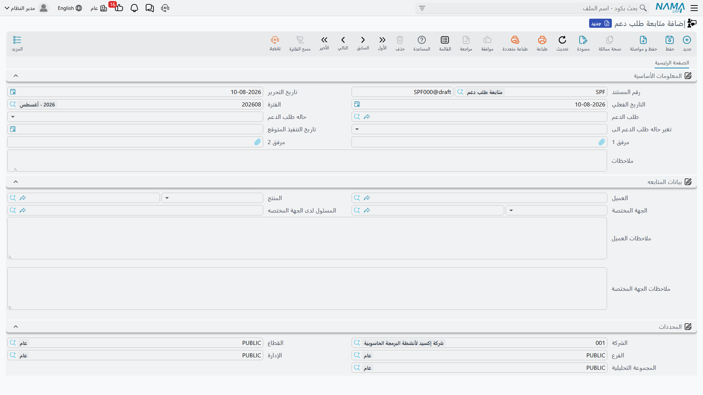

# متابعات طلب الدعم

::: info الترخيص المطلوب
`crm`.
:::

تبدو **متابعة طلب الدعم** (Ticket Follow Up) في ظاهرها أقلّ مستندات مجموعة الدعم شأناً — نموذج صغير من صفحة واحدة لتدوين ما قاله العميل. وهي في الحقيقة أوجبها معرفةً، لأنها **الموضع الوحيد في المنتج الذي يمكن فيه ضبط ثماني حالات من حالات طلب الدعم الثلاث عشرة**.

ولا يكتشف ذلك أحد بالتجوال بين الشاشات. ولهذا وُجدت هذه الصفحة: لئلا يقضي مكتبك سنةً كاملة يعمل بخمس حالات.

## بوابة الحالات

يعرض مربع **تغيير الحالة** في طلب الدعم خمس قيم. وحقل الحالة نفسه للقراءة فقط. فأين تسكن الثماني الأخرى؟

| متاحة من مربع تغيير الحالة في الطلب | متاحة **فقط** بترحيل متابعة طلب دعم |
|---|---|
| قيد التنفيذ | مبدئي |
| ملغي | مسند |
| مغلقة | تم التنفيذ |
| منتهي | مؤجل |
| معاد فتحه | طلب تطوير |
| | بانتظار رد العميل |
| | OutSideContractScope *(بلا ترجمة في اللغتين)* |
| | خارج الضمان |

و*مبدئي* و*مسند* يُضبطان لك في العادة — مبدئي عند إنشاء الطلب، ومسند كلما كان في جدول الموظفين سطور — لكن إن احتجت إلى إرجاع طلب إليهما قسراً فالمتابعة هي الطريق الوحيد مرة أخرى.

والآلية هي حقل **تغير حاله طلب الدعم الى**. فما تضعه فيه يُكتب على الطلب عند ترحيل المتابعة. وهذه هي البوابة كلها.

::: tip القاعدة العملية
*«إن لم تكن الحالة التي تريدها في مربع تغيير الحالة، فحرّر متابعة.»*

علّم المكتب هذه الجملة وحدها، ويصير كل ما في هذه الصفحة تفصيلاً.
:::

## تحرير متابعة

افتح **خدمة العملاء ← الدعم ← متابعة طلب دعم**، أو اضغط **عمل متابعة** في طلب الدعم — وهو زرٌّ عنوانه يوحي بسند المتابعة لكنه يفتح هذه الشاشة. وعلى الحالين تحصل على مستند صفحة واحدة غير محفوظ.

**المعلومات الأساسية** — الدفتر والكود وتاريخ التحرير والتاريخ الفعلي والفترة المالية، ثم:

| الحقل | بالإنجليزية | ما يفعله |
|---|---|---|
| **طلب الدعم** | Trouble Ticket | الطلب الذي تتبعه هذه المتابعة. عامله معاملة الحقل الإلزامي — انظر أدناه. |
| **حاله طلب الدعم** | Ticket Status | لقطة عن موضع الطلب. تستطيع الكتابة فيه، و**لا يقرؤه شيء**. |
| **تغير حاله طلب الدعم الى** | Ticket New Status | **الحقل الذي يحرّك الطلب.** |
| **تاريخ التنفيذ المتوقع** | Expected Execution Date | يُنسخ إلى الطلب مع الحالة. |
| مرفق 1 و2 والوصف | | تسجيل حر. |

**بيانات المتابعه** — العميل والمنتج و**الجهة المختصة** (طرف ثالث أو مورّد) و**المسئول لدى الجهة المختصه** و**ملاحظات العميل** و**ملاحظات الجهة المختصة**.

وهذه المجموعة الثانية هي ما يجعل المتابعة سجلَّ محادثة حقيقياً لا مجرد مفتاح حالة: جانبٌ منها لما أخبرك به العميل، وجانبٌ لما أخبرك به المورّد أو مقاول الباطن.

والمتابعة `TFUP-0333` في مثالنا، المؤرخة 8 أبريل 2026 على الطلب `TKT-0451`:

- الجهة المختصة — `SUP-0311`، الشركة المصرية لخدمات التبريد.
- ملاحظات العميل — *«العميل يطلب تأجيل الإصلاح لحين وصول الضاغط»*.
- **تغير حاله طلب الدعم الى — مؤجل**.
- تاريخ التنفيذ المتوقع — 13 أبريل 2026.

وعند الترحيل ينتقل `TKT-0451` إلى *مؤجل* ويأخذ 13 أبريل تاريخاً متوقعاً لتنفيذه. و*مؤجل* واحدة من الثماني؛ ولا سبيل آخر لإيصال الطلب إليها.

## أمران سيعضّانك

::: danger ترك «تغير حاله طلب الدعم الى» فارغاً يمحو حالة الطلب
**هذا الحقل اختياري على الشاشة وإلزامي في الواقع.**

فإن حرّرت متابعة لمجرد تسجيل ما قاله العميل وتركته فارغاً، كُتبت القيمة الفارغة على الطلب رغم ذلك. فتصير **حالة الطلب فارغة** — وتبقى فارغة عبر كل حفظ لاحق، لأن القيمة التي يتذكرها الطلب مُحيت هي الأخرى. ويُمسح معها **تاريخ التنفيذ المتوقع** على الطلب.

والتعافي يكون بتحرير متابعة أخرى تحمل الحالة الصحيحة. ولا تراجع عن الأمر، وإلغاء المتابعة الجانية لا يعيد الحالة القديمة.

**اضبط «تغير حاله طلب الدعم الى» دائماً.** فإن لم تكن الحالة متغيّرة فاضبطه على الحالة التي عليها الطلب بالفعل.
:::

::: warning الحفظ بلا طلب دعم يُنتج خطأً فنياً
حقل طلب الدعم غير معلَّم كحقل مطلوب على الشاشة، لكن المستند لا يُرحَّل بدونه. وتركه فارغاً يُظهر خطأً فنياً خاماً عند الحفظ بدل رسالة لطيفة تقول إن الحقل مطلوب. فاختر الطلب أولاً.
:::

## المتابعة الأحدث وحدها هي التي تفوز

عند ترحيل متابعة يتحقق النظام مما إذا كانت **أحدث متابعة لذلك الطلب بحسب التاريخ الفعلي**. وعندها فقط يكتب الحالة.

ولذلك أثران عمليان:

- **التأريخ الرجعي لا يفعل شيئاً.** فالمتابعة المؤرخة قبل متابعة قائمة تُحفظ حفظاً سليماً وتترك الطلب كما هو تماماً. وهذا ما تريده إن كنت تصحّح تاريخاً؛ وليس ما تريده إن كنت تحاول تغيير الحالة.
- **أحدث متابعة تملك حالة الطلب.** حرّر متابعة بتاريخ اليوم فتتجاوز ما قالته متابعة أقدم، مهما مرّ بالطلب بينهما.

وتُكتب الحالة على الطلب المرحَّل مباشرةً لا عبر تعديل عادي له، فلا تمرّ على تحققات الطلب نفسه ولا تظهر كأن أحداً عدّل الطلب. لكن الذي **لا** تستطيع الإفلات منه هو قاعدة الطلب نفسه: أن جدول الموظفين المعبَّأ يفرض الحالة *مسند* عند كل حفظ — فالطلب الذي أرقدته على *مؤجل* سيقفز عائداً إلى *مسند* في المرة التالية التي يحفظه فيها أحد. فإن وجب بقاء الحالة المُرقَدة، فلا يُحفظ الطلب مرة أخرى حتى تكون مستعداً لتحريكه.

## ما لا تفعله المتابعة

- **لا آثار.** لا تقيّد شيئاً ولا تحرّك مخزوناً، وليس لها توجيه مستند — فلا شيء يُضبط ولا شيء يمكن جعله يستجيب لها.
- **لا إشعار.** لا يُخبَر أحد بتحرير متابعة، بمن في ذلك الموظف المسئول عن الطلب والجهة المختصة المسمّاة فيها.
- **لا تذكير.** فتاريخ التنفيذ المتوقع الذي تختمه على الطلب لا يراقبه شيء. ولا تنبيه عند حلوله أو مروره.
- **لا تسلسل.** فالمتابعة لا تنشئ المتابعة التالية، ولا توجد آلية «تاريخ الاتصال القادم» في خدمة العملاء إطلاقاً.

وتظهر متابعات الطلب في صفحة **متابعات** فيه، وفي صفحة السجلات المرتبطة في الشكوى الأصل. ولا توجد قائمة «متابعات مستحقة» لأن لا شيء يستحق أصلاً.
