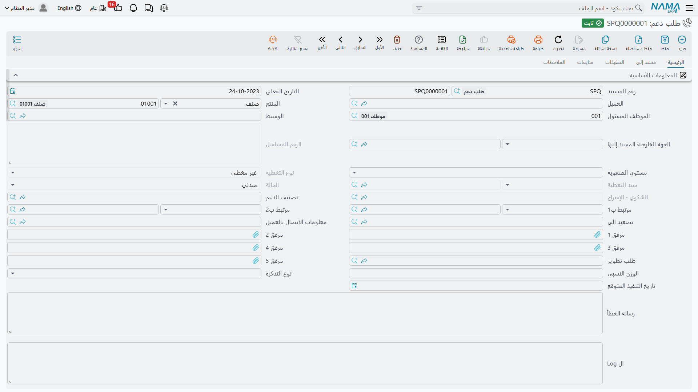

# طلبات الدعم

::: info الترخيص المطلوب
`crm`.
:::

**طلب الدعم** (Trouble Ticket) هو ملف الحالة. وهو المستند الوحيد في مجموعة الدعم الذي لا يستغني عنه مكتب: فيه العميل والمنتج ومن يعمل عليه وكم مضى على عمله وماذا تقول سلسلة النقاش الجارية — وأول ما تقع عليه العين: هل المنتج تحت الضمان أو تحت عقد.

وحدة السبليت في مارينا بلازا تصير طلب الدعم `TKT-0451`، المحرَّر في 6 أبريل 2026 من الشكوى `CMPL-0207`. وتابعه خلال هذه الصفحة.

## فتح الطلب

يصل طلب الدعم بأحد طريقين: بضغط **تحويلة إلي طلب دعم** على شكوى، فيُفتح طلب معبّأ مسبقاً بالعميل والمنتج والرقم المسلسل والوصف والمسئول الخارجي؛ أو بفتح **خدمة العملاء ← الدعم ← طلب دعم** والبدء من الصفر.

وعلى الحالين يُفتح السجل الجديد و**تاريخ الطلب** اليوم، و**وقت التنفيذ المقدر** مقاساً بالساعات، و**الموظف المسئول** هو صاحب الجلسة، و**الحالة** = *مبدئي*.

تحمل الصفحة الرئيسية هوية الحالة: العميل والمنتج والرقم المسلسل والموظف المسئول والوسيط والمسئول الخارجي ومستوي الصعوبة ونوع التذكرة والوزن النسبى وتاريخ التنفيذ المتوقع وكتلة الاتصال، وأربعة حقول نصية عريضة — رسالة الخطأ وال Log وملاحظات الدعم الفني والوصف.

::: warning مستوي الصعوبة وجيرانه تُسجَّل ولا تُقرأ
**مستوي الصعوبة** (صغير / كبير / إضافة / حرج) و**نوع التذكرة** و**الوزن النسبى** و**تاريخ التنفيذ المتوقع** تُحفظ على الطلب ولا يستشيرها شيء. فلا قائمة تُرتَّب بها، ولا قاعدة تستجيب لها، ولا تنبيه عند مرور التاريخ المتوقع. وكذلك **وقت التنفيذ المقدر** لا يُقارَن أبداً بالساعات الفعلية التي يجمعها الطلب.

املأها إن أرادتها تقاريرك — فهي تُصدَّر إلى إكسل على أتمّ وجه — لكن لا تبنِ عليها منظومة أولويات، لأن النظام لن يفرضها.
:::

### مجموعة وقت الطلب

أربعة حقول، اثنان منها لا تستطيع الكتابة فيهما:

- **وقت التنفيذ المقدر** — تقديرك، بالساعات افتراضياً.
- **وقت التنفيذ الفعلي** — للقراءة فقط، يتراكم من مستندات تنفيذ طلب الدعم.
- **تاريخ الطلب** — يبدأ باليوم، وهو التاريخ الذي يختبره بحث التغطية.
- **تاريخ الإغلاق** — للقراءة فقط.

::: warning تاريخ الإغلاق يبقى فارغاً في العادة
لا يُختَم تاريخ الإغلاق إلا في حالتين: عند **أول** ترحيل للمستند إن كان الطلب مغلقاً حينها، أو عند بلوغ تنفيذ طلب دعم نسبة إتمام 100٪. أما الطريق الواقعي — تفتح الطلب وتعمل عليه أسبوعاً ثم تغيّر حالته إلى مغلقة — فيترك تاريخ الإغلاق **فارغاً**. وأي تحليل «زمن الإغلاق» مبني عليه سيكون فارغاً في أغلبه.
:::

### سلسلة النقاش

أسفل الحقول الرئيسية تجلس محادثة الطلب: عشرون صندوق نص. تكتب في أحدها فيختم النظام عند الحفظ اسم المستخدم وتاريخ اللحظة ووقتها في الزوج المجاور المخصص للقراءة فقط. وهي التعليق الداخلي الجاري على الحالة — وسقفها عشرون مدخلاً لا مكان للكتابة بعدها.

## التغطية — البحث الوحيد الذي يعمل حقاً

بمجرد اختيارك عميلاً ومنتجاً يمتلئ حقلان للقراءة فقط:

- **نوع التغطيه** — *مغطي بعقد خدمة* أو *في فترة الضمان* أو *غير مغطي*.
- **سند التغطية** — العقد أو الضمان الذي أنتج الجواب.

ويُعاد حسابهما كلما قُرئ الطلب، فهما يعكسان دائماً عقود اليوم وضماناته لا لقطةً أُخذت يوم تحرير الطلب.

وعلى `TKT-0451` يطابق وحدةَ السبليت في 6 أبريل ضمانٌ وعقدٌ معاً:

| المرشَّح | النافذة | يطابق؟ | يفوز؟ |
|---|---|---|---|
| الضمان `WR-00219` | 2025-11-18 ← 2026-11-18 | نعم | لا |
| عقد الخدمة `CSC-0044`، السطر 1 | 2026-03-01 ← 2027-03-01 | نعم | **نعم** |

**عقد الخدمة يغلب الضمان دائماً.** فلولا وجود `CSC-0044` لقرأ الطلب *في فترة الضمان* وسند التغطية `WR-00219`؛ ولولاهما جميعاً لقرأ *غير مغطي*.

::: danger ماذا تطابق التغطية، وماذا تتجاهل
**ما تطابقه التغطية:** **المنتج** في الطلب، و**الرقم المسلسل** *فقط حين يحمله الطلب*، و**تاريخ الطلب** واقعاً داخل نافذة **يبدأ في ← ينتهى** للسطر. وعقد الخدمة يغلب الضمان حين يطابق الاثنان.

**ما تتجاهله التغطية:** **العميل** (فعقد أي عميل أو ضمانه قد يغطي طلب عميل آخر)، و**حالة العقد** (فالعقود الملغاة والمنتهية والمجدَّدة تغطّي كما هي)، وهل رُحِّل العقد أصلاً (فالمسودات تغطّي)، و**امتداد التجميد** (فالشاشة تعرض التاريخ الممدود بينما تختبر التغطية «ينتهى» الأصلي)، وكل **المحددات** — الشركة والفرع والقطاع.

**ما تفعله التغطية:** العرض ولا شيء غيره. فنوع التغطيه وسند التغطية مؤشر على الشاشة للموظف. ولا يقرؤهما أي تحقق ولا قاعدة تسعير ولا حارس حالة ولا توليد مستند، ولا يوجد توجيه مستند على طلب الدعم يستطيع الاستجابة لهما. ويبقى القرار التجاري — أنُحاسِب على العمل أم لا — يدوياً بالكامل.

**نصيحة عملية:** املأ الرقم المسلسل دائماً في الأصناف المسلسلة، وإلا فضمانٌ واحد مسجَّل بلا رقم مسلسل سيغطي كل طلب يُفتح على ذلك المنتج، لأي عميل، وفي أي فرع.
:::

## دورة الحياة

الحالة ليست شيئاً تكتبه. فالحقل للقراءة فقط على الشاشة، ويُنقَل الطلب بين حالاته بثلاث آليات مختلفة لا تتفق فيما بينها اتفاقاً تاماً.

### 1. الإسناد — والحالة تقفز من تلقاء نفسها

افتح صفحة **مسند إلي** وأضف سطوراً إلى جدول **الموظفين**. وعلى `TKT-0451` هما الفنيان `EMP-2011` و`EMP-2014`.

::: warning تعبئة جدول الموظفين تفرض الحالة «مسند»
في كل مرة يُحفظ فيها الطلب، إن كان في جدول الموظفين سطر واحد على الأقل ضُبطت الحالة على *مسند* قبل تطبيق أي شيء آخر. فلا تستطيع إبقاء طلب على *مبدئي* بعد وضع فنيين عليه — والأدهى أن حالةً ضُبطت بطريق آخر قد تُدفَع رجوعاً إلى *مسند* بحفظٍ لاحق لا علاقة له بالأمر. وهذه هي الآلية وراء سلوك «الارتداد» الموصوف في صفحة تنفيذات طلب الدعم.
:::

وهذا الجدول أيضاً هو ما يجعل فنيي الطلب قابلين للاختيار في تنفيذ طلب دعم: فمنتقي الموظف هناك لا يعرض إلا الموظف المسئول عن الطلب ومن في هذا الجدول.

### 2. تغيير الحالة — وما لن يعرضه عليك

إجراء **تغيير الحالة** في الصفحة الرئيسية يفتح مربع حوار صغيراً يعرض خمسة خيارات بالضبط:

**قيد التنفيذ · ملغي · مغلقة · منتهي · معاد فتحه**

واختيار أحدها يكتب تلك الحالة على الطلب ويجعلها تثبت عبر الحفظات اللاحقة. واختيار **قيد التنفيذ** يبدأ فوق ذلك سطر توقيت للموظف الحالي؛ واختيار أي شيء عدا **معاد فتحه** يوقفه.

### 3. بوابة الحالات — ثماني حالات تسكن مكاناً آخر

لطلب الدعم **ثلاث عشرة** حالة، وهذه أقلّ الحقائق قابليةً للاكتشاف في ركن الدعم كله:

| متاحة من مربع تغيير الحالة | متاحة **فقط** عبر متابعة طلب دعم |
|---|---|
| قيد التنفيذ | مبدئي |
| ملغي | مسند |
| مغلقة | تم التنفيذ |
| منتهي | مؤجل |
| معاد فتحه | طلب تطوير |
| | بانتظار رد العميل |
| | OutSideContractScope *(بلا ترجمة في أي من اللغتين)* |
| | خارج الضمان |

::: danger الحالات الثماني الغائبة ليست على شاشة الطلب أصلاً
إن أراد مكتبك إرقاد حالة على *مؤجل* أو *بانتظار رد العميل* أو *خارج الضمان* أو *طلب تطوير*، فلن يعرض عليه مربع تغيير الحالة شيئاً من ذلك، وحقل الحالة نفسه للقراءة فقط. والسبيل **الوحيد** لضبط تلك الثماني هو تحرير [متابعة طلب دعم](/ar/modules/crm/support/crm-ticket-follow-ups.md) تحمل القيمة في حقل *تغير حاله طلب الدعم الى* وترحيلها.

(و*مبدئي* و*مسند* في العمود الأيمن كذلك لأن النظام يضبطهما لك — مبدئي عند إنشاء السجل، ومسند كلما كان في جدول الموظفين سطور — لكن إن احتجت يوماً إلى إرجاع طلب إليهما بيدك، فالمتابعة هي الطريق الوحيد مرة أخرى.)

وحالتان تظهران بكلمة لاتينية خام بدل عنوان مترجم: **OutSideContractScope** بلا ترجمة عربية ولا إنجليزية، و*تعديل* في قائمة نوع التذكرة مترجمة بالعربية وحدها.
:::

درّب المكتب على هذا مبكراً. فالمواقع التي تجهله تنتهي إلى استعمال خمس حالات فقط واختراع أعراف داخل حقل الوصف للتعبير عن البقية.

### 4. الإغلاق

طريقان، وسلوكهما مختلف:

- **تغيير الحالة ← مغلقة** — يُغلق الطلب. ولا يُملأ تاريخ الإغلاق إلا إن صادف أن كان هذا أول ترحيل للمستند.
- **ترحيل تنفيذ طلب دعم بنسبة إتمام 100٪** — يعرض الطلب *منتهي* ويُختم تاريخ الإغلاق بتاريخ «من تاريخ» في ذلك السطر. وعلى `TKT-0451` يفعل التنفيذ `TEXE-0679` في 13 أبريل هذا بالضبط. لكن راجع التحذير في [تنفيذات طلب الدعم](/ar/modules/crm/support/crm-ticket-executions.md): فهذا الطريق يضبط الحالة الظاهرة دون أن يثبّتها.

و**معاد فتحه** يعيد الطلب إلى الميدان؛ ولا يتغير شيء آخر، ولا يُمسح تاريخ الإغلاق.

## ساعة توقيت الطلب

تحمل صفحة «مسند إلي» جدولاً ثانياً هو **وقت تنفيذ الطلب**، بسطر لكل فترة عمل: الموظف وتاريخ ووقت البداية وتاريخ ووقت النهاية ووقت التنفيذ وإجمالي وقت تنفيذ الموظف. وكل تلك المدد يُعاد حسابها عند الحفظ، و**إجمالي وقت التنفيذ** في الترويسة مجموعها.

وتُنشأ السطور وتُغلق بزرَّي **بدء** و**إنهاء** في الصفحة نفسها، وبتغيير الحالة إلى قيد التنفيذ.

وعلى `TKT-0451` تقرأ الساعة:

| الموظف | البداية | النهاية | المدة |
|---|---|---|---|
| `EMP-2011` | 2026-04-07 08:25 | 2026-04-07 15:40 | 7:15 |
| `EMP-2014` | 2026-04-13 09:00 | 2026-04-13 12:20 | 3:20 |
| | | **إجمالي وقت التنفيذ** | **10:35** |

::: warning ساعتان لن تتفقا أبداً
**إجمالي وقت التنفيذ** (10:35 هنا) يأتي من هذه الساعة. و**وقت التنفيذ الفعلي** (7.0 ساعات هنا) يأتي من مستندات تنفيذ طلب الدعم. وهما يقيسان شيئين مختلفين، ويُصانان مستقلين، ولا شيء يوفّق بينهما. فاختر أيّهما تقاريرك والتزمه.
:::

::: danger بدء العمل يوقف ساعة الفني نفسه على طلب آخر
حين تبدأ ساعة فني هنا يبحث النظام أولاً عن **أي** سطر توقيت مفتوح لذلك الفني — *في كل طلبات الدعم في قاعدة البيانات* — فيغلقه. فلا يكون الشخص الواحد «قيد التنفيذ» إلا على طلب واحد في وقت واحد.

والأسوأ أن وقت النهاية المكتوب على السطر المهجور ليس وقت اللحظة، بل طابع آخر إجراء مسجَّل لذلك الموظف في اليوم نفسه، فإن لم يوجد أُغلق السطر عند وقت بدايته — أي **صفر دقيقة** لصباح عملٍ كامل. ويُعاد حفظ الطلب الآخر بصمت ضمن هذه العملية.

أخبر الفنيين أن يضغطوا **إنهاء** قبل الانتقال إلى طلب آخر. كما أن السطر لا يجوز أن يمتد أكثر من يوم واحد؛ والشاشة ترفض ما يمتد.
:::

## أزرار الصفحة الرئيسية

| الزر | ما يفعله |
|---|---|
| **تنفيذ** | يفتح **تنفيذ طلب دعم** غير محفوظ في نافذة منبثقة، مشيراً إلى هذا الطلب، بسطر واحد للموظف المسئول يبدأ الآن |
| **تغيير الحالة** | مربع الخيارات الخمسة الموصوف أعلاه |
| **تحويل إلي سؤال شائع** | ينشئ سؤالاً شائعاً: السؤال هو وصف الطلب، والجواب كل ملاحظات تنفيذات هذا الطلب مضمومة بعضها إلى بعض |
| **تصعيد الي** | يختم الموظف المختار في حقل «تصعيد الي» |
| **إنشاء طلب تطوير** | يفتح طلب تطوير غير محفوظ يحمل هذا الطلب والعميل والمنتج والوصف |
| **عمل متابعة** | يفتح **متابعة طلب دعم** غير محفوظة |

::: warning زرّان لا يفعلان ما يقوله عنوانهما
**عمل متابعة** يفتح **متابعة طلب دعم**، لا مستند «سند متابعة» الذي في مجموعة الأنشطة. فهما شاشتان مختلفتان بحقول مختلفة؛ وسند المتابعة لا يُوصل إليه إلا من عنصر قائمته. راجع [المهام وسندات المتابعة](/ar/modules/crm/activities/crm-tasks-and-follow-ups.md).

و**تصعيد الي** يحفظ السجل المخزَّن ويرحّله بمجرد ضغطه — ويرحّل النسخة الموجودة على الخادم، فأي تعديلات كتبتها على الشاشة ولم تحفظها **لا** تدخل فيه. كما أنه لا يغيّر الحالة: فليس لطلب الدعم حالة *مصعَّد*، ولا قائمة تصعيد، ولا إشعار. احفظ عملك قبل ضغطه.
:::

## بقية الشاشة

- صفحة **التنفيذات** — قائمة للقراءة فقط بمستندات تنفيذ طلب الدعم المحرَّرة على هذا الطلب. (تسرد أعمدتها «الموظف» مرتين؛ وهذا خلل عرض لا موظفان مختلفان.)
- صفحة **متابعات** — قائمة للقراءة فقط بمتابعات طلب الدعم المحرَّرة عليه.
- صفحة **الملاحظات** — جدول ملاحظات حرّة بملاحظة ومرفقين لكل سطر، فوق خانات المرفقات الخمس في الصفحة الرئيسية.

## لا آثار ولا توجيه

**طلب الدعم لا يقيّد شيئاً ولا يحرّك مخزوناً.** وليس له توجيه مستند، فلا شيء يُضبط عليه ولا شيء يمكن جعله يستجيب لحالة أو لنتيجة تغطية. وإن استهلك الإصلاح قطع غيار، صُرفت بمستند مخزني عادي يُحرَّر على حدة، ولا يوجد رابط يعود منه إلى الطلب.

::: info زر «إنشاء طلب دعم» في الشاشات الأخرى شيء آخر تماماً
يحمل شريط أدوات نما إجراءً عاماً باسم *إنشاء طلب دعم* قد يظهر في أي شاشة. وهذا الإجراء **لا** ينشئ طلباً في تركيبتك أنت — بل يرفع طلب دعم إلى مكتب دعم شركة نما عبر الإنترنت، ولا يعمل إلا إذا حملت الإعدادات العامة عنوان خادم نما وبيانات الدخول. والذي تراه محلياً صفٌّ من الطلبات لا مستند خدمة عملاء. ولا علاقة له بطلبات الدعم الموصوفة في هذه الصفحة.
:::
