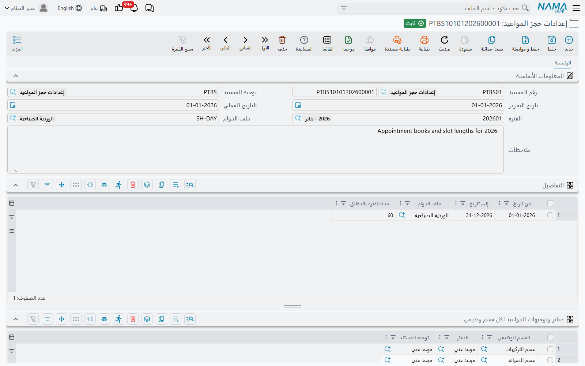

# إعدادات حجز المواعيد

::: info الترخيص المطلوب
`crm-technician-appointments`.
:::

يحتاج تقويم الحجز أن يعرف أمرين قبل أن يمنع حجزاً سيئاً: **متى تعمل فرقك**، و**بأي دقة تريد تقسيم اليوم**. وكلاهما هنا، في مستند اسمه **إعدادات حجز المواعيد**.

ويُبلَغ إليه من القسم الوظيفي لا من الموعد. فأنت تنشئ سجل الإعدادات، ثم تفتح **قسم وظيفي** وتُشير بحقل **إعدادات حجز المواعيد** فيه إلى هذا السجل. ومن ثمّ يحكم هذا السجلُّ كلَّ موعد لذلك القسم، وتقويمَ الحجز، وفرقَ القسم في [مواعيدي](/ar/modules/crm/technician-appointments/crm-my-appointments).

## ساعات العمل تأتي من ملف الدوام

الشيء الوحيد الذي لا تفعله هذه الشاشة هو أن تطلب منك إعادة رسم أسبوع العمل. فهي تستعيره من شؤون الموظفين: يشير حقل **ملف الدوام** إلى ملف دوام، ويقرأ التقويم تعريف ذلك الملف يوماً بيوم — أيّ الأيام أيام عمل، وأيها راحة أسبوعية، وما فترات العمل داخل كل يوم عمل.

ويستعمل السجل في المثال أعلاه `SH-DAY - الوردية الصباحية` (*Morning Shift*). وهذا الملف يعمل من الأحد إلى الخميس من 8:00 إلى 16:00، ويجعل الجمعة والسبت راحة أسبوعية. فيرسم التقويم من الأحد إلى الخميس قابلاً للحجز بين الثامنة والرابعة، ويظلّل الجمعة والسبت غير عاملين، لأن هذا ما يقوله ملف الدوام.

وقد يحمل ملف الدوام أكثر من فترة عمل في اليوم — فترة صباحية وأخرى بعد الظهر بينهما راحة. والتقويم يحترم ذلك أيضاً: فتُرسم الراحة خارج ساعات العمل ولا يمكن تحديدها.

## جدول التفاصيل — الفترات وملفات الدوام ومدة الفترة

في جدول **التفاصيل** تصير الإعدادات محدَّدة بالزمن. فكل سطر يقول: *بين هذين التاريخين، اعمل بملف الدوام هذا، بفترات بهذا الطول.*

| العمود | ما يفعله |
|---|---|
| من تاريخ | بداية المدة التي يحكمها هذا السطر |
| إلى تاريخ | نهايتها |
| ملف الدوام | ملف الدوام لهذه المدة. وإن كان ملف الدوام في المعلومات الأساسية مملوءاً نُسخ إلى هذا العمود في كل السطور عند الحفظ |
| مدة الفترة بالدقائق | ارتفاع السطر الواحد في شبكة التقويم |

ويغطي السطر الوحيد في المثال من 1 يناير 2026 إلى 31 ديسمبر 2026، بملف الدوام «الوردية الصباحية»، بفترات من 60 دقيقة.

وثلاث نتائج جديرة بالتخطيط لها:

**التواريخ تسيّج التقويم.** فأبكر «من تاريخ» وأحدث «إلى تاريخ» في كل السطور يصيران المدى الذي يعرضه التقويم أصلاً — فلا تستطيع الانتقال إلى أسبوع خارجه، ولا يستطيع موظف الحجز أن يحجز سهواً في سنة لم يجهّزها أحد. واترك التواريخ فارغة يصر التقويم بلا حدود.

**ومدة الفترة شبكة رسم لا قاعدة على طول الموعد.** فبفترات الستين دقيقة يرسم التقويم سطوراً بالساعة ويلتصق السحب بالساعة؛ ويظل بوسعك السحب عبر ثلاثة سطور لحجز ثلاث ساعات. وإن حملت عدة سطور مدداً مختلفة استعمل التقويم **أقصرها**، لتكون الشبكة دقيقة بما يكفي لكل مدة. واتركها فارغة يرجع التقويم إلى سطور نصف الساعة.

**والسطور قد تختلف.** فسطران يتيحان لك جدولاً صيفياً بملف دوام وجدولاً شتوياً بآخر، أو تضييق الفترة من ساعة إلى نصف ساعة في موسم الذروة، دون المساس بملفات الدوام نفسها.

::: warning ملف الدوام في المعلومات الأساسية يستبدل السطور
إن كان حقل **ملف الدوام** في المعلومات الأساسية مملوءاً نسخه الحفظ إلى كل سطور التفاصيل واستبدل ما كان فيها. فلكي تعطي المدد المختلفة ملفات دوام مختلفة اترك حقل المعلومات الأساسية فارغاً واضبط ملف الدوام في كل سطر.
:::

## دفاتر وتوجيهات المواعيد لكل قسم وظيفي

أما الجدول الثاني — **دفاتر وتوجيهات المواعيد لكل قسم وظيفي** — فيجيب عن سؤال آخر: كيف تُرقَّم المواعيد وتُوجَّه؟

سطر لكل قسم: **القسم الوظيفي**، و**الدفتر** الذي تُسجَّل فيه مواعيده، واختيارياً **توجيه المستند**. وفي سجل المثال سطران، أحدهما لـ«قسم التركيبات» والآخر لـ«قسم الصيانة»، فيتقاسم القسمان ملف الدوام وقواعد الفترات فيه.

فحين يُحفظ موعد بلا دفتر أو بلا توجيه يبحث النظام في إعدادات القسم، فيأخذ **أول** سطر لذلك القسم ويملأ الدفتر والتوجيه كليهما. ويحدث هذا في كل مرة ينشئ فيها [تقويم الحجز](/ar/modules/crm/technician-appointments/crm-technician-appointment-calendar) موعداً، لأن التقويم لا يسأل عن دفتر قط. ويأخذ الموعد رقمه من ذلك الدفتر ويرث محدداته. وإن كان للقسم أكثر من سطر فالأول وحده هو المستعمل.

::: tip سجل إعدادات واحد قد يخدم عدة أقسام
الجدول مفتاحه القسم، فقد تشير عدة أقسام إلى سجل الإعدادات نفسه وتظل ترقّم مواعيدها في دفاترها الخاصة. والذي ستتقاسمه هو ملف الدوام وقواعد الفترات في جدول التفاصيل — فلا تجمع الأقسام إلا حين تعمل الساعات نفسها حقاً.

والقسم الذي لا سطر له هنا لا يُملأ له دفتر تلقائياً. فمن ينشئ الموعد من شاشته يختار الدفتر بيده. أما تقويم الحجز فلا يستطيع ذلك، فيُرفض حفظه لذلك القسم إلى أن تضيف السطر.
:::

## مثال إعداد كامل

لقسم تركيب يعمل من 8 إلى 5 من الأحد إلى الخميس، بفترات ساعة، ويُرقَّم في دفتر `APP`:

1. تأكد من وجود ملف الدوام في شؤون الموظفين بأيام العمل والساعات الصحيحة.
2. أنشئ مستند الإعدادات وضع ملف الدوام في المعلومات الأساسية.
3. أضف سطر تفاصيل واحداً: من 1 يناير هذا العام إلى 31 ديسمبر العام المقبل، ومدة الفترة 60.
4. أضف سطراً في دفاتر وتوجيهات المواعيد لكل قسم وظيفي: قسمك، الدفتر `APP`، التوجيه `APP_TERM`.
5. رحِّل، ثم افتح القسم الوظيفي وعلّم **يظهر في شاشة المواعيد** وأشِر بـ**إعدادات حجز المواعيد** إلى هذا السجل.

وسيفتح تقويم ذلك القسم الآن على الأسبوع الصحيح، ويرفض الجمعة والسبت، ويرفض ما قبل الثامنة وما بعد الخامسة، ويعطي كل حجز ينشئه رقم `APP…` صحيحاً.
