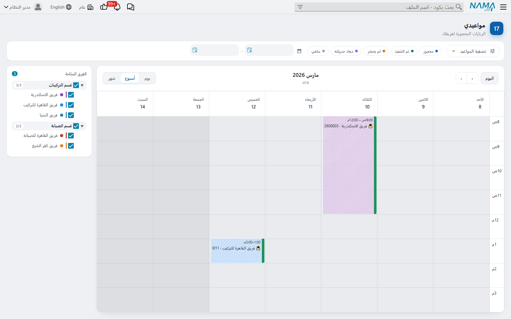
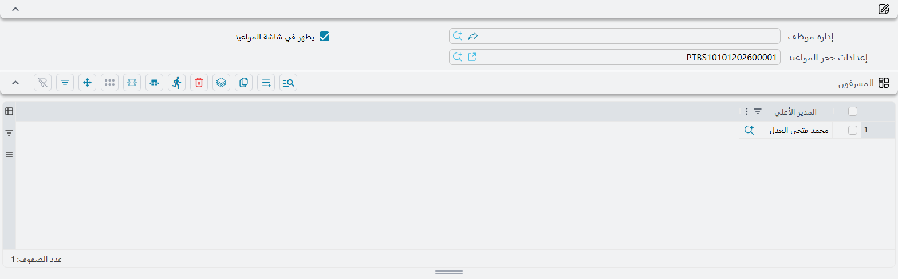
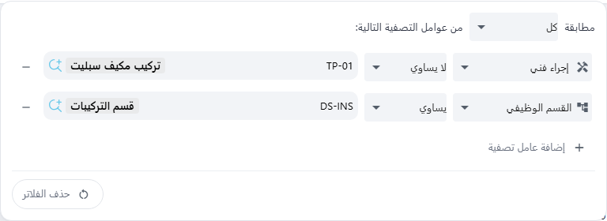

# مواعيدي

::: info الترخيص المطلوب
`crm-technician-appointments`.
:::

[تقويم الحجز](/ar/modules/crm/technician-appointments/crm-technician-appointment-calendar) لمن يخططون الزيارات. أما **مواعيدي** فلمن يذهبون إليها ولمن يشرفون عليهم. والقائمة واحدة للجميع: الفني يرى أسبوع فريقه، ومشرف القسم يرى كل فرق أقسامه، ومدير النظام يرى كل الفرق. والشاشة للقراءة فقط عن قصد، فهي تعرض الجدول وليست أداة تخطيط.

## مَن يرى ماذا

تحدد الشاشة ما تعرضه من تسجيل دخولك. فتطرح هذه الأسئلة بهذا الترتيب، وتتوقف عند أول سؤال ينطبق عليك:

1. **هل أنت مدير نظام؟** أي أن ملف الصلاحيات الخاص بك فيه **صلاحيات كاملة** — انظر [ملفات الصلاحيات](/ar/platform/security/security-profiles) — أو أن مستخدمك معلَّم عليه **Allow Access to Admin Restricted Functionality (utils.html, kill tasks, logout users and so on)** (يظهر بهذا النص الإنجليزي في الواجهة العربية أيضاً). فإن كنت كذلك رأيت كل الفرق المرحَّلة، ولا يلزم ربط مستخدمك بموظف.
2. **هل مستخدمك مرتبط بموظف؟** إن لم يكن توقفت الشاشة برسالة *«حساب المستخدم الخاص بك غير مرتبط بموظف، لذلك لا يمكن تحديد الفريق الذي تنتمي إليه…»*. فاطلب من مدير النظام ربط مستخدمك ببطاقة الموظف الخاصة بك.
3. **هل أنت مشرف قسم؟** أي أن موظفك مدرج في جدول **المشرفون** لقسم وظيفي مرحَّل أو أكثر. فإن كنت كذلك رأيت الفرق المرحَّلة التابعة لتلك الأقسام. وهذا يسبق أي فريق أنت عضو فيه. والفرق التي ليس لها قسم وظيفي لا تظهر للمشرف.
4. **هل أنت فني؟** ترى الفرق المرحَّلة التي يُذكر موظفك بين فنييها.

وإن لم يجد أيٌّ من هذه فريقاً قالت الشاشة *«أنت لست عضواً في أي فريق فنيين، لذلك لا يوجد جدول لعرضه…»*. فأضف الموظف في [الفريق](/ar/modules/crm/technician-appointments/crm-technician-crews)، أو انقله إليه بـ[سند نقل](/ar/modules/crm/technician-appointments/crm-technician-transfers). ويرى مدير النظام أو المشرف الرسالة نفسها إن لم يكن في نطاقه فريق بعد.

::: tip مشرف الفريق ليس مشرف القسم
حقل **مشرف الفريق** في الفريق يسمّي رئيس الفريق، ولا يجعل صاحبه مشرفاً في هذه الشاشة. فجدول «المشرفون» في القسم الوظيفي وحده هو الذي يفعل ذلك.
:::

## تجهيز المشرفين

يحتاج المشرف أمرين:

1. افتح **الرواتب ← الأساسيات ← الأقسام الوظيفية**، وافتح القسم، وأضف الموظف في جدول **المشرفون** واحفظ.
2. اربط مستخدم المشرف بملف ذلك الموظف.

ومشرف قسمين يرى فرق القسمين كليهما. وباقي تجهيز القسم (**يظهر في شاشة المواعيد** و**إعدادات حجز المواعيد**) في [النظرة العامة](/ar/modules/crm/technician-appointments/crm-technician-appointments-overview)، وتجهيز الفرق نفسها في [فرق الفنيين](/ar/modules/crm/technician-appointments/crm-technician-crews).

## قراءة الجدول

تُفتح الشاشة على الأسبوع الحالي. و**اليوم** وسهما التنقل وعروض **يوم / أسبوع / شهر** تعمل كما في تقويم الحجز. وتحت عنوان الفترة يظهر رقم الأسبوع، مثل *W37 · الأسبوع الحالي*.

وساعات العمل وارتفاع الفترة ومدى التواريخ التي يمكنك تصفحها وأيام الراحة كلها تأتي من [إعدادات حجز المواعيد](/ar/modules/crm/technician-appointments/crm-appointment-booking-settings) للأقسام التي تتبعها الفرق المعروضة. والوقت الذي مضى يظهر رمادياً.

وكل كتلة فترة من موعد مرحَّل، معنونة باسم الفريق وكود الموعد، ويتبعهما عنوان الموعد إن كان للموعد الفني وصف للعنوان (Title descriptor). وتُقرأ الكتلة هكذا:

- **لون الكتلة هو لون الفريق**، فتميّز الفرق بنظرة.
- **الحالة شريط ملوّن على حافة الكتلة الأولى.** الزيارة **محجوز** بلا شريط. ولكل من **معاد جدولته** و**لم يحضر** و**تم التنفيذ** لونه، والزيارة المنفَّذة يظهر عليها قفل 🔒 أيضاً.
- **الزيارة الملغاة تبقى ظاهرة**، لكن باهتة ومشطوبة، فيعرف الفني أنها أُلغيت.

وتحمّل الشاشة حتى 200 موعد للفترة المعروضة. ففي الأسبوع المزدحم ضيّق العرض بالتصفية أدناه.

## لوحة «الفرق المتاحة»

لوحة **الفرق المتاحة** بجوار التقويم تسرد الفرق التي تراها، مجمّعة حسب القسم الوظيفي. والفرق التي بلا قسم تُجمع تحت **بدون قسم**. ويظهر مع كل قسم عدد فرقه الظاهرة من إجماليها، مثل *2/3*.

وكل الفرق معلَّمة عند فتح الشاشة. فأزل التعليم عن فريق لتخفي زياراته، أو عن قسم لتخفي فرقه كلها دفعة واحدة.

## تصفية الجدول

شريط التصفية فوق التقويم. وزر **تصفية المواعيد** يفتح أداة بناء عوامل التصفية، وعلى الزر شارة بعدد العوامل التي لها قيمة.

وتُقرأ الأداة كجملة: *مطابقة **كل** / **أيٌّ منها** من عوامل التصفية التالية*. فاختر **كل** حين يجب أن تتحقق كل العوامل، أو **أيٌّ منها** حين يكفي واحد. ولكل عامل ثلاثة أجزاء:

- **حقل**،
- **يساوي** أو **لا يساوي**. و«لا يساوي» تطابق أيضاً المواعيد التي يكون فيها ذلك الحقل فارغاً،
- **قيمة**.

واضغط **إضافة عامل تصفية** لإضافة عامل، وزر الناقص لحذفه. وما دامت لا توجد عوامل تقول الأداة *لا توجد عوامل تصفية*.

| الحقل | ما يطابقه |
|---|---|
| الفني (Technician) | زيارات الفرق التي ينتمي إليها ذلك الشخص حالياً |
| القسم الوظيفي (Department Section) | زيارات فرق ذلك القسم |
| العميل (Customer) | عميل الموعد |
| الفرع (Branch) | فرع الموعد |
| المنطقة (Area) | منطقة عنوان العميل |
| إجراء فني (Technician Procedure) | العمل المحجوز. استعمله للتصفية بنوع الزيارة |
| بناءا على (From Document) | المستند الذي حُجزت منه الزيارة |
| موعد فني (Technician Appointment) | موعد بعينه |

و**الفني** و**القسم الوظيفي** لا يُعرضان إلا للمشرفين ومديري النظام، لأنهم يرون أكثر من فريق. ومنتقيات الفني والقسم الوظيفي والموعد الفني لا تعرض إلا قيماً من الفرق التي تراها.

وبجوار زر التصفية:

- **شرائح الحالات.** انقر حالة أو أكثر لترى تلك الحالات وحدها. وإن لم تختر شيئاً ظهرت كل الحالات.
- **خانتا من تاريخ وإلى تاريخ.** تحصران الجدول في مدة، و«إلى تاريخ» داخلة فيها. وحين تضبط «من تاريخ» ينتقل التقويم إليه.
- **حذف الفلاتر.** يظهر بمجرد أن تضيف عاملاً أو تختار شريحة حالة أو تضبط تاريخاً. يحذف العوامل والتواريخ وشرائح الحالات، ويعيد «مطابقة» إلى **كل**. والزر نفسه موجود في أداة البناء.

والتصفية لا تُحفظ. فحين تغادر الشاشة وتعود تُفتح بلا تصفية.

## فتح موعد

**انقر بالزر الأيسر** على كتلة لتفتح ذلك الموعد للقراءة فقط في التبويب نفسه. وفيه تقرأ العميل، والعنوان في صفحة «عنوان العميل»، والمواد في «الأصناف والخدمات»، وباقي فترات الحجز.

**وانقر بالزر الأيمن** على كتلة لتظهر قائمة صغيرة عنوانها كود الموعد. وبندها الوحيد **فتح المستند** يفتح الموعد في تبويب جديد.

ولا شيء في هذه الشاشة يغيّر حجزاً. فلنقل زيارة أو إلغائها أو إغلاقها استعمل [تقويم الحجز](/ar/modules/crm/technician-appointments/crm-technician-appointment-calendar) أو [الموعد الفني](/ar/modules/crm/technician-appointments/crm-technician-appointment) نفسه.
