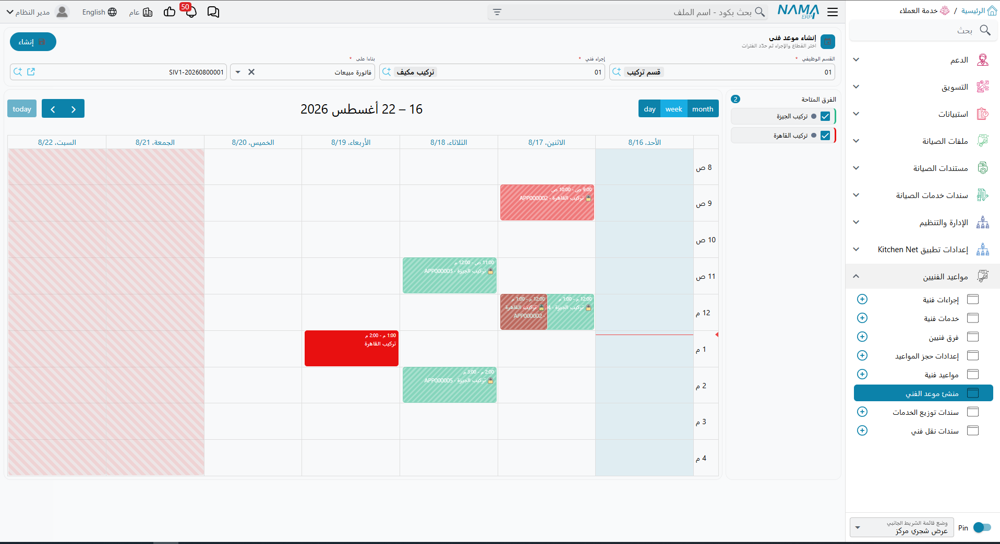

# تقويم الحجز

::: info الترخيص المطلوب
`crm-technician-appointments`.
:::

**منشئ موعد الفني** هو الشاشة التي يعيش فيها موظفو الحجز فعلاً. وهي عرض أسبوعي لالتزامات فرقك، فوقه ثلاثة حقول: اختر القسم، واختر العمل، وسمِّ المستند الذي بيعت عليه الزيارة، ثم اسحب الساعات التي تريدها واضغط **إنشاء**. فيخرج من الطرف الآخر موعد واحد مرحَّل.

## الحقول الثلاثة في الأعلى

**القسم الوظيفي** — ولا يُعرض إلا للأقسام المعلَّم عليها **يظهر في شاشة المواعيد**. واختياره يحمّل [إعدادات حجز المواعيد](/ar/modules/crm/technician-appointments/crm-appointment-booking-settings.md) الخاصة بذلك القسم، وهي التي تعطي الشبكةَ ساعات عملها وارتفاع فتراتها ومدى الأسابيع المسموح لك بتصفحها.

**إجراء فني** — العمل. ويعرض المنتقي الإجراءات التي يذكر جدول أقسامها الوظيفية القسمَ الذي اخترته، ويعرض معها الإجراءات التي جدولها فارغ.

**بناء على** — فاتورة المبيعات أو أمر البيع أو العقد الذي وُعد فيه بالزيارة. وهو مطلوب هنا: فالتقويم لن ينشئ موعداً بدونه.

وإلى أن يُضبط القسم والإجراء معاً يبقى التقويم خلف لوحة تقول *«اختر القسم الوظيفي والإجراء لبدء تحديد الفترات»*. وبمجرد ضبطهما تمتلئ قائمة الفرق ويمتلئ الأسبوع.

## قراءة الأسبوع

**لوحة «الفرق المتاحة»** إلى الجانب تسرد الفرق القادرة على هذا العمل في هذا القسم — الفرق التي يذكر جدول إجراءاتها الإجراء المختار أو يكون فارغاً، والتي يطابق قسمها الوظيفي القسمَ المختار أو يكون فارغاً. ولكل فريق لونه ومربع تعليم؛ فأزل التعليم عن فريق ليخرج هو وحجوزاته من العرض. وهي أسرع طريقة للإجابة عن «متى يكون فريق القاهرة متاحاً» في أسبوع مزدحم: أزل التعليم عن الباقين.

**الكتل المخططة التي عليها قفل** مواعيد قائمة — التزامات الفرق نفسها، مرسومة بلون كل فريق ومعنونة باسمه ورقم الموعد. وهي للقراءة فقط هنا؛ والنقر على إحداها يفتح ذلك الموعد.

**الكتل الصمّاء** هي الفترات التي رسمتها للتو ولم تُنشئها بعد.

**الأعمدة المظللة والسطور الرمادية** وقت لا يمكن حجزه: أيام يعدّها ملف الدوام راحةً، وساعات خارج فترات عمله. وفي الصورة الجمعة والسبت مظللان بالكامل، وتبدأ الشبكة من الثامنة صباحاً لأن ذلك وقت بدء دوام الإدارة.

وأزرار الرأس هي مجموعة التقويم المعتادة — **السابق** و**التالي** و**اليوم**، وعروض **شهر / أسبوع / يوم**. والخط الأحمر هو الوقت الحالي.

## رسم حجز

1. اسحب لأسفل في عمود اليوم الذي تريده، من وقت البداية إلى وقت النهاية. ويلتصق السحب بمدة الفترة المضبوطة في إعدادات الحجز — وهي سطور بالساعة في الصورة.
2. يسألك مربع حوار عن **الفريق** صاحب هذه الفترة، وفيه خانة بحث للمواقع كثيرة الفرق. وإن كان المتاح فريقاً واحداً اختير لك دون سؤال.
3. تظهر الكتلة بلون ذلك الفريق. وكرِّر بقدر ما يحتاج العمل من فترات — كتلة صباحية وأخرى بعد الظهر، أو ثلاثة صباحات متتالية.
4. اضغط **إنشاء**.

::: tip كل الفترات التي ترسمها لفريق واحد
اختر فريقاً مختلفاً لفترة ثانية فيخبرك التقويم *«تم تغيير الفريق، وحُذفت الفترات السابقة»* ويمسح ما رسمته، فلا يبقى إلا الفترة الجديدة.

وليس هذا تعنّتاً من الشاشة: فالموعد يحجز فريقاً واحداً بالضبط، فجلسة الحجز الواحدة لا يمكن أن تكون إلا عن واحد منهم. فاحجز الفريق الثاني موعداً ثانياً.
:::

ولحذف فترة رسمتها انقر عليها وأكّد الحذف. أما المواعيد القائمة فلا تُحذف من هنا — والنقر على إحداها ينقلك إلى المستند.

## ماذا يفعل زر «إنشاء»

يصير زر **إنشاء** متاحاً متى كان لديك قسم وإجراء ومستند مصدر وفترة واحدة مرسومة على الأقل. فيبني الموعد ويرحّله في خطوة واحدة:

- يوضع القسم الوظيفي والإجراء الفني ومستند «بناء على» في المعلومات الأساسية.
- وتصير كل كتلة مرسومة سطر تفاصيل — الفريق واليوم ووقت البداية ووقت النهاية.
- وتبدأ الحالة **محجوز**، ويُملأ الدفتر والتوجيه والرقم والمحددات من إعدادات حجز المواعيد الخاصة بالقسم.

وتظهر رسالة تأكيد فيها كود الموعد الجديد، فتختفي الكتل المرسومة، ويعود الموعد المُنشأ حديثاً بعد لحظة كتلةً مخططة مقفلة — لأنه صار الآن التزاماً على أحدهم كسائر الالتزامات. وتبقى أنت على الأسبوع نفسه بالقسم والإجراء نفسيهما، مستعداً لحجز العميل التالي.

وإن تعذّر ترحيل الموعد — لغياب دفتر أو لقاعدة موافقات أو لمحدد مطلوب — عُرضت الأخطاء ولم يُنشأ شيء؛ وتبقى فتراتك المرسومة على الشاشة لتعالج السبب وتضغط «إنشاء» من جديد.

## من أين تأتي حدود التقويم

لا شيء من أسبوع العمل يُضبط في هذه الشاشة. فكل شيء يعود إلى أصله:

| ما تراه | من أين يأتي |
|---|---|
| أيّ الأقسام يمكنك اختياره | **يظهر في شاشة المواعيد** في القسم الوظيفي |
| أيّ الأسابيع يمكنك الانتقال إليه | «من تاريخ» و«إلى تاريخ» في جدول تفاصيل إعدادات الحجز |
| ارتفاع سطر الشبكة | مدة الفترة بالدقائق — أقصرها إن اختلفت السطور |
| ساعات العمل وأيام الراحة | ملف الدوام المسمّى في إعدادات الحجز |
| أيّ الفرق تُسرد | القسم الوظيفي للفرق وجدول إجراءاتها |
| لون كل فريق | كود اللون في الفريق |
| الدفتر الذي يُرقَّم به الموعد | دفاتر وتوجيهات المواعيد لكل قسم وظيفي |

فإن لم يعرض التقويم ما تتوقعه فهذا الجدول قائمة الفحص التي تنزل فيها بنداً بنداً.
