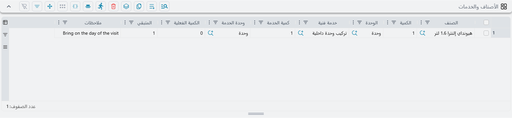
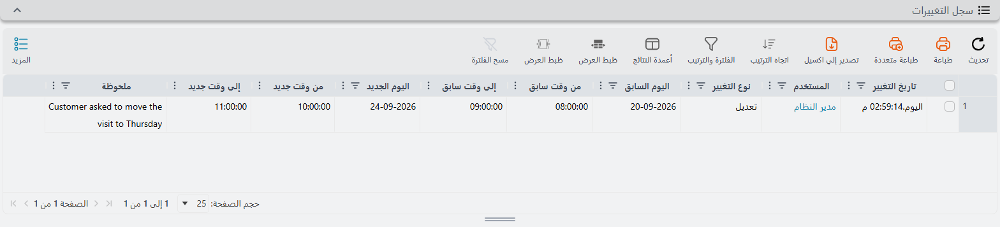

# الموعد الفني

::: info الترخيص المطلوب
`crm-technician-appointments`.
:::

**الموعد الفني** هو الحجز نفسه — فريق واحد، وعمل واحد، والأوقات المحجوزة لهما، والمواد التي ستستهلكها الزيارة. وفي أغلب الأحوال لن تكتبه من الصفر، بل سترسمه على [تقويم الحجز](/ar/modules/crm/technician-appointments/crm-technician-appointment-calendar.md) فينشئه التقويم لك. وهذه الصفحة تصف المستند الذي تحصل عليه، لأنه الموضع الذي تذهب إليه لتبحث عن حجز، أو تسرد مواده، أو تعدّله أو تلغيه، أو تتتبعه رجوعاً إلى البيع، أو تعرف مَن نقله.

## المعلومات الأساسية

إلى جانب إطار المستند المعتاد — **رقم المستند** والدفتر، و**توجيه المستند**، و**تاريخ التحرير**، و**التاريخ الفعلي**، و**الفترة**، و**ملاحظات** — يحمل الموعد حقولاً خاصة به.

**بناءا على** — المستند الذي وُعد فيه بهذه الزيارة: فاتورة مبيعات، أو أمر بيع، أو عقد، أو مستند صيانة. وهو حقل مرجع عام يقبل أي مستند، وهو الخيط الذي يربط الزيارة بما بيع. وقد حُرِّر `PTA101PUBLIC202600009` من فاتورة مبيعات السيارة `SISI10101202600001`.

**المستند الأعلى لبناءاّ علي** — يملؤه النظام ولا يُعدَّل: وهو المستند الذي جاء منه مستند «بناءا على» نفسه. فحين تُحجز الزيارة من فاتورة مبيعات محرَّرة أصلاً من أمر بيع، أظهر هذا الحقل أمر البيع. وهو يوفّر عليك نقرة تتبع السلسلة حين يسأل أحدهم لأي أمر بيع يتبع هذا التركيب. وهو في `PTA101PUBLIC202600009` يقرأ أمر بيع السيارة `SISO10101202600001`.

**العميل** — يملؤه النظام في كل حفظ. وهو العميل المذكور في المستند الأعلى، أو في مستند «بناءا على» إن لم يكن في المستند الأعلى عميل. ويُقرأ العميل من مستندات الصيانة، ومن المستندات التي من نوع الفواتير (فواتير المبيعات وأوامر البيع وما شابهها)، ومن شكاوى خدمة العملاء. ومع أي نوع آخر من المستندات يبقى الحقل فارغاً.

وصفحة **عنوان العميل** تحمل نسخة للقراءة فقط من عنوان الشحن الخاص بذلك العميل، وتُحدَّث في كل حفظ، فيكون عنوان الزيارة مع الفريق على الحجز نفسه: منطقة جغرافيه (Region)، وكود الدولة، والدولة، والمدينة، والمحافظة، والمنطقة (Area)، وشارع، ورقم المبني، والكود البريدي، والحي (District)، ورقم تعريفي للأرض، وعنوان 1، والموقع على الخريطة.

**الحالة** — أين يقف الحجز. فالموعد الجديد يبدأ **محجوز**. وحدثان ينقلانه من تلقاء نفسيهما:

- ترحيل [سند توزيع خدمات](/ar/modules/crm/technician-appointments/crm-technician-service-distribution.md) عليه ينقله إلى **تم التنفيذ**، وإلغاء ذلك السند يعيده إلى **محجوز**.
- حفظ الموعد بعد نقل إحدى فتراته أو حذفها يجعله **معاد جدولته**.

أما القيمتان الباقيتان، **ملغي** و**لم يحضر**، فتسجّلان ما حدث فعلاً في اليوم: العميل اعتذر، أو لم يكن أحد في المنزل. واضبطهما هنا، أو من قائمة الزر الأيمن في تقويم الحجز. ويمكن كذلك ضبط **تم التنفيذ** يدوياً، من إجراء **تم التنفيذ** في التقويم أو من هذا الحقل مباشرة.

**القسم الوظيفي** — مطلوب، وهو الحقل الذي يقرر كل شيء تقريباً. ولا يُعرض إلا الأقسام المعلَّم عليها **يظهر في شاشة المواعيد**. والقسم يجلب ساعات العمل التي يفرضها التقويم، ويجلب عبر [إعدادات حجز المواعيد](/ar/modules/crm/technician-appointments/crm-appointment-booking-settings.md) الدفترَ والتوجيه اللذين يُرقَّم بهما الموعد.

**إجراء فني** — مطلوب. وهو العمل المحجوز. وهو كذلك يحكم أيّ الخدمات يمكن التبليغ عنها لاحقاً على الزيارة، لأن سند توزيع الخدمات لا يقبل إلا الخدمات المدرجة على هذا الإجراء.

::: tip الدفتر يملأ نفسه
احفظ موعداً ينقصه الدفتر أو التوجيه، فيبحث النظام في إعدادات حجز المواعيد الخاصة بالقسم الوظيفي. فيأخذ أول سطر لذلك القسم في **دفاتر وتوجيهات المواعيد لكل قسم وظيفي** ويطبّق دفتره وتوجيهه **كليهما**، ثم يرقّم المستند وينسخ محددات الدفتر. ولهذا يخرج الموعد الذي ينشئه التقويم، وهو لا يسأل عن دفتر، مستنداً مرقَّماً `APP…` كما ينبغي.

ولا يُتخطى هذا البحث إلا إذا كان الدفتر **والتوجيه** مضبوطين معاً. فإن اخترت دفتراً بيدك وتركت التوجيه فارغاً استُبدل الاثنان من سطر القسم. فإن أردت دفتراً مختلفاً فاضبط الدفتر والتوجيه معاً.
:::

## جدول التفاصيل — الأوقات المحجوزة

كل ما يتعلق بـ**متى** يقع في جدول **التفاصيل**. سطر لكل كتلة زمنية:

| العمود | المعنى |
|---|---|
| فريق فنيين (Technician Crew) | الفريق المحجوز |
| اليوم (Day) | التاريخ — مطلوب |
| من وقت (From-Time) | وقت البداية |
| إلى وقت (To-Time) | وقت النهاية |

وعلى الشاشة يقع عمودا الوقت تحت عنوان مشترك هو **الوقت**، ويحمل أحدهما عنوان **من** والآخر **إلى**.

ويحجز `PTA101PUBLIC202600008` فريق المنيا مرتين في 23 سبتمبر 2026: من 11:00 إلى 12:00 ومن 13:00 إلى 14:00. سطران لا كتلة واحدة طويلة، لأن للفريق عملاً آخر بينهما.

ويلزم سطر واحد على الأقل، وتحكم الجدولَ قاعدتان:

::: warning كل السطور يجب أن تسمي الفريق نفسه
الموعد يحجز فريقاً **واحداً**. فإن وضعت فريقين مختلفين في سطرين رُفض الترحيل برسالة *«يجب أن تكون جميع السطور لنفس الفريق»* على السطر المخالف.

وإن كان العمل يحتاج فريقين حقاً فحرِّر موعدين. فذلك يُبقي تقويم كل فريق صادقاً، ويُبقي سند توزيع الخدمات — الذي يبلّغ عن أعضاء فريق واحد — قادراً على أداء عمله.
:::

::: warning لا تبدأ فترة في الماضي
السطر الذي تضيفه، أو السطر الذي تغيّر يومه أو أوقاته، يجب أن يبدأ بعد اللحظة الحالية. وإلا رُفض الحفظ برسالة *«لا يمكن حجز فترة تبدأ قبل الوقت الحالي»* على خانة «من وقت» في ذلك السطر. ويشمل هذا تغيير وقت النهاية وحده لزيارة بدأت بالفعل. أما السطور التي لا تمسّها فلا تُفحص أبداً، فيبقى بإمكانك تعديل موعد مضت زياراته الأولى.
:::

## جدول الأصناف والخدمات — ما تستهلكه الزيارة

تحت الفترات يقع جدول **الأصناف والخدمات**. وهو يسجّل المواد التي تستهلكها الزيارة، ومع كل مادة الخدمة الفنية التي تُستهلك من أجلها — فيُكتب «أيّ قطعة رُكّبت لأيّ مهمة» على الحجز بدل أن يبقى في ذهن المشرف.

| العمود | المعنى |
|---|---|
| الصنف (Item) | المادة |
| الكمية (Quantity) | مقدارها |
| الوحدة (Unit) | الوحدة التي تُعدّ بها الكمية |
| خدمة فنية (Technician Service) | المهمة التي تُستهلك المادة من أجلها |
| كمية الخدمة (Service Quantity) | مقدار تلك الخدمة |
| وحدة الخدمة (Service Unit) | الوحدة التي تُعدّ بها كمية الخدمة |
| الكمية الفعلية (Actual Quantity) | ما استُهلك فعلاً |
| المتبقي (Remaining Quantity) | يملؤه النظام: الكمية ناقص الكمية الفعلية |
| ملاحظات (Description) | ملاحظة حرة |

والجدول اختياري؛ فالموعد الذي هو جدولة فقط يمكن أن يتركه فارغاً.

**ومعظمه يملأ نفسه.** فحين تختار مستند «بناءا على» في الموعد يُملأ الجدول من سطور ذلك المستند: صنف كل سطر وكميته ووحدته. ويعمل هذا مع مستندات المخازن والمبيعات والمشتريات (فواتير المبيعات وأوامر البيع وعروض الأسعار والمشتريات وأذون الصرف والإضافة)، ومع مستندات الصيانة التي تُنسخ قطع غيارها. وتبقى أعمدة الخدمة الثلاثة فارغة، لأن الإنسان وحده يعرف أيّ مادة تتبع أيّ خدمة (ثم تُملأ وحدة الخدمة عند الحفظ، كما يأتي). ولا يجري النسخ إلا ما دام لا يوجد سطر فيه صنف أو خدمة، فاختيار مستند «بناءا على» آخر لاحقاً لا يستبدل أبداً سطوراً ملأتها.

**وإضافة سطر يدوياً** موجَّهة كذلك: فمنتقي الصنف يعرض الأصناف الموجودة في مستند «بناءا على»، واختيار أحدها يملأ كميته ووحدته من ذلك المستند.

**ووحدة الخدمة تأخذ وحدة الصنف افتراضياً.** فاترك وحدة الخدمة فارغة تُضبط على وحدة السطر عند الحفظ؛ واضبطها بنفسك تُترك كما هي.

::: tip إيقاف النسخ
النسخ يحكمه التوجيه. فافتح **توجيه المستند** الخاص بالموعد وأزل التعليم عن **نسخ الأصناف من المستند الأعلى** ليتوقف الجدول عن ملء نفسه. والخيار مفعَّل افتراضياً.

والمواعيد التي تُنشأ من تقويم الحجز لا تُملأ في الحالتين — فالتقويم لا يمر بهذه الخطوة. فافتح الموعد وأعد اختيار مستند «بناءا على» إن أردت النسخ.
:::

## سجل التغييرات

صفحة **سجل التغييرات** تجيب عن السؤال الذي يُسأل عنه كل موظف حجز عاجلاً أو آجلاً: *متى نُقلت هذه الزيارة، ومَن نقلها؟* وتُكتب الصفوف حين يُرحَّل من جديد موعدٌ **مرحَّل** من قبل وقد تغيّرت فتراته. فلكل فترة تغيّرت صف واحد:

| العمود | المعنى |
|---|---|
| تاريخ التغيير (Change Date) | متى حُفظ التغيير |
| المستخدم (User) | مَن حفظه |
| نوع التغيير (Change Type) | إضافة فترة جديدة، أو تعديل فترة نُقلت أو غُيّر طولها، أو حذف فترة |
| اليوم السابق، من وقت سابق، إلى وقت سابق | أين كانت الفترة — فارغة للفترة الجديدة |
| اليوم الجديد، من وقت جديد، إلى وقت جديد | أين صارت — فارغة للفترة المحذوفة |
| ملحوظة (Remark) | آخر سبب سُجِّل لتلك الفترة في تقويم الحجز (انظر قسم «سبب التغيير» في [تقويم الحجز](/ar/modules/crm/technician-appointments/crm-technician-appointment-calendar)). وصفوف الفترات التي تُغيَّر في هذه الشاشة بلا سبب، إلا إن كانت الفترة تحمل سبباً من قبل |

تُفتح القائمة في هذه الصفحة مطويّة؛ فانقر عنوانها **سجل التغييرات** لتظهر الصفوف. وأحدث تغيير في الأعلى. ويمكنك الفلترة بتاريخ التغيير والمستخدم ونوع التغيير واليوم السابق واليوم الجديد، وهي الطريقة السريعة لإيجاد «كل ما نقله أحمد الأسبوع الماضي». ولا يستطيع أحد تعديل الصفوف. وإلغاء مستند الموعد نفسه أو حذفه يحذف سجله، أما ضبط حالته على **ملغي** فلا يحذفه.

::: info ما لا يسجّله السجل
الصفوف تخص **الفترات**. فإنشاء الموعد، أو تغيير حالته وحدها، أو تغيير الفريق وحده في سطر، أو تعديل جدول الأصناف والخدمات — لا يكتب شيئاً هنا. فالموعد الذي حُجز ونُفِّذ دون أن يُنقل قط يكون سجل تغييراته فارغاً، وهذا بالضبط ما تتوقعه.
:::

## تعديل الحجز بعد إنشائه

يتصرف الموعد كأي مستند آخر: تصححه وتحفظه، أو تلغيه، وفق دورة الموافقات لديك. أما نقل الزيارات وتغيير حالاتها فـ[تقويم الحجز](/ar/modules/crm/technician-appointments/crm-technician-appointment-calendar.md) أسرع لهما في الغالب، لأنك ترى أين يكون الفريق متاحاً.

وعادتان جديرتان بالاتباع:

- **لنقل زيارة**، غيّر اليوم والأوقات في السطور القائمة — في هذه الشاشة أو بالسحب على التقويم — بدل تحرير موعد جديد. فيصير الموعد **معاد جدولته** من تلقاء نفسه، ويحتفظ سجل التغييرات بالأوقات القديمة والجديدة جنباً إلى جنب.
- **لتغيير الفريق**، غيّره في كل السطور — فقاعدة وحدة الفريق تُفحص عند الحفظ، والتغيير الناقص سيُرفض ببساطة.

وتعرض شاشة القائمة الحالة والقسم الوظيفي والإجراء الفني أعمدةً، مما يجعل «أيّ عمليات التركيب ما زالت **محجوزة** فقط هذا الأسبوع» فلتراً مباشراً.
