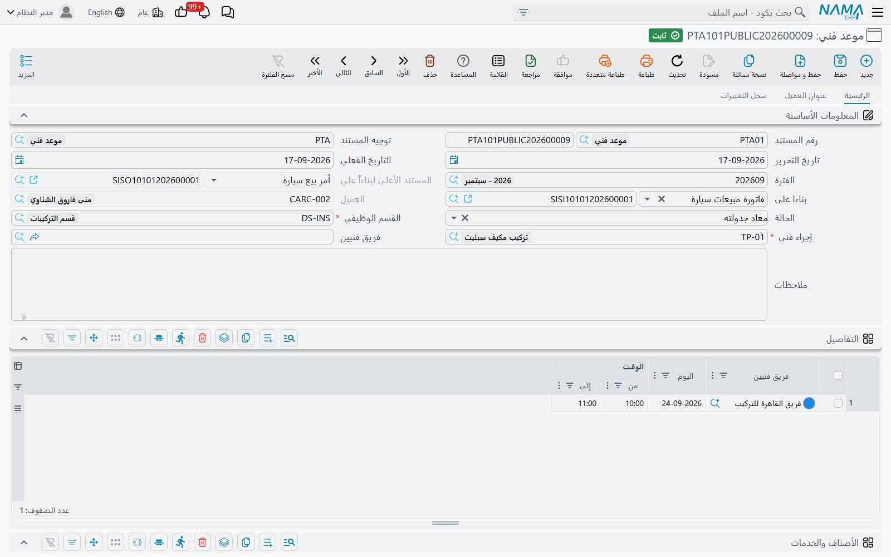

# الموعد الفني

::: info الترخيص المطلوب
`crm-technician-appointments`.
:::

**الموعد الفني** هو الحجز نفسه — فريق واحد، وعمل واحد، والأوقات المحجوزة لهما. وفي أغلب الأحوال لن تكتبه من الصفر، بل سترسمه على [تقويم الحجز](/ar/modules/crm/technician-appointments/crm-technician-appointment-calendar.md) فينشئه التقويم لك. وهذه الصفحة تصف المستند الذي تحصل عليه، لأنه الموضع الذي تذهب إليه لتبحث عن حجز أو تعدّله أو تلغيه أو تتتبعه رجوعاً إلى البيع.

## المعلومات الأساسية

إلى جانب إطار المستند المعتاد — **رقم المستند** والدفتر، و**توجيه المستند**، و**التاريخ الفعلي**، و**الفترة**، و**ملاحظات**، و**رقم المستند اليدوي** — يحمل الموعد خمسة حقول خاصة به.

**بناء على** — المستند التجاري الذي وُعد فيه بهذه الزيارة: فاتورة مبيعات أو أمر بيع أو عقد. وهو حقل مرجع عام يقبل أي مستند، وهو الخيط الذي يربط الزيارة بما بيع. وقد حُرِّر `APP000001` من فاتورة المبيعات `SIV1-20260800001`.

**المستند الأعلى لبناءاً على** — يملؤه النظام ولا يُعدَّل: وهو المستند الذي جاء منه مستند «بناء على» نفسه. فحين تُحجز الزيارة من فاتورة مبيعات محرَّرة أصلاً من أمر بيع، أظهر هذا الحقل أمر البيع. وهو يوفّر عليك نقرة تتبع السلسلة حين يسأل أحدهم لأي أمر بيع يتبع هذا التركيب. وهو في `APP000001` يقرأ `SO1-20260800001`.

**الحالة** — أين يقف الحجز. فالموعد الجديد يبدأ **محجوز**، وترحيل [سند توزيع خدمات](/ar/modules/crm/technician-appointments/crm-technician-service-distribution.md) عليه ينقله إلى **تم التنفيذ**، وإلغاء ذلك السند يعيده إلى **محجوز**. أما القيم الثلاث الأخرى — **ملغي** و**لم يحضر** و**معاد جدولته** — فتُضبط بيدك، وبها يُسجَّل واقع اليوم: العميل اعتذر، لم يكن أحد في المنزل، الزيارة أُجّلت.

**القسم الوظيفي** — مطلوب، وهو الحقل الذي يقرر كل شيء تقريباً. ولا يُعرض إلا الأقسام المعلَّم عليها **يظهر في شاشة المواعيد**. والقسم يجلب ساعات العمل التي يفرضها التقويم، ويجلب عبر [إعدادات حجز المواعيد](/ar/modules/crm/technician-appointments/crm-appointment-booking-settings.md) الدفترَ والتوجيه اللذين يُرقَّم بهما الموعد.

**إجراء فني** — مطلوب. وهو العمل المحجوز. وهو كذلك يحكم أيّ الخدمات يمكن التبليغ عنها لاحقاً على الزيارة، لأن سند توزيع الخدمات لا يقبل إلا الخدمات المدرجة على هذا الإجراء.

::: tip الدفتر يملأ نفسه
احفظ موعداً بلا دفتر فيبحث النظام في إعدادات حجز المواعيد الخاصة بالقسم الوظيفي، فيجد سطر ذلك القسم في **دفاتر وتوجيهات المواعيد لكل قسم وظيفي**، فيطبّق دفتره وتوجيهه — ثم يرقّم المستند وينسخ محددات الدفتر. ولهذا يخرج الموعد الذي ينشئه التقويم، وهو لا يسأل عن دفتر، مستنداً مرقَّماً `APP…` كما ينبغي.

وإذا كان الدفتر مضبوطاً أصلاً فلا يُستبدل شيء.
:::

## جدول التفاصيل — الأوقات المحجوزة

كل ما يتعلق بـ**متى** يقع في جدول **التفاصيل**. سطر لكل كتلة زمنية:

| العمود | المعنى |
|---|---|
| فريق فنيين | الفريق المحجوز |
| اليوم | التاريخ — مطلوب |
| الوقت من | وقت البداية |
| الوقت إلى | وقت النهاية |

ويحجز `APP000001` فريق تركيب الجيزة مرتين في 13 أغسطس 2026: من 08:00 إلى 09:00 ومن 10:00 إلى 11:00. سطران لا كتلة واحدة طويلة، لأن للفريق عملاً آخر بينهما.

ويلزم سطر واحد على الأقل. وتحكم الجدولَ قاعدةٌ واحدة:

::: warning كل السطور يجب أن تسمي الفريق نفسه
الموعد يحجز فريقاً **واحداً**. فضع فريقين مختلفين في سطرين يُرفض الترحيل برسالة *«كل السطور يجب أن تكون لنفس الفريق»* على السطر المخالف.

وإن كان العمل يحتاج فريقين حقاً فحرِّر موعدين. فذلك يُبقي تقويم كل فريق صادقاً، ويُبقي سند توزيع الخدمات — الذي يبلّغ عن أعضاء فريق واحد — قادراً على أداء عمله.
:::

وتعمل مجموعة **المحددات** أسفل الشاشة كما تعمل في كل مستند، وتُغذَّى من الدفتر حين يُطبَّق الدفتر.

## تعديل الحجز بعد إنشائه

يتصرف الموعد كأي مستند آخر: تصححه وتحفظه، أو تلغيه، وفق دورة الموافقات لديك.

وعادتان جديرتان بالاتباع:

- **لنقل زيارة**، غيّر اليوم والأوقات في سطور التفاصيل بدل تحرير موعد جديد، إلا إن أردت تاريخ الاثنين معاً. وإن حرّرت بديلاً فاضبط القديم على **معاد جدولته** ليروي التقويم وشاشة القائمة القصة.
- **لتغيير الفريق**، غيّره في كل السطور — فقاعدة وحدة الفريق تُفحص عند الحفظ، والتغيير الناقص سيُرفض ببساطة.

وتعرض شاشة القائمة الحالة والقسم الوظيفي والإجراء الفني أعمدةً، مما يجعل «أيّ عمليات التركيب ما زالت **محجوزة** فقط هذا الأسبوع» فلتراً مباشراً.
