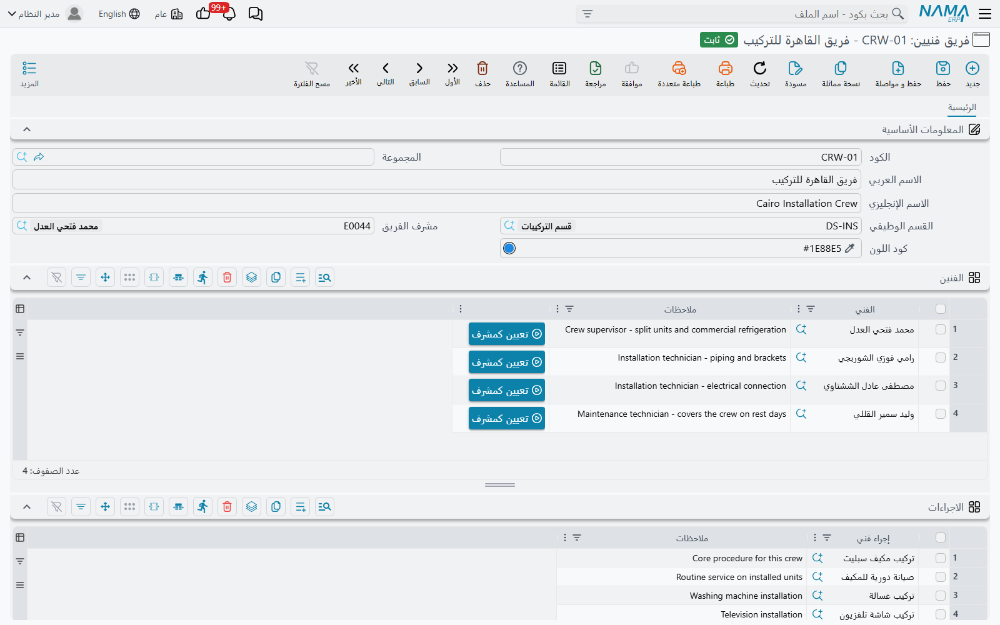

# فرق الفنيين

::: info الترخيص المطلوب
`crm-technician-appointments`.
:::

أنت لا تحجز أفراداً في هذه الميزة، وإنما تحجز **فريقاً**. وهذا تبسيط مقصود: ففريق التركيب المكوّن من رجلين يسافر معاً ويصل معاً وينشغل معاً، فمعاملته وحدةَ حجز واحدة تُسقط طبقة كاملة من الجدولة لا يحتاجها معظم أصحاب العمل الميداني.

والفريق مجموعة مسمّاة من الموظفين، تتبع قسماً وظيفياً، وتحمل قائمة الإجراءات المؤهلة لأدائها، وتحمل كذلك — وهي التفصيلة الصغيرة التي تجعل التقويم مقروءاً — لوناً.

## المعلومات الأساسية

**الكود** و**الاسم العربي** و**الاسم الإنجليزي** كما في كل ملف أساسي. وفي المثال أعلاه `CRW-01` هو *فريق القاهرة للتركيب* (*Cairo Installation Crew*).

**القسم الوظيفي** — أيّ أجزاء المنشأة يتبع هذا الفريق. وله أثر عملي فوري: فمنتقي **الفني** في الجدول أدناه يُرشَّح على الموظفين الذين يتبع قسمهم الوظيفي القسمَ نفسه. فاضبط القسم قبل أن تبدأ إضافة الأشخاص وإلا عرض عليك المنتقي ملف الموظفين كله.

**مشرف الفريق** — رئيس الفريق والشخص المسؤول عنه. ويجب أن يكون واحداً من فنيّي الفريق أنفسهم، ولذلك لا يعرض المنتقي إلا الأشخاص الموجودين في جدول الفنيين. وإن أُزيل المشرف من ذلك الجدول لاحقاً رفض السجل الترحيل برسالة *«يجب أن يكون مشرف الفريق … أحد فنيي الفريق»*.

::: tip مشرف الفريق ليس مشرف القسم
تسمية شخص مشرفاً للفريق لا تجعله يرى الفرق الأخرى في [مواعيدي](/ar/modules/crm/technician-appointments/crm-my-appointments). فذلك يأتي من جدول **المشرفون** في القسم الوظيفي.
:::

**كود اللون** — اللون الذي تُرسم به حجوزات هذا الفريق على [تقويم الحجز](/ar/modules/crm/technician-appointments/crm-technician-appointment-calendar). وفريق القاهرة للتركيب أزرق `#1E88E5`. واختر ألواناً متباينة حقاً بين الفرق التي تتقاسم قسماً واحداً؛ فأسبوع فيه أربعة فرق بأربع درجات من الأزرق أصعب قراءةً بكثير من أسبوع فيه أخضر وأحمر وبنفسجي وبرتقالي. والفرق التي تُترك بلا لون يُعطى لها لون تلقائياً من لوحة ألوان جاهزة.

## الفنيين

سطر لكل عضو: **الفني** — وهو موظف — و**ملاحظات** حرة.

ويحمل كل سطر كذلك زر **تعيين كمشرف** الذي ينسخ فنيّ ذلك السطر إلى حقل مشرف الفريق. وهو اختصار للحالة الشائعة، ويعمل قبل حفظ الفريق.

::: tip الفني ينتمي إلى فريق واحد لا غير
حين ترحّل الفريق يُفحص كل فني فيه في مقابل كل فريق آخر في النظام. فإن كان أحدهم عضواً في مكان آخر ظهرت رسالة *«الفني … موجود بالفعل في فريق فنيين آخر …»* وتوقف الترحيل.

وهذه هي القاعدة التي تجعل التقويم جديراً بالثقة — فحجوزات الفريق هي حقاً حجوزات ذلك الشخص. وهي تعني كذلك أنك لا تنقل أحداً أبداً بتعديل فريقين، بل تستعمل [سند نقل فني](/ar/modules/crm/technician-appointments/crm-technician-transfers) الذي يخرجه من فريق ويدخله في آخر في مستند واحد مرحَّل.
:::

## الاجراءات

يسرد الجدول الثاني الإجراءات الفنية (عمود **إجراء فني**) التي يؤهَّل هذا الفريق لأدائها، ومعها وصف حر كذلك.

وعلى هذا يرشِّح تقويمُ الحجز. فحين يختار موظف الحجز *تركيب مكيف* تُعرض عليه الفرق التي يذكر جدول إجراءاتها ذلك الإجراء — يضاف إليها كل فريق جدوله فارغ، إذ يُقرأ الفراغ «مؤهل لكل شيء». ولذلك فالفريق الذي لم تُملأ إجراءاته قط سيظهر تحت كل عمل، وهو مقبول في عملية صغيرة ومضلِّل في عملية كبيرة.

## بناء الفرق

في قسم فيه ثلاثة فرق تكون الخطوات قصيرة:

1. أنشئ الفريق واضبط قسمه الوظيفي ولونه.
2. أضف الفنيين — والمنتقي مضيَّق أصلاً على موظفي القسم.
3. اضغط **تعيين كمشرف** على سطر رئيس الفريق.
4. اسرد الإجراءات المدرَّب عليها الفريق.
5. رحِّل. وإن رُفض أحدهم لكونه في فريق آخر فتلك إجابتك عن موضعه الحالي — فانقله بسند نقل بدل مصارعة الرسالة.
