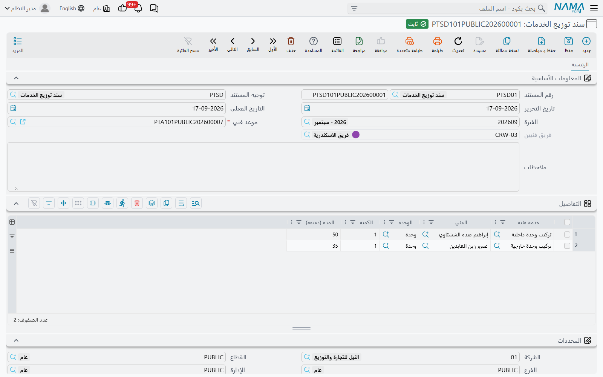

# سند توزيع الخدمات

::: info الترخيص المطلوب
`crm-technician-appointments`.
:::

الموعد يقول إن فريق الجيزة محجوز صباح الأحد لتركيب مكيف. و**سند توزيع الخدمات** يقول ما الذي حدث: عصام ركّب الوحدة الخارجية في 20 دقيقة، ومحمد ركّب الوحدة الداخلية في 30. وهو مستند ما بعد الزيارة، واحد لكل موعد في العادة، وترحيله هو ما يجعل الموعد **تم التنفيذ**.

## المعلومات الأساسية

**موعد فني** — مطلوب، وهو الشيء الوحيد الذي عليك اختياره حقاً. فكل ما عداه في الشاشة يتشكل به.

**فريق فنيين** — يُملأ من سطور تفاصيل الموعد لحظةَ اختيارك الموعدَ، ويُبقى متسقاً معه في كل حفظ. ولست أنت من يصونه؛ وإنما هو هناك ليعرف المستند — ومنتقي الفني أدناه — أيّ فريق أعضاؤه مؤهلون.

والباقي إطار المستند المعتاد: **رقم المستند** والدفتر، و**توجيه المستند**، و**تاريخ التحرير**، و**التاريخ الفعلي**، و**الفترة**، و**ملاحظات**، ومجموعة **المحددات**.

## جدول التفاصيل — مَن فعل ماذا

سطر لكل قطعة عمل أُنجزت:

| العمود | المعنى |
|---|---|
| خدمة فنية | المهمة المؤداة — مطلوبة |
| الفني | مَن أدّاها — مطلوب |
| الوحدة | الوحدة التي تُحسب بها الكمية |
| الكمية | كم |
| المدة (دقيقة) | كم استغرقت — مطلوبة |

ويحمل `PTSD101PUBLIC202600001`، المكتوب على الموعد `PTA101PUBLIC202600007` لـ«فريق الاسكندرية»، سطرين: *تركيب وحدة داخلية* بيد إبراهيم عبده الششتاوي، 1 وحدة، 50 دقيقة؛ و*تركيب وحدة خارجية* بيد عمرو زين العابدين، 1 وحدة، 35 دقيقة.

والمنتقيان كلاهما مضيَّق لك، وهذا هو مقصد التبليغ عن العمل بهذه الطريقة:

- **خدمة فنية** لا تعرض إلا الخدمات المدرجة على إجراء الموعد.
- **الفني** لا يعرض إلا أعضاء فريق الموعد.

ويُعاد فحص هذين الحدّين عند ترحيل المستند أيضاً، فالسطر الذي كان صحيحاً حين كُتب ثم انزاح — تغيّرت قائمة خدمات الإجراء، أو نُقل أحدهم خارج الفريق — يُلتقط بدل أن يُحفظ بصمت. والرسائل تسمّي السطر: *«الخدمة الفنية … لا تنتمي إلى موعد الفني …»* و*«الفني … لا ينتمي إلى الفريق …»*.

أما الكمية والوحدة والدقائق فلك أن تسجّلها كما وقعت فعلاً. ولا شيء يعيد حسابها من مدد التخطيط في كتالوج الخدمات، وهذا بالضبط ما يجعل المقارنة بين الاثنين جديرة بالاحتفاظ.

## ماذا يفعل الترحيل

::: tip الترحيل ينقل الموعد إلى «تم التنفيذ»
عند الترحيل يُضبط الموعد المسمّى في المعلومات الأساسية على **تم التنفيذ**. وألغِ السند يعد الموعد إلى **محجوز**. وأشِر بسند مرحَّل إلى موعد *آخر* فيُصحَّح الاثنان: الجديد يصير «تم التنفيذ» والذي انتقلت عنه يعود «محجوز».

وسند واحد لكل موعد عادةٌ لا قاعدة، فالنظام يقبل سنداً ثانياً. وانتبه إلى أن إلغاء **أي** سند توزيع للموعد أو حذفه يعيد الموعد إلى «محجوز»، حتى لو بقي سند آخر مرحَّل. وإن نُقلت لاحقاً فترة من موعد منفَّذ أو حُذفت في شاشة الموعد نفسها صار الموعد «معاد جدولته».

وهذا كل أثر هذا المستند. فهو يسجّل جهداً — لا يسعّر العمل، ولا يحرّك مخزوناً، ولا يسجل قيوداً. وتبقى الفوترة تجري على مستند البيع الذي حُرِّر منه الموعد.
:::

## موضعه في اليوم

النمط الذي ينجح عملياً سندُ توزيع واحد لكل زيارة منجَزة، يُكتب في اليوم نفسه:

1. افتح الموعد من التقويم أو من شاشة القائمة وسجّل كوده، أو ابدأ من شاشة سند التوزيع واختر الموعد فيها.
2. أضف سطراً لكل خدمة أُدّيت فعلاً، مسمّياً الفني الذي أدّاها والدقائق الحقيقية.
3. رحِّل. فيصير الموعد **تم التنفيذ** ويسقط من فلتر «ما زال معلقاً» في شاشة قائمة المواعيد.

أما الزيارات التي لم تقع فلا يُكتب لها سند توزيع أبداً — بل اضبط الموعد بيدك على **لم يحضر** أو **ملغي**، ليظل «محجوز» دائماً بمعنى عمل لم يُنجز بعد.
