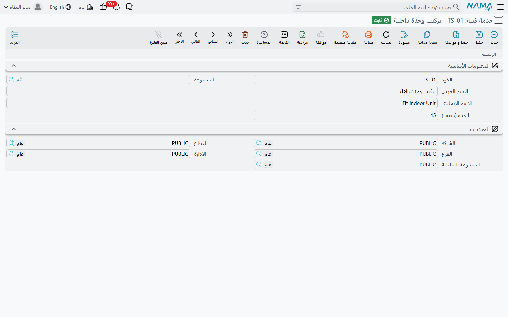
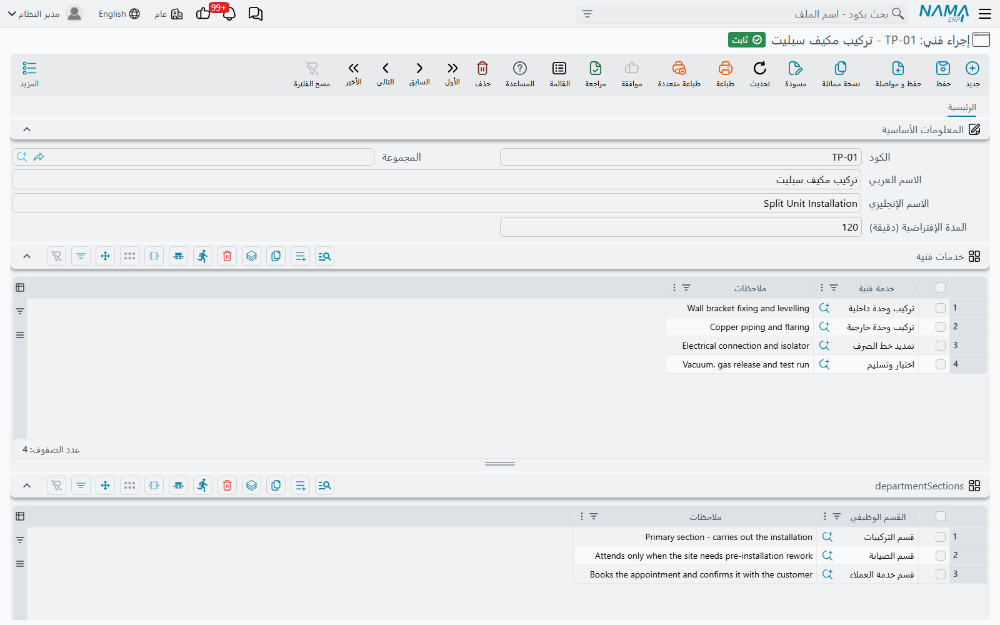

# الخدمات والإجراءات الفنية

::: info الترخيص المطلوب
`crm-technician-appointments`.
:::

قبل أن تحجز أحداً عليك أن تخبر النظام بما **تحجزه من أجله**. ويحتاج ذلك ملفين أساسيين، والفرق بينهما فرق حجم لا أكثر.

**الخدمة الفنية** (Technician Service) مهمة واحدة: *تركيب الوحدة الداخلية*، *تمديد خط الصرف*، *الاختبار والتسليم*. و**الإجراء الفني** (Technician Procedure) هو العمل الذي يطلبه العميل فعلاً — *تركيب مكيف* — وهو ليس أكثر من قائمة مسمّاة بالخدمات التي يتكون منها ذلك العمل.

ولماذا الاثنان معاً؟ لأنهما يُستعملان في طرفي الدورة. فأنت تحجز **الإجراء** — وهو ما يوضع على الموعد وما يُرشِّح الفرق التي يعرضها عليك التقويم. وتُبلِّغ عن **الخدمات** — فبعد الزيارة يسأل سند توزيع الخدمات أيّ خدمة أدّى كل فني. وتقسيم العمل إلى خدمات هو ما يحوّل «كان الفريق هناك ثلاث ساعات» إلى «ركّب عصام الوحدة الخارجية في 20 دقيقة وركّب محمد الوحدة الداخلية في 30».

## الخدمة الفنية

ملف قصير. الكود والاسم العربي والاسم الإنجليزي، وحقل واحد خاص به:

**المدة (دقيقة)** — كم تستغرق هذه المهمة عادةً. وهو رقم التخطيط الذي تحتفظ به في الكتالوج لتتسق التقديرات؛ أما الدقائق المسجَّلة على زيارة حقيقية فتُكتب في سند توزيع الخدمات.

واجعل تفصيل القائمة بالقدر الذي تريد التبليغ عنه فعلاً. فإن كان لن يعني أحداً أن تركيب الحامل استغرق 8 دقائق فلا تُنشئ خدمة للحامل — فكل خدمة زائدة سطر على أحدهم أن يملأه بعد كل زيارة.

## الإجراء الفني

يحمل الإجراء الاسم الذي يعرفه موظفو الحجز، ومعه **المدة الإفتراضية (دقيقة)** للعمل كله — وهو الرقم الذي تستحضره حين تقرر عرض الفترة التي سترسمها على التقويم.

وتحته جدولان.

**خدمات فنية** — المهام التي يتكون منها هذا العمل، مهمة في كل سطر، مع وصف حر. وهذا الجدول مطلوب: فالإجراء الخالي من الخدمات يمكن حجزه، لكن سند توزيع الخدمات المكتوب على ذلك الحجز لن يجد ما يعرضه، لأنه لا يقبل إلا الخدمات المدرجة هنا.

ويحمل إجراء «البهاء» `01 - تركيب مكيف` سطرين: *تركيب وحدة داخلية* و*تركيب وحدة خارجية*.

**الأقسام الوظيفية** — أيّ أجزاء المنشأة تؤدي هذا العمل. وهذا الجدول اختياري، وطريقة قراءته جديرة بالمعرفة:

::: tip قائمة الأقسام الفارغة تعني «الجميع»
يعرض عليك تقويم الحجز الإجراءات التي **يذكر جدول أقسامها الوظيفية القسمَ الذي اخترته أو يكون فارغاً**. فترك الجدول فارغاً يجعل الإجراء متاحاً للجميع، وملؤه يقصره على تلك الأقسام.

استعمله حين يؤدي قسمان عملين مختلفين حقاً — قسم تركيب وقسم صيانة — كي لا يرى موظف الحجز في أحدهما قائمة أعمال الآخر.
:::

وفي كلا الجدولين عمود **ملاحظات** لما يحتاج زميلٌ معرفته حين يختار السطر.

## ترتيب معقول للبناء

1. اكتب قائمة الخدمات أولاً — كل مهمة متمايزة تريد التبليغ عنها، ومعها مدتها المعتادة.
2. اجمع الخدمات في إجراءات، إجراءً لكل شيء يستطيع العميل حجزه.
3. لا تقصر الإجراءات على أقسام إلا حيث يوجد سبب حقيقي.
4. ثم انتقل إلى [فرق الفنيين](/ar/modules/crm/technician-appointments/crm-technician-crews.md) حيث تقول أيّ الفرق مؤهلة لأيّ الإجراءات.
